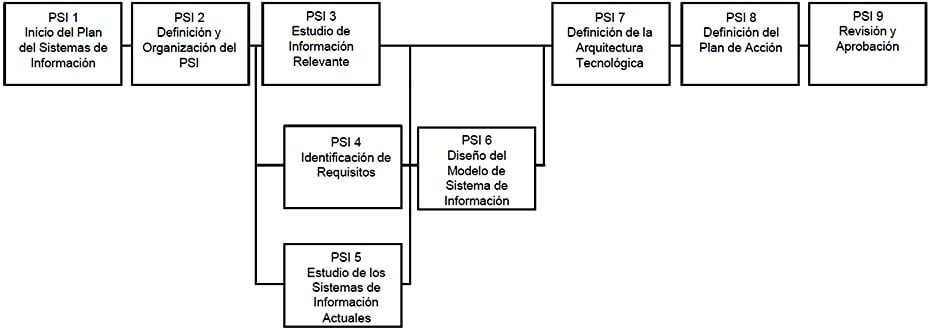
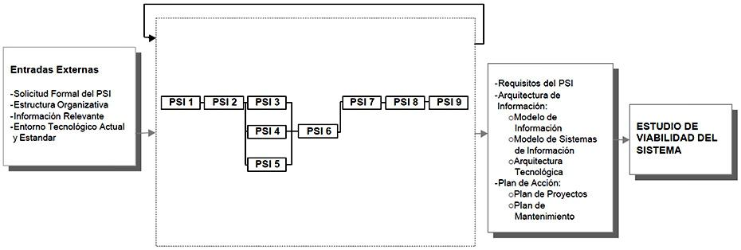

#  Planificación de Sistemas de Información

## Descripción y objetivos

El Plan de Sistemas de Información tiene como objetivo la obtención de un marco de referencia para el desarrollo de sistemas de información que responda a los objetivos estratégicos de la organización. Este marco de referencia consta de:

- Una descripción de la situación actual, que constituirá el punto de partida del Plan de Sistemas de Información. Dicha descripción incluirá un análisis técnico de puntos fuertes y riesgos, así como el análisis de servicio a los objetivos de la organización.
- Un conjunto de modelos que constituya la arquitectura de información.
- Una propuesta de proyectos a desarrollar en los próximos años, así como la prioridad de realización de cada proyecto.
- Una propuesta de calendario para la ejecución de dichos proyectos.
- La evaluación de los recursos necesarios para los proyectos a desarrollar en el próximo año, con el objetivo de tenerlos en cuenta en los presupuestos. Para el resto de proyectos, bastará con una estimación de alto nivel.
- Un plan de seguimiento y cumplimiento de todo lo propuesto mediante unos mecanismos de evaluación adecuados.

La perspectiva del plan debe ser estratégica y operativa, no tecnológica.

Es fundamental que la alta dirección de la organización tome parte activa en la decisión del Plan de Sistemas de Información con el fin de posibilitar su éxito. La dirección debe convencer a sus colaboradores más directos de la necesidad de realización del plan; de su apoyo de forma constructiva, mentalizándose de que la ejecución del mismo requerirá la utilización de unos recursos de los cuales son responsables.

La presentación del Plan de Sistemas de Información y la constitución del equipo supone el arranque del proyecto y es fundamental que las más altas instancias de la organización estén implicadas en ambos, dando el apoyo necesario y aportando todo tipo de medios. Explicar el plan a las personas de la organización y a las unidades organizativas afectadas sobre las que recaerá el Plan, el apoyo de los altos directivos y la cualificación de los recursos de las distintas unidades implicadas, serán factores críticos de éxito del Plan de Sistemas de Información.

El nivel de detalle con el que se hará el estudio de la situación actual dependerá de la existencia de documentación actual, de si hay personas que conozcan dicha documentación y de la predisposición a una sustitución total o parcial por sistemas de información nuevos. En cualquier caso, como paso previo para detectar aspectos importantes que puedan afectar a la organización, es necesario investigar sus puntos fuertes, áreas de mejora, riesgos y amenazas posibles y hacer un diagnóstico de los mismos.

Para la elaboración del Plan de Sistemas de Información se estudian las necesidades de información de los procesos de la organización afectados por el Plan, con el fin de definir los requisitos generales y obtener modelos conceptuales de información. Por otra parte se evalúan las opciones tecnológicas y se propone un entorno.

Tras analizar las prioridades relacionadas con las distintas variables que afectan a los sistemas de información, se elabora un calendario de proyectos con una planificación lo más detallada posible de los más inmediatos. Además, se propone una sistemática para mantener actualizado el Plan de Sistemas de Información para incluir en él todos los cambios necesarios, garantizando el cumplimiento adecuado del mismo.

A continuación se incluye un gráfico que representa la secuencia de actividades del proceso PSI.

Aunque los resultados de la actividad Estudio de la Información Relevante (PSI 3) deberán tenerse en cuenta para la definición de requisitos que se efectúa en la actividad Identificación de Requisitos (PSI 4), ambas podrán realizarse en paralelo, junto con el Estudio de los Sistemas de Información Actuales (PSI 5).

### Participantes en las Actividades del Proceso PSI {.unnumbered .unlisted}

PLANIFICACIÓN DE SISTEMAS DE INFORMACIÓN 	ACTIVIDADES
PSI 1 	PSI 2 	PSI 3 	PSI 4 	PSI 5 	PSI 6 	PSI 7 	PSI 8 	PSI 9
Comité de Dirección 	X 	X 							X
Consultores 			X 	X 	X 	X 	X 	X 	X
Consultores Informáticos 			X 		X 	X 	X 	X 	X
Directores Usuarios 		X 							
Equipo de Soporte Técnico 					X 		X 		
Equipo del Proyecto 					X 				
Jefe de Proyecto 		X 							X
Responsable Mantenimiento 					X 				
Usuarios Expertos 			X 	X 	X 	X 	X 	X 	X

### TÉCNICAS/PRÁCTICAS UTILIZADAS EN LAS ACTIVIDADES DEL PROCESO PSI {.unnumbered .unlisted}

PLANIFICACIÓN DE SISTEMAS DE INFORMACIÓN 	ACTIVIDADES
PSI 1 	PSI 2 	PSI 3 	PSI 4 	PSI 5 	PSI 6 	PSI 7 	PSI 8 	PSI 9
Análisis Coste/Beneficio 							X 	X 	
Catalogación 		X 	X 	X 	X 	X 			
Diagrama de Clases 				X 					
Diagrama de Representación 					X 	X 	X 		
Estimación 		X 							
Factores Críticos de Éxito 	X 								
Impacto en la Organización 							X 	X 	
Matricial 						X 			
Modelado de Procesos de la Organización 				X 					
Modelo Entidad/Relación Extendido 				X 					
Planificación 		X 							
Presentación 									X
Sesiones de trabajo 	X 	X 	X 	X 	X 	X 	X 	X 	X

### Actividades {.unnumbered .unlisted}

    Actividad PSI 1: Inicio del Plan de Sistemas de Información
    Actividad PSI 2: Definición y Organización del PSI
    Actividad PSI 3: Estudio de la Información Relevante
    Actividad PSI 4: Identificación de Requisitos
    Actividad PSI 5: Estudio de los Sistemas de Información Actuales
    Actividad PSI 6: Diseño del Modelo de Sistemas de Información
    Actividad PSI 7: Definición de la Arquitectura Tecnológica
    Actividad PSI 8: Definición del Plan de Acción
    Actividad PSI 9: Revisión y Aprobación del PSI

## Actividad PSI 1: Inicio del Plan de Sistemas de Información

El objetivo de esta actividad es determinar la necesidad del Plan de Sistemas de Información y llevar a cabo el arranque formal del mismo, con el apoyo del nivel más alto de la organización. Como resultado, se obtiene una descripción general del Plan de Sistemas de Información que proporciona una definición inicial del mismo, identificando los objetivos estratégicos a los que apoya, así como el ámbito general de la organización al que afecta, lo que permite implicar a las direcciones de las áreas afectadas por el Plan de Sistemas de Información.

Además, se identifican los factores críticos de éxito y los participantes en el Plan de Sistemas de Información, nombrando a los máximos responsables.

A continuación se incluye una tabla resumen con las tareas de la presente actividad:
TAREA 	PRODUCTOS 	TÉCNICAS Y PRÁCTICAS 	PARTICIPANTES
PSI 1.1: Análisis de la Necesidad del PSI 	

    Descripción general del PSI
        Aprobación de inicio del PSI

	

    Sesiones de trabajo

	

    Comité de Dirección

PSI 1.2: Identificación del Alcance del PSI 	

    Descripción general del PSI
        Ámbito y objetivos del PSI
        Objetivos estratégicos relacionados con el PSI
        Factores críticos de éxito

	

    Factores críticos de éxito
    Sesiones de trabajo

	

    Comité de Dirección

PSI 1.3: Determinación de Responsables 	

    Descripcion general del PSI
        Responsables del PSI

	

    Sesiones de trabajo

	

    Comité de Dirección

## Actividad PSI 2: Definición y Organización del PSI

En esta actividad se detalla el alcance del plan, se organiza el equipo de personas que lo va a llevar a cabo y se elabora un calendario de ejecución. Todos los resultados o productos de esta actividad constituirán el marco de actuación del proyecto más detallado que en PSI 1 en cuanto a objetivos, procesos afectados, participantes, resultados y fechas de entrega.
TAREA 	PRODUCTOS 	TÉCNICAS Y PRÁCTICAS 	PARTICIPANTES
PSI 2.1: Especificación del ámbito y Alcance 	

    Descripción general de procesos de la organización afectados
    Catálogo de objetivos de PSI
        Objetivos generales
        Objetivos específicos de cada proceso (si los hubiera)

	

    Catalogación

	

    Comité de Dirección
    Directores de Usuarios
    Jefe de Proyecto del PSI

PSI 2.2: Organización del PSI 	

    Catálogo de usuarios
    Equipos de trabajo

	

    Catalogación
    Sesiones de trabajo

	

    Directores de Usuarios
    Jefe de Proyecto del PSI

PSI 2.3: Definición del Plan de Trabajo 	

    Plan de trabajo

	

    Planificación
    Estimación

	

    Directores de Usuarios
    Jefe de Proyecto del PSI

PSI 2.4: Comunicación del Plan de Trabajo 	

    Plan de trabajo
        Aceptación del Plan de Trabajo por parte de los implicados

		

    Comité de Dirección
    Directores de Usuarios
    Jefe de Proyecto del PSI

### Tarea PSI 2.1: Especificación del Ámbito y Alcance

De manera más concreta que en la actividad Inicio del Plan de Sistemas de Información (PSI 1), en esta tarea se describe el ámbito de los procesos de la organización a considerar. Igualmente, se definirá el alcance, es decir, los objetivos específicos del Plan de Sistemas de Información. Puede ser necesario determinar distintos objetivos para cada proceso del proyecto. Los responsables de los distintos procesos de la organización afectados por el Plan de Sistemas de Información participarán de forma activa en la definición de los objetivos, sin perder de vista los resultados de la actividad anterior.
Productos

De entrada

    Descripción general del PSI (PSI 1.3)

De salida

    Descripción general de procesos de la organización afectados
    Catálogo de objetivos del PSI:
        Objetivos generales
        Objetivos específicos de cada proceso (si los hubiera)

Prácticas

    Catalogación

Participantes

    Comité de Dirección
    Directores de Usuarios
    Jefe de Proyecto del PSI

### Tarea PSI 2.2: Organización del PSI

En esta tarea se tratan cuestiones relacionadas con la organización del trabajo para llevar a cabo el Plan de Sistemas de Información. Se seleccionan los participantes, valorando el número y perfil de profesionales de Sistemas y Tecnologías de la Información y Comunicaciones (STIC) necesarios en función de los objetivos perseguidos.

Asimismo, se determinan las funciones de los responsables de la dirección y seguimiento del Plan de Sistemas de Información. Adicionalmente, se concretan aspectos logísticos relacionados con el material, salas de reuniones, estándares de documentación, etc.
Productos

De entrada

    Estructura organizativa (externo)
    Descripción general del PSI (PSI 1.3)
    Descripción general de procesos de la organización afectados (PSI 2.1)
    Catálogo de objetivos del PSI (PSI 2.1)

De salida

    Catálogo de usuarios
    Equipos de trabajo

Prácticas

    Catalogación
    Sesiones de trabajo

Participantes

    Directores de Usuarios
    Jefe de Proyecto del PSI

### Tarea PSI 2.3: Definición del Plan de Trabajo

El objetivo de esta tarea es determinar todos los productos finales del Plan de Sistemas de Información, así como la fecha prevista de obtención y entrega de los mismos. Es necesario planificar las distintas actividades y estimar los tiempos requeridos para llevarlas a cabo, teniendo en cuenta la disponibilidad de los usuarios del Plan de Sistemas de Información. Se deben considerar también los factores críticos de éxito, identificados en la actividad anterior y recogidos en la descripción general de procesos de la organización afectados, ya que pueden condicionar la elaboración del plan de trabajo.

Se detallan las actividades, asignando participantes, tiempos y responsables de cada una de ellas, los resultados esperados y el plan de trabajo a seguir.
Productos

De entrada

    Equipos de trabajo (PSI 2.2)
    Descripción general del PSI (PSI 1.3)
    Catálogo de objetivos de PSI (PSI 2.1)
    Descripción general de procesos de la organización afectados (PSI 2.1)
    Catálogo de usuarios (PSI 2.2)

De salida

    Plan de trabajo

Técnicas

    Planificación
    Estimación

Participantes

    Directores de Usuarios
    Jefe de Proyecto del PSI

### Una vez definido el plan de trabajo se comunica a los usuarios del Plan de Sistemas de Información con el fin de que sea aceptado. Esto permite que los usuarios conozcan el método de trabajo a seguir, los resultados a obtener y la dedicación necesaria por su parte.
Productos

De entrada

    Plan de trabajo (PSI 2.3)
    Catálogo de usuarios (PSI 2.2)

De salida

    Plan de trabajo
        Aceptación del Plan de Trabajo

Participantes

    Comité de Dirección
    Directores de Usuarios
    Jefe de Proyecto del PSI

## Actividad PSI 3: Estudio de la Información Relevante

El objetivo de esta actividad es recopilar y analizar todos los antecedentes generales que puedan afectar a los procesos y a las unidades organizativas implicadas en el Plan de Sistemas de Información, así como a los resultados del mismo. Pueden ser de especial interés los estudios realizados con anterioridad al Plan de Sistemas de Información, relativos a los sistemas de información de su ámbito, o bien a su entorno tecnológico, cuyas conclusiones deben ser conocidas por el equipo de trabajo del Plan de Sistemas de Información.

La información obtenida en esta actividad se tendrá en cuenta en la elaboración de los requisitos.
TAREA 	PRODUCTOS 	TÉCNICAS Y PRÁCTICAS 	PARTICIPANTES
PSI 3.1: Selección y Análisis de Antecedentes 	

    Valoración de antecedentes

	

    Sesiones de trabajo

	

    Consultores
    Consutores Informáticos
    Usuarios expertos

PSI 3.2: Valoración de Antecedentes 	

    Catálogo de requisitos
    Requisitos generales
    Catálogo de normas del PSI

	

    Catalogación

	

    Consultores
    Consultores Informáticos

### Tarea PSI 3.1: Selección y Análisis de Antecedentes

Se seleccionan las fuentes de información y documentación a considerar en este estudio, teniendo en cuenta todos aquellos antecedentes de interés: plan estratégico de sistemas de información, estudios previos, plan general informático, etc. y se analiza el contenido de la información anterior. En el inicio y organización del Plan de Sistemas de Información se habrá orientado sobre la existencia de estos antecedentes, para facilitar al equipo de trabajo el desarrollo de esta actividad.

Asimismo, se debe entrevistar a las personas de la organización que puedan aportar información adicional sobre antecedentes que deban ser considerados en el Plan de Sistemas de Información, al margen de la documentación disponible. La información recogida se tiene también en cuenta en la valoración de los mismos.
Productos

De entrada

    Información relevante (externo)
    Descripción general de procesos de la organización afectados (PSI 2.1)
    Catálogo de objetivos del PSI (PSI 2.1)
    Catálogo de usuarios (PSI 2.2)

De salida

    Análisis de antecedentes

Prácticas

    Sesiones de trabajo

Participantes

    Consultores
    Consultores Informáticos
    Usuarios Expertos

### Tarea PSI 3.2: Valoración de Antecedentes

Se realiza la valoración de los antecedentes analizados en la tarea anterior y las conclusiones se recogerán en el catálogo de requisitos. La realización de esta valoración ayudará a establecer términos de referencia en cuanto a estándares, procedimientos, normativas, etc., si es que existen.
Productos

De entrada

    Información relevante (externo)
    Análisis de antecedentes (PSI 3.1)

De salida

    Catálogo de requisitos:
        Requisitos generales
    Catálogo de normas del PSI

Prácticas

    Catalogación

Participantes

    Consultores
    Consultores Informáticos

## Actividad PSI 4: Identificación de Requisitos

El objetivo final de esta actividad va a ser la especificación de los requisitos de información de la organización, así como obtener un modelo de información que los complemente.

Para conseguir este objetivo, se estudia el proceso o procesos de la organización incluidos en el ámbito del Plan de Sistemas de Información. Para ello es necesario llevar a cabo sesiones de trabajo con los usuarios, analizando cada proceso tal y como debería ser, y no según su situación actual, ya que ésta puede estar condicionada por los sistemas de información existentes.

Del mismo modo, se identifican los requisitos de información, y se elabora un modelo de información que represente las distintas entidades implicadas en el proceso, así como las relaciones entre ellas.

Por último, se clasifican los requisitos identificados según su prioridad, con el objetivo de incorporarlos al catálogo de requisitos del Plan de Sistemas de Información.
TAREA 	PRODUCTOS 	TÉCNICAS Y PRÁCTICAS 	PARTICIPANTES
PSI 4.1: Estudio de los Procesos del PSI 	

    Modelo de procesos de la organización

	

    Modelo de Procesos de la Organización
    Sesiones de trabajo

	

    Consultores
    Usuarios Expertos

PSI 4.2: Análisis de las Necesidades de Información 	

    Necesidades de información
    Modelo de información

	

    Modelo Entidad/Relación Extendido
    Diagrama de clases
    Sesiones de trabajo

	

    Consultores
    Usuarios Expertos

PSI 4.3: Catalogación de Requisitos 	

    Catálogo de requisitos
        Requisitos de los procesos afectados por el PSI

	

    Catalogación

	

    Consultores
    Usuarios Expertos

### Tarea PSI 4.1: Estudio de los Procesos del PSI

Se estudia cada proceso de la organización incluido en el ámbito del Plan de Sistemas de Información. Para cada uno de ellos, es necesario identificar las actividades o funciones, la información implicada en ellas y las unidades organizativas que participan en el desarrollo de cada actividad.

Para obtener esta información es necesario llevar a cabo sesiones de trabajo con los usuarios implicados en cada uno de los procesos a analizar. Una vez contrastadas las conclusiones, se elabora el modelo correspondiente a cada proceso. Si existe relación entre los distintos modelos, se unifican en la medida de lo posible, con el fin de proporcionar una visión global en el contexto de la organización y facilitar una identificación de requisitos más objetiva.
Productos

De entrada

    Descripción general de procesos de la organización afectados (PSI 2.1)
    Catálogo de objetivos de PSI (PSI 2.1)
    Catálogo de usuarios (PSI 2.2)
    Equipos de trabajo (PSI 2.2)

De salida

    Modelo de procesos de la organización

Técnicas

    Modelado de procesos de la organización

Prácticas

    Sesiones de trabajo

Participantes

    Consultores
    Usuarios Expertos

### Tarea PSI 4.2: Análisis de las Necesidades de Información

Mediante sesiones de trabajo, se identifican las necesidades de información de cada uno de los procesos analizados en la actividad anterior. Se elabora un modelo de información que refleje las principales entidades y relaciones existentes entre ellas. Todo esto se realiza con la perspectiva de lo que debe ser el proceso en cuanto a sus actividades y funciones, así como a la información de entrada y salida para cada una de ellas.

Los resultados del análisis realizado en esta tarea son la base para la identificación de requisitos.
Productos

De entrada

    Modelo de procesos de la organización (PSI 4.1)

De salida

    Necesidades de información
    Modelo de información

Técnicas

    Modelo Entidad/Relación extendido
    Diagrama de clases

Prácticas

    Sesiones de trabajo

Participantes

    Consultores
    Usuarios Expertos

### Tarea PSI 4.3: Catalogación de Requisitos

En esta tarea se analiza la información recogida en las tareas Estudio de los Procesos del PSI (PSI 4.1) y Análisis de las Necesidades de Información (PSI 4.2). Se definen los requisitos, incorporándolos al catálogo que se había comenzado a elaborar en la actividad Estudio de la Información Relevante (PSI 3) y se les asignan prioridades.

Los criterios para asignar dichas prioridades deben ser definidos al comienzo de esta tarea, considerando la opinión de los usuarios sobre los procesos de la organización, así como los objetivos del Plan de Sistemas de Información.
Productos

De entrada

    Catálogo de objetivos de PSI (PSI 2.1)
    Catálogo de requisitos (PSI 3.2)
    Modelo de procesos de la organización (PSI 4.1)
    Modelo de información (PSI 4.2)
    Necesidades de información (PSI 4.2)

De salida

    Catálogo de requisitos:
        Requisitos de los procesos afectados por el PSI

Prácticas

    Catalogación

Participantes

    Consultores
    Usuarios Expertos

## Actividad PSI 5: Estudio de los Sistemas de Información Actuales

El objetivo de esta actividad es obtener una valoración de la situación actual al margen de los requisitos del catálogo, apoyándose en criterios relativos a facilidad de mantenimiento, documentación, flexibilidad, facilidad de uso, etc. En esta actividad se debe tener en cuenta la opinión de los usuarios, ya que aportarán elementos de valoración, como por ejemplo, su nivel de satisfacción con cada sistema de información.

Se seleccionan los sistemas de información actuales que son objeto del análisis y se lleva a cabo el estudio de los mismos con la profundidad y el detalle que se determine conveniente en función de los objetivos definidos para el Plan de Sistemas de Información. Este estudio permite, para cada sistema, determinar sus carencias y valorarlos. Esta valoración se utilizará en la actividad Diseño del Modelo de Sistemas de Información (PSI 6), donde se analizará la cobertura de los sistemas de información actuales con respecto a los requisitos.
TAREA 	PRODUCTOS 	TÉCNICAS Y PRÁCTICAS 	PARTICIPANTES
PSI 5.1: Alcance y Objetivos del Estudio de los Sistemas de Información Actuales 	

    Catálogo de objetivos del PSI
        Objetivos del estudio de los Sistemas de Información actuales
    Identificación de los Sistemas de Información actuales

	

    Catalogación
    Sesiones de trabajo

	

    Consultores
    Consultores Informáticos
    Usuarios Expertos

PSI 5.2: Análisis de los Sistemas de Información Actuales 	

    Descripción general de los Sistemas de Información actuales

	

    Sesiones de trabajo
    Diagrama de representación

	

    Consultores
    Consultores Informáticos
    Usuarios Expertos
    Equipo de Proyecto
    Equipo de Soporte Técnico
    Responsable de Mantenimiento

PSI 5.3: Valoración de los Sistemas de Información Actuales 	

    Valoración de la situación actual

	

    Sesiones de trabajo

	

    Consultores
    Consultores Informáticos

### Tarea PSI 5.1: Alcance y Objetivos del Estudio de los Sistemas de Información Actuales

A partir de la descripción general de los procesos de la organización afectados por el Plan de Sistemas de Información se determina qué sistemas de información actuales se encuentran dentro del ámbito del Plan de Sistemas de Información. Se seleccionan, de los sistemas existentes, los que deben ser analizados, así como los objetivos del estudio de cada uno. De esta forma, se establece el dominio de sistemas de información de la organización a considerar. También se tienen en cuenta los objetivos definidos para el Plan de Sistemas de Información, en función de los cuales se establece la amplitud y profundidad con la que se deberá desarrollar esta actividad.

Los objetivos del Plan de Sistemas de Información se completan con los objetivos definidos en esta tarea para el estudio de los sistemas de información actuales.

La información relativa a los sistemas de información que dan actualmente soporte a los procesos afectados por el Plan de Sistemas de Información, se obtiene mediante sesiones de trabajo con los usuarios y el apoyo del personal informático que se considere necesario.
Productos

De entrada

    Catálogo de objetivos de PSI (PSI 2.1)
    Descripción general de procesos de la organización afectados (PSI 2.1)
    Catálogo de usuarios (PSI 2.2)
    Equipos de trabajo (PSI 2.2)

De salida

    Catálogo de objetivos de PSI:
        Objetivos del estudio de los sistemas de información actuales
    Identificación de sistemas de información actuales afectados por el PSI

Prácticas

    Catalogación
    Sesiones de trabajo

Participantes

    Consultores
    Consultores Informáticos
    Usuarios Expertos

### Tarea PSI 5.2: Análisis de los Sistemas de Información Actuales

En esta tarea se lleva a cabo el estudio de los sistemas de información actuales afectados por el PSI. Para cada sistema de información se recogen, al menos, las características básicas relativas a datos, software de aplicación, procesos de la organización a los que da soporte y de qué forma lo hace, flexibilidad, carencias, riesgos y posibles amenazas.

En función del tipo de sistema de información y de los objetivos de su estudio se recopila además, para cada uno de ellos, información procedente de diversos puntos de vista (la opinión de usuarios de los sistemas de información, de analistas de desarrollo, de personal de operación, etc.).
Productos

De entrada

    Descripción general de procesos de la organización afectados (PSI 2.1)
    Catálogo de objetivos de PSI (PSI 5.1)
    Identificación de sistemas de información actuales afectados por el PSI (PSI 5.1)

De salida

    Descripción general de sistemas de información actuales

Prácticas

    Sesiones de trabajo
    Diagrama de Representación

Participantes

    Consultores
    Consultores Informáticos
    Usuarios Expertos
    Equipo del Proyecto
    Equipo de Soporte Técnico
    Responsable de Mantenimiento

### Tarea PSI 5.3: Valoración de los Sistemas de Información Actuales

Una vez descritas las características de los sistemas de información actuales, se analizan los problemas reales y potenciales, opiniones, etc. Se obtienen conclusiones y una valoración, lo más objetiva posible, de cada uno de ellos. Es importante lograr esta objetividad, ya que la valoración podrá influir en la decisión de la sustitución o mejora de los sistemas de información en los próximos años.

Conviene señalar que esta valoración no se realiza en cuanto a cobertura de requisitos, sino con respecto a aspectos intrínsecos o de eficiencia de cada sistema de información, relativos a facilidad de mantenimiento, operatividad, nivel de servicio, costes, etc.
Productos

De entrada

    Catálogo de objetivos de PSI (PSI 5.1)
    Descripción general de sistemas de información actuales (PSI 5.2)

De salida

    Valoración de la situación actual

Prácticas

    Sesiones de trabajo
    Impacto en la Organización

Participantes

    Consultores
    Consultores Informáticos

## Actividad PSI 6: Diseño del Modelo de Sistemas de Información

El objetivo de esta actividad es identificar y definir los sistemas de información que van a dar soporte a los procesos de la organización afectados por el Plan de Sistemas de Información. Para ello, en primer lugar, se analiza la cobertura que los sistemas de información actuales dan a los requisitos recogidos en el catálogo elaborado en las actividades Estudio de la Información Relevante (PSI 3) e Identificación de Requisitos (PSI 4). Esto permitirá efectuar un diagnóstico de la situación actual, a partir del cual se seleccionan los sistemas de información actuales considerados válidos, identificando las mejoras a realizar en los mismos.

Por último, se definen los nuevos sistemas de información necesarios para cubrir los requisitos y funciones de los procesos no soportados por los sistemas actuales seleccionados.

Teniendo en cuenta los resultados anteriores, se elabora el modelo de sistemas de información válido para dar soporte a los procesos de la organización incluidos en el ámbito del Plan de Sistemas de Información.
TAREA 	PRODUCTOS 	TÉCNICAS Y PRÁCTICAS 	PARTICIPANTES
PSI 6.1: Diagnóstico de la Situación Actual 	

    Diagnóstico de la situación actual
        Relación de sistemas de información que se conservan y mejoras necesarias

	

    Matricial

	

    Consultores

PSI 6.2: Definición del Modelo de Sistemas de Información 	

    Modelo de sistemas de información

	

    Matricial
    Diagrama de representación
    Sesiones de trabajo

	

    Consultores
    Consultores Informáticos
    Usuarios Expertos

### Tarea PSI 6.1: Diagnóstico de la Situación Actual

Para llegar a un diagnóstico sobre la situación actual, se tiene en cuenta la valoración de los sistemas de información actuales realizada en la actividad Estudio de los Sistemas de Información Actuales (PSI 5), y se estudia la cobertura de requisitos que se tiene con ellos. Esto permite determinar los requisitos del catálogo no cubiertos por los sistemas de información actuales, estudiando su criticidad y prioridad.

En paralelo, se analiza el modelo de información obtenido en la tarea Análisis de las Necesidades de Información (PSI 4.2). Se determina si existen entidades o relaciones del mismo, que no aparecen recogidas en la situación actual o que, estando recogidas, su tratamiento actual no responde a los nuevos requisitos.

Como resultado del análisis anterior, se seleccionan los sistemas de información a conservar y se elabora, si procede, la relación de mejoras a realizar en cada uno de ellos para cubrir los requisitos que le afectan.
Productos

De entrada

    Modelo de información (PSI 4.2)
    Catálogo de requisitos (PSI 4.3)
    Valoración de la situación actual (PSI 5.3)

De salida

    Diagnóstico de la situación actual:
        Relación de sistemas de información que se conservan y mejoras necesarias

Técnicas

    Matricial

Participantes

    Consultores

### Tarea PSI 6.2: Definición del Modelo de Sistemas de Información

Esta tarea tiene como objetivo representar el conjunto de sistemas de información que da soporte a los procesos de la organización afectados, describiendo sus relaciones e interfaces, así como definir qué sistemas de información actuales se mantendrán con las mejoras propuestas, y qué sistemas de información nuevos cubrirán los requisitos no soportados por los sistemas de información actuales.

Para identificar cada sistema de información nuevo se analizan:

    Los sistemas de información actuales que se conservan.
    Los requisitos no cubiertos por los sistemas de información actuales. Se realiza una identificación inicial de sistemas de información, agrupando actividades homogéneas de los procesos de la organización afectados que actúan sobre información común.
    Diferentes tipos de sistemas de información (de gestión, de soporte a la toma de decisiones, especiales, etc.).
    Interfaces entre sistemas de información, con el objetivo de minimizarlas.
    Tecnología especial requerida, si procede.

Las conclusiones obtenidas de dicho análisis sirven para identificar cada sistema de información nuevo y elaborar el modelo de sistemas de información.

Por último y contando con la experiencia de los participantes en esta tarea, se obtiene el modelo de sistemas de información, que incluye un diagrama de representación de todos ellos, con sus conexiones e interfaces, y una descripción de cada sistema de información con el conjunto de actividades y requisitos que cubre, así como el tipo de sistema de que se trata.
Productos

De entrada

    Diagnóstico situación actual (PSI 6.1)
    Modelo de procesos de la organización (PSI 4.1)
    Modelo de información (PSI 4.2)
    Catálogo de requisitos (PSI 4.3)

De salida

    Modelo de sistemas de información

Técnicas

    Matricial

Prácticas

    Diagrama de Representación
    Sesiones de trabajo

Participantes

    Consultores
    Consultores Informáticos
    Usuarios Expertos

## Actividad PSI 7: Definición de la Arquitectura Tecnológica

En esta actividad se propone una arquitectura tecnológica que de soporte al modelo de información y de sistemas de información incluyendo, si es necesario, opciones. Para esta actividad se tienen en cuenta especialmente los requisitos de carácter tecnológico, aunque es necesario considerar el catálogo completo de requisitos para entender las necesidades de los procesos y proponer los entornos tecnológicos que mejor se adapten a las mismas.
TAREA 	PRODUCTOS 	TÉCNICAS Y PRÁCTICAS 	PARTICIPANTES
PSI 7.1: Identificación de las Necesidades de Infraestructura Tecnológica 	

    Alternativas de arquitectura tecnológica

	

    Diagrama de representación
    Sesiones de trabajo

	

    Consultores Informáticos
    Equipo de Soporte Técnico

PSI 7.2: Selección de la Arquitectura Tecnológica 	

    Arquitectura tecnológica

	

    Análisis Coste/Beneficio
    Diagrama de representación
    Impacto en la organización

	

    Consultores
    Consultores Informáticos
    Usuarios expertos
    Equipo de Soporte Técnico

### Tarea PSI 7.1: Identificación de las Necesidades de Infraestructura Tecnológica

Esta tarea tiene el objetivo de analizar las necesidades de infraestructura tecnológica y proponer las alternativas viables desde el punto de vista tecnológico, para dar respuesta a dichas necesidades.

Para ello, se comienza analizando el modelo de sistemas de información y el catálogo de requisitos, en especial los de carácter técnico. Se identifican las necesidades (entornos necesarios, conectividad y comunicaciones entre ellos, disponibilidad, servicios críticos, etc.).

A continuación se determinan las posibles alternativas de infraestructura tecnológica, definiendo los componentes, a alto nivel, y representando gráficamente cada una de ellas. Es necesario establecer la forma de gestionar la infraestructura tecnológica para responder a las necesidades identificadas. La visión aportada por los consultores de Tecnologías de la Información y Comunicaciones (TIC) debe ser de futuro, considerando la posible evolución de las distintas tecnologías candidatas, así como de las actualmente incorporadas en la organización. Es imprescindible contar, en este análisis, con la información relativa a los entornos tecnológicos de la situación actual, así como los estándares existentes en la organización.
Productos

De entrada

    Entorno tecnológico actual y estándares (externo)
    Modelo de sistemas de información (PSI 6.2)
    Modelo de información (PSI 4.2)
    Catálogo de requisitos (PSI 4.3)
    Descripción general de sistemas de información actuales (PSI 5.2)
    Valoración de la situación actual (PSI 5.3)

De salida

    Alternativas de arquitectura tecnológica

Prácticas

    Diagrama de Representación
    Sesiones de trabajo

Participantes

    Consultores Informáticos
    Equipo de Soporte Técnico

### Tarea PSI 7.2: Selección de la Arquitectura Tecnológica

Esta tarea está encaminada a la selección de una alternativa de plataforma tecnológica para determinar lo que llamaremos arquitectura tecnológica, que recoge la infraestructura más adecuada para dar soporte, en el contexto de la organización, al modelo de información y de sistemas de información propuesto.

Para cada alternativa, se debe analizar su impacto en la organización, así como los medios y el tiempo necesarios para su implantación. Se deben tener en cuenta los recursos tecnológicos actuales para evaluar los cambios necesarios.

Se realiza un estudio de cada propuesta, indicando ventajas e inconvenientes, así como el nivel de respuesta a las necesidades identificadas en la tarea anterior.

Por último, una estimación económica global puede ayudar a elegir la alternativa que va a ser propuesta, para la cual pueden incluirse opciones.
Productos

De entrada

    Entorno tecnológico actual y estándares (externo)
    Alternativas de arquitectura tecnológica (PSI 7.1)

De salida

    Arquitectura tecnológica

Técnicas

    Análisis Coste/Beneficio

Prácticas

    Diagrama de Representación
    Impacto en la organización

Participantes

    Consultores
    Consultores Informáticos
    Usuarios Expertos
    Equipo de Soporte Técnico

## Actividad PSI 8: Definición del Plan de Acción

En el Plan de Acción, que se elabora en esta actividad, se definen los proyectos y acciones a llevar a cabo para la implantación de los modelos de información y de sistemas de información, determinados en las actividades Identificación de Requisitos (PSI 4) y Diseño del Modelo de Sistemas de Información (PSI 6), con la arquitectura tecnológica propuesta en la actividad Definición de la Arquitectura Tecnológica (PSI 7). El conjunto de estos tres modelos constituye la arquitectura de información.

Dentro del Plan de Acción se incluye un calendario de proyectos, con posibles alternativas, y una estimación de recursos, cuyo detalle será mayor para los más inmediatos. Para la elaboración del calendario se tienen que analizar las distintas variables que afecten a la prioridad de cada proyecto y sistema de información. El orden definitivo de los proyectos y acciones debe pactarse con los usuarios, para llegar a una solución de compromiso que resulte la mejor posible para la organización.

Por último, se propone un plan de mantenimiento para el control y seguimiento de la ejecución de los proyectos, así como para la actualización de los productos finales del Plan de Sistemas de Información.
TAREA 	PRODUCTOS 	TÉCNICAS Y PRÁCTICAS 	PARTICIPANTES
PSI 8.1: Definición de Proyectos a Realizar 	

    Plan de proyectos
        Definición de proyectos
        Prioridad de proyectos
        Calendario de proyectos y acciones

	

    Análisis Coste/Beneficio
    Impacto en la Organización
    Sesiones de trabajo

	

    Consultores
    Consultores Informáticos
    Usuarios expertos

PSI 8.2: Elaboración del Plan de Mantenimiento del PSI 	

    Plan de mantenimiento del PSI

		

    Consultores
    Consultores Informáticos

### Tarea PSI 8.1: Definición de Proyectos a Realizar

Se determinan los proyectos y acciones necesarios para implantar la arquitectura de información propuesta, definiendo para cada proyecto los objetivos que cubre y cualquier observación que se considere relevante.

A continuación, se asignan prioridades tratando de combinar diferentes criterios como:

    Relación con los objetivos considerados en el Plan de Sistemas de Información.
    Condicionantes técnicos que impliquen dependencias entre proyectos.
    Tiempo de implantación.
    Beneficios para la organización (tangibles e intangibles).
    Limitaciones y consideraciones relativas a la organización (impacto, necesidades de formación, etc.).
    Recursos disponibles a corto y medio plazo, tanto de las áreas de Sistemas de Información y Tecnologías de la Información como de los usuarios.
    Situación de riesgo de algunos de los sistemas actuales a sustituir o mejorar.
    Otros.

Después del estudio de todos los elementos anteriores, se propone el calendario de proyectos que mejor conjugue todas las restricciones analizadas previamente, estimando fechas de principio y fin de cada uno de ellos, así como los recursos necesarios para los más inmediatos. Se hará énfasis en los objetivos estratégicos soportados por el Plan de Sistemas de Información.

Por último, se completa el plan de proyectos considerando los factores críticos de éxito para llevar a cabo la propuesta, así como el plan de acciones necesarias, deducidas del análisis de dichos factores (planes de formación, gestión del cambio, etc.).

Las conclusiones obtenidas deben ser contrastadas y modificadas, si se estima conveniente, con las aportaciones de los usuarios.
Productos

De entrada

    Descripción general del PSI (PSI 1.2)
    Catálogo de objetivos del PSI (PSI 5.1)
    Arquitectura de información:
        Modelo de información (PSI 4.2)
        Modelo de sistemas de información (PSI 6.2)
        Arquitectura tecnológica (PSI 7.2)

De salida

    Plan de proyectos:
        Definición de proyectos
        Prioridad de proyectos
        Calendario de proyectos y acciones

Técnicas

    Análisis Coste/Beneficio

Prácticas

    Impacto en la organización
    Sesiones de trabajo

Participantes

    Consultores
    Consultores Informáticos
    Usuarios Expertos

### Tarea PSI 8.2: Elaboración del Plan de Mantenimiento del PSI

Una vez establecido el plan de acción, se deben definir las acciones que permitan mantener actualizado el Plan de Sistemas de Información a su terminación, y conocer el grado de avance de los proyectos que en él se han definido. Todo ello se denomina Plan de Mantenimiento del Plan de Sistemas de Información.

En este plan de mantenimiento, entre otros aspectos que se puedan considerar relevantes para la organización, se deben establecer los productos finales del Plan de Sistemas de Información que se van a mantener actualizados, el soporte para los mismos, y cuándo y por quién van a ser modificados, así como la frecuencia y situaciones en los que se debe revisar el plan de proyectos y los responsables de hacerlo.

También se determina a quiénes se informará, y con qué periodicidad, del grado de avance del plan establecido o de los cambios que en él se produzcan.
Productos

De entrada

    Plan de proyectos (PSI 8.1)

De salida

    Plan de mantenimiento del PSI

Participantes

    Consultores
    Consultores Informáticos

## Actividad PSI 9: Revisión y Aprobación del PSI

Esta actividad tiene como objetivo contrastar con los responsables de la dirección del Plan de Sistemas de Información la arquitectura de información y el plan de acción elaborados anteriormente, para mejorar la propuesta si se considera necesario y por último, obtener su aprobación final.
TAREA 	PRODUCTOS 	TÉCNICAS Y PRÁCTICAS 	PARTICIPANTES
PSI 9.1: Convocatoria de la Presentación 	

    Plan de presentación

	

    Presentación

	

    Jefe de Proyecto del PSI
    Consultores
    Consultores Informáticos

PSI 9.2: Evaluación y Mejora de la Propuesta 	

    Resultado de las sesiones de trabajo
    Presentación
    Catálogo de requisitos del PSI
    Arquitectura de información
        Modelo de información
        Modelo de sistemas de información
        Arquitectura tecnológica
    Plan de acción
        Plan de proyectos
        Plan de mantenimiento del PSI

	

    Sesiones de trabajo
    Presentación

	

    Comité de Dirección
    Jefe de Proyecto del PSI
    Consultores
    Consultores Informáticos
    Usuarios expertos

PSI 9.3: Aprobación del PSI 	

    Aprobación formal del PSI
    Plan de comunicación del PSI

	

    Sesiones de trabajo

	

    Comité de Dirección
    Jefe de Proyecto del PSI

### Tarea PSI 9.1: Convocatoria de la Presentación

Se elabora un resumen que recoja los resultados finales de las actividades Identificación de Requisitos (PSI 4), Estudio de los sistemas de Información Actuales (PSI 5), Diseño del Modelo de Sistemas de Información (PSI 6), Definición de la Arquitectura Tecnológica (PSI 7) y Definición del Plan de Acción (PSI 8). El Jefe de Proyecto del PSI envía esta información a quienes constituyen la dirección del Plan de Sistemas de Información, para su estudio junto con la convocatoria, y espera su confirmación.
Productos

De entrada

    Catálogo de requisitos (PSI 4.3)
    Catálogo de objetivos (PSI 5.1)
    Arquitectura de información:
        Modelo de información (PSI 4.2)
        Modelo de sistemas de información (PSI 6.2)
        Arquitectura tecnológica (PSI 7.2)
    Plan de acción:
        Plan de proyectos (PSI 8.1)
        Plan de mantenimiento del PSI (PSI 8.2)

De salida

    Plan de presentación

Prácticas

    Presentación

Participantes

    Jefe de Proyecto del PSI
    Consultores
    Consultores Informáticos

### Tarea PSI 9.2: Evaluación y Mejora de la Propuesta

Se realiza la presentación de los resultados, manteniéndose a continuación sesiones de trabajo guiadas por el Jefe de Proyecto del PSI, para recoger las posibles mejoras y analizar su incorporación a la propuesta.
Productos

De entrada

    Plan de Presentación (PSI 9.1)
    Catálogo de requisitos (PSI 4.3)
    Catálogo de objetivos (PSI 5.1)
    Arquitectura de información:
        Modelo de información (PSI 4.2)
        Modelo de sistemas de información (PSI 6.2)
        Arquitectura tecnológica (PSI 7.2)
    Plan de acción:
        Plan de proyectos (PSI 8.1)
        Plan de mantenimiento del PSI (PSI 8.2)

De salida

    Presentación
    Catálogo de requisitos del PSI
    Resultado de las sesiones de trabajo (mejora de la propuesta), que afectan a:
        Arquitectura de información:
            Modelo de información
            Modelo de sistemas de información
            Arquitectura tecnológica
         Plan de acción:
            Plan de proyectos
            Plan de mantenimiento del PSI

Prácticas

    Sesiones de trabajo
    Presentación

Participantes

    Comité de Dirección
    Jefe de Proyecto del PSI
    Consultores
    Consultores Informáticos
    Usuarios Expertos

### Tarea PSI 9.3: Aprobación del PSI

Se entrega la propuesta final, y se solicita formalmente al Comité de Dirección del Plan de Sistemas de Información la aprobación de la misma. Por último, se debe informar de los resultados a las unidades organizativas participantes y a todas aquellas afectadas por los resultados del Plan de Sistemas de Información.
Productos

De entrada

    Resultado de las sesiones de trabajo (PSI 9.2)
    Catálogo de requisitos del PSI (PSI 9.2)
    Arquitectura de información:
        Modelo de información (PSI 9.2)
        Modelo de sistemas de información (PSI 9.2)
        Arquitectura tecnológica (PSI 9.2)
    Plan de acción:
        Plan de proyectos (PSI 9.2)
        Plan de mantenimiento del PSI (PSI 9.2)

De salida

    Aprobación formal del PSI
    Plan de comunicación del PSI

Prácticas

    Sesiones de trabajo

Participantes

    Comité de Dirección
    Jefe de Proyecto del PSI

