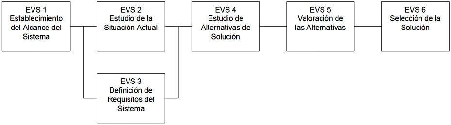
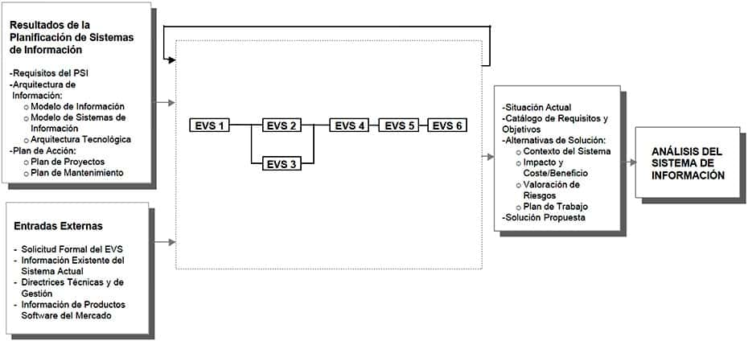

#  Estudio de Viabilidad del Sistema

## Descripción y objetivos

Mientras que el Plan de Sistemas de Información tiene como objetivo proporcionar un marco estratégico que sirva de referencia para los Sistemas de Información de un ámbito concreto de una organización, el objetivo del Estudio de Viabilidad del Sistema es el análisis de un conjunto concreto de necesidades para proponer una solución a corto plazo, que tenga en cuenta restricciones económicas, técnicas, legales y operativas. La solución obtenida como resultado del estudio puede ser la definición de uno o varios proyectos que afecten a uno o varios sistemas de información ya existentes o nuevos. Para ello, se identifican los requisitos que se ha de satisfacer y se estudia, si procede, la situación actual.

A partir del estado inicial, la situación actual y los requisitos planteados, se estudian las alternativas de solución. Dichas alternativas pueden incluir soluciones que impliquen desarrollos a medida, soluciones basadas en la adquisición de productos software del mercado o soluciones mixtas. Se describe cada una de las alternativas, indicando los requisitos que cubre.

Una vez descritas cada una de las alternativas planteadas, se valora su impacto en la organización, la inversión a realizar en cada caso y los riesgos asociados. Esta información se analiza con el fin de evaluar las distintas alternativas y seleccionar la más adecuada, definiendo y estableciendo su planificación.

Si en la organización se ha realizado con anterioridad un Plan de Sistemas de Información que afecte al sistema objeto de este estudio, se dispondrá de un conjunto de productos que proporcionarán información a tener en cuenta en todo el proceso.

Las actividades que engloba este proceso se recogen en la siguiente figura, en la que se indican las actividades que pueden ejecutarse en paralelo y las que precisan para su realización resultados originados en actividades anteriores.

### ESTUDIO DE VIABILIDAD DEL SISTEMA {.unnumbered .unlisted}

### PARTICIPANTES EN LAS ACTIVIDADES DEL PROCESO EVS {.unnumbered .unlisted}

ESTUDIO DE VIABILIDAD DEL SISTEMA 	ACTIVIDADES
EVS 1 	EVS 2 	EVS 3 	EVS 4 	EVS 5 	EVS 6
Analistas 	X 	X 	X 	X 	X 	X
Comité de Dirección 	X 					X
Directores Usuarios 		X 				
Equipo de Soporte Técnico 		X 				
Especialistas en Comunicaciones 				X 		
Jefe de Proyecto 	X 	X 	X 	X 	X 	X
Responsable Mantenimiento 		X 				
Responsables de Seguridad 				X 		
Técnicos de Sistemas 				X 		
Usuarios Expertos 		X 	X 	X 		
TÉCNICAS/PRÁCTICAS UTILIZADAS EN LAS ACTIVIDADES DEL PROCESO EVS
ESTUDIO DE VIABILIDAD DEL SISTEMA 	ACTIVIDADES
EVS 1 	EVS 2 	EVS 3 	EVS 4 	EVS 5 	EVS 6
Análisis Coste/Beneficio 					X 	
Casos de Uso 				X 		
Catalogación 	X 	X 	X 	X 		
Diagrama de Clases 		X 		X 		
Diagrama de Descomposición Funcional 	X 					
Diagrama de Flujo de Datos 	X 	X 		X 		
Diagrama de Interacción de Objetos 		X 				
Diagrama de Representación 		X 		X 		
Impacto en la Organización 					X 	
Matricial 		X 		X 		
Modelo Entidad/Relación Extendido 		X 		X 		
Planificación 					X 	
Presentación 						X
Sesiones de trabajo 	X 	X 	X 			X
Actividades

    Actividad EVS 1: Establecimiento del Alcance del Sistema
    Actividad EVS 2: Estudio de la Situación Actual
    Actividad EVS 3: Definición de Requisitos del Sistema
    Actividad EVS 4: Estudio de Alternativas de Solución
    Actividad EVS 5: Valoración de las Alternativas
    Actividad EVS 6: Selección de la Solución

## Actividad EVS 1: Establecimiento del Alcance del Sistema

En esta actividad se estudia el alcance de la necesidad planteada por el cliente o usuario, o como consecuencia de la realización de un PSI, realizando una descripción general de la misma. Se determinan los objetivos, se inicia el estudio de los requisitos y se identifican las unidades organizativas afectadas estableciendo su estructura.

Se analizan las posibles restricciones, tanto generales como específicas, que puedan condicionar el estudio y la planificación de las alternativas de solución que se propongan.

Si la justificación económica es obvia, el riesgo técnico bajo, se esperan pocos problemas legales y no existe ninguna alternativa razonable, no es necesario profundizar en el estudio de viabilidad del sistema, analizando posibles alternativas y realizando una valoración y evaluación de las mismas, sino que éste se orientará a la especificación de requisitos, descripción del nuevo sistema y planificación.

Se detalla la composición del equipo de trabajo necesario para este proceso y su planificación. Finalmente, con el fin de facilitar la implicación activa de los usuarios en la definición del sistema, se identifican sus perfiles, dejando claras sus tareas y responsabilidades.
TAREA 	PRODUCTOS 	TÉCNICAS Y PRÁCTICAS 	PARTICIPANTES
EVS 1.1: Estudio de la Solicitud 	

    Descripción General del Sistema
    Catálogo Objetivos EVS
    Catálogo de Requisitos

	

    Catalogación
    Sesiones de trabajo

	

    Comité de Dirección
    Jefe de Proyecto
    Analistas

EVS 1.2: Identificación del Alcance del Sistema 	

    Descripción General del Sistema:
        Contexto del Sistema
        Estructura Organizativa
    Catálogo de Requisitos
    Catálogo de Usuarios

	

    Diagrama de Flujo de Datos
    Diagrama de Descomposición Funcional
    Catalogación
    Sesiones de trabajo

	

    Comité de Dirección
    Jefe de Proyecto
    Analistas

EVS 1.3: Especificación del Alcance del EVS 	

    Catálogo de Objetivos del EVS
    Catálogo de Usuarios
    Plan de Trabajo

	

    Catalogación
    Sesiones de trabajo

	

    Comité de Dirección
    Jefe de Proyecto
    Analistas

### Tarea EVS 1.1: Estudio de la Solicitud

Se realiza una descripción general de la necesidad planteada por el usuario, y se estudian las posibles restricciones de carácter económico, técnico, operativo y legal que puedan afectar al sistema. Antes de iniciar el estudio de los requisitos del sistema se establecen los objetivos generales del Estudio de Viabilidad, teniendo en cuenta las restricciones identificadas anteriormente.

Si el sistema objeto de estudio se encuentra en el ámbito de un Plan de Sistemas de Información vigente, se debe de tomar como referencia el catálogo de requisitos y la arquitectura de información resultante del mismo, como información adicional para la descripción general del sistema y determinación de los requisitos iniciales.
Productos

De entrada

    Catálogo de Requisitos del PSI (PSI 9.2)
    Arquitectura de Información (PSI 9.2)
    Solicitud (externo)

De salida

    Descripción General del Sistema
    Catálogo de Objetivos del EVS
    Catálogo de Requisitos

Prácticas

    Catalogación
    Sesiones de trabajo

Participantes

    Comité de Dirección
    Jefe de Proyecto
    Analistas

### Tarea EVS 1.2: Identificación del Alcance del Sistema

Se analiza el alcance de la necesidad planteada y se identifican las restricciones relativas a la sincronización con otros proyectos, que puedan interferir en la planificación y futura puesta a punto del sistema objeto del estudio. Esta información se recoge en el catálogo de requisitos.

Si el sistema pertenece al ámbito de un Plan de Sistemas de Información, se debe tener en cuenta la arquitectura de información propuesta para analizar el alcance del sistema e identificar los sistemas de información que quedan fuera del ámbito del estudio. Además, se estudia el plan de proyectos, para determinar las posibles dependencias con otros proyectos.

Una vez establecido el alcance, se identifican las unidades organizativas afectadas por el sistema, así como su estructura y responsables de las mismas. Para determinar los responsables se tiene en cuenta a quiénes afecta directamente y quiénes pueden influir en el éxito o fracaso del mismo.
Productos

De entrada

    Plan de Proyectos (PSI 9.2)
    Arquitectura de Información (PSI 9.2)
    Descripción General del Sistema (EVS 1.1)
    Catálogo de Objetivos del EVS (EVS 1.1)
    Catálogo de Requisitos (EVS 1.1)

De salida

    Descripción General del Sistema:
        Contexto del Sistema
        Estructura Organizativa
    Catálogo de Requisitos:
        Requisitos Relativos a Restricciones o Dependencias con Otros Proyectos
    Catálogo de Usuarios

Técnicas

    Diagrama de Flujo de Datos
    Diagrama de Descomposición Funcional

Prácticas

    Catalogación
    Sesiones de trabajo

Participantes

    Comité de Dirección
    Jefe de Proyecto
    Analistas

### Tarea EVS 1.3: Especificación del Alcance del EVS

En función del alcance del sistema y los objetivos del Estudio de Viabilidad del Sistema, se determinan las actividades y tareas a realizar. En particular, hay que decidir si se realiza o no el estudio de la situación actual y, en el caso de considerarlo necesario, con qué objetivo. Si el sistema pertenece al ámbito de un Plan de Sistemas de Información, los criterios que pueden orientar sobre la necesidad de llevar a cabo el estudio de la situación actual dependen de la arquitectura de información propuesta, en cuanto a la identificación de los sistemas de información actuales, implicados en el ámbito de este estudio, que se haya decidido conservar.

Se identifican los usuarios participantes de las distintas unidades organizativas afectadas para la realización del Estudio de Viabilidad del Sistema, determinando previamente sus perfiles y responsabilidades.

Debe comunicarse el plan de trabajo a los usuarios identificados como implicados en el Estudio de Viabilidad, solicitando su aceptación y esperado su confirmación.
Productos

De entrada

    Arquitectura de Información (PSI 9.2)
    Catálogo de Objetivos del EVS (EVS 1.1)
    Descripción General del Sistema (EVS 1.2)
    Catálogo de Usuarios (EVS 1.2)

De salida

    Catálogo de Objetivos del EVS:
        Objetivos del Estudio de la Situación Actual
    Catálogo de Usuarios
    Plan de Trabajo

Prácticas

    Catalogación
    Sesiones de trabajo

Participantes

    Comité de Dirección
    Jefe de Proyecto
    Analistas

## Actividad EVS 2: Estudio de la Situación Actual

La situación actual es el estado en el que se encuentran los sistemas de información existentes en el momento en el que se inicia su estudio.

Teniendo en cuenta el objetivo del estudio de la situación actual, se realiza una valoración de la información existente acerca de los sistemas de información afectados. En función de dicha valoración, se especifica el nivel de detalle con que se debe llevar a cabo el estudio. Si es necesario, se constituye un equipo de trabajo específico para su realización y se identifican los usuarios participantes en el mismo.

Si se decide documentar la situación actual, normalmente es conveniente dividir el sistema actual en subsistemas. Si es posible se describirá cada uno de los subsistemas, valorando qué información puede ser relevante para la descripción.

Como resultado de esta actividad se genera un diagnóstico, estimando la eficiencia de los sistemas de información existentes e identificando los posibles problemas y las mejoras.
TAREA 	PRODUCTOS 	TÉCNICAS Y PRÁCTICAS 	PARTICIPANTES
EVS 2.1: Valoración del Estudio de la Situación Actual 	

    Descripción de la Situación Actual:
        Contexto del Sistema Actual
        Descripción de los Sistemas de Información Actuales

	

    Diagrama de Flujo de Datos
    Diagrama de Representación
    Sesiones de trabajo

	

    Jefe de Proyecto
    Analistas
    Directores de Usuarios

EVS 2.2: Identificación de los Usuarios Participantes en el Estudio de la Situación Actual 	

    Catálogo de Usuarios

	

    Sesiones de trabajo
    Catalogación

	

    Jefe de Proyecto
    Directores de Usuarios

EVS 2.3: Descripción de los Sistemas de Información Existentes 	

    Descripción de la Situación Actual:
        Descripción Lógica del Sistema Actual
        Modelo Físico del Sistema Actual (opcional)
        Matriz Localización Módulos y Datos

	

    Modelo Entidad/Relación Extendido
    Diagrama de Flujo de Datos
    Diagrama de Clases
    Diagrama de Interacción de Objetos
    Matricial
    Diagrama de Representación
    Sesiones de trabajo

	

    Analistas
    Usuarios Expertos
    Equipo de Soporte Técnico

EVS 2.4: Realización del Diagnóstico de la Situación Actual 	

    Descripción de la Situación Actual:
        Diagnóstico de la Situación Actual

		

    Analistas
    Responsable de Mantenimiento

### Tarea EVS 2.1: Valoración del Estudio de la Situación Actual

En función de los objetivos establecidos para el estudio de la situación actual, y considerando el contexto del sistema especificado en la descripción general del mismo, se identifican los sistemas de información existentes que es necesario analizar con el fin de determinar el alcance del sistema actual. Asimismo, se decide el nivel de detalle con el que se va a llevar a cabo el estudio de cada uno de los sistemas de información implicados. En el caso de haber realizado un Plan de Sistemas de Información que afecte a dicho sistema, se toma como punto de partida para este análisis la arquitectura de información propuesta.

Para poder abordar el estudio, se realiza previamente una valoración de la información existente acerca de los sistemas de información afectados por el EVS. Se debe decidir si se realizan o no los modelos lógicos del sistema actual o si se describe el modelo físico, en función de los siguientes criterios:

    Si existen los modelos lógicos, y son fiables, se utilizan en la tarea Descripción de los Sistemas de Información Existentes (EVS 2.3)
    Si no existen dichos modelos, o no son fiables, se considera el tiempo de vida estimado para el sistema de información en función de la antigüedad, la obsolescencia de la tecnología o la falta de adecuación funcional para determinar sí se obtienen los modelos lógicos y físicos del sistema actual o por el contrario no se elabora ningún modelo.

La información relativa a los sistemas de información que se decida analizar, se obtiene mediante sesiones de trabajo con los Directores de Usuarios y el apoyo de los profesionales de Sistemas y Tecnologías de la Información y Comunicaciones (STIC) que se considere necesario.
Productos

De entrada

    Información Existente del Sistema Actual (externo)
    Arquitectura de Información (PSI 9.2)
    Catálogo de Objetivos del EVS (EVS 1.3)
    Descripción General del Sistema (EVS 1.2)

De salida

    Descripción de la Situación Actual:
        Contexto del Sistema Actual
        Descripción de los Sistemas de Información Actuales

Técnicas

    Diagrama de Flujo de Datos

Prácticas

    Diagrama de Representación
    Sesiones de Trabajo

Participantes

    Jefe de Proyecto
    Analistas
    Directores de Usuarios

### Tarea EVS 2.2: Identificación de los Usuarios Participantes en el Estudio de la Situación Actual

En función del nivel de detalle establecido para el estudio de la situación actual, se identifican los usuarios participantes de cada una de las unidades organizativas afectadas por dicho estudio. Se informa a los usuarios identificados como implicados en el Estudio de la Situación Actual, se solicita su aceptación y se espera su confirmación.
Productos

De entrada

    Descripción General del Sistema (EVS 1.2)
    Catálogo de Usuarios (EVS 1.2)
    Descripción de la Situación Actual (EVS 1.2)

De salida

    Catálogo de Usuarios

Prácticas

    Catalogación
    Sesiones de Trabajo

Participantes

    Jefe de Proyecto
    Directores de Usuarios

### Tarea EVS 2.3: Descripción de los Sistemas de Información Existentes

En esta tarea se describen los sistemas de información existentes afectados, según el alcance y nivel de detalle establecido en la tarea Valoración del Estudio de la Situación Actual (EVS 2.1), mediante sesiones de trabajo con los usuarios designados para este estudio.

Si se ha decidido describir los sistemas a nivel lógico, y si existe un conocimiento suficiente de los sistemas de información a especificar, puede hacerse directamente, aplicando las técnicas de modelización y siguiendo un método descendente. Si no se dispone del conocimiento suficiente, se construyen los modelos a partir de la descripción del modelo físico, es decir, de forma ascendente.

Si se tiene que describir el modelo físico, se puede hacer mediante un Diagrama de Representación en el que se recojan todos los componentes físicos y sus referencias cruzadas. Otra opción es describir el modelo físico de forma más detallada, para lo que es necesaria la utilización de herramientas de tipo scanner.

Es conveniente indicar la localización geográfica y física actual de los módulos y datos de los sistemas de información afectados, evaluando al mismo tiempo la redundancia en las distintas unidades organizativas.
Productos

De entrada

    Descripción de la Situación Actual (EVS 2.1)
    Catálogo de Usuarios (EVS 2.2)

De salida

    Descripción de la Situación Actual:
        Descripción Lógica del Sistema Actual
        Modelo Físico del Sistema Actual (opcional)
        Matriz de Localización Geográfica y Física de Módulos y Datos, incluidas las redundancias

Técnicas

    Diagrama de Flujo de Datos
    Modelo Entidad/Relación extendido
    Diagrama de Clases
    Diagrama de Interacción de Objetos
    Matricial

Prácticas

    Diagrama de Representación
    Sesiones de Trabajo

Participantes

    Analistas
    Usuarios Expertos
    Equipo de Soporte Técnico

### Tarea EVS 2.4: Realización del Diagnóstico de la Situación Actual

Con el fin de elaborar el diagnóstico de la situación actual se analiza la información de los sistemas de información existentes, obtenida en la tarea anterior y se identifican problemas, deficiencias y mejoras. Estas últimas deben tenerse en cuenta en la definición de los requisitos.

En el caso de haber realizado un Plan de Sistemas de Información, se considera la valoración realizada sobre los sistemas de información actuales que pertenecen al ámbito de este estudio.

Si se ha tomado la decisión de no describir la situación actual, se realiza un diagnóstico global justificando esta decisión.
Productos

De entrada

    Descripción de la Situación Actual (EVS 2.3)
    Catálogo de Objetivos del EVS (EVS 1.3)
    Valoración de la Situación actual (PSI 5.3)

De salida

    Descripción de la Situación Actual:
        Diagnóstico de Situación Actual

Participantes

    Analistas
    Responsable de Mantenimiento

## Actividad EVS 3: Definición de Requisitos del Sistema

Esta actividad incluye la determinación de los requisitos generales, mediante una serie de sesiones de trabajo con los usuarios participantes, que hay que planificar y realizar. Una vez finalizadas, se analiza la información obtenida definiendo los requisitos y sus prioridades, que se añaden al catálogo de requisitos que servirá para el estudio y valoración de las distintas alternativas de solución que se propongan.
TAREA 	PRODUCTOS 	TÉCNICAS Y PRÁCTICAS 	PARTICIPANTES
EVS 3.1: Identificación de las Directrices Técnicas y de Gestión 	

    Catálogo de Normas

	

    Catalogación

	

    Jefe de Proyecto
    Analistas
    Usuarios Expertos

EVS 3.2: Identificación de Requisitos 	

    Identificación de Requisitos

	

    Sesiones de trabajo

	

    Jefe de Proyecto
    Analistas
    Usuarios Expertos

EVS 3.3: Catalogación de Requisitos 	

    Catálogo de Requisitos

	

    Catalogación

	

    Jefe de Proyecto
    Analistas
    Usuarios Expertos

### Tarea EVS 3.1: Identificación de las Directrices Técnicas y de Gestión

La realización de esta tarea permite considerar los términos de referencia para el sistema en estudio desde el punto de vista de directrices tanto técnicas como de gestión. Si el sistema en estudio pertenece al ámbito de un Plan de Sistemas de Información vigente, éste proporciona un marco de referencia a considerar en esta tarea.

Con este fin, se recoge información sobre los estándares y procedimientos que deben considerarse al proponer una solución, relativos a:

    Políticas técnicas:
        Gestión de Proyectos (seguimiento, revisión y aprobación final).
        Desarrollo de Sistemas (existencia de normativas, metodologías y técnicas de programación).
        Arquitectura de Sistemas (centralizada, distribuida).
    Política de Seguridad (control de accesos, integridad de datos, disponibilidad de aplicaciones).
    Directrices de Planificación.
    Directrices de Gestión de Cambios.
    Directrices de Gestión de Calidad.

Productos

De entrada

    Catálogo de Normas del PSI (PSI 3.2)
    Recopilación de Directrices Técnicas y de Gestión (externo)

De salida

    Catálogo de Normas

Prácticas

    Catalogación

Participantes

    Jefe de Proyecto
    Analistas
    Usuarios Expertos

### Tarea EVS 3.2: Identificación de Requisitos

Para la obtención de las necesidades que ha de cubrir el sistema en estudio, se debe decidir qué tipo de sesiones de trabajo se realizarán y con qué frecuencia tendrán lugar, en función de la disponibilidad de los usuarios participantes.

Si se ha realizado el Estudio de la Situación Actual (EVS 2), puede ser conveniente seleccionar la información de los sistemas de información existentes que resulte de interés para el desarrollo de dichas sesiones de trabajo.

Una vez establecidos los puntos anteriores, se planifican las sesiones de trabajo con los usuarios participantes identificados al estudiar el alcance del Estudio de Viabilidad del Sistema (EVS 1.3), y se realizan de acuerdo al plan previsto. La información obtenida depende del tipo de sesión de trabajo seleccionado.
Productos

De entrada

    Descripción General del Sistema (EVS 1.2)
    Catálogo de Requisitos (EVS 1.2)
    Equipo de Trabajo del EVS (EVS 1.3)
    Catálogo de Usuarios (EVS 2.2/1.3)
    Descripción de la Situación Actual (EVS 2.4)

De salida

    Identificación de Requisitos

Prácticas

    Sesiones de Trabajo

Participantes

    Jefe de Proyecto
    Analistas
    Usuarios Expertos

### Tarea EVS 3.3: Catalogación de Requisitos

Se analiza la información obtenida en las sesiones de trabajo para la Identificación de Requisitos, definiendo y catalogando los requisitos (funcionales y no funcionales) que debe satisfacer el sistema, indicando sus prioridades.

Se incluirán también requisitos relativos a distribución geográfica y entorno tecnológico.
Productos

De entrada

    Identificación de Requisitos (EVS 3.2)
    Catálogo de Requisitos (EVS 1.2)

De salida

    Catálogo de Requisitos

Prácticas

    Catalogación

Participantes

    Jefe de Proyecto
    Analistas
    Usuarios Expertos

## Actividad EVS 4: Estudio de Alternativas de Solución

Este estudio se centra en proponer diversas alternativas que respondan satisfactoriamente a los requisitos planteados, considerando también los resultados obtenidos en el Estudio de la Situación Actual (EVS 2), en el caso de que se haya realizado.

Teniendo en cuenta el ámbito y funcionalidad que debe cubrir el sistema, puede ser conveniente realizar, previamente a la definición de cada alternativa, una descomposición del sistema en subsistemas.

En la descripción de las distintas alternativas de solución propuestas, se debe especificar si alguna de ellas está basada, total o parcialmente, en un producto existente en el mercado. Si la alternativa incluye un desarrollo a medida, se debe incorporar en la descripción de la misma un modelo abstracto de datos y un modelo de procesos, y en orientación a objetos, un modelo de negocio y un modelo de dominio.
TAREA 	PRODUCTOS 	TÉCNICAS Y PRÁCTICAS 	PARTICIPANTES
EVS 4.1: Preselección de Alternativas de Solución 	

    Descripción Inicial del Sistema en Subsistemas (opcional)
    Alternativas de Solución a Estudiar

	

    Diagrama de Representación

	

    Jefe de Proyecto
    Analistas
    Técnico de sistemas

EVS 4.2: Descripción de las Alternativas de Solución 	

    Catálogo de Requisitos
    Alternativas de solución a estudiar:
        Catálogo de Requisitos (actualizado)
        Modelo de Descomposición en Subsistemas
        Matroz Procesos / Localización Geográfica
        Matriz Datos / Localización Geográfica
        Entorno Tecnológico y Comunicaciones
        Estrategia de Implantación Global del Sistema
        Si la alternativa requiere desarrollo:
        Modelo Abstracto de Datos / Modelo de Procesos (En caso de Estructurado)
        Modelo de Negocio / Modelo de Dominio (En caso de Orientación a Objetos)
        Si la alternativa incluye producto software estándar:
        Descripción del Producto
        Previsión de Evolución del Producto
        Costes Ocasionados por Producto
        Estándares del Producto
        Descripción de Adaptación (si es necesaria)

	

    Matricial
    Modelo Entidad/Relación Extendido
    Diagrama de Flujo de Datos
    Casos de Uso
    Diagrama de Clases
    Catalogación
    Diagrama de Representación

	

    Jefe de Proyecto
    Analistas
    Usuarios Expertos
    Técnicos de sistemas
    Responsables de Seguridad
    Especialistas en Comunicaciones

### Tarea EVS 4.1: Preselección de Alternativas de Solución

Una vez definidos los requisitos a cubrir por el sistema, se estudian las diferentes opciones que hay para configurar la solución. Entre ellas, hay que considerar la adquisición de productos software estándar del mercado, desarrollos a medida o soluciones mixtas.

Dependiendo del alcance del sistema y las posibles opciones, puede ser conveniente realizar inicialmente una descomposición del sistema en subsistemas. Se establecen las posibles alternativas sobre las que se va a centrar el estudio de la solución, combinando las opciones que se consideren más adecuadas.
Productos

De entrada

    Información de Productos Software del Mercado (externo)
    Descripción General del Sistema (EVS 1.2)
    Descripción de la Situación Actual (EVS 2.4)
    Catálogo de Requisitos (EVS 3.3)

De salida

    Descomposición Inicial del Sistema en Subsistemas (opcional)
    Alternativas de Solución a Estudiar

Prácticas

    Diagrama de Representación

Participantes

    Jefe de Proyecto
    Analistas
    Técnicos de Sistema

### Tarea EVS 4.2: Descripción de las Alternativas de Solución

Para cada alternativa propuesta, se identifican los subsistemas que cubre y los requisitos a los que se da respuesta.

Se deben considerar también aspectos relativos a la cobertura geográfica (ámbito y limitaciones) de procesos y datos, teniendo en cuenta a su vez la gestión de comunicaciones y control de red.

En la definición de cada alternativa, se propone una estrategia de implantación teniendo en cuenta tanto la cobertura global del sistema como la cobertura geográfica.

Si la alternativa incluye desarrollo se describe el modelo abstracto de datos y el modelo de procesos, y en el caso de Orientación a Objetos, el modelo de negocio y, opcionalmente, el modelo de dominio. Se propone el entorno tecnológico que se considera más apropiado para la parte del sistema basada en desarrollo y se describen los procesos manuales.

Si la alternativa incluye una solución basada en producto se analiza su evolución prevista, adaptabilidad y portabilidad, así como los costes ocasionados por licencias, y los estándares del producto. Igualmente se valora y determina su entorno tecnológico.
Productos

De entrada

    Descripción General del Sistema (EVS 1.2)
    Descripción de la Situación Actual (EVS 2.4)
    Catálogo de Requisitos (EVS 3.3)
    Descomposición Inicial del Sistema en Subsistemas (EVS 4.1) (opcional)
    Alternativas de Solución a Estudiar (EVS 4.1)

De salida

    Catálogo de Requisitos (actualizado)
    Alternativas de Solución a Estudiar:
        Catálogo de Requisitos (cobertura)
        Modelo de Descomposición en Subsistemas
        Matriz Procesos / Localización Geográfica
        Matriz Datos / Localización Geográfica
        Entorno Tecnológico y Comunicaciones
        Estrategia de Implantación Global del Sistema
        Descripción de Procesos Manuales
        Si la alternativa incluye desarrollo:
        Modelo Abstracto de Datos / Modelo de Procesos
        Modelo de Negocio / Modelo de Dominio (en caso de Orientación a Objetos)
        Si la alternativa incluye un producto software estándar de mercado:
        Descripción del Producto
        Evolución del Producto
        Costes Ocasionados por Producto
        Estándares del Producto
        Descripción de Adaptación (si es necesaria)

Técnicas

    Matricial
    Diagrama de Flujo de Datos
    Modelo Entidad/ Relación extendido
    Diagrama de Clases
    Casos de Uso

Prácticas

    Catalogación
    Diagrama de Representación

Participantes

    Jefe de Proyecto
    Analistas
    Usuarios Expertos
    Técnicos de Sistemas
    Responsable de Seguridad
    Especialistas en Comunicaciones

## Actividad EVS 5: Valoración de las Alternativas

Una vez descritas las alternativas se realiza una valoración de las mismas, considerando el impacto en la organización, tanto desde el punto de vista tecnológico y organizativo como de operación, y los posibles beneficios que se esperan contrastados con los costes asociados. Se realiza también un análisis de los riesgos, decidiendo cómo enfocar el plan de acción para minimizar los mismos y cuantificando los recursos y plazos precisos para planificar cada alternativa.
TAREA 	PRODUCTOS 	TÉCNICAS Y PRÁCTICAS 	PARTICIPANTES
EVS 5.1: Estudio de la Inversión 	

    Valoración de Alternativas:
        Impacto en la Organización de Alternativas
        Coste/Beneficio de Alternativas

	

    Análisis Coste/Beneficio

	

    Jefe de Proyecto
    Analistas

EVS 5.2: Estudio de los Riesgos 	

    Valoración de Alternativas:
        Valoración de Riesgos

	

    Impacto en la Organización

	

    Jefe de Proyecto
    Analistas

EVS 5.3: Planificación de Alternativas 	

    Plan de Trabajo de Cada Alternativa:
        Enfoque del Plan de Trabajo de Cada Alternativa
        Planificación de Cada Alternativa

	

    Planificación

	

    Jefe de Proyecto
    Analistas

### Tarea EVS 5.1: Estudio de la Inversión

Para cada alternativa de solución propuesta, se valora el impacto en la organización y se establece su viabilidad económica. Para ello, se realiza un análisis coste/beneficio que determina los costes del sistema y los pondera con los beneficios tangibles, cuantificables directamente, y con los beneficios intangibles, buscando el modo de cuantificarlos.
Productos

De entrada

    Alternativas de Solución a Estudiar (EVS 4.2)

De salida

    Valoración de Alternativas:
        Impacto en la Organización de Alternativas
        Coste / beneficio de Alternativas

Técnicas

    Análisis Coste/Beneficio

Participantes

    Jefe de Proyecto
    Analistas

### Tarea EVS 5.2: Estudio de los Riesgos

Para cada alternativa se seleccionan los factores de situación que habrá que considerar, relativos tanto a la incertidumbre como a la complejidad del sistema. Se identifican y valoran los riesgos asociados y se determinan las medidas a tomar para minimizarlos.
Productos

De entrada

    Alternativas de Solución a Estudiar (EVS 4.2)
    Valoración de Alternativas (EVS 5.1)

De salida

    Valoración de Alternativas:
        Valoración de Riesgos

Prácticas

    Impacto en la Organización

Participantes

    Jefe de Proyecto
    Analistas

### Tarea EVS 5.3: Planificación de Alternativas

En función del análisis de riesgos realizado en la tarea anterior, y para cada una de las alternativas existentes:

    Se determina el enfoque más adecuado para llevar a buen fin la solución propuesta en cada alternativa.
    Se realiza una planificación, teniendo en cuenta los puntos de sincronismo con otros proyectos en desarrollo o que esté previsto desarrollar, según se ha recogido en el catálogo de requisitos.

De esta manera se garantiza el cumplimiento del plan de trabajo en los restantes procesos del ciclo de vida.
Productos

De entrada

    Catálogo de Requisitos (EVS 4.2)
    Alternativas de Solución a Estudiar (EVS 4.2)
    Valoración de Alternativas (EVS 5.2)

De salida

    Plan de Trabajo de Cada Alternativa:
        Enfoque del Plan de Trabajo de Cada Alternativa
        Planificación de Cada Alternativa

Técnicas

    Planificación

Participantes

    Jefe de Proyecto
    Analistas

## Actividad EVS 6: Selección de la Solución

Antes de finalizar el Estudio de Viabilidad del Sistema, se convoca al Comité de Dirección para la presentación de las distintas alternativas de solución, resultantes de la actividad anterior. En dicha presentación, se debaten las ventajas de cada una de ellas, incorporando las modificaciones que se consideren oportunas, con el fin de seleccionar la más adecuada. Finalmente, se aprueba la solución o se determina su inviabilidad.
TAREA 	PRODUCTOS 	TÉCNICAS Y PRÁCTICAS 	PARTICIPANTES
EVS 6.1: Convocatoria de la Presentación 	

    Plan de Presentación de Alternativas

	

    Presentación

	

    Jefe de Proyecto

EVS 6.2: Evaluación de las Alternativas y Selección 	

    Plan de Presentación de Alternativas
    Catálogo de Requisitos
    Solución Propuesta:
        Descripción de la Solución
        Contexto del Sistema (con la definición de las interfaces)
        Impacto en Organización de la Solución
        Coste/Beneficio de la Solución
        Valoración de Riesgos de la Solución
        Enfoque del Plan de Trabajo de la Solución
        Planificación de la Solución

	

    Presentación
    Sesiones de trabajo

	

    Comité de Dirección
    Jefe de Proyecto
    Analistas

EVS 6.3: Aprobación de la Solución 	

    Aprobación de la Solución

		

    Comité de Dirección
    Jefe de Proyecto

### Tarea EVS 6.1: Convocatoria de la Presentación

Se efectúa la convocatoria de la presentación de las distintas alternativas propuestas, adjuntando los productos de la actividad anterior con el fin de que el Comité de Dirección pueda estudiar previamente su contenido. Se espera confirmación por parte del Comité de Dirección de las alternativas a presentar.
Productos

De entrada

    Catálogo de Usuarios (EVS 2.2/1.3)
    Alternativas de Solución a Estudiar (EVS 4.2)
    Valoración de Alternativas (EVS 5.2)
    Plan de Trabajo de Cada Alternativa (EVS 5.3)

De salida

    Plan de Presentación de Alternativas

Prácticas

    Presentación

Participantes

    Jefe de Proyecto

### Tarea EVS 6.2: Evaluación de las Alternativas y Selección

Una vez recibida la confirmación de qué alternativas van a ser presentadas para su valoración, se efectúa su presentación al Comité de Dirección, debatiendo sobre las ventajas e inconvenientes de cada una de ellas y realizando las modificaciones que sugiera dicho Comité, hasta la selección de la solución final.
Productos

De entrada

    Descripción General del Sistema (Contexto del Sistema) (EVS 1.2)
    Catálogo de Requisitos (EVS 4.2)
    Alternativas de Solución a Estudiar (EVS 4.2)
    Valoración de Alternativas (EVS 5.2)
    Plan de Trabajo de Cada Alternativa (EVS 5.3)
    Plan de Presentación de Alternativas (EVS 6.1)

De salida

    Plan de Presentación de Alternativas
    Catálogo de Requisitos (Actualizado en Función de la Cobertura de la Solución)
    Solución Propuesta:
        Descripción de la Solución
            Modelo de Descomposición en Subsistemas
            Matriz Procesos / Localización Geográfica
            Matriz Datos / Localización Geográfica
            Entorno Tecnológico y Comunicaciones
            Estrategia de Implantación Global del Sistema
            Descripción de Procesos Manuales
            Si la alternativa incluye desarrollo:
            Modelo Abstracto de Datos / Modelo de Procesos
            Modelo de Negocio / Modelo de Dominio
            Si la alternativa incluye un producto software estándar de mercado:
            Descripción del Producto
            Evolución del Producto
            Costes Ocasionados por Producto
            Estándares del Producto
            Descripción de Adaptación (si es necesaria)
        Contexto del Sistema (con la Definición de las Interfaces en Función de la Solución)
        Impacto en la Organización de la Solución
        Coste / Beneficio de la Solución
        Valoración de Riesgos de la Solución
        Enfoque del Plan de Trabajo de la Solución
        Planificación de la Solución

Prácticas

    Presentación
    Sesiones de Trabajo

Participantes

    Comité de Dirección
    Jefe de Proyecto
    Analistas

### Tarea EVS 6.3: Aprobación de la Solución

El Comité de Dirección da su aprobación formal o determina la inviabilidad del sistema, por motivos económicos, de funcionalidad como resultado del incumplimiento de los requisitos identificados en plazos razonables o de cobertura de los mismos, etc.
Productos

De entrada

    Catálogo de Requisitos (EVS 6.2)
    Solución Propuesta (EVS 6.2)

De salida

    Aprobación de la Solución

Participantes

    Comité de Dirección
    Jefe de Proyecto

