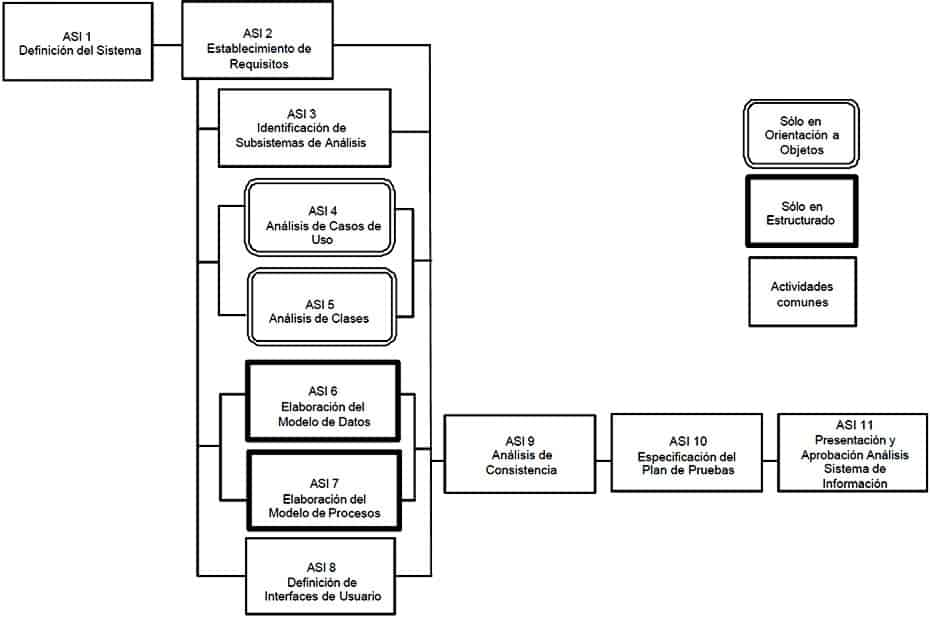
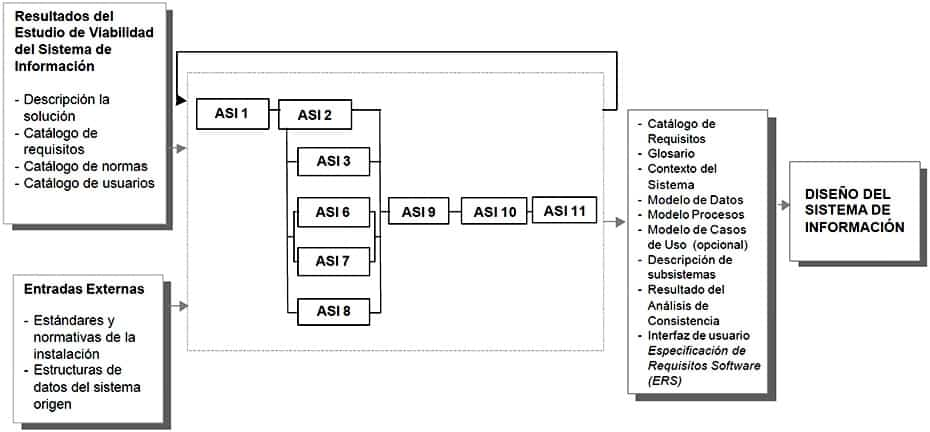
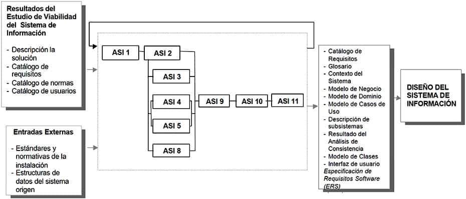

#  Análisis del Sistema de Información

## Descripción y objetivos

El objetivo de este proceso es la obtención de una especificación detallada del sistema de información que satisfaga las necesidades de información de los usuarios y sirva de base para el posterior diseño del sistema.

Al ser MÉTRICA Versión 3 una metodología que cubre tanto desarrollos estructurados como orientados a objetos, las actividades de ambas aproximaciones están integradas en una estructura común.

En la primera actividad, Definición del Sistema (ASI 1), se lleva a cabo la descripción inicial del sistema de información, a partir de los productos generados en el proceso Estudio de Viabilidad del Sistema (EVS). Se delimita el alcance del sistema, se genera un catálogo de requisitos generales y se describe el sistema mediante unos modelos iniciales de alto nivel. También se identifican los usuarios que participan en el proceso de análisis, determinando sus perfiles, responsabilidades y dedicaciones necesarias. Así mismo se elabora el plan de trabajo a seguir.

La definición de requisitos del nuevo sistema se realiza principalmente en la actividad Establecimiento de Requisitos (ASI 2). El objetivo de esta actividad es elaborar un catálogo de requisitos detallado, que permita describir con precisión el sistema de información, y que además sirva de base para comprobar que es completa la especificación de los modelos obtenidos en las actividades Identificación de Subsistemas de Análisis (ASI 3), Análisis de Casos de Uso (ASI 4), Análisis de Clases (ASI 5), Elaboración del Modelo de Datos (ASI 6), Elaboración del Modelo de Procesos (ASI 7) y Definición de Interfaces de Usuario (ASI 8). Hay que hacer constar que estas actividades pueden provocar la actualización del catálogo, aunque no se refleja como producto de salida en las tareas de dichas actividades, ya que el objetivo de las mismas no es crear el catálogo sino definir modelos que soporten los requisitos.

Para la obtención de requisitos en la actividad Establecimiento de Requisitos (ASI 2) se toman como punto de partida el catálogo de requisitos y los modelos elaborados en la actividad Definición del Sistema (ASI 1), completándolos mediante sesiones de trabajo con los usuarios. Estas sesiones de trabajo tienen como objetivo reunir la información necesaria para obtener la especificación detallada del nuevo sistema. Las técnicas que ayudan a la recopilación de esta información pueden variar en función de las características del proyecto y los tipos de usuario a entrevistar. Entre ellas podemos citar las reuniones, entrevistas, Joint Application Design (JAD), etc. Durante estas sesiones de trabajo se propone utilizar la especificación de los casos de uso como ayuda y guía en el establecimiento de requisitos. Esta técnica facilita la comunicación con los usuarios y en el análisis orientado a objetos constituye la base de la especificación. A continuación se identifican las facilidades que ha de proporcionar el sistema, y las restricciones a que está sometido en cuanto a rendimiento, frecuencia de tratamiento, seguridad y control de accesos, etc. Toda esta información se incorpora al catálogo de requisitos.

En la actividad Identificación de Subsistemas de Análisis (ASI 3), se estructura el sistema de información en subsistemas de análisis, para facilitar la especificación de los distintos modelos y la traza de requisitos.

En paralelo, se generan los distintos modelos que sirven de base para el diseño. En el caso de análisis estructurado, se procede a la elaboración y descripción detallada del modelo de datos y de procesos, y en el caso de un análisis orientado a objetos, se elaboran el modelo de clases y el de interacción de objetos, mediante el análisis de los casos de uso. Se especifican, asimismo, todas las interfaces entre el sistema y el usuario, tales como formatos de pantallas, diálogos, formatos de informes y formularios de entrada.

En la actividad Análisis de Consistencia y Especificación de Requisitos (ASI 9), se realiza la verificación y validación de los modelos, con el fin de asegurar que son:

    Completos, puesto que cada modelo obtenido contiene toda la información necesaria recogida en el catálogo de requisitos.
    Consistentes, ya que cada modelo es coherente con el resto de los modelos.
    Correctos, dado que cada modelo sigue unos criterios de calidad predeterminados en relación a la técnica utilizada, calidad de diagramas, elección de nombres, normas de calidad, etc.).

En la actividad Especificación del Plan de Pruebas (ASI 10), se establece el marco general del plan de pruebas, iniciándose su especificación, que se completará en el proceso Diseño del Sistema de Información (DSI).

La participación activa de los usuarios es una condición imprescindible para el análisis del sistema de información, ya que dicha participación constituye una garantía de que los requisitos identificados son comprendidos e incorporados al sistema y, por tanto, de que éste será aceptado. Para facilitar la colaboración de los usuarios, se pueden utilizar técnicas interactivas, como diseño de diálogos y prototipos, que permiten al usuario familiarizarse con el nuevo sistema y colaborar en la construcción y perfeccionamiento del mismo.

En el siguiente gráfico se muestra la relación de actividades del proceso Análisis del Sistema de Información, tanto para desarrollos estructurados como para desarrollos orientados a objetos, distinguiendo las que se pueden realizar en paralelo de aquellas que han de realizarse secuencialmente.

ANÁLISIS DEL SISTEMAS DE INFORMACIÓN (ESTRUCTURADO)

ANÁLISIS DEL SISTEMAS DE INFORMACIÓN (ORIENTACIÓN A OBJETOS)

### Actividad ASI 1: Definición del Sistema

Esta actividad tiene como objetivo efectuar una descripción del sistema, delimitando su alcance, estableciendo las interfaces con otros sistemas e identificando a los usuarios representativos. Las tareas de esta actividad se pueden haber desarrollado ya en parte en el proceso de Estudio de Viabilidad del Sistema (EVS), de modo que se parte de los productos obtenidos en dicho proceso para proceder a su adecuación como punto de partida para definir el sistema de información.
TAREA 	PRODUCTOS 	TÉCNICAS Y PRÁCTICAS 	PARTICIPANTES
ASI 1.1: Determinación del Alcance del Sistema 	

    Catálogo de Requisitos
    Glosario
    Estructurado:
    Contexto del Sistema
    Modelo Conceptual de Datos
    Orientación a Objetos:
    Modelo de Negocio
    Modelo de Dominio

	

    Sesiones de trabajo
    Catalogación
    Diagrama de Flujo de Datos
    Modelo Entidad/Relación Extendido
    Casos de Uso
    Diagrama de Clases

	

    Jefe de Proyecto
    Analistas
    Directores de Usuarios

ASI 1.2: Identificación del Entorno Tecnológico 	

    Catálogo de Requisitos
    Descripción General del Entorno Tecnológico del Sistema

	

    Sesiones de trabajo
    Catalogación
    Diagramas de Representación

	

    Jefe de Proyecto
    Analistas
    Directores de Usuarios
    Equipo de Soporte Técnico

ASI 1.3: Especificación de Estándares y Normas 	

    Catálogo de Normas

	

    Sesiones de trabajo
    Catalogación

	

    Jefe de Proyecto
    Analistas
    Directores de Usuarios
    Equipo de Soporte Técnico

ASI 1.4: Identificación de Usuarios Participantes y Finales 	

    Catálogo de Usuarios
    Planificación

	

    Sesiones de trabajo
    Catalogación

	

    Jefe de Proyecto
    Analistas
    Directores de Usuarios

#### Tarea ASI 1.1: Determinación del Alcance del Sistema

En esta tarea se delimita el sistema de información, utilizando como punto de partida el modelo de procesos especificado en la descripción de la solución del proceso Estudio de Viabilidad del Sistema (EVS). Se indica qué procesos pertenecen al ámbito del Sistema de Información y se identifican las entidades externas al sistema que aportan o reciben información. Asimismo, se obtiene un modelo conceptual de datos identificando las entidades y relaciones que forman parte del sistema de información objeto de este análisis a partir del modelo abstracto de datos generado en la tarea Evaluación de Alternativas y Selección (EVS 6.2).

En el caso de análisis orientado a objetos, antes de la captura de requisitos empleando los casos de uso, puede ser conveniente establecer el contexto del sistema a partir del modelo de negocio obtenido en el proceso Estudio de Viabilidad del Sistema (EVS), y además, opcionalmente, del modelo de dominio. El modelo de negocio especifica los procesos a los que se quiere dar respuesta en el sistema de información, en forma de casos de uso de alto nivel, y el subconjunto de objetos del dominio requerido para ello.

En esta actividad se realiza, también, la definición del catálogo de requisitos del sistema a partir del catálogo de requisitos generado en el proceso Estudio de Viabilidad del Sistema (EVS).

A medida que se van generando los productos anteriores, se recomienda la definición de un glosario de términos del ámbito de negocio, con el fin de conseguir una mayor precisión en la especificación del sistema de información. El glosario es un catálogo de términos general y común a todos los procesos, y susceptible de ser entrada o salida en cualquier tarea, de modo que por sencillez en las restantes tareas se omite la referencia al mismo.

Para obtener esta información es necesario llevar a cabo sesiones de trabajo con los usuarios responsables del sistema de información que se está analizando.
Productos

De entrada

    Descripción de la Solución (EVS 6.2)
    Catálogo de requisitos (EVS 6.2)

De salida

    Catálogo de Requisitos
    Glosario
    En Análisis Estructurado:
    Contexto del Sistema
    Modelo Conceptual de Datos
    En Análisis Orientado a Objetos:
    Modelo de Negocio
    Modelo de Dominio

Técnicas

    Diagrama de Flujo de Datos
    Modelo Entidad / Relación extendido
    Diagrama de Clases
    Casos de Uso

Prácticas

    Sesiones de Trabajo
    Catalogación

Participantes

    Jefe de Proyecto
    Analistas
    Directores de los Usuarios

#### Tarea ASI 1.2: Identificación del Entorno Tecnológico

El objetivo de esta tarea es definir, a alto nivel, el entorno tecnológico que se requiere para dar respuesta a las necesidades de información, especificando sus posibles condicionantes y restricciones. Para ello se tiene en cuenta el entorno tecnológico propuesto en la descripción de la solución, que se obtuvo en el proceso Estudio de Viabilidad del Sistema (EVS).

Esta información se obtiene mediante sesiones de trabajo con los usuarios y el apoyo de los responsables de Tecnologías de Información y Comunicaciones que se considere necesario.
Productos

De entrada

    Catálogo de Requisitos (ASI 1.1)
    Descripción de la Solución (EVS 6.2)
    En Análisis Estructurado:
    Contexto del Sistema (ASI 1.1)
    En Análisis Orientado a Objetos:
    Modelo de Negocio (ASI 1.1)
    Modelo de Dominio (ASI 1.1)

De salida

    Catálogo de Requisitos
    Descripción General del Entorno Tecnológico del Sistema

Prácticas

    Sesiones de Trabajo
    Catalogación
    Diagrama de Representación

Participantes

    Jefe de Proyecto
    Analistas
    Directores de los Usuarios
    Equipo de Soporte Técnico

#### Tarea ASI 1.3: Especificación de Estándares y Normas

La realización de esta tarea permite considerar las referencias para el sistema de información en estudio, desde el punto de vista de estándares, normativas, leyes o recomendaciones, que deben tenerse en cuenta a lo largo de todo el proceso de desarrollo.

El producto resultante se obtiene actualizando el catálogo de normas elaborado en el proceso Estudio de Viabilidad del Sistema (EVS), incorporando toda la información que, desde el punto de vista de la instalación, se considere necesario contemplar para la elaboración de los distintos productos del ciclo de vida.
Productos

De entrada

    Catálogo de Normas (EVS 3.1)
    Descripción General del Entorno Tecnológico del Sistema (ASI 1.2)
    Estándares y Normativas de la Instalación (externo)
    En Análisis Estructurado:
    Contexto del Sistema (ASI 1.1)
    En Análisis Orientado a Objetos:
    Modelo de Negocio (ASI 1.1)
    Modelo de Dominio (ASI 1.1)

De salida

    Catálogo de Normas

Prácticas

    Sesiones de Trabajo
    Catalogación

Participantes

    Jefe de Proyecto
    Analistas
    Directores de los Usuarios
    Equipo de Soporte Técnico

#### Tarea ASI 1.4: Identificación de los Usuarios Participantes y Finales

En esta tarea se identifican los usuarios participantes y finales, interlocutores tanto en la obtención de requisitos como en la validación de los distintos productos y la aceptación final del sistema. Para ello, se actualiza el catálogo de usuarios generado previamente en el Estudio de Viabilidad del Sistema (EVS).

Dada la importancia que la colaboración de los usuarios tiene en el proceso de obtención de los requisitos, es conveniente determinar quiénes van a participar en las sesiones de trabajo, especificando sus funciones y asignando responsabilidades. Así mismo, se informa del plan de trabajo a los usuarios identificados.

El alcance de este plan de trabajo se limita al proceso de análisis.
Productos

De entrada

    Catálogo de Usuarios (EVS 1.3 y EVS 2.2)
    Catálogo de Requisitos (ASI 1.2)
    En Análisis Estructurado:
    Contexto del Sistema (ASI 1.1)
    En Análisis Orientado a Objetos:
    Modelo de Negocio (ASI 1.1)
    Modelo de Dominio (ASI 1.1)

De salida

    Catálogo de Usuarios
    Plan de Trabajo

Prácticas

    Catalogación
    Sesiones de Trabajo

Participantes

    Jefe de Proyecto
    Analistas
    Directores de los Usuarios

### Actividad ASI 2: Establecimiento de Requisitos

En esta actividad se lleva a cabo la definición, análisis y validación de los requisitos a partir de la información facilitada por el usuario, completándose el catálogo de requisitos obtenido en la actividad Definición del Sistema (ASI 1). El objetivo de esta actividad es obtener un catálogo detallado de los requisitos, a partir del cual se pueda comprobar que los productos generados en las actividades de modelización se ajustan a los requisitos de usuario.

Esta actividad se descompone en un conjunto de tareas que, si bien tienen un orden, exige continuas realimentaciones y solapamientos, entre sí y con otras tareas realizadas en paralelo. No es necesaria la finalización de una tarea para el comienzo de la siguiente. Lo que se tiene en un momento determinado es un catálogo de requisitos especificado en función de la progresión del proceso de análisis.

Se propone como técnica de obtención de requisitos la especificación de los casos de uso de la orientación a objetos, siendo opcional en el caso estructurado. Dicha técnica ofrece un diagrama simple y una guía de especificación en las sesiones de trabajo con el usuario.
TAREA 	PRODUCTOS 	TÉCNICAS Y PRÁCTICAS 	PARTICIPANTES
ASI 2.1: Obtención de Requisitos 	

    Catálogo de Requisitos
    Modelo de Casos de uso

	

    Sesiones de trabajo
    Catalogación
    Casos de Uso

	

    Usuarios Expertos
    Analistas

ASI 2.2: Especificación de Casos de Uso 	

    Catálogo de Requisitos
    Modelo de Casos de Uso
    Especificación de Casos de Uso

	

    Sesiones de trabajo
    Catalogación
    Casos de Uso

	

    Usuarios Expertos
    Analistas

ASI 2.3: Análisis de Requisitos 	

    Catálogo de Requistos
    Modelo de Casos de Uso
    Especificación de Casos de Uso

	

    Sesiones de trabajo
    Catalogación
    Casos de Uso

	

    Usuarios Expertos
    Analistas

ASI 2.4: Validación de Requisitos 	

    Catálogo de Requistos
    Modelo de Casos de Uso
    Especificación de Casos de Uso

	

    Sesiones de trabajo
    Catalogación
    Casos de Uso

	

    Usuarios Expertos
    Analistas

#### Tarea ASI 2.1: Obtención de Requisitos

En esta tarea comienza la obtención detallada de información mediante sesiones de trabajo con los usuarios, previamente identificados en la actividad Definición del Sistema (ASI 1).

Se recoge información de los requisitos que debe cumplir el software. En la definición de los requisitos, que sirven de base para establecer los niveles de servicios del sistema, hay que tener en cuenta, si existen, las posibles restricciones del entorno, tanto hardware como software, que puedan afectar al sistema de información.

También se definen las prioridades que hay que asignar a los requisitos, considerando los criterios de los usuarios acerca de las funcionalidades a cubrir.

Los principales tipos de requisitos que se deben especificar son, por ejemplo:

    Funcionales.
    Rendimiento.
    Seguridad.
    Implantación.
    Disponibilidad del sistema.

En el caso de orientación a objetos se especifican, además, los casos de uso asociados a los requisitos funcionales.

Los casos de uso son una técnica de especificación de requisitos válida tanto en desarrollos estructurados como en orientación a objetos, aunque en este último caso se propone como técnica obligatoria al ser necesaria como referencia a lo largo de todo el ciclo de vida. En esta tarea se elabora el modelo de casos de uso, según las normas y estándares de la organización, identificando:

    Actores.
    Casos de uso.
    Breve descripción de cada caso de uso.

Los productos obtenidos en la tarea Determinación del Alcance del Sistema (ASI 1.1), son tomados como referencia durante la obtención de requisitos, de forma que todos los requisitos especificados se encuentren dentro del ámbito del sistema de información.
Productos

De entrada

    Catálogo de Requisitos (ASI 1.4)
    Descripción General del Entorno Tecnológico del Sistema (ASI 1.4)
    Catálogo de Usuarios (ASI 1.4)
    Plan de Trabajo (ASI 1.4)
    En Análisis Estructurado:
    Contexto del Sistema (ASI 1.1)
    En Análisis Orientado a Objetos:
    Modelo de Negocio (ASI 1.1)
    Modelo de Dominio (ASI 1.1)

De salida

    Catálogo de Requisitos
    Modelo de Casos de Uso

Técnicas

    Casos de Uso

Prácticas

    Sesiones de Trabajo
    Catalogación

Participantes

    Usuarios Expertos
    Analistas

#### Tarea ASI 2.2: Especificación de Casos de Uso

Esta tarea es obligatoria en el caso de orientación a objetos, y opcional en el caso de análisis estructurado, como apoyo a la obtención de requisitos.

El objetivo de esta tarea es especificar cada caso de uso identificado en la tarea anterior, desarrollando el escenario.

Para completar los casos de uso, es preciso especificar información relativa a:

    Descripción del escenario, es decir, cómo un actor interactúa con el sistema, y cual es la respuesta obtenida.
    Precondiciones y poscondiciones.
    Identificación de interfaces de usuario.
    Condiciones de fallo que afectan al escenario, así como la respuesta del sistema (escenarios secundarios).

En escenarios complejos, es posible utilizar como técnica de especificación los diagramas de transición de estados, así como la división en casos de uso más simples, actualizando el modelo de casos de uso.

Para la obtención de esta información es imprescindible la participación activa de los usuarios.
Productos

De entrada

    Catálogo de Requisitos (ASI 2.1)
    Modelo de Casos de Uso (ASI 2.1)

De salida

    Catálogo de Requisitos
    Modelo de Casos de Uso
    Especificación de Casos de Uso

Técnicas

    Casos de Uso

Prácticas

    Sesiones de Trabajo
    Catalogación

Participantes

    Usuarios Expertos
    Analistas

#### Tarea ASI 2.3: Análisis de Requisitos

En esta tarea se estudia la información capturada previamente en esta actividad, para detectar inconsistencias, ambigüedades, duplicidad o escasez de información, etc.

También se analizan las prioridades establecidas por el usuario y se asocian los requisitos relacionados entre sí.

El análisis de los requisitos y de los casos de uso asociados permite identificar funcionalidades o comportamientos comunes, reestructurando la información de los casos de uso a través de las generalizaciones y relaciones entre ellos.

Mediante sesiones de trabajo con los usuarios, se contrastan las conclusiones del análisis de la información recogida.
Productos

De entrada

    Catálogo de Requisitos (ASI 2.2)
    Modelo de Casos de Uso (ASI 2.2)
    Especificación de Casos de Uso (ASI 2.2)

De salida

    Catálogo de Requisitos
    Modelo de Casos de Uso
    Especificación de Casos de Uso

Técnicas

    Casos de Uso

Prácticas

    Sesiones de Trabajo
    Catalogación

Participantes

    Usuarios Expertos
    Analistas

#### Tarea ASI 2.4: Validación de Requisitos

Mediante esta tarea, los usuarios confirman que los requisitos especificados en el catálogo de requisitos, así como los casos de uso, son válidos, consistentes y completos.
Productos

De entrada

    Catálogo de Requisitos (ASI 2.3)
    Modelo de Casos de Uso (ASI 2.3)
    Especificación de Casos de Uso (ASI 2.3)

De salida

    Catálogo de Requisitos
    Modelo de Casos de Uso
    Especificación de Casos de Uso

Técnicas

    Casos de Uso

Prácticas

    Sesiones de Trabajo
    Catalogación

Participantes

    Usuarios Expertos
    Analistas

### Actividad ASI 3: Identificación de Subsistemas de Análisis

Actividad ASI 3: Identificación de Subsistemas de Análisis
Usted está aquí: Inicio1 / TIC-tac-DOC2 / Metodologías y guías3 / MÉTRICA 34 / PROCESOS PRINCIPALES DE MÉTRICA v35 / Análisis del Sistema de Información (ASI)6 / Actividad ASI 3: Identificación de Subsistemas de Análisis

El objetivo de esta actividad, común tanto para análisis estructurado como para análisis orientado a objetos, es facilitar el análisis del sistema de información llevando a cabo la descomposición del sistema en subsistemas. Se realiza en paralelo con el resto de las actividades de generación de modelos del análisis. Por tanto, se asume la necesidad de una realimentación y ajuste continuo con respecto a la definición de los subsistemas, sus dependencias y sus interfaces.
TAREA 	PRODUCTOS 	TÉCNICAS Y PRÁCTICAS 	PARTICIPANTES
ASI 3.1: Determinación de Subsistemas de Análisis 	

    Estructurado:
    Modelo de Procesos
    Orientación a Objetos:
    Descripción de Subsistemas de Análisis
    Descripción de Interfaces entre Subsistemas

	

    Diagrama de Flujo de Datos
    Diagrama de Paquetes (Subsistemas)

	

    Jefe de Proyecto
    Analistas

ASI 3.2: Integración de Subsistemas de Análisis 	

    Desarrollo y Aceptación
    Estructurado:
    Modelo de Procesos
    Orientación a Objetos:
    Descripción de Subsistemas de Análisis
    Descripción de Interfaces entre Subsistemas

	

    Diagrama de Flujo de Datos
    Diagrama de Paquetes (Subsistemas)

	

    Jefe de Proyecto
    Analistas

#### Tarea ASI 3.1: Determinación de Subsistemas de Análisis

La descomposición del sistema en subsistemas debe estar, principalmente, orientada a los procesos de negocio, aunque también es posible adoptar otros criterios lógicos. Entre los criterios que pueden ayudar a su identificación, se encuentran los siguientes:

    Homogeneidad de procesos.
    Servicios comunes.
    Prioridad.
    Afinidad de requisitos.
    Localización geográfica.

En análisis estructurado, los subsistemas coinciden habitualmente con el primer nivel de descomposición del Diagrama de Flujo de Datos (diagrama 0), de modo que llevan implícita la definición de dependencia y de interfaz.

En análisis orientado a objetos, se identifican y definen las dependencias entre subsistemas analizando los elementos compartidos entre ellos o las interfaces entre subsistemas. En el caso de que se decida abstraer un subsistema para su análisis como una unidad con una funcionalidad concreta, se puede, opcionalmente, definir la interfaz de dicho subsistema para poder delimitar su comportamiento y utilización en el modelo general del sistema. Por tanto, se establece como obligatoria la asociación entre subsistemas indicando sólo la dependencia. Además, opcionalmente, se propone la especificación de la interfaz de subsistemas de análisis, y la definición del comportamiento del sistema.

En ambos casos, se asignan los requisitos y casos de uso a cada uno de los subsistemas identificados, actualizando el catálogo de requisitos.
Productos

De entrada

    En Análisis Estructurado:
    Contexto del sistema (ASI 1.1)
    En Análisis Orientado a Objetos:
    Modelo de negocio (ASI 1.1)
    Modelo de dominio (ASI 1.1)
    Modelo de casos de uso (ASI 2.4)
    Especificación de casos de uso (ASI 2.4)

De salida

    En Análisis Estructurado:
    Modelo de procesos
    En Análisis Orientado a Objetos:
    Descripción de subsistemas de análisis
    Descripción de interfaces entre subsistemas

Técnicas

    Diagrama de Flujo de Datos
    Diagrama de Paquetes (Subsistemas)

Participantes

    Jefe de Proyecto
    Analistas

#### Tarea ASI 3.2: Integración de Subsistemas de Análisis

El objetivo de esta tarea es la coordinación en la elaboración de los distintos modelos de análisis de cada subsistema, asegurando la ausencia de duplicidad de elementos y la precisión en la utilización de los términos del glosario. Esta tarea se realiza en paralelo con el resto de las actividades de elaboración de modelos del análisis, y permite tener una visión global y unificada de los distintos modelos.

Como consecuencia de la coordinación de modelos, se pueden identificar elementos comunes con posible implicación en la propia definición de subsistemas y en sus dependencias o interfaces.
Productos

De entrada

    En Análisis Estructurado:
    Modelo de procesos (ASI 3.1)
    En Análisis Orientado a Objetos:
    Descripción de subsistemas de análisis (ASI 3.1)
    Descripción de interfaces entre subsistemas (ASI 3.1)

De salida

    En Análisis Estructurado:
    Modelo de Procesos
    En Análisis Orientado a Objetos:
    Descripción de Subsistemas de Análisis
    Descripción de Interfaces entre Subsistemas

Técnicas

    Diagrama de Flujo de Datos
    Diagrama de Paquetes (Subsistemas)

Participantes

    Jefe de Proyecto
    Analistas

### Actividad ASI 4: Análisis de los Casos de Uso

Actividad ASI 4: Análisis de los Casos de Uso
Usted está aquí: Inicio1 / TIC-tac-DOC2 / Metodologías y guías3 / MÉTRICA 34 / PROCESOS PRINCIPALES DE MÉTRICA v35 / Análisis del Sistema de Información (ASI)6 / Actividad ASI 4: Análisis de los Casos de Uso

El objetivo de esta actividad, que sólo se realiza en el caso de Análisis Orientado a Objetos, es identificar las clases cuyos objetos son necesarios para realizar un caso de uso y describir su comportamiento mediante la interacción dichos objetos.

Esta actividad se lleva a cabo para cada uno de los casos de uso contenidos en un subsistema de los definidos en la actividad Identificación de Subsistemas de Análisis (ASI 3). Las tareas de esta actividad no se realizan de forma secuencial sino en paralelo, con continuas realimentaciones entre ellas y con las realizadas en las actividades Establecimiento de Requisitos (ASI 2), Identificación de Subsistemas de Análisis (ASI 3), Análisis de Clases (ASI 5) y Definición de Interfaces de Usuario (ASI 8).
TAREA 	PRODUCTOS 	TÉCNICAS Y PRÁCTICAS 	PARTICIPANTES
ASI 4.1: Identificación de Clases Asociadas a un Caso de Uso 	

    Modelo de Clases de Análisis

	

    Diagrama de Clases

	

    Analistas

ASI 4.2: Descripción de la Interacción de Objetos 	

    Análisis de la Realización de los Casos de Uso
    Diagrama de Interacción de Objetos (secuencia o colaboración)
    Analistas

#### Tarea ASI 4.1: Identificación de Clases Asociadas a un Caso de Uso

En esta tarea se comienzan a identificar los objetos necesarios para realizar el caso de uso, basándose en la especificación que tenemos del mismo.

A partir del estudio del caso de uso, se extrae una lista de objetos candidatos a ser clases. Es posible que, inicialmente, no se disponga de la información necesaria para identificar todas, por lo que se hace una primera aproximación que se va refinando posteriormente, durante esta actividad y en el proceso de diseño. Además, algunos de los objetos representan mejor la información del sistema si se les identifica como atributos en vez de como clases. Para poder diferenciarlas, es necesario estudiar el comportamiento de esos objetos en el diagrama de interacción y además se debe tener en cuenta una serie de reglas, como puede ser el suprimir palabras no pertinentes, con significados vagos o sinónimos.

Una vez definidas cada una de las clases, se incorporan al modelo de clases de la actividad Análisis de Clases (ASI 5), donde se identifican sus atributos, responsabilidades y relaciones.

Las clases que se identifican en esta tarea pueden ser:

    Clases de Entidad (representan la información manipulada en el caso de uso).
    Clases de Interfaz de Usuario (se utilizan para describir la interacción entre el sistema y sus actores. Suelen representar abstracciones de ventanas, interfaces de comunicación, formularios, etc.).
    Clases de Control (son responsables de la coordinación, secuencia de transacciones y control de los objetos relacionados con un caso de uso).

Productos

De entrada

    Modelo de Casos de Uso (ASI 2.4)
    Especificación de Casos de Uso (ASI 2.4)

De salida

    Modelo de Clases de Análisis

Técnicas

    Diagrama de Clases

Participantes

    Analistas

#### Tarea ASI 4.1: Identificación de Clases Asociadas a un Caso de Uso

En esta tarea se comienzan a identificar los objetos necesarios para realizar el caso de uso, basándose en la especificación que tenemos del mismo.

A partir del estudio del caso de uso, se extrae una lista de objetos candidatos a ser clases. Es posible que, inicialmente, no se disponga de la información necesaria para identificar todas, por lo que se hace una primera aproximación que se va refinando posteriormente, durante esta actividad y en el proceso de diseño. Además, algunos de los objetos representan mejor la información del sistema si se les identifica como atributos en vez de como clases. Para poder diferenciarlas, es necesario estudiar el comportamiento de esos objetos en el diagrama de interacción y además se debe tener en cuenta una serie de reglas, como puede ser el suprimir palabras no pertinentes, con significados vagos o sinónimos.

Una vez definidas cada una de las clases, se incorporan al modelo de clases de la actividad Análisis de Clases (ASI 5), donde se identifican sus atributos, responsabilidades y relaciones.

Las clases que se identifican en esta tarea pueden ser:

    Clases de Entidad (representan la información manipulada en el caso de uso).
    Clases de Interfaz de Usuario (se utilizan para describir la interacción entre el sistema y sus actores. Suelen representar abstracciones de ventanas, interfaces de comunicación, formularios, etc.).
    Clases de Control (son responsables de la coordinación, secuencia de transacciones y control de los objetos relacionados con un caso de uso).

Productos

De entrada

    Modelo de Casos de Uso (ASI 2.4)
    Especificación de Casos de Uso (ASI 2.4)

De salida

    Modelo de Clases de Análisis

Técnicas

    Diagrama de Clases

Participantes

    Analistas

### Actividad ASI 5: Análisis de Clases

El objetivo de esta actividad que sólo se realiza en el caso de Análisis Orientado a Objetos es describir cada una de las clases que ha surgido, identificando las responsabilidades que tienen asociadas, sus atributos, y las relaciones entre ellas. Para esto, se debe tener en cuenta la normativa establecida en la tarea Especificación de Estándares y Normas (ASI 1.3), de forma que el modelo de clases cumpla estos criterios, con el fin de evitar posibles inconsistencias en el diseño.

Teniendo en cuenta las clases identificadas en la actividad Análisis de los Casos de Uso (ASI 4), se elabora el modelo de clases para cada subsistema. A medida que avanza el análisis, dicho modelo se va completando con las clases que vayan apareciendo, tanto del estudio de los casos de uso, como de la interfaz de usuario necesaria para el sistema de información.
TAREA 	PRODUCTOS 	TÉCNICAS Y PRÁCTICAS 	PARTICIPANTES
ASI 5.1: Identificación de Responsabilidades y Atributos 	

    Modelo de Clases de Análisis
    Comportamiento de Clases de Análisis

	

    Diagrama de Clases
    Diagrama de Transición de Estados

	

    Analistas

ASI 5.2: Identificación de Asociaciones y Agregaciones 	

    Modelo de Clases de Análisis

	

    Diagrama de Clases

	

    Analistas

ASI 5.3: Identificación de Generalizaciones 	

    Modelo de Clases de Análisis

	

    Diagrama de Clases

	

    Analistas

#### Tarea ASI 5.1: Identificación de Responsabilidades y Atributos

El objetivo de esta tarea es identificar las responsabilidades y atributos relevantes de una clase.

Las responsabilidades de una clase definen la funcionalidad de esa clase, y están basadas en el estudio de los papeles que desempeñan sus objetos dentro de los distintos casos de uso. A partir de estas responsabilidades, se puede comenzar a encontrar las operaciones que van a pertenecer a la clase. Estas deben ser relevantes, simples, y participar en la descripción de la responsabilidad.

Los atributos de una clase especifican propiedades de la clase, y se identifican por estar implicados en sus responsabilidades. Los tipos de estos atributos deberían ser conceptuales y conocidos en el dominio.

De manera opcional, se elabora una especificación para cada clase, que incluye: la lista de sus operaciones y las clases que colaboran para cubrir esas operaciones y una descripción de las responsabilidades, atributos y operaciones de esa clase.

Para aquellas clases cuyo comportamiento dependa del estado en el que se encuentren se realiza, también de manera opcional, un diagrama de transición de estados.
Productos

De entrada

    Especificación de Casos de Uso (ASI 2.4)
    Modelo de Casos de Uso (ASI 2.4)
    Modelo de Clases de Análisis (ASI 4.1)

De salida

    Modelo de Clases de Análisis
    Comportamiento de Clases de Análisis

Técnicas

    Diagrama de Clases
    Diagrama de Transición de Estados

Participantes

    Analistas

#### Tarea ASI 5.2: Identificación de Asociaciones y Agregaciones

En esta tarea se estudian los mensajes establecidos entre los objetos del diagrama de interacción para determinar qué asociaciones existen entre las clases correspondientes. Estas asociaciones suelen corresponderse con expresiones verbales incluidas en las especificaciones.

Las relaciones surgen como respuesta a las demandas en los distintos casos de uso, y para ello puede existir la necesidad de definir agregaciones y herencia entre objetos. Una asociación esta caracterizada por:

    Los papeles que desempeña.
    Su direccionalidad, que representa el sentido en el que se debe interpretar.
    Su cardinalidad, que representa el número de instancias implicadas en la asociación.

Dichas características pueden obtenerse a partir de la especificación de los casos de uso.

A medida que se establecen las relaciones entre las clases, se revisa la especificación de subsistemas de análisis en la actividad Identificación de Subsistemas de Análisis (ASI 3), para conseguir optimizar los subsistemas.
Productos

De entrada

    Especificación de Casos de Uso (ASI 2.4)
    Modelo de Casos de Uso (ASI 2.4)
    Análisis de la Realización de los Casos de Uso (ASI 4.2)
    Modelo de Clases de Análisis (ASI 5.1)

De salida

    Modelo de Clases de Análisis

Técnicas

    Diagrama de Clases

Participantes

    Analistas

#### Tarea ASI 5.3: Identificación de Generalizaciones

El objetivo de esta tarea es representar una organización de las clases que permita una implementación sencilla de la herencia y una agrupación semántica de las diferentes clases, basándose siempre en las normas y estándares definidos en la actividad Definición del Sistema (ASI 1).
Productos

De entrada

    Modelo de Clases de Análisis (ASI 5.2)

De salida

    Modelo de Clases de Análisis

Técnicas

    Diagrama de Clases

Participantes

    Analistas

### Actividad ASI 6: Elaboración del Modelo de Datos

Actividad ASI 6: Elaboración del Modelo de Datos

El objetivo de esta actividad que se lleva a cabo únicamente en el caso de Análisis Estructurado es identificar las necesidades de información de cada uno de los procesos que conforman el sistema de información, con el fin de obtener un modelo de datos que contemple todas las entidades, relaciones, atributos y reglas de negocio necesarias para dar respuesta a dichas necesidades.

El modelo de datos se elabora siguiendo un enfoque descendente (top-down).

A partir del modelo conceptual de datos, obtenido en la tarea Determinación del Alcance del Sistema (ASI 1.1), se incorporan a dicho modelo todas las entidades que vayan apareciendo, como resultado de las funcionalidades que se deban cubrir y de las necesidades de información del usuario. Es necesario tener en cuenta el catálogo de requisitos y el modelo de procesos, productos que se están generando en paralelo en las actividades Establecimiento de Requisitos (ASI 2), Identificación de Subsistemas de Análisis (ASI 3) y Elaboración del Modelo de Procesos (ASI 7).

Una vez construido el modelo conceptual y definidas sus entidades, se resuelven las relaciones complejas y se completa la información de entidades, relaciones, atributos y ocurrencias de las entidades, generando el modelo lógico de datos.

Como última tarea en la definición del modelo, se asegura la normalización hasta la tercera forma normal para obtener el modelo lógico de datos normalizado.

Finalmente, si procede, se describen las necesidades de migración y carga inicial de los datos.

Esta actividad se realiza en paralelo, y con continuas realimentaciones, con otras tareas realizadas en las actividades Establecimiento de Requisitos (ASI 2), Identificación de Subsistemas de Análisis (ASI 3), Elaboración del Modelo de Procesos (ASI 7) y Definición de Interfaces de Usuario (ASI 8).
TAREA 	PRODUCTOS 	TÉCNICAS Y PRÁCTICAS 	PARTICIPANTES
ASI 6.1: Elaboración del Modelo Conceptual de Datos 	

    Modelo Conceptual de Datos

	

    Modelo Entidad/Relación Extendido

	

    Analistas

ASI 6.2: Elaboración del Modelo Lógico de Datos 	

    Modelo Lógico de Datos

	

    Modelo Entidad/Relación Extendido

	

    Analistas

ASI 6.3: Normalización del Modelo Lógico de Datos 	

    Modelo Lógico de Datos Normalizado

	

    Normalización

	

    Analistas

ASI 6.4: Especificación de Necesidades de Migración de Datos y Carga Inicial 	

    Plan de Migración y Carga Inicial de Datos

	

    Sesiones de Trabajo

	

    Usuarios Expertos
    Analistas
    Equipo de Soporte Técnico

#### Tarea ASI 6.1: Elaboración del Modelo Conceptual de Datos

Para la elaboración del modelo conceptual de datos, generalmente se parte de un modelo conceptual especificado en la tarea Determinación del Alcance del Sistema (ASI 1.1).

El objetivo de esta tarea es identificar y definir las entidades que quedan dentro del ámbito del sistema de información, los atributos de cada entidad (diferenciando aquellos que pueden convertirse en identificadores de la entidad), los dominios de los atributos y las relaciones existentes entre las entidades, indicando las cardinalidades mínimas y máximas. Estas relaciones pueden ser múltiples, recursivas, de explosión e implosión, generalizaciones y agregaciones.

También se identifican aquellas entidades de datos que no forman parte del modelo, pero que están relacionadas con alguna entidad del mismo, indicando a su vez el tipo de relación y las cardinalidades mínimas y máximas.

Asimismo, se pueden describir las reglas de negocio, también llamadas restricciones semánticas, en lenguaje natural o mediante expresiones lógicas.
Productos

De entrada

    Contexto del Sistema (ASI 1.1)
    Modelo Conceptual de Datos (ASI 1.1)

De salida

    Modelo Conceptual de Datos

Técnicas

    Modelo Entidad / Relación Extendido

Participantes

    Analistas

#### Tarea ASI 6.2: Elaboración del Modelo Lógico de Datos

En esta tarea se obtiene el modelo lógico de datos a partir del modelo conceptual para lo cual se realizarán las acciones siguientes:

    Resolver las relaciones complejas que pudieran existir entre las distintas entidades.
    Eliminar las relaciones redundantes que puedan surgir como consecuencia de la resolución de las relaciones complejas.
    Eliminar cualquier ambigüedad sobre el significado de los atributos.
    Identificar las relaciones de dependencia entre entidades .
    Completar la información de las entidades y los atributos, una vez resueltas las relaciones complejas.
    Revisar y completar los identificadores de cada entidad.

También se debe especificar para cada entidad el número máximo y medio de ocurrencias, estimaciones de crecimiento por periodo, tipo y frecuencia de acceso, así como aquellas características relativas a la seguridad, confidencialidad, disponibilidad, etc. consideradas relevantes.
Productos

De entrada

    Modelo Conceptual de Datos (ASI 6.1)

De salida

    Modelo Lógico de Datos

Técnicas

    Modelo Entidad / Relación Extendido

Participantes

    Analistas

#### Tarea ASI 6.3: Normalización del Modelo Lógico de Datos

El objetivo de esta tarea es revisar el modelo lógico de datos, garantizando que cumple al menos con la tercera forma normal.

La normalización es una técnica cuya finalidad es eliminar redundancias e inconsistencias en las entidades de datos, evitando anomalías en la manipulación de éstas y facilitando su mantenimiento.

La primera forma normal consiste en la prohibición de grupos repetitivos, es decir, la existencia de atributos con más de un valor. La segunda y tercera formas normales se basan en el conocimiento semántico de los datos y sus relaciones, expresadas como dependencias funcionales. Esta identificación de dependencias exige una especial atención en la actividad Establecimiento de Requisitos (ASI 2).

La técnica de normalización puede exigir la modificación de entidades, la creación de nuevas entidades y la reorganización de atributos, por lo tanto, es necesaria una revisión del modelo.
Productos

De entrada

    Modelo Lógico de Datos (ASI 6.2)

De salida

    Modelo Lógico de Datos Normalizado

Técnicas

    Normalización

Participantes

    Analistas

#### Tarea ASI 6.4: Especificación de Necesidades de Migración de Datos y Carga Inicial

Está tarea se realiza si es necesaria una migración de datos de otros sistemas, o una carga inicial de información.

Se especifican las necesidades de migración o carga inicial de los datos requeridos por el sistema. Como punto de partida, se toma el modelo lógico de datos normalizado, junto con las estructuras de datos del sistema o sistemas origen.

Es preciso tener en cuenta aspectos tales como:

    Planificación de la migración y carga inicial.
    Prioridad en las cargas.
    Requisitos de conversión de información: necesidades de depuración de información, importación de información complementaria, validaciones y controles, etc.
    Plan de pruebas específico.
    Necesidades especiales de equipamiento hardware y estimaciones de capacidad, en función de los volúmenes de las estructuras de datos origen.
    Necesidades especiales de utilidades software.
    Posibles modificaciones del sistema origen, que faciliten la ejecución o verificación de la migración o carga inicial.

Como resultado de esta tarea se obtiene una primera especificación del plan de migración de datos y carga inicial del sistema, que se completará en el proceso Diseño del Sistema de Información (DSI).
Productos

De entrada

    Modelo Lógico de Datos Normalizado (ASI 6.3)
    Estructuras de Datos del Sistema Origen (externo)

De salida

    Plan de Migración y Carga Inicial de Datos

Prácticas

    Sesiones de Trabajo

Participantes

    Usuarios Expertos
- Analistas
- Equipo de Soporte Técnico

### Actividad ASI 7: Elaboración del Modelo de Procesos

Actividad ASI 7: Elaboración del Modelo de Procesos
Usted está aquí: Inicio1 / TIC-tac-DOC2 / Metodologías y guías3 / MÉTRICA 34 / PROCESOS PRINCIPALES DE MÉTRICA v35 / Análisis del Sistema de Información (ASI)6 / Actividad ASI 7: Elaboración del Modelo de Procesos

El objetivo de esta actividad, que se lleva a cabo únicamente en el caso de Análisis Estructurado, es analizar las necesidades del usuario para establecer el conjunto de procesos que conforma el sistema de información. Para ello, se realiza una descomposición de dichos procesos siguiendo un enfoque descendente (top-down), en varios niveles de abstracción, donde cada nivel proporciona una visión más detallada del proceso definido en el nivel anterior.

Con el fin de facilitar el desarrollo posterior, se debe llegar a un nivel de descomposición en el que los procesos obtenidos sean claros y sencillos, es decir, buscar un punto de equilibrio en el que dichos procesos tengan significado por sí mismos dentro del sistema global y a su vez la máxima independencia y simplicidad.

Esta actividad se lleva a cabo para cada uno de los subsistemas identificados en la actividad Identificación de Subsistemas de Análisis (ASI 3). Las tareas de esta actividad se realizan en paralelo y con continuas realimentaciones con otras tareas ejecutadas en las actividades Establecimiento de Requisitos (ASI 2), Elaboración del Modelo de Datos (ASI 6) y Definición de Interfaces de Usuario (ASI 8).
TAREA 	PRODUCTOS 	TÉCNICAS Y PRÁCTICAS 	PARTICIPANTES
ASI 7.1: Obtención del Modelo de Procesos del Sistema 	

    Modelo de Procesos
    Matriz de Procesos / Localización Geográfica (ampliada)

	

    Diagrama de Flujo de Datos
    Matricial

	

    Analistas

ASI 7.2: Especificación de Interfaces con Otros Sistemas 	

    Descripción de Interfaz con otros Sisteas

		

    Analistas

#### Tarea ASI 7.1: Obtención del Modelo de Procesos del Sistema

En esta tarea se lleva a cabo la descripción de los subsistemas definidos en la actividad Identificación de Subsistemas de Análisis (ASI 3), mediante la descomposición en sucesivos niveles de procesos. La técnica que se propone es el diagrama de flujo de datos ampliado con eventos, si fuera necesario.

Se describe la estructura de los flujos y de los almacenes de datos, y se elabora una especificación para cada proceso primitivo, especificación que permita conocer en detalle el tipo de tratamiento (en línea o por lotes), la operativa asociada, las restricciones y limitaciones impuestas al proceso, y las características de rendimiento que se consideren relevantes.

Por tanto, para cada proceso primitivo identificado, se analizan las características propias con el fin de establecer su frecuencia de ejecución, procesos asociados y limitaciones o restricciones en su ejecución, como tiempos máximos de respuesta, franja horaria y períodos críticos, número máximo de usuarios concurrentes, etc. Este análisis permite establecer los criterios de distribución de los componentes software al definir, en el proceso de diseño, la arquitectura física del sistema.

Para cada proceso primitivo, también se debe especificar qué procesos van a estar bajo control del usuario y cuáles bajo control del sistema. Asimismo, se define su localización geográfica y se determina su disponibilidad.
Productos

De entrada

    Modelo de procesos (ASI 3.2)

De salida

    Modelo de Procesos
    Matriz de Procesos / Localización Geográfica (ampliada)

Técnicas

    Diagrama de Flujo de Datos
    Matricial

Participantes

    Analistas

#### Tarea ASI 7.2: Especificación de Interfaces con otros Sistemas

En esta tarea se describen, con detalle, las interfaces con otros sistemas de información, con el fin de definir y delimitar el modo en que el sistema va a relacionarse con el exterior.

Para cada interfaz identificada, se especifica:

    Procesos del sistema de información asociados.
    Especificaciones funcionales de los sistemas origen o destino.
    Formatos de los datos intercambiados.
    Aspectos operativos de la interfaz: en lotes o en línea y medio físico utilizado.
    Frecuencia o periodicidad del intercambio.
    Evento que desencadena la interfaz.
    Validaciones, requisitos especiales de seguridad, etc.
    Modificaciones o adaptaciones necesarias en los sistemas origen o destino.

Las interfaces con otros sistemas forman parte del modelo de procesos, pero se recomienda que su especificación se realice como anexo al diagrama de flujo de datos en aquellos casos en que la naturaleza de la interfaz, por sus características especiales (complejidad, uso temporal, etc.), lo aconseje.
Productos

De entrada

    Modelo de Procesos (ASI 7.1)

De salida

    Descripción de Interfaz con otros Sistemas

Participantes

    Analistas

### Actividad ASI 8: Definición de Interfaces de Usuario

Actividad ASI 8: Definición de Interfaces de Usuario
Usted está aquí: Inicio1 / TIC-tac-DOC2 / Metodologías y guías3 / MÉTRICA 34 / PROCESOS PRINCIPALES DE MÉTRICA v35 / Análisis del Sistema de Información (ASI)6 / Actividad ASI 8: Definición de Interfaces de Usuario

En esta actividad se especifican las interfaces entre el sistema y el usuario: formatos de pantallas, diálogos, e informes, principalmente. El objetivo es realizar un análisis de los procesos del sistema de información en los que se requiere una interacción del usuario, con el fin de crear una interfaz que satisfaga todos los requisitos establecidos, teniendo en cuenta los diferentes perfiles a quiénes va dirigido.

Al comienzo de este análisis es necesario seleccionar el entorno en el que es operativa la interfaz, considerando estándares internacionales y de la instalación, y establecer las directrices aplicables en los procesos de diseño y construcción. El propósito es construir una interfaz de usuario acorde a sus necesidades, flexible, coherente, eficiente y sencilla de utilizar, teniendo en cuenta la facilidad de cambio a otras plataformas, si fuera necesario.

Se identifican los distintos grupos de usuarios de acuerdo con las funciones que realizan, conocimientos y habilidades que poseen, y características del entorno en el que trabajan. La identificación de los diferentes perfiles permite conocer mejor las necesidades y particularidades de cada uno de ellos.

Asimismo, se determina la naturaleza de los procesos que se llevan a cabo (en lotes o en línea). Para cada proceso en línea se especifica qué tipo de información requiere el usuario para completar su ejecución realizando, para ello, una descomposición en diálogos que refleje la secuencia de la interfaz de pantalla tipo carácter o pantalla gráfica.

Finalmente, se define el formato y contenido de cada una de las interfaces de pantalla especificando su comportamiento dinámico.

Se propone un flujo de trabajo muy similar para desarrollos estructurados y orientados a objetos, coincidiendo en la mayoría de las tareas, si bien es cierto que en orientación a objetos, al identificar y describir cada escenario en la especificación de los casos de uso, se hace un avance muy significativo en la toma de datos para la posterior definición de la interfaz de usuario.

Como resultado de esta actividad se genera la especificación de interfaz de usuario, como producto que engloba los siguientes elementos:

    Principios generales de la interfaz.
    Catálogo de perfiles de usuario.
    Descomposición funcional en diálogos.
    Catálogo de controles y elementos de diseño de interfaz de pantalla.
    Formatos individuales de interfaz de pantalla.
    Modelo de navegación de interfaz de pantalla.
    Formatos de impresión.
    Prototipo de interfaz interactiva.
    Prototipo de interfaz de impresión.

TAREA 	PRODUCTOS 	TÉCNICAS Y PRÁCTICAS 	PARTICIPANTES
ASI 8.1: Especificación de Principios Generales de la Interfaz 	

    Especificación de Interfaz de Usuario:
        Principios Generales de la Interfaz

	

    Sesiones de Trabajo

	

    Usuarios Expertos
    Analistas

ASI 8.2: Identificación de Perfiles y Diálogos 	

    Especificación de Interfaz de Usuario:
        Catálogo de Perfiles de Usuario
        Descomposición Funcional en Diálogos

	

    Diagrama de Descomposión Funcional
    Sesiones de Trabajo
    Catalogación
    Diagrama de Representación

	

    Usuarios Expertos
    Analistas

ASI 8.3: Especificación de Formatos Individuales de la Interfaz de Pantalla 	

    Especificación de Interfaz de Usuario:
        Formatos Individuales de Interfaz de Pantalla
        Catálogo de Controles y Elementos de Diseño de Interfaz de Pantalla

	

    Prototipado
    Catalogación
    Sesiones de Trabajo
    Casos de Uso

	

    Usuarios Expertos
    Analistas

ASI 8.4: Especificación del Comportamiento Dinámico de la Interfaz 	

    Especificación de Interfaz de Usuario:
        Modelo de Navegación de Interfaz de Pantalla
        Prototipo de Interfaz Interactiva

	

    Diagrama de Transición de Estados
    Prototipado
    Sesiones de Trabajo
    Matricial
    Diagrama de Interacción de Objetos

	

    Usuarios Expertos
    Analistas

ASI 8.5: Especificación de Formatos de Impresión 	

    Especificación de Interfaz de Usuario:
        Formatos de Impresión
        Prototipo de Interfaz de Impresión

	

    Prototipado
    Sesiones de Trabajo

	

    Usuarios Expertos
    Analistas

#### Tarea ASI 8.1: Especificación de Principios Generales de la Interfaz

El objetivo de esta tarea es especificar los estándares, directrices y elementos generales a tener en cuenta en la definición de la interfaz de usuario, tanto para la interfaz interactiva (gráfica o carácter), como para los informes y formularios impresos.

En primer lugar, se selecciona el entorno de la interfaz interactiva (gráfico, carácter, etc.), siguiendo estándares internacionales y de la instalación, y se determinan los principios de diseño de la interfaz de usuario, contemplando:

    Directrices generales en cuanto a la interfaz y aspectos generales de interacción.
    Principios de composición de pantallas y criterios de ubicación de los distintos elementos dentro de cada formato.
    Normas para los mensajes de error y aviso, codificación, presentación y comportamientos.
    Normas para la presentación de ayudas.

Hay que establecer criterios similares para la interfaz impresa:

    Directrices generales.
    Principios de composición de informes y formularios.
    Normas de elaboración, distribución y salvaguarda de la información.

Productos

De entrada

    Descripción General del Entorno Tecnológico (ASI 1.2)
    Catálogo de Normas (ASI 1.3)

De salida

    Especificación de Interfaz de Usuario:
        Principios Generales de la Interfaz

Prácticas

    Sesiones de Trabajo

Participantes

    Usuarios Expertos
    Analistas

#### Tarea ASI 8.2: Identificación de Perfiles y Diálogos

El objetivo de esta tarea es identificar los perfiles de usuario, de acuerdo a su nivel de responsabilidad y al alcance o naturaleza de las funciones que realizan, así como analizar las características más relevantes de los usuarios que van a asumir esos perfiles, valorando tanto su conocimiento técnico, es decir, la mecánica necesaria para usar la interfaz eficazmente, como de negocio, en cuanto a la comprensión de las funciones que realizan, relación entre funciones y condicionantes en su ejecución. Para tal fin se genera un catálogo de perfiles de usuario.

Se identifican los procesos en línea o interactivos, a partir del modelo de procesos, producto generado en paralelo en la actividad Elaboración del Modelo de Procesos (ASI 7). Hay que incluir en estos procesos, en general, todos los que requieren una comunicación en línea con el usuario, tanto manual como informatizada, con el fin de orientarlos en un conjunto similar para su implementación en el contexto de la interfaz. Se clasifican en función de su prioridad, frecuencia, comunicación con otros procesos, seguridad, restricciones de horario, etc.

Se realiza una descomposición básica de dichos procesos en diálogos, en función de las necesidades y tipo de información que requiera el usuario para llevar a cabo cada proceso, y de sus características propias. Finalmente, se asignan los diálogos a los perfiles de usuario, completando el catálogo.

Es importante resaltar que la descomposición funcional en diálogos tiene distinto alcance para un entorno basado en caracteres y para un entorno gráfico. Mientras en el primero, debido a las limitaciones existentes, es suficiente utilizar una jerarquía de pantallas para determinar el encadenamiento entre las mismas, en el segundo, el hecho de poder acceder y navegar a cualquier pantalla hace que este paso sea más complejo. De todos modos aunque exista la posibilidad de acceder a cualquier pantalla desde la principal, siempre existen restricciones que pueden condicionar la secuencia de ejecución. Por este motivo, en un entorno gráfico se debe reflejar también esta secuencia mediante la descomposición funcional en diálogos.

En un análisis orientado a objetos, esta tarea no se realiza, puesto que se ha analizado esta información en la especificación de los casos de uso.
Productos

De entrada

    Especificación de Interfaz de Usuario (ASI 8.1)
    Modelo de Procesos (ASI 7.1)

De salida

    Especificación de Interfaz de Usuario:
        Descomposición Funcional en Diálogos
        Catálogo de Perfiles de Usuario

Técnicas

    Diagrama de Descomposición Funcional

Prácticas

    Diagrama de Representación
    Catalogación
    Sesiones de Trabajo

Participantes

    Usuarios Expertos
    Analistas

#### Tarea ASI 8.3: Especificación de Formatos Individuales de la Interfaz de Pantalla

El objetivo de esta tarea es especificar cada formato individual de la interfaz de pantalla, desde el punto de vista estático. Para cada proceso en línea identificado en la tarea anterior o en la especificación de los casos de uso, y teniendo en cuenta los formatos estándar definidos en la tarea Especificación de Principios Generales de la Interfaz (ASI 8.1), se definen los formatos individuales de la interfaz de pantalla requerida para completar la especificación de cada diálogo.

En el caso de un análisis orientado a objetos, estos formatos individuales van completando las especificaciones de los casos de uso.

En un análisis estructurado se tiene en cuenta, para la realización de esta tarea, el modelo de datos y el modelo de procesos generados en paralelo en las actividades Elaboración del Modelo de Datos (ASI 6) y Elaboración del Modelo de Procesos (ASI 7).

También se considera el catálogo de requisitos, para especificar las interfaces relacionadas con las consultas.

En la definición de cada interfaz de pantalla se deben definir aquellos aspectos considerados de interés para su posterior diseño y construcción:

    Posibilidad de cambio de tamaño, ubicación, modalidad (modal del sistema, modal de aplicación), etc.
    Dispositivos de entrada necesarios para su ejecución.
    Conjunto y formato de datos asociados, identificando qué datos se usan y cuáles se generan como consecuencia de su ejecución.
    Controles y elementos de diseño asociados, indicando cuáles aparecen inicialmente activos e inactivos al visualizar la interfaz de pantalla.

Productos

De entrada

    Especificación de Interfaz de Usuario (ASI 8.2)
    En Análisis Orientado a Objetos:
    Especificación de Casos de Uso (ASI 2.4)
    Modelo de Casos de Uso (ASI 2.4)

De salida

    Especificación de Interfaz de Usuario:
        Formatos Individuales de Interfaz de Pantalla
        Catálogo de Controles y Elementos de Diseño de Interfaz de Pantalla

Técnicas

    Casos de Uso

Prácticas

    Prototipado
    Catalogación
    Sesiones de Trabajo

Participantes

    Usuarios Expertos
    Analistas

#### Tarea ASI 8.4: Especificación del Comportamiento Dinámico de la Interfaz

El objetivo de esta tarea es definir los flujos entre los distintos formatos de interfaz de pantalla, y también dentro del propio formato. Este comportamiento se describe mediante un modelo de navegación de interfaz de pantalla.

Para cada formato individual de pantalla o ventana, definido en la tarea Especificación de Formatos Individuales de la Interfaz de Pantalla (ASI 8.3), se establece la entrada lógica de los datos y las reglas de validación, incluyendo dependencia de valores (reflejo de los requisitos de validación de sistema).

Se analiza y determina la secuencia de acciones específicas para completar cada diálogo, tal y como se ejecuta en el ámbito de la interfaz, así como las condiciones que se deben cumplir para su inicio, y las posibles restricciones durante su ejecución. El comportamiento está dirigido y representado por los controles y los eventos que provocan su activación.

Se identifican aquellos diálogos o formatos considerados críticos para el correcto funcionamiento del sistema, basándose en el número de usuarios, frecuencia de uso, datos implicados, alcance de las funciones asociadas al diálogo, diálogos comunes a diferentes funciones, marco de seguridad establecido en los requisitos del sistema, etc.

Para los diálogos o comportamientos complejos de interfaz se propone la técnica de diagrama de transición de estados, siendo suficiente en la mayoría de los casos una especificación del comportamiento con matrices control / evento / acción, detallándose la acción con una descripción textual.

Se propone, opcionalmente, la realización de prototipos como técnica de ayuda a la especificación y validación de la interfaz de usuario.
Productos

De entrada

    Especificación de Interfaz de Usuario (ASI 8.3)
    En Análisis Orientado a Objetos:
    Especificación de Casos de Uso (ASI 2.4)
    Modelo de Casos de Uso (ASI 2.4)

De salida

    Especificación de Interfaz de Usuario:
        Modelo de Navegación de Interfaz de Pantalla
        Prototipo de Interfaz Interactiva

Técnicas

    Diagrama de Transición de Estados
    Matricial
    Diagrama de Interacción de Objetos

Prácticas

    Prototipado
    Sesiones de Trabajo

Participantes

    Usuarios Expertos
    Analistas

#### Tarea ASI 8.5: Especificación de Formatos de Impresión

El objetivo de esta tarea es especificar los formatos y características de las salidas o entradas impresas del sistema.

De acuerdo a los estándares establecidos en la tarea Especificación de Principios Generales de la Interfaz (ASI 8.1), se definen los formatos individuales de informes y formularios, estos últimos si son necesarios, así como sus características principales, entre las que se especifican la periodicidad, confidencialidad, procedimientos de entrega o difusión, y salvaguarda de copia.

Opcionalmente, se recomienda la utilización de prototipos.
Productos

De entrada

    Especificación de Interfaz de Usuario (ASI 8.4)

De salida

    Especificación de Interfaz de Usuario:
        Formatos de Impresión
        Prototipo de Interfaz de Impresión

Prácticas

    Prototipado
    Sesiones de Trabajo

Participantes

    Usuarios Expertos
    Analistas

### Actividad ASI 9: Análisis de Consistencia y Especificación de Requisitos

Actividad ASI 9: Análisis de Consistencia y Especificación de Requisitos
Usted está aquí: Inicio1 / TIC-tac-DOC2 / Metodologías y guías3 / MÉTRICA 34 / PROCESOS PRINCIPALES DE MÉTRICA v35 / Análisis del Sistema de Información (ASI)6 / Actividad ASI 9: Análisis de Consistencia y Especificación de Requisit...

El objetivo de esta actividad es garantizar la calidad de los distintos modelos generados en el proceso de Análisis del Sistema de Información, y asegurar que los usuarios y los Analistas tienen el mismo concepto del sistema. Para cumplir dicho objetivo, se llevan a cabo las siguientes acciones:

    Verificación de la calidad técnica de cada modelo.
    Aseguramiento de la coherencia entre los distintos modelos.
    Validación del cumplimiento de los requisitos.

Esta actividad requiere una herramienta de apoyo para realizar el análisis de consistencia. También se elabora en esta actividad la Especificación de Requisitos Software (ERS), como producto para la aprobación formal, por parte del usuario, de las especificaciones del sistema.

La Especificación de Requisitos Software se convierte en la línea base para los procesos posteriores del desarrollo del software, de modo que cualquier petición de cambio en los requisitos que pueda surgir posteriormente, debe ser evaluada y aprobada.
TAREA 	PRODUCTOS 	TÉCNICAS Y PRÁCTICAS 	PARTICIPANTES
ASI 9.1: Verificación de los Modelos 	

    Especificación de Interfaz de Usuario
    Estructurado:
    Modelo Lógico de Datos Normalizado
    Modelo de Procesos
    Orientación a Objetos:
    Modelo de Casos de Uso
    Especificación de Casos de Uso
    Descripción de Subsistemas de Análisis
    Descripción de Interfaces entre Subsistemas
    Modelo Clases de Análisis
    Comportamiento de Clases de Análisis
    Análisis de la Realización de los Casos de Uso

		

    Analistas
    Equipo de Arquitectura

ASI 9.2: Análisis de Consistencia entre Modelos 	

    Resultado de Análisis de Consistencia
    Especificación de Interfaz de Usuario
    Estructurado:
    Modelo Lógico de Datos Normalizado
    Modelo de Procesos
    Orientación a Objetos:
    Modelo de Casos de Uso
    Especificación de Casos de Uso
    Descripción de Subsistemas de Análisis
    Descripción de Interfaces entre Subsistemas
    Modelo de Clases de Análisis
    Comportamiento de Clases de Análisis
    Análisis de la Realización de los Casos de Uso

	

    Matricial
    Cálculo de Accesos Lógicos
    Caminos de Accesos Lógicos en Consultas

	

    Analistas
    Equipo de Arquitectura

ASI 9.3: Validación de los Modelos 	

    Especificación de Interfaz de Usuario
    Estructurado:
    Modelo Lógico de Datos Normalizado
    Modelo de Procesos
    Orientación a Objetos:
    Modelo de Casos de Uso
    Especificación de Casos de Uso
    Descripción de Subsistemas de Análisis
    Descripción de Interfaces entre Subsistemas
    Modelo de Clases de Análisis
    Comportamiento de Clases de Análisis
    Análisis de la Realización de los Casos de Uso

	

    Prototipado

	

    Analistas
    Usuarios Expertos

ASI 9.4: Elaboración de la Especificación de Requisitos Software (ERS) 	

    Especificación de Requisitos Software (ERS)
    Analistas

#### Tarea ASI 9.1: Verificación de los Modelos

El objetivo de esta tarea es asegurar la calidad formal de los distintos modelos, conforme a la técnica seguida para la elaboración de cada producto y a las normas determinadas en el Catálogo de Normas.
Productos

De entrada

    Catálogo de Normas (ASI 1.3)
    Especificación de Interfaz de Usuario (ASI 8.5)
    En Análisis Estructurado:
    Modelo Lógico de Datos Normalizado (ASI 6.3)
    Modelo de Procesos (ASI 7.1)
    En Análisis Orientado a Objetos:
    Modelo de Casos de Uso (ASI 2.4)
    Especificación de Casos de Uso (ASI 2.4)
    Modelo de Clases de Análisis (ASI 5.3)
    Comportamiento de Clases de Análisis (ASI 5.1)
    Análisis de la Realización de los Casos de Uso (ASI 4.2)
    Descripción de Subsistemas de Análisis (ASI 3.2)
    Descripción Interfaces entre Subsistemas (ASI 3.2)

De salida

    Especificación de Interfaz de Usuario
    Modelo Lógico de Datos Normalizado
    Modelo de Procesos
    Modelo de Casos de Uso
    Especificación de Casos de Uso
    Modelo de Clases de Análisis
    Comportamiento de Clases de Análisis
    Análisis de la Realización de los Casos de Uso
    Descripción de Subsistemas de Análisis
    Descripción Interfaces entre Subsistemas

Participantes

    Analistas
    Equipo de Arquitectura

#### Tarea ASI 9.2: Análisis de Consistencia entre Modelos

El objetivo de esta tarea es asegurar que los modelos son coherentes entre sí, comprobando la falta de ambigüedades o duplicación de información.

Las diferentes comprobaciones varían en función del tipo de desarrollo, aunque, en general, son matrices entre los elementos comunes de los distintos modelos. Estas comprobaciones forman parte del producto Resultado de Análisis de Consistencia.

Los análisis de consistencia propuestos en Desarrollo Estructurado son:

    Modelo Lógico de Datos Normalizado / Modelo de Procesos:
    Se verifica que:
        Cada uno de los almacenes definidos en el modelo de procesos se corresponde con una parte del modelo lógico de datos normalizado. Es decir, un almacén se puede corresponder con una entidad, atributos de una entidad o con varias entidades relacionadas.
        Los atributos del modelo lógico de datos normalizado y del modelo de procesos se ajustan a una misma especificación.
        El modelo lógico de datos normalizado satisface las principales consultas de información. Para comprobar que el modelo lógico de datos normalizado puede soportar dichas consultas, se proponen, como técnicas opcionales, la determinación de caminos de acceso lógico en consultas y el cálculo de accesos lógicos.
        Todas y cada una de las entidades del modelo lógico normalizado son accedidas por algún proceso primitivo. Para dicha comprobación, se propone una matriz de entidades/procesos, donde se especifique que tipo de acceso se realiza (alta, baja, modificación o consulta).
    Modelo Lógico de Datos Normalizado / Interfaz de Usuario:
        En este análisis se comprueba que los atributos relevantes que aparecen en cada diálogo de la interfaz de usuario forman parte del modelo lógico de datos normalizado o, en su caso, atributos derivados de los mismos.
    Modelo de Procesos / Interfaz de Usuario:
        Se comprueba que todo proceso en línea tiene asociado al menos un diálogo.

El resultado del análisis de consistencia en un análisis estructurado es un producto que engloba los siguientes elementos:

    Matriz de almacenes de datos / entidades del modelo lógico de datos normalizado.
    Matriz de atributos de interfaz / atributos de entidades del modelo lógico de datos normalizado.
    Caminos de acceso lógico en consultas.
    Cálculo de accesos lógicos.
    Matriz de entidades / procesos.
    Matriz de diálogos / procesos.

Los análisis de consistencia propuestos en Desarrollo Orientado a Objetos son los siguientes:

Considerando que la interfaz de usuario incluye diagramas dinámicos y forma parte del modelo de clases, los análisis de consistencia con la interfaz pueden solaparse con los del resto de los modelos. Los análisis de consistencia propuestos son:

    Modelo de Clases / Diagramas Dinámicos:
    Se comprueba que:
        Cada mensaje entre objetos se corresponde con una operación de una clase y que todos los mensajes se envían a las clases correctas.
        La clase que recibe un mensaje con petición de datos tiene capacidad para proporcionar esos datos.
        Cada objeto del diagrama de interacción de objetos tiene una correspondencia en el modelo de clases.
    En el caso de haber elaborado diagramas de transición de estados para clases significativas:
        Se verifica que, para cada uno de ellos, todo evento se corresponde con una operación de la clase. También se tiene que establecer si las acciones y actividades de los diagramas de transición de estado se corresponden con operaciones de la clase.
    Modelo de clases / Interfaz de usuario:
        Cada clase que requiera una clase de interfaz de usuario, debe tener asociación con ella en el modelo de clases.
        Todas las clases, atributos y operaciones identificados en la interfaz de usuario, deben tener su correspondencia con algún atributo, operación o clase en el modelo de clases.
    Análisis de la Realización de los Casos de Uso / Interfaz de Usuario:
        Cada elemento que active la navegación entre pantallas, debe estar asociado con un mensaje del diagrama de interacción de objetos.

Además, se revisa que los subsistemas satisfagan la realización de todos los casos de uso, e incluyan las clases identificadas hasta el momento.

El resultado del análisis de consistencia en un análisis orientado a objetos es un producto que engloba los siguientes elementos:

    Matriz de mensajes del diagrama de interacción de objetos / operaciones del modelo de clases.
    Matriz de mensajes del diagrama de interacción de objetos / operaciones y atributos del modelo de clases.
    Matriz de objetos del diagrama de interacción de objetos / clases, atributos del modelo de clases.
    Matriz (evento, acción, actividad de clase) / operaciones de clase.
    Correspondencia elementos de negocio de interfaz de usuario / modelo de clases.
    Correspondencia entre elementos de navegación de interfaz de usuario / mensajes del diagrama de interacción de objetos.

Productos

De entrada

    Catálogo de Requisitos (ASI 2.4)
    Especificación de Interfaz de Usuario (ASI 9.1)
    En Análisis Estructurado:
    Modelo Lógico de Datos Normalizado (ASI 9.1)
    Modelo de Procesos (ASI 9.1)
    En Análisis Orientado a Objetos:
    Modelo de Casos de Uso (ASI 9.1)
    Especificación de Casos de Uso (ASI 9.1)
    Modelo de Clases de Análisis (ASI 9.1)
    Comportamiento de Clases de Análisis (ASI 9.1)
    Análisis de la Realización de los Casos de Uso (ASI 9.1)
    Descripción de Subsistemas de Análisis (ASI 9.1)
    Descripción Interfaces entre Subsistemas (ASI 9.1)

De salida

    Resultado de Análisis de Consistencia
    Especificación de Interfaz de Usuario
    En Análisis Estructurado:
    Modelo Lógico de Datos Normalizado
    Modelo de Procesos
    En Análisis Orientado a Objetos:
    Modelo de Casos de Uso
    Especificación de Casos de Uso
    Modelo de Clases de Análisis
    Comportamiento de Clases de Análisis
    Análisis de la Realización de los Casos de Uso
    Descripción de Subsistemas de Análisis
    Descripción Interfaces entre Subsistemas

Técnicas

    Matricial

Prácticas

    Cálculo de Accesos Lógicos (CAL)
    Caminos de Accesos Lógicos en Consultas (CALC)

Participantes

    Analistas
    Equipo de Arquitectura

#### Tarea ASI 9.3: Validación de los Modelos

El objetivo de esta tarea es validar los distintos modelos con los requisitos especificados para el sistema de información, tanto a través del catálogo de requisitos, mediante la traza de requisitos, como a través de la validación directa del usuario, especialmente necesaria en el caso de la interfaz de usuario.

Para la validación de la interfaz de usuario se recomienda un prototipo, ya sea estático o dinámico.
Productos

De entrada

    Catálogo de Requisitos (ASI 2.4)
    Especificación de Interfaz de Usuario (ASI 9.2)
    En Análisis Estructurado:
    Modelo Lógico de Datos Normalizado (ASI 9.2)
    Modelo de Procesos (ASI 9.2)
    En Análisis Orientado a Objetos:
    Modelo de Casos de Uso (ASI 9.2)
    Especificación de Casos de Uso (ASI 9.2)
    Modelo de Clases de Análisis (ASI 9.2)
    Comportamiento de Clases de Análisis (ASI 9.2)
    Análisis de la Realización de los Casos de Uso (ASI 9.2)
    Descripción de Subsistemas de Análisis (ASI 9.2)
    Descripción de Interfaces entre Subsistemas (ASI 9.2)

De salida

    Especificación de Interfaz de Usuario
    En Análisis Estructurado:
    Modelo Lógico de Datos Normalizado
    Modelo de Procesos
    En Análisis Orientado a Objetos:
    Modelo de Casos de Uso
    Especificación de Casos de Uso
    Modelo de Clases de Análisis
    Comportamiento de Clases de Análisis
    Análisis de la Realización de los Casos de Uso
    Descripción de Subsistemas de Análisis
    Descripción de Interfaces entre Subsistemas

Prácticas

    Prototipado

Participantes

    Analistas
    Usuarios Expertos

#### Tarea ASI 9.4: Elaboración de la Especificación de Requisitos Software (ERS)

En esta tarea se aborda la elaboración de la Especificación de Requisitos Software (ERS), una vez validados los modelos en la tarea anterior.

Este producto incorporará la información necesaria para la aprobación final del Análisis del Sistema de Información, según el siguiente índice:

    Introducción.
    Ámbito y alcance.
    Participantes.
    Requisitos del sistema de información.
    Visión general del sistema de información.
    Referencia de los productos a entregar.
    Plan de acción.

Productos

De entrada

    Descripción general del entorno tecnológico (ASI 1.2)
    Glosario (ASI 1.1)
    Catálogo de normas (ASI 1.3)
    Catálogo de requisitos (ASI 2.4)
    Especificación de interfaz de usuario (ASI 9.3)
    En análisis estructurado:
    Plan de migración y carga inicial de datos (ASI 6.4)
    Contexto del sistema (ASI 1.1)
    Matriz de procesos / localización geográfica (ASI 7.1)
    Descripción de interfaz con otros sistemas (ASI 7.2)
    Modelo de procesos (ASI 9.3)
    Modelo lógico de datos normalizado (ASI 9.3)
    En análisis orientado a objetos:
    Modelo de negocio / modelo de dominio (ASI 1.1)
    Modelo de casos de uso (ASI 9.3)
    Especificación de casos de uso (ASI 9.3)
    Descripción de subsistemas de análisis (ASI 9.3)
    Descripción de interfaces entre subsistemas (ASI 9.3)
    Modelo de clases de análisis (ASI 9.3)
    Comportamiento de clases de análisis (ASI 9.3)
    Análisis de la realización de los casos de uso (ASI 9.3)

De salida

    Especificación de Requisitos Software (ERS)

Participantes

    Analistas

### Actividad ASI 10: Especificación del Plan de Pruebas

Actividad ASI 10: Especificación del Plan de Pruebas
Usted está aquí: Inicio1 / TIC-tac-DOC2 / Metodologías y guías3 / MÉTRICA 34 / PROCESOS PRINCIPALES DE MÉTRICA v35 / Análisis del Sistema de Información (ASI)6 / Actividad ASI 10: Especificación del Plan de Pruebas

En esta actividad se inicia la definición del plan de pruebas, el cual sirve como guía para la realización de las pruebas, y permite verificar que el sistema de información cumple las necesidades establecidas por el usuario, con las debidas garantías de calidad.

El plan de pruebas es un producto formal que define los objetivos de la prueba de un sistema, establece y coordina una estrategia de trabajo, y provee del marco adecuado para elaborar una planificación paso a paso de las actividades de prueba. El plan se inicia en el proceso Análisis del Sistema de Información (ASI), definiendo el marco general, y estableciendo los requisitos de prueba de aceptación, relacionados directamente con la especificación de requisitos.

Dicho plan se va completando y detallando a medida que se avanza en los restantes procesos del ciclo de vida del software, Diseño del Sistema de Información (DSI), Construcción del Sistema de Información (CSI) e Implantación y Aceptación del Sistema (IAS).

Se plantean los siguientes niveles de prueba:

    Pruebas unitarias.
    Pruebas de integración.
    Pruebas del sistema.
    Pruebas de implantación.
    Pruebas de aceptación.

En esta actividad también se avanza en la definición de las pruebas de aceptación del sistema. Con la información disponible, es posible establecer los criterios de aceptación de las pruebas incluidas en dicho nivel, al poseer la información sobre los requisitos que debe cumplir el sistema, recogidos en el catálogo de requisitos.
TAREA 	PRODUCTOS 	TÉCNICAS Y PRÁCTICAS 	PARTICIPANTES
ASI 10.1: Definición del Alcance de las Pruebas 	

    Plan de Pruebas

	

    Sesiones de Trabajo

	

    Jefe de Proyecto
    Analistas
    Equipo de Soporte Técnico
    Usuarios Expertos

ASI 10.2: Definición de Requisitos del Entorno de Pruebas 	

    Plan de Pruebas

	

    Sesiones de Trabajo

	

    Jefe de Proyecto
    Analistas
    Equipo de Soporte Técnico
    Usuarios Expertos

ASI 10.3: Definición de las Pruebas de Aceptación del Sistema 	

    Plan de Pruebas

	

    Sesiones de Trabajo

	

    Jefe de Proyecto
    Analistas
    Equipo de Soporte Técnico
    Usuarios Expertos

#### Tarea ASI 10.1: Definición del Alcance de las Pruebas

En función de la solución adoptada en el desarrollo de un sistema de información, es posible que determinados niveles de pruebas sean especialmente críticos y otros no sean necesarios. Por ejemplo, puede haber grandes diferencias en función de una solución de desarrollo completo o un producto de mercado cerrado integrado con otros sistemas.

En esta tarea se especifican y justifican de los niveles de pruebas a realizar, así como el marco general de planificación de cada nivel de prueba, según el siguiente esquema:

    Definición de los perfiles implicados en los distintos niveles de prueba.
    Planificación temporal.
    Criterios de verificación y aceptación de cada nivel de prueba.
    Definición, generación y mantenimiento de verificaciones y casos de prueba.
    Análisis y evaluación de los resultados de cada nivel de prueba.
    Productos a entregar como resultado de la ejecución de las pruebas.

Productos

De entrada

    Catálogo de Requisitos (ASI 1.2)
    Catálogo de Normas (ASI 1.3)
    Descripción General del Entorno Tecnológico (ASI 2.4)
    Especificación de Interfaz de Usuario (ASI 9.3)
    En Análisis Estructurado:
    Contexto del Sistema (ASI 1.1)
    Modelo de Procesos (ASI 9.3)
    Modelo Lógico de Datos Normalizado (ASI 9.3)
    En Análisis Orientado a Objeto:
    Modelo de Casos de Uso (ASI 9.3)
    Especificación de Casos de Uso (ASI 9.3)
    Descripción de Subsistemas de Análisis (ASI 9.3)
    Descripción de Interfaces entre Subsistemas (ASI 9.3)
    Modelo de Clases (ASI 9.3)
    Comportamiento de Clases (ASI 9.3)
    Análisis de la Realización de los Casos de Uso (ASI 9.3)

De salida

    Plan de Pruebas:
        Especificación de los Niveles de Pruebas

Prácticas

    Sesiones de Trabajo

Participantes

    Jefe de proyecto
    Analistas
    Equipo de Soporte Técnico
    Usuarios Expertos

#### Tarea ASI 10.2: Definición de Requisitos del Entorno de Pruebas

El objetivo de esta tarea es la definición o recopilación de los requisitos relativos al entorno de pruebas, completando el plan de pruebas.

La realización de las pruebas aconseja disponer de un entorno de pruebas separado del entorno de desarrollo y del entorno de operación, garantizando cierta independencia y estabilidad en los datos y elementos a probar, de modo que los resultados obtenidos sean objetivamente representativos, punto especialmente crítico en pruebas de rendimiento.

No es objeto de MÉTRICA Versión 3 en general, ni de esta tarea en particular, la especificación formal de entornos y procedimientos de pruebas en el ámbito de una instalación.

Independientemente de la existencia o no de dichos entornos, en esta tarea se inicia la definición de las especificaciones necesarias para la correcta ejecución de las distintas pruebas del sistema de información. Entre ellas podemos citar las siguientes:

    Requisitos básicos de hardware y software base: sistemas operativos, gestores de bases de datos, monitores de teleproceso, etc.
    Requisitos de configuración de entorno: librerías, bases de datos, ficheros, procesos, comunicaciones, necesidades de almacenamiento, configuración de accesos, etc.
    Herramientas auxiliares. Por ejemplo, de extracción de juegos de ensayo, análisis de rendimiento y calidad, etc.
    Procedimientos para la realización de pruebas y migración de elementos entre entornos.

Productos

De entrada

    Catálogo de Requisitos (ASI 2.4)
    Descripción General del Entorno Tecnológico (ASI 1.2)
    Plan de pruebas (ASI 10.1)

De salida

    Plan de pruebas:
        Definición de Requisitos del Entorno de Pruebas

Prácticas

    Sesiones de Trabajo

Participantes

    Jefe de proyecto
    Analistas
    Equipo de Soporte Técnico
    Usuarios Expertos

#### Tarea ASI 10.3: Definición de las Pruebas de Aceptación del Sistema

En esta tarea se realiza la especificación de las pruebas de aceptación del sistema, labor fundamental para que el usuario valide el sistema, como último paso, previo a la puesta en explotación.

Se debe insistir, principalmente, en los criterios de aceptación del sistema que sirven de base para asegurar que satisface los requisitos exigidos.

Los criterios de aceptación deben ser definidos de forma clara, prestando especial atención a aspectos como:

    Procesos críticos del sistema.
    Rendimiento del sistema.
    Seguridad.
    Disponibilidad.

Productos

De entrada

    Catálogo de requisitos (ASI 2.4)
    Especificación de Interfaz de Usuario (ASI 9.3)
    Plan de Pruebas (ASI 10.2)
    En Análisis Estructurado:
    Contexto del Sistema (ASI 1.1)
    Descripción de Interfaz con otros Sistemas (ASI 7.2)
    Modelo de Procesos (ASI 9.3)
    Modelo Lógico de Datos Normalizado (ASI 9.3)
    En Análisis Orientado a Objetos:
    Modelo de Casos de Uso (ASI 9.3)
    Especificación de Casos de Uso (ASI 9.3)
    Descripción de Subsistemas de Análisis (ASI 9.3)
    Descripción de Interfaces entre Subsistemas (ASI 9.3)
    Modelo de Clases (ASI 9.3)
    Comportamiento de Clases (ASI 9.3)
    Análisis de la Realización de los Casos de Uso (ASI 9.3)

De salida

    Plan de Pruebas

Prácticas

    Sesiones de Trabajo

Participantes

    Jefe de Proyecto
    Analistas
    Equipo de Soporte Técnico
    Usuarios Expertos

### Actividad ASI 11: Aprobación del Análisis del Sistema de Información

Actividad ASI 11: Aprobación del Análisis del Sistema de Información
Usted está aquí: Inicio1 / TIC-tac-DOC2 / Metodologías y guías3 / MÉTRICA 34 / PROCESOS PRINCIPALES DE MÉTRICA v35 / Análisis del Sistema de Información (ASI)6 / Actividad ASI 11: Aprobación del Análisis del Sistema de Información...
TAREA 	PRODUCTOS 	TÉCNICAS Y PRÁCTICAS 	PARTICIPANTES
ASI 11.1: Presentación y Aprobación del Análisis del Sistema de Información 	

    Aprobación del Análisis del Sistema de Información
    Presentación
    Comité de Dirección
    Jefe de Proyecto

#### Tarea 11.1: Presentación y Aprobación del Análisis del Sistema de Información

En esta tarea se realiza la presentación del análisis del sistema de información al Comité de Dirección, para la aprobación final del mismo.
Productos

De entrada

    Especificación de Requisitos Software (ERS) (ASI 9.4)
    Plan de pruebas (ASI 10.3)

De salida

    Aprobación del Análisis del Sistema de Información

Técnicas

    Presentación

Participantes

    Comité de Seguimiento
    Jefe de Proyecto

## PARTICIPANTES EN LAS ACTIVIDADES DEL PROCESO ASI

ANÁLISIS DEL SISTEMA DE INFORMACIÓN 	ACTIVIDADES
ASI 1 	ASI 2 	ASI 3 	ASI 4 	ASI 5 	ASI 6 	ASI 7 	ASI 8 	ASI 9 	ASI 10 	ASI 11
Analistas 	X 	X 	X 	X 	X 	X 	X 	X 	X 	X 	
Comité de Dirección 											X
Directores Usuarios 	X 										
Equipo de Arquitectura 									X 		
Equipo de Soporte Técnico 	X 					X 				X 	
Jefe de Proyecto 	X 		X 							X 	X
Usuarios Expertos 		X 				X 		X 	X 	X 	
 	
Actividades

    Actividad ASI 1: Definición del Sistema
    Actividad ASI 2: Establecimiento de Requisitos
    Actividad ASI 3: Identificación de Subsistemas de Análisis
    Actividad ASI 4: Análisis de los Casos de Uso
    Actividad ASI 5: Análisis de Clases
    Actividad ASI 6: Elaboración del Modelo de Datos
    Actividad ASI 7: Elaboración del Modelo de Procesos
    Actividad ASI 8: Definición de Interfaces de Usuario
    Actividad ASI 9: Análisis de Consistencia y Especificación de Requisitos
    Actividad ASI 10: Especificación del Plan de Pruebas
    Actividad ASI 11: Aprobación del Análisis del Sistema de Información

## TÉCNICAS/PRÁCTICAS UTILIZADAS EN LAS ACTIVIDADES DEL PROCESO ASI

TÉCNICAS/PRÁCTICAS UTILIZADAS EN LAS ACTIVIDADES DEL PROCESO ASI
ANÁLISIS DEL SISTEMA DE INFORMACIÓN 	ACTIVIDADES
ASI 1 	ASI 2 	ASI 3 	ASI 4 	ASI 5 	ASI 6 	ASI 7 	ASI 8 	ASI 9 	ASI 10 	ASI 11
Cálculo de Accesos Lógicos 									X 		
Caminos de Accesos Lógicos en Consultas 									X 		
Casos de Uso 	X 	X 						X 			
Catalogación 	X 	X 						X 			
Diagrama de Clases 	X 			X 	X 						
Diagrama de Descomposición Funcional 								X 			
Diagrama de Flujo de Datos 	X 		X 				X 				
Diagrama de Interacción de objetos 				X 				X 			
Diagrama de Paquetes (Subsistemas) 			X 								
Diagrama de Representación 	X 							X 			
Diagrama de Transición de Estados 					X 			X 			
Matricial 							X 	X 	X 		
Modelo Entidad/Relación Extendido 	X 					X 					
Normalización 						X 					
Presentación 											X
Prototipado 								X 	X 		
Sesiones de trabajo 	X 	X 				X 		X 		X

Actividades

    Actividad ASI 1: Definición del Sistema
    Actividad ASI 2: Establecimiento de Requisitos
    Actividad ASI 3: Identificación de Subsistemas de Análisis
    Actividad ASI 4: Análisis de los Casos de Uso
    Actividad ASI 5: Análisis de Clases
    Actividad ASI 6: Elaboración del Modelo de Datos
    Actividad ASI 7: Elaboración del Modelo de Procesos
    Actividad ASI 8: Definición de Interfaces de Usuario
    Actividad ASI 9: Análisis de Consistencia y Especificación de Requisitos
    Actividad ASI 10: Especificación del Plan de Pruebas
    Actividad ASI 11: Aprobación del Análisis del Sistema de Información

