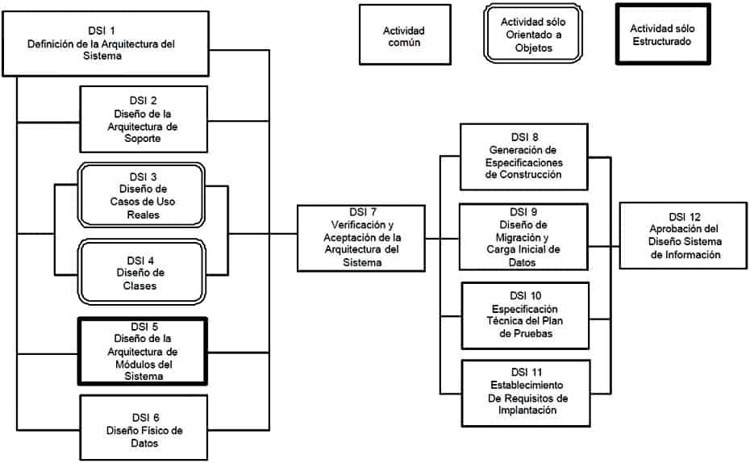
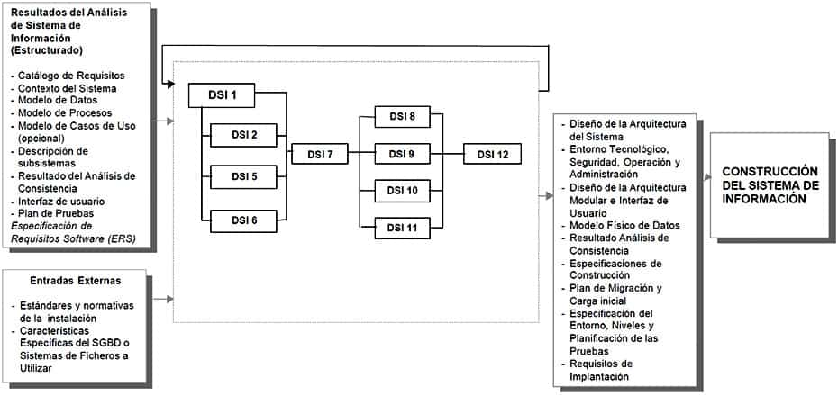
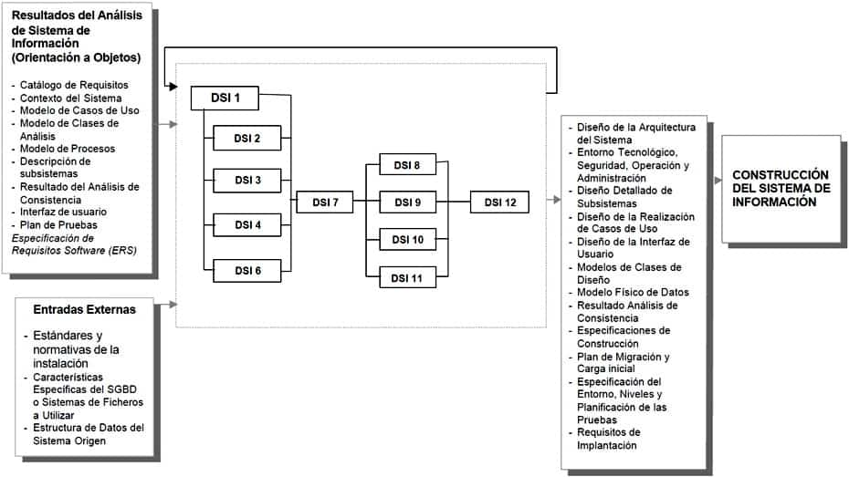

# Diseño del Sistema de Información

## Descripción y objetivos

El objetivo del proceso de Diseño del Sistema de Información (DSI) es la definición de la arquitectura del sistema y del entorno tecnológico que le va a dar soporte, junto con la especificación detallada de los componentes del sistema de información.

A partir de dicha información, se generan todas las especificaciones de construcción relativas al propio sistema, así como la descripción técnica del plan de pruebas, la definición de los requisitos de implantación y el diseño de los procedimientos de migración y carga inicial, éstos últimos cuando proceda.

Al ser MÉTRICA Versión 3 una metodología que cubre tanto desarrollos estructurados como orientados a objetos, las actividades de ambas aproximaciones están integradas en una estructura común.

Las actividades de este proceso se agrupan en dos grandes bloques.

    En un primer bloque de actividades, que se llevan a cabo en paralelo, se obtiene el diseño de detalle del sistema de información. La realización de estas actividades exige una continua realimentación. En general, el orden real de ejecución de las mismas depende de las particularidades del sistema de información y, por lo tanto, de generación de sus productos.

En la actividad Definición de la Arquitectura del Sistema (DSI 1), se establece el particionamiento físico del sistema de información, así como su organización en subsistemas de diseño, la especificación del entorno tecnológico, y sus requisitos de operación, administración, seguridad y control de acceso. Se completan los catálogos de requisitos y normas, en función de la definición del entorno tecnológico, con aquellos aspectos relativos al diseño y construcción que sea necesario contemplar. Asimismo, se crea un catálogo de excepciones del sistema, en el que se registran las situaciones de funcionamiento secundario o anómalo que se estime oportuno considerar y, por lo tanto, diseñar y probar. Este catálogo de excepciones se utiliza como referencia en la especificación técnica de las pruebas del sistema.

El particionamiento físico del sistema de información permite organizar un diseño que contemple un sistema de información distribuido, como por ejemplo la arquitectura cliente/servidor, siendo aplicable a arquitecturas multinivel en general. Independientemente de la infraestructura tecnológica, dicho particionamiento representa los distintos niveles funcionales o físicos del sistema de información. La relación entre los elementos del diseño y particionamiento físico, y a su vez, entre el particionamiento físico y el entorno tecnológico, permite una especificación de la distribución de los elementos del sistema de información y, al mismo tiempo, un diseño orientado a la movilidad a otras plataformas o la reubicación de subsistemas.

El sistema de información se estructura en subsistemas de diseño. Éstos a su vez se clasifican como de soporte o específicos, al responder a propósitos diferentes.

    Los subsistemas de soporte contienen los elementos o servicios comunes al sistema y a la instalación, y generalmente están originados por la interacción con la infraestructura técnica o la reutilización de otros sistemas, con un nivel de complejidad técnica mayor.
    Los subsistemas específicos contienen los elementos propios del sistema de información, generalmente con una continuidad de los subsistemas definidos en el proceso de Análisis del Sistema de Información (ASI).

También se especifica en detalle el entorno tecnológico del sistema de información, junto con su planificación de capacidades (capacity planning), y sus requisitos de operación, administración, seguridad y control de acceso.

El diseño detallado del sistema de información, siguiendo un enfoque estructurado, comprende un conjunto de actividades que se llevan a cabo en paralelo a la Definición de la Arquitectura del Sistema (DSI 1). El alcance de cada una de estas actividades se resume a continuación:

    Diseño de la Arquitectura de Soporte (DSI 2), que incluye el diseño detallado de los subsistemas de soporte, el establecimiento de las normas y requisitos propios del diseño y construcción, así como la identificación y definición de los mecanismos genéricos de diseño y construcción.
    Diseño de la Arquitectura de Módulos del Sistema (DSI 5), donde se realiza el diseño de detalle de los subsistemas específicos del sistema de información y la revisión de la interfaz de usuario.
    Diseño Físico de Datos (DSI 6), que incluye el diseño y optimización de las estructuras de datos del sistema, así como su localización en los nodos de la arquitectura propuesta.

En el caso de Diseño Orientado a Objetos, conviene señalar que el diseño de la persistencia de los objetos se lleva a cabo sobre bases de datos relacionales, y que el diseño detallado del sistema de información se realiza en paralelo con la actividad de Diseño de la Arquitectura de Soporte (DSI 2), y se corresponde con las siguientes actividades:

    Diseño de Casos de Uso Reales (DSI 3), con el diseño detallado del comportamiento del sistema de información para los casos de uso, el diseño de la interfaz de usuario y la validación de la división en subsistemas.
    Diseño de Clases (DSI 4), con el diseño detallado de cada una de las clases que forman parte del sistema, sus atributos, operaciones, relaciones y métodos, y la estructura jerárquica del mismo. En el caso de que sea necesario, se realiza la definición de un plan de migración y carga inicial de datos.

Una vez que se tiene el modelo de clases, se comienza el diseño físico en la actividad Diseño Físico de Datos (DSI 6), común con el enfoque estructurado.

Una vez finalizado el diseño de detalle, se realiza su revisión y validación en la actividad Verificación y Aceptación de la Arquitectura del Sistema (DSI 7), con el objeto de analizar la consistencia entre los distintos modelos y conseguir la aceptación del diseño por parte de los responsables de las áreas de Explotación y Sistemas.

    El segundo bloque de actividades complementa el diseño del sistema de información. En él se generan todas las especificaciones necesarias para la construcción del sistema de información:

    Generación de Especificaciones de Construcción (DSI 8), fijando las directrices para la construcción de los componentes del sistema, así como de las estructuras de datos.
    Diseño de la Migración y Carga Inicial de Datos (DSI 9), en el que se definen los procedimientos de migración y sus componentes asociados, con las especificaciones de construcción oportunas.
    Especificación Técnica del Plan de Pruebas (DSI 10), que incluye la definición y revisión del plan de pruebas, y el diseño de las verificaciones de los niveles de prueba establecidos. El catálogo de excepciones permite, de una forma muy ágil, establecer un conjunto de verificaciones relacionadas con el propio diseño o con la arquitectura del sistema.
    Establecimiento de Requisitos de Implantación (DSI 11), que hace posible concretar las exigencias relacionados con la propia implantación del sistema, tales como formación de usuarios finales, infraestructura, etc.

Finalmente, en la actividad de Presentación y Aprobación del Diseño del Sistema de Información (DSI 12), se realiza una presentación formal y aprobación de los distintos productos del diseño.

En el siguiente gráfico se muestra la relación de actividades del proceso Diseño del Sistema de Información (DSI), tanto para Desarrollos Estructurados como para Desarrollos Orientados a Objetos.

[DISEÑO DEL SISTEMA DE INFORMACIÓN]

DISEÑO DEL SISTEMA INFORMACIÓN (ESTRUCTURADO)

DISEÑO DEL SISTEMA INFORMACIÓN (ORIENTACIÓN A OBJETOS)

### Actividad DSI 1: Definición de la Arquitectura del Sistema

En esta actividad se define la arquitectura general del sistema de información, especificando las distintas particiones físicas del mismo, la descomposición lógica en subsistemas de diseño y la ubicación de cada subsistema en cada partición, así como la especificación detallada de la infraestructura tecnológica necesaria para dar soporte al sistema de información.

El particionamiento físico del sistema de información se especifica identificando los nodos y las comunicaciones entre los mismos, con cierta independencia de la infraestructura tecnológica que da soporte a cada nodo.

Con el fin de organizar y facilitar el diseño, se realiza una división del sistema de información en subsistemas de diseño, como partes lógicas coherentes y con interfaces claramente definidas.

Se establece una distinción entre subsistemas específicos del sistema de información (en adelante, subsistemas específicos) y subsistemas de soporte, con la finalidad de independizar, en la medida de lo posible, las funcionalidades a cubrir por el sistema de información de la infraestructura que le da soporte. En la mayoría de los casos, los subsistemas específicos provienen directamente de las especificaciones de análisis y de los subsistemas de análisis, mientras que los subsistemas de soporte provienen de la necesidad de interacción del sistema de información con la infraestructura y con el resto de los sistemas, así como de la reutilización de módulos o subsistemas ya existentes en la instalación.

Debido a que la definición de los subsistemas de soporte puede exigir la participación de distintos perfiles técnicos, se propone el diseño de ambos tipos de subsistemas en actividades distintas, aunque en paralelo.

Una vez identificados y definidos los distintos subsistemas de diseño, se determina su ubicación óptima de acuerdo a la arquitectura propuesta. La asignación de dichos subsistemas a cada nodo permite disponer, en función de la carga de proceso y comunicación existente entre los nodos, de la información necesaria para realizar una estimación de las necesidades de infraestructura tecnológica que da soporte al sistema de información. Este factor es especialmente crítico en arquitecturas multinivel o cliente/servidor, donde las comunicaciones son determinantes en el rendimiento final del sistema.

Se propone crear un catálogo de excepciones en el que se especifiquen las situaciones anómalas o secundarias en el funcionamiento y ejecución del sistema de información, y que se irá completando a medida que se avance en el diseño detallado de los subsistemas.

En esta actividad también se establecen los requisitos, normas y estándares originados como consecuencia de la adopción de una determinada solución de arquitectura o infraestructura, que serán aplicables tanto en este proceso como en la Construcción del Sistema de Información (CSI).

Se detallan a su vez, de acuerdo a las particularidades de la arquitectura del sistema propuesta, los requisitos de operación, seguridad y control, especificando los procedimientos necesarios para su cumplimiento.

Como resultado de esta actividad, se actualizan los catálogos de requisitos y normas, y se generan los siguientes productos:

    Diseño de la Arquitectura del Sistema, como producto que engloba el particionamiento físico del sistema de información y la descripción de subsistemas de diseño.
    Entorno Tecnológico del Sistema, que a su vez comprende la especificación del entorno tecnológico, las restricciones técnicas y la planificación de capacidades.
    Catálogo de Excepciones.
    Procedimientos de Operación y Administración del Sistema.
    Procedimientos de Seguridad y Control de Acceso.

TAREA 	PRODUCTOS 	TÉCNICAS Y PRÁCTICAS 	PARTICIPANTES
DSI 1.1: Definición de Niveles de Arquitectura 	

    Diseño de la Arquitectura del Sistema
        Particionamiento Físico del Sistema de Información

	

    Diagrama de Representación
    Diagrama de Desplegue

	

    Equipo de Arquitectura
    Equipo de Soporte Técnico
    Equipo de Seguridad

DSI 1.2: Identificación de Requisitos de Diseño y Construcción 	

    Catálogo de Requisitos

	

    Sesiones de Trabajo
    Catalogación

	

    Equipo de Arquitectura
    Equipo de Soporte Técnico

DSI 1.3: Especificación de Excepciones 	

    Catálogo de Excepciones

	

    Sesiones de Trabajo
    Catalogación

	

    Equipo de Arquitectura
    Equipo de Soporte Técnico

DSI 1.4: Especificación de Estándares y Normas de Diseño y Construcción 	

    Catálogo de Normas

	

    Sesiones de Trabajo
    Catalogación

	

    Equipo de Arquitectura
    Equipo de Soporte Técnico

DSI 1.5: Identificación de Subsistemas de Diseño 	

    Diseño de la Arquitectura del Sistema
        Descripción de Subsistemas de Diseño

	

    Matricial
    Diagrama de Estructura
    Diagrama de Interacción de Objetos
    Diagrama de Paquetes
    Diagrama de Despliegue

	

    Equipo de Arquitectura
    Equipo de Soporte Técnico
    Equipo de Seguridad

DSI 1.6: Especificación del Entorno Tecnológico 	

    Entorno Tecnológico del Sistema
        Especificación del Entorno Tecnológico
        Restricciones Técnicas
        Estimación de Planificación de Capacidades

	

    Sesiones de Trabajo
    Diagrama de Representación

	

    Equipo de Arquitectura
    Equipo de Soporte Técnico

DSI 1.7: Especificación de Requisitos de Operación y Seguridad 	

    Procedimientos de Seguridad y Control de Acceso
    Procedimientos de Operación y Administración del Sistema
    Equipo de Seguridad
    Equipo de Arquitectura
    Equipo de Soporte Técnico

#### Tarea DSI 1.1: Definición de Niveles de Arquitectura

En esta tarea se describen los niveles de la arquitectura software, mediante la definición de las principales particiones físicas del sistema de información, representadas como nodos y comunicaciones entre nodos.

Se entiende por nodo cada partición física o parte significativa del sistema de información, con características propias de ejecución o función, e incluso de diseño y construcción.

Para facilitar la comprensión del sistema, se recomienda identificar como nodos los elementos de infraestructura más significativos de la arquitectura en la que se va a implementar el sistema de información. Los elementos que se aconseja especificar son los siguientes:

    Gestores de datos.
    Tipos de puesto cliente.
    Tipos de dispositivos de impresión.
    Monitores de teleproceso.
    Servidores.
    Comunicaciones.

La comunicación se expresa por una conexión entre nodos, indicando su carácter bidireccional o unidireccional, con las principales características de los protocolos o tipo de mensajes utilizados.

La especificación de los niveles de la arquitectura se realiza con el detalle suficiente como para permitir un diseño dirigido hacia una solución concreta. En general, no es preciso indicar en cada nodo detalles relativos al hardware, capacidad, rendimiento o configuraciones de tolerancia a fallos, entre otros. Esta información se concreta en la tarea Especificación del Entorno Tecnológico (DSI 1.6).

Los criterios para diseñar la arquitectura se obtienen a partir de directrices tecnológicas o de integración, propias de la instalación, y del catálogo de requisitos del sistema de información. Es necesario tener en cuenta, especialmente, aspectos relacionados con:

    Usuarios: ubicación, movilidad, concurrencia, número, etc.
    Datos: variabilidad, volúmenes, necesidades de consolidación, seguridad, etc.
    Procesos: distribución, reutilización, concurrencia, carácter crítico, etc.

Productos

De entrada

    Descripción General del Entorno Tecnológico del Sistema (ASI 1.2)
    Catálogo de Requisitos (ASI 2.4)
    Especificación de Interfaz de Usuario (ASI 9.3)
    En Diseño Estructurado:
    Matriz de Procesos / Localización Geográfica (ASI 7.1)
    Descripción de Interfaz con otros Sistemas (ASI 7.2)
    Modelo de Procesos (ASI 9.3)
    Modelo Lógico de Datos Normalizado (ASI 9.3)
    En Diseño Orientado a Objetos:
    Modelo de Casos de Uso (ASI 9.3)
    Especificación de Casos de Uso (ASI 9.3)
    Descripción de Subsistemas de Análisis (ASI 9.3)
    Descripción Interfaces entre Subsistemas (ASI 9.3)
    Modelo de Clases de Análisis (ASI 9.3)
    Análisis de la Realización de los Casos de Uso (ASI 9.3)

De salida

    Diseño de la Arquitectura del Sistema
        Particionamiento Físico del Sistema de Información

Técnicas

    Diagrama de Despliegue

Prácticas

    Diagrama de Representación

Participantes

    Equipo de Arquitectura
    Equipo de Soporte Técnico
    Equipo de Seguridad

#### Tarea DSI 1.2: Identificación de Requisitos de Diseño y Construcción

En esta tarea se realiza la especificación de los requisitos que están directamente relacionados con la adopción o diseño de una arquitectura o infraestructura concreta, y que pueden condicionar el diseño o la construcción del sistema de información.

Entre estos requisitos pueden estar los relacionados con lenguajes, rendimiento de los distintos elementos de la arquitectura, así como criterios de ubicación de módulos y datos en los distintos nodos.

Por tanto, como resultado de esta tarea se actualiza el catálogo de requisitos elaborado en el proceso Análisis de Sistemas de Información.
Productos

De entrada

    Catálogo de Requisitos (ASI 2.4)
    Diseño de la Arquitectura del Sistema (DSI 1.1)

De salida

    Catálogo de Requisitos

Prácticas

    Sesiones de Trabajo
    Catalogación

Participantes

    Equipo de Arquitectura
    Equipo de Soporte Técnico

#### Tarea DSI 1.3: Especificación de Excepciones

El objetivo de esta tarea es la definición de los comportamientos no habituales en el sistema, que reflejan situaciones anómalas o secundarias en el funcionamiento y ejecución del sistema de información. Para ello, se establece previamente el nivel de especificación de las mismas, así como los criterios de catalogación y clasificación.

Se propone su catalogación como ayuda para el diseño del sistema de información y como guía en la especificación técnica de las pruebas, al permitir la generación de algunos casos de prueba de forma inmediata. Dicho catálogo se va completando a partir de las actividades correspondientes al diseño detallado de los subsistemas.

Las excepciones se describen incluyendo, al menos, los siguientes conceptos:

    Tipo y descripción de la excepción.
    Condiciones previas del sistema de información.
    Elemento afectado (nodo, módulo, caso de uso).
    Respuesta del sistema de información.
    Elemento asociado a la respuesta esperada del sistema (módulo, clase, procedimiento, etc.).

Las excepciones que se proponen como obligatorias son las relacionadas con el funcionamiento general del sistema de información, habitualmente asociadas a:

    Nodos y comunicaciones del particionamiento físico del sistema de información. Este tipo de excepciones tiene lugar cuando no están disponibles los gestores de bases de datos o los recursos compartidos del sistema (representados como nodos), cuando se producen fallos en las comunicaciones entre nodos, etc.
    Rangos o valores no válidos en la entrada de datos, como pueden ser atributos obligatorios, con formatos específicos, etc.

Se recomienda, según el nivel de especificación que se establezca en cada caso, catalogar también las excepciones particulares que se identifiquen en las actividades del diseño de detalle.
Productos

De entrada

    Catálogo de Requisitos (ASI 1.2)
    Diseño de la Arquitectura del Sistema (DSI 1.1)
    En Diseño Orientado a Objetos:
    Modelo de Casos de Uso (ASI 9.3)
    Especificación de Casos de Uso (ASI 9.3)

De salida

    Catálogo de Excepciones

Prácticas

    Sesiones de Trabajo
    Catalogación

Participantes

    Equipo de Arquitectura
    Equipo de Soporte Técnico

#### Tarea DSI 1.4: Especificación de Estándares y Normas de Diseño y Construcción

En esta tarea se definen los estándares técnicos y de nomenclatura, normas y recomendaciones, que generalmente están relacionados con la adopción o diseño de una arquitectura o infraestructura tecnológica concreta, y que pueden condicionar el diseño o la construcción del sistema de información.

Como resultado de esta tarea, se actualiza el catálogo de normas obtenido en el proceso Análisis del Sistema de Información (ASI).

La información recogida en el catálogo se debe tener en cuenta en la elaboración de los productos resultantes del diseño y construcción del sistema de información. El catálogo de normas es, por tanto, producto de entrada en todas las tareas, aunque por sencillez se omite la referencia al mismo.
Productos

De entrada

    Estándares y Normativas de la Instalación (externo)
    Catálogo de Normas (ASI 1.3)
    Diseño de la Arquitectura del Sistema (DSI 1.1)

De salida

    Catálogo de Normas

Prácticas

    Sesiones de Trabajo
    Catalogación

Participantes

    Equipo de Arquitectura
    Equipo de Soporte Técnico

#### Tarea DSI 1.5: Identificación de Subsistemas de Diseño

En esta tarea se divide de forma lógica el sistema de información en subsistemas de diseño, con el fin de reducir la complejidad y facilitar el mantenimiento. Hay que tomar como referencia inicial los subsistemas de análisis especificados en el proceso de Análisis del Sistema de Información (ASI).

La división en subsistemas de diseño se puede realizar con una continuidad directa de los modelos del análisis, o aplicando nuevos criterios de diseño, entre los que es posible citar los siguientes:

    Facilidad de mantenimiento.
    Reutilización de elementos del propio sistema o de la instalación.
    Optimización de recursos (por ejemplo, líneas de comunicaciones).
    Características de ejecución (en línea o por lotes).
    Funcionalidad común.
    Aplicación de mecanismos genéricos de diseño al nivel de arquitectura.

Los subsistemas resultantes se califican como específicos o de soporte, asignando cada subsistema al nodo correspondiente.

Los subsistemas específicos contemplan las funcionalidades propias del sistema de información, mientras que los de soporte cubren servicios comunes, proporcionando un acceso transparente a los distintos recursos. Estos últimos están relacionados con:

    Comunicaciones entre subsistemas.
    Gestión de datos (acceso a bases de datos, ficheros, áreas temporales, importación y exportación de datos, sincronización de bases de datos, etc.).
    Gestión de transacciones.
    Control y gestión de errores.
    Seguridad y control de acceso.
    Gestión de interfaz.
    Interacción con los recursos propios del sistema.

La interacción del sistema de información con la infraestructura que le da soporte, así como con el resto de los sistemas y servicios de la instalación, puede originar la necesidad de nuevos subsistemas, módulos, clases o servicios no especificados en el análisis.

La definición del comportamiento externo de cada subsistema se completa durante el diseño de detalle con la especificación de su interfaz, así como con la dependencia entre subsistemas.

El diseño de detalle de los subsistemas identificados por criterios de optimización y reutilización, puede aconsejar la reorganización y reubicación de los elementos que forman parte de cada subsistema y, a su vez, puede dar lugar a la identificación de nuevos subsistemas de soporte.

En diseño estructurado, la descripción de los subsistemas de diseño que conforman el sistema de información se especifica mediante un diagrama de estructura de alto nivel, que muestra los distintos subsistemas de que consta el sistema, incluidos los subsistemas de soporte, junto con la definición de la interfaz de cada subsistema.

La ubicación de subsistemas en nodos y la dependencia entre subsistemas se especifica por medio de técnicas matriciales, o bien en lenguaje natural o pseudocódigo.
Productos

De entrada

    Descripción General del Entorno Tecnológico del Sistema (ASI 1.2)
    Diseño de la Arquitectura del Sistema (DSI 1.1)
    Catálogo de Requisitos (DSI 1.2)
    En Diseño Estructurado:
    Matriz de Procesos / Localización (ASI 7.1)
    Descripción de Interfaz con otros Sistemas (ASI 7.2)
    Modelo de Procesos (ASI 9.3)
    En Diseño Orientado a Objetos:
    Descripción de Subsistemas de Análisis (ASI 9.3)
    Descripción Interfaces entre Subsistemas (ASI 9.3)

De salida

    Diseño de la Arquitectura del Sistema
        Descripción de Subsistemas de Diseño

Técnicas

    Diagrama de Estructura
    Matricial
    Diagrama de Interacción de Objetos
    Diagrama de Paquetes
    Diagrama de Despliegue

Participantes

    Equipo de Arquitectura
    Equipo de Soporte Técnico
    Equipo de Seguridad

#### Tarea DSI 1.6: Especificación del Entorno Tecnológico

En esta tarea se definen en detalle los distintos elementos de la infraestructura técnica que dan soporte al sistema de información, determinando la implementación concreta de los nodos y comunicaciones especificados en la tarea Definición de Niveles de Arquitectura (DSI 1.1).

Se propone agrupar los elementos de la infraestructura en los siguientes conceptos:

    Hardware: procesadores, unidades de almacenamiento, estaciones de trabajo, etc.
    Software: sistemas operativos, subsistemas, middleware, gestores de bases de datos, sistemas de ficheros, software de base, herramientas y utilidades de gestión propias del sistema, etc.
    Comunicaciones: diseño de la topología de la red, protocolos, nodos de red, etc.

La definición de los distintos elementos puede generar restricciones técnicas que afecten al diseño o construcción del sistema de información.

Asimismo, se realiza una estimación de la planificación de capacidades (capacity planning) o se especifican los parámetros que Explotación y Sistemas precisen para realizar dicha planificación. Se indican, al menos, las necesidades previstas de:

    Almacenamiento: espacio en disco, espacio en memoria, pautas de crecimiento y evolución estimada del sistema de información, etc.
    Procesamiento: número y tipo de procesadores, memoria, etc.
    Comunicaciones: líneas, caudal, capacidades de elementos de red, etc.

Para poder determinar la planificación de capacidades, es necesario conocer los diseños detallados de los módulos / clases y escenarios, incluida la información de control en las comunicaciones, así como el diseño físico de datos optimizado, productos que se están generando en paralelo a esta actividad. También se tienen en cuenta, cuando proceda, las estimaciones de volúmenes de datos propios de la migración y carga inicial de datos.
Productos

De entrada

    Descripción General del Entorno Tecnológico del Sistema (ASI 1.2)
    Catálogo de Requisitos (DSI 1.2)
    Diseño de la arquitectura del sistema (DSI 1.5)
    En Diseño Estructurado:
    Matriz de Procesos / Localización Geográfica (ASI 7.1)
    Plan de Migración y Carga Inicial de Datos (ASI 6.4)
    En Diseño Orientado a Objetos:
    Plan de Migración (DSI 4.7)

De salida

    Entorno Tecnológico del Sistema:
        Especificación del Entorno Tecnológico
        Restricciones Técnicas
        Estimación de Planificación de Capacidades

Prácticas

    Sesiones de Trabajo
    Diagrama de Representación

Participantes

    Equipo de Arquitectura
    Equipo de Soporte Técnico

#### Tarea DSI 1.7: Especificación de Requisitos de Operación y Seguridad

El objetivo de esta tarea es definir los procedimientos de seguridad y operación necesarios para no comprometer el correcto funcionamiento del sistema y garantizar el cumplimiento de los niveles de servicios que exigirá el sistema en cuanto a la gestión de operaciones (procesos por lotes, seguridad, comunicaciones, etc.). Los niveles de servicio se especifican formalmente en el proceso Implantación y Aceptación del Sistema (IAS).

Tomando como referencia los requisitos establecidos para el sistema, y teniendo en cuenta la arquitectura propuesta y las características del entorno tecnológico definido en esta actividad, se lleva a cabo la definición de los requisitos de seguridad y control de acceso necesarios para garantizar la protección del sistema y minimizar el riesgo de pérdida, alteración o consulta indebida de la información. Para ello, se diseñan los procedimientos relacionados con:

    Acceso al sistema y a sus recursos (datos, transacciones, librerías, etc.).
    Mantenimiento de la integridad y confidencialidad de los datos.
    Control y registro de accesos al sistema (logs, certificación, etc.).
    Copias de seguridad y recuperación de datos y su periodicidad.
    Recuperación ante catástrofes.

Asimismo, se definen los requisitos de operación para los distintos elementos del sistema (módulos, clases, estructuras físicas de datos, sistemas de ficheros), que se están elaborando en paralelo a esta actividad, y se diseñan los procedimientos asociados relacionados con:

    Tratamiento en línea (franja horaria/periodos críticos, número máximo de usuarios, etc.).
    Tratamiento por lotes (periodicidad y secuencia de ejecución, interdependencias, petición de ejecución, etc.).
    Control y planificación de trabajos.
    Recuperación y reanudación de trabajos.
    Distribución de información generada por el sistema, tanto trabajos planificados o bajo petición.
    Control y seguimiento del correcto funcionamiento de los procedimientos de backup y recuperación utilizados habitualmente.

Productos

De entrada

    Catálogo de Requisitos (DSI 1.2)
    Diseño de la Arquitectura del Sistema (DSI 1.5)
    Entorno Tecnológico del Sistema (DSI 1.6)

De salida

    Procedimientos de Seguridad y Control de Acceso
    Procedimientos de Operación y Administración del Sistema

Prácticas

    Sesiones de Trabajo
    Catalogación

Participantes

    Equipo de Seguridad
    Equipo de Arquitectura
    Equipo de Soporte Técnico

### Actividad DSI 2: Diseño de la Arquitectura de Soporte

En esta actividad se lleva a cabo la especificación de la arquitectura de soporte, que comprende el diseño de los subsistemas de soporte identificados en la actividad de Definición de la Arquitectura del Sistema (DSI 1), y la determinación de los mecanismos genéricos de diseño. Estos últimos sirven de guía en la utilización de diferentes estilos de diseño, tanto en el ámbito global del sistema de información, como en el diseño de detalle.

El diseño de los subsistemas de soporte, conceptualmente, es similar al diseño de los subsistemas específicos, aunque debe cumplir con unos objetivos claros de reutilización. De esta manera, se consigue simplificar y abstraer el diseño de los subsistemas específicos de la complejidad del entorno tecnológico, dotando al sistema de información de una mayor independencia de la infraestructura que le da soporte. Con este fin, se aconseja la consulta de los datos de otros proyectos existentes, disponible en el Histórico de Proyectos. Si esto no fuera suficiente, se puede contar en esta actividad con la participación de perfiles técnicos, con una visión global de la instalación.

Esta actividad se realiza en paralelo al diseño detallado, debido a que existe una constante realimentación, tanto en la especificación de los subsistemas con sus interfaces y dependencias, como en la aplicación de esqueletos o patrones en el diseño.

Los productos resultantes de esta actividad son:

    Diseño Detallado de los Subsistemas de Soporte.
    Mecanismos Genéricos de Diseño y Construcción.

TAREA 	PRODUCTOS 	TÉCNICAS Y PRÁCTICAS 	PARTICIPANTES
DSI 2.1: Diseño de Subsistemas  de Soporte 	

    Diseño Detallado de los Subsistemasde Soporte

	

    Diagrama de Estructura
    Diagrama de Interacción de Objetos
    Diagrama de Clases

	

    Equipo de Arquitectura

DSI 2.2: Identificación de Mecanismos Genéricos de Diseño 	

    Mecanismos Genéricos de Diseño y Construcción

	

    Sesiones de Trabajo
    Diagrama de Interacción de Objetos
    Diagrama de Clases

	

    Equipo de Arquitectura

#### Tarea DSI 2.1: Diseño de Subsistemas de Soporte

El objetivo de esta tarea es la especificación y diseño de los módulos/clases que forman parte de los subsistemas de soporte, identificados en la tarea Identificación de Subsistemas de Diseño (DSI 1.5). Se lleva a cabo siempre y cuando no se disponga en la instalación de servicios comunes que respondan satisfactoriamente a los requisitos planteados.

El nivel de reutilización de los subsistemas de soporte y sus servicios es potencialmente alto, de modo que se debe intentar emplear, en la medida de lo posible, los subsistemas que ya existan en la instalación y se consideren viables. La información relativa a dichos subsistemas podrá obtenerse del Histórico de Proyectos. En cualquier caso, cuando proceda realizar el diseño de los subsistemas de soporte, se recomienda hacerlo con ese fin.

El diseño sigue las mismas pautas que las establecidas para los subsistemas específicos, aunque con las siguientes particularidades:

    Generalmente, será necesaria una descomposición de los subsistemas de soporte en servicios, entendiendo como tales módulos o clases independientes y reutilizables.
    Se recomienda realizar una descripción de la interfaz y del comportamiento de cada servicio, previa a su diseño de detalle, que permita completar el diseño de los subsistemas específicos.
    La especificación y diseño de cada servicio, módulo o clase, se realiza con las técnicas habituales de especificación y diseño de módulos o clases, o incluso opcionalmente, si la simplicidad de los elementos lo aconseja, otros lenguajes de especificación, pseudocódigo o lenguaje natural.

A medida que se lleva a cabo esta tarea pueden surgir comportamientos de excepción que deberán contemplarse igualmente en el diseño, y que en función del nivel de especificación que se haya establecido, se incorporan al catálogo de excepciones.
Productos

De entrada

    Diseño de la Arquitectura del Sistema (DSI 1.5)

De salida

    Diseño Detallado de los Subsistemas de Soporte

Técnicas

    Diagrama de Estructura
    Diagrama de Interacción de Objetos
    Diagrama de Clases

Participantes

    Equipo de Arquitectura

#### Tarea DSI 2.2: Identificación de Mecanismos Genéricos de Diseño

El objetivo de esta tarea es identificar y diseñar, en el caso de no existir en la instalación, esqueletos, patrones de diseño o guías de diseño. Estos mecanismos genéricos se definen a partir del estudio de comportamientos comunes relacionados, generalmente, con gestión de transacciones, persistencia de datos, control y recuperación de errores, utilización de recursos comunes, etc.

Los mecanismos genéricos de diseño son de aplicación tanto en la definición de la arquitectura del sistema como en el diseño de detalle de los subsistemas específicos y de soporte.
Productos

De entrada

    Diseño de la Arquitectura del Sistema (DSI 1.5)

De salida

    Mecanismos Genéricos de Diseño y Construcción

Técnicas

    Diagrama de Interacción de Objetos
    Diagrama de Clases

Prácticas

    Sesiones de Trabajo

Participantes

    Equipo de Arquitectura

### Actividad DSI 3: Diseño de Casos de Uso Reales

Esta actividad, que se realiza solo en el caso de Diseño Orientado a Objetos, tiene como propósito especificar el comportamiento del sistema de información para un caso de uso, mediante objetos o subsistemas de diseño que interactúan, y determinar las operaciones de las clases e interfaces de los distintos subsistemas de diseño.

Para ello, una vez identificadas las clases participantes dentro de un caso de uso, es necesario completar los escenarios que se recogen del análisis, incluyendo las clases de diseño que correspondan y teniendo en cuenta las restricciones del entorno tecnológico, esto es, detalles relacionados con la implementación del sistema. Es necesario analizar los comportamientos de excepción para dichos escenarios. Algunos de ellos pueden haber sido identificados en el proceso de análisis, aunque no se resuelven hasta este momento. Dichas excepciones se añadirán al catálogo de excepciones para facilitar las pruebas.

Algunos de los escenarios detallados requerirán una nueva interfaz de usuario. Por este motivo es necesario diseñar el formato de cada una de las pantallas o impresos identificados.

Es importante validar que los subsistemas definidos en la tarea Identificación de Subsistemas de Diseño (DSI 1.5) tienen la mínima interfaz con otros subsistemas. Por este motivo, se elaboran los escenarios al nivel de subsistemas y, de esta forma, se delimitan las interfaces necesarias para cada uno de ellos, teniendo en cuenta toda la funcionalidad del sistema que recogen los casos de uso. Además, durante esta actividad pueden surgir requisitos de implementación, que se recogen en el catálogo de requisitos.

Las tareas de esta actividad se realizan en paralelo con las de Diseño de Clases (DSI 4).
TAREA 	PRODUCTOS 	TÉCNICAS Y PRÁCTICAS 	PARTICIPANTES
DSI 3.1: Identificación de Clases Asociadas a un Caso de Uso 	

    Diseño de la Realización de los Casos de Uso
        Especificación Detallada

	

    Diagrama de Interacción de Objetos

	

    Equipo del Proyecto

DSI 3.2: Diseño de la Realización de los Casos de Uso 	

    Diseño de la Realización de los Casos de uso
        Especificación Detallada

	

    Diagrama de Interacción de Objetos

	

    Equipo del Proyecto

DSI 3.3: Revisión de la Interfaz de Usuario 	

    Diseño de Interfaz de Usuario
        Formatos Individuales de Interfaz de Pantalla Gráfica
        Catálogo de Controles y Elementos de Diseño de Interfaz de Pantalla Gráfica
        Modelo de Navegación de Interfaz de Pantalla Gráfica
        Formatos de Impresión
        Prototipo de Interfaz de Pantalla Gráfica

	

    Catalogación
    Diagrama de Transición de Estados
    Diagrama de Interacción de Objetos
    Prototipado

	

    Equipo del Proyecto
    Usuarios Expertos

DSI 3.4: Revisión de Subsistemas de Diseño e Interfaces 	

    Diseño de la Realización de los Casos de Uso
        Definición a Nivel de Subsistemas e Interfaz

	

    Diagrama de Interacción de Objetos

	

    Equipo del Proyecto
    Equipo de Arquitectura

#### Tarea DSI 3.1: Identificación de Clases Asociadas a un Caso de Uso

El objetivo de esta tarea es identificar las clases que intervienen en cada caso de uso, a partir del conjunto de clases definidas en la tarea Identificación de Clases Adicionales (DSI 4.1), ya que, como se ha señalado en la introducción de esta actividad, las actividades DSI 3 y DSI 4 se realizan en paralelo. Dichas clases se identifican a partir de las clases del modelo del análisis y de aquellas clases adicionales necesarias para el escenario que se está diseñando.

A su vez, a medida que se va estudiando la descripción de los casos de uso, pueden aparecer nuevas clases de diseño que no hayan sido identificadas anteriormente y que se incorporan al modelo de clases en la tarea Identificación de Clases Adicionales (DSI 4.1).
Productos

De entrada

    Modelo de Clases de Diseño (DSI 4.1)
    Modelo de Casos de Uso (ASI 9.3)
    Especificación de Casos de Uso (ASI 9.3)
    Análisis de la Realización de los Casos de Uso (ASI 9.3)

De salida

    Diseño de la Realización de los Casos de Uso
        Especificación Detallada

Técnicas

    Diagrama de Interacción de Objetos

Participantes

    Equipo del Proyecto

#### Tarea DSI 3.2: Diseño de la Realización de los Casos de Uso

El objetivo de esta tarea es definir cómo interactúan entre sí los objetos identificados en la tarea anterior para realizar, desde un punto de vista técnico, un caso de uso del sistema de información. Para ello, se parte de los escenarios especificados en el análisis, y se detallan teniendo en cuenta que se deben llevar cabo sobre un entorno tecnológico concreto y unos mecanismos genéricos de diseño.

Durante el desarrollo de esta tarea, es posible que surjan excepciones que se incluyen en el catálogo de excepciones, y que ahora quedan resueltas en los escenarios correspondientes. Algunos de estos escenarios necesitan nueva interfaz de usuario. Por lo tanto, las clases de interfaz que se identifiquen se incorporan al modelo de clases de la tarea Identificación de Clases Adicionales (DSI 4.1), para realizar su diseño detallado.

También se realiza el estudio de los escenarios de los distintos casos de uso, para identificar comportamientos comunes sobre los que se aplican mecanismos genéricos de diseño identificados en la tarea de Identificación de Mecanismos Genéricos de Diseño (DSI 2.2), o se puede decidir diseñar un subsistema de soporte que contenga dicho comportamiento, como un servicio.

El estudio de los comportamientos comunes identificados puede servir de ayuda para detallar o revisar la herencia entre clases en la tarea Diseño de la Jerarquía (DSI 4.5).
Productos

De entrada

    Modelo de Casos de Uso (ASI 9.3)
    Especificación de Casos de Uso (ASI 9.3)
    Análisis de la Realización de los Casos de Uso (ASI 9.3)
    Especificación de Interfaz de Usuario (ASI 9.3)
    Diseño de la Realización de los Casos de Uso (DSI 3.1)

De salida

    Diseño de la Realización de los Casos de Uso
        Especificación Detallada

Técnicas

    Diagrama de Interacción de Objetos (colaboración o secuencia)

Participantes

    Equipo del Proyecto

#### Tarea DSI 3.3: Revisión de la Interfaz de Usuario

El objetivo de esta tarea es realizar el diseño detallado del comportamiento de la interfaz de usuario a partir de la especificación de la misma, obtenida en el proceso de análisis, y de acuerdo con el entorno tecnológico definido. Si se hubiera realizado un prototipo de la interfaz de usuario, éste se tomaría como punto de partida para el diseño. Además, se incluyen las ventanas alternativas o elementos de diseño surgidos como consecuencia del diseño de los escenarios definidos en la tarea anterior.

Además, se revisa: la interfaz de usuario, la navegación entre ventanas, los elementos que forman cada interfaz, sus características (que deben ser consistentes con los atributos con los que están relacionadas), su disposición, y cómo se gestionan los eventos relacionados con los objetos.

En aquellos casos en los que se realizan modificaciones significativas sobre la interfaz de usuario, es conveniente que éste las valide, siendo opcional la realización de un nuevo prototipo.
Productos

De entrada

    Diseño de la Realización de los Casos de Uso (DSI 3.2)
    Especificación de Interfaz de Usuario (ASI 9.3)

De salida

    Diseño de Interfaz de Usuario
        Formatos Individuales de Interfaz de Pantalla Gráfica
        Catálogo de Controles y Elementos de Diseño de Interfaz de Pantalla Gráfica
        Modelo de Navegación de Interfaz de Pantalla Gráfica
        Formatos de Impresión
        Prototipo de Interfaz de Pantalla Gráfica

Técnicas

    Diagrama de Interacción de Objetos
    Diagrama de Transición de Estados

Prácticas

    Prototipado
    Catalogación

Participantes

    Equipo del Proyecto
    Usuarios Expertos

#### Tarea DSI 3.4: Revisión de Subsistemas de Diseño e Interfaces

El objetivo de esta tarea es describir cada caso de uso en términos de los subsistemas que participan en el caso de uso y las interfaces que se requieren entre ellos.

Para un caso de uso hay que definir, además de los subsistemas y actores que intervienen en el mismo, los mensajes que intercambian los objetos de un subsistema con otro. Estos mensajes sirven para verificar y detallar las interfaces de cada subsistema, teniendo en cuenta todos los casos de uso en los que interviene, y completar de esta manera la definición de subsistemas establecida en la tarea Identificación de Subsistemas de Diseño (DSI 1.5).
Productos

De entrada

    Modelo de Casos de Uso (ASI 9.3)
    Especificación de Casos de Uso (ASI 9.3)
    Diseño de la Realización de los Casos de Uso (DSI 3.2)

De salida

    Diseño de la Realización de los Casos de Uso
        Definición a Nivel de Subsistemas e Interfaz

Técnicas

    Diagrama de Interacción de Objetos

Participantes

    Equipo del Proyecto
    Equipo de Arquitectura

### Actividad DSI 4: Diseño de Clases

#### Tarea DSI 4.1: Identificación de Clases Adicionales

El objetivo de esta tarea es identificar un conjunto de clases que completen el modelo de clases analizado en la tarea Validación de los Modelos (ASI 9.3) del proceso anterior (clases y/o interfaces) teniendo en cuenta que:

    Cada interfaz identificada en el análisis se corresponde en el diseño con una clase que proporcione esa interfaz.
    El conjunto de clases del análisis puede modificarse en función de las tecnologías de desarrollo utilizadas y de los mecanismos genéricos de diseño especificados.

Las clases de control deben contemplar la coordinación y secuencia entre objetos y, en algunos casos, deben contener lógica de negocio. De cualquier manera, se deben considerar cuestiones de distribución, de rendimiento, de transacción y de serialización.

El diseño de las clases de entidad varia según el sistema de gestión de datos utilizado. Las clases pueden ser construidas por el propio desarrollador, adquiridas en forma de bibliotecas, facilitadas por el entorno de trabajo o por el entorno tecnológico.

El diseño de las clases de interfaz de usuario depende de la tecnología especifica que se esté utilizando. Así, por ejemplo, la interfaz puede crearse a partir de los objetos gráficos disponibles en el entorno de desarrollo, sin necesidad de que estos se contemplen en el modelo de clases correspondiente.

Entre las clases identificadas a lo largo de esta tarea se encuentran clases abstractas, que reúnen características comunes a varias clases. Cada subclase aumenta su estructura y comportamiento con la clase abstracta de la que hereda.
Productos

De entrada

    Modelo de Clases de Análisis (ASI 9.3)
    Especificación de Interfaz de Usuario (ASI 9.3)

De salida

    Modelo de Clases de Diseño

Técnicas

    Diagrama de Clases

Participantes

    Equipo del Proyecto

#### Tarea DSI 4.2: Diseño de Asociaciones y Agregaciones

En esta tarea se completan las asociaciones entre las clases del modelo de clases del diseño, estudiando la secuencia de mensajes entre los objetos correspondientes en el diagrama de interacción de los escenarios definidos en la tarea Descripción de la Interacción entre Objetos (ASI 4.2).

Para definir las asociaciones, partimos de las que fueron identificadas en la tarea Identificación de Asociaciones y Agregaciones (ASI 5.2), teniendo en cuenta que:

    Las características de la asociación (papeles que desempeña, multiplicidad, etc.) se detallan según el entorno de desarrollo utilizado.
    Las relaciones bidireccionales se transforman en unidireccionales, para simplificar la implementación del sistema.
    Se realiza la modelización de las rutas de acceso óptimas entre las asociaciones para evitar problemas de rendimiento.
    Se analiza la posibilidad de diseñar como clases algunas de las asociaciones.

Opcionalmente, se especifica la forma en la que se va a implementar cada asociación (punteros, colecciones, etc.).
Productos

De entrada

    Modelo de Clases de Análisis (ASI 9.3)
    Modelo de Clases de Diseño (DSI 4.1)

De salida

    Modelo de Clases de Diseño

Técnicas

    Diagrama de Clases

Participantes

    Equipo del Proyecto

#### Tarea DSI 4.3: Identificación de Atributos de las Clases

El objetivo de esta tarea es identificar y describir, una vez que se ha especificado el entorno de desarrollo, los atributos de las clases.

Para identificar los atributos se revisa el modelo de clases obtenido en el proceso de Análisis del Sistema de Información (ASI 9.3), considerando que, a partir de uno de ellos, puede ser necesario definir atributos adicionales. Para cada atributo identificado se define su tipo, con formatos específicos, y si existieran, las restricciones asociadas a ese atributo.

Asimismo, se analiza la posibilidad de convertir un atributo en clase en aquellos casos en los que:

    El atributo se defina en varias clases de diseño.
    La complejidad del atributo aumente la dificultad para comprender la clase a la que pertenece.

Productos

De entrada

    Modelo de Clases de Análisis (ASI 9.3)
    Modelo de Clases de Diseño (DSI 4.2)

De salida

    Modelo de Clases de Diseño

Técnicas

    Diagrama de Clases

Participantes

    Equipo del Proyecto

#### Tarea DSI 4.4: Identificación de Operaciones de las Clases

El objetivo de esta tarea es definir, de forma detallada, las operaciones de cada clase de diseño. Para ello, se toma como punto de partida el modelo de clases generado en el análisis, así como el diseño de los casos de uso reales y los requisitos de diseño que pueden aparecer al definir el entorno de desarrollo.

Las operaciones de las clases de diseño surgen para dar respuesta a las responsabilidades de las clases de análisis y, además, para definir las interfaces que ofrece esa clase.

Según el entorno de desarrollo utilizado, se describe cada operación especificando: su nombre, parámetros y visibilidad (pública, privada, protegida). Si el entorno de desarrollo lo permite, se tiene en cuenta la posibilidad de simplificar el modelo de clases haciendo uso del polimorfismo y la sobrecarga de operaciones.

Para identificar las operaciones de aquellos objetos que presenten distintos estados, por lo que su comportamiento depende del estado en el que se encuentren, es recomendable realizar un diagrama de transición de estados, y traducir cada acción o actividad del mismo en una de estas operaciones.
Productos

De entrada

    Modelo de Clases de Análisis (ASI 9.3)
    Comportamiento de Clases de Análisis (ASI 9.3)
    Modelo de Clases de Diseño (DSI 4.3)

De salida

    Comportamiento de Clases de Diseño
    Modelo de Clases de Diseño

Técnicas

    Diagrama de Clases
    Diagrama de Transición de Estados

Participantes

    Equipo del Proyecto

#### Tarea DSI 4.5: Diseño de la Jerarquía

El objetivo de esta tarea es revisar la jerarquía de clases que ha surgido en el modelo de clases a lo largo de las tareas anteriores y comprobar que esa jerarquía es viable según los mecanismos disponibles en el entorno de desarrollo utilizado.

Entre las modificaciones realizadas sobre la jerarquía se identifican clases abstractas, que son superclases en las que se agrupan atributos y operaciones que heredan sus subclases.
Productos

De entrada

    Modelo de Clases de Diseño (DSI 4.4)

De salida

    Modelo de Clases de Diseño

Técnicas

    Diagrama de Clases

Participantes

    Equipo del Proyecto

#### Tarea DSI 4.6: Descripción de Métodos de las Operaciones

En esta tarea se describen los métodos que se usan para detallar como se realiza cada una de las operaciones de una clase. Los métodos pueden especificarse mediante un algoritmo, usando pseudocódigo o lenguaje natural. Su implementación se basa en la secuencia de interacciones del diagrama de interacción en los que la clase aparezca o en la secuencia de transiciones del diagrama de transición de estados.

En la mayoría de los casos, esta tarea no se realiza hasta el proceso de construcción, en el que los métodos se describen directamente en el lenguaje de programación que se va a utilizar.
Productos

De entrada

    Modelo de Clases de Diseño (DSI 4.5)
    Comportamiento de Clases de Diseño (DSI 4.4)

De salida

    Modelo de Clases de Diseño

Técnicas

    Diagrama de Clases

Participantes

    Equipo del Proyecto

#### Tarea DSI 4.7: Especificación de Necesidades de Migración y Carga Inicial de Datos

En esta tarea se realiza, en los casos que sea necesario y a partir de los resultados de la tarea ASI 6.4, una primera especificación de las necesidades de migración o carga inicial de los datos requeridos por el sistema, que se completa en la actividad Diseño de la Migración y Carga Inicial de Datos (DSI 9).
Productos

De entrada

    Estructura de Datos del Sistema Origen (externo)
    Modelo de Clases de Diseño (DSI 4.6)
    Plan de Migración y Carga Inicial de Datos (ASI 6.4)

De salida

    Plan de Migración y Carga Inicial de Datos

Prácticas

    Sesiones de Trabajo

Participantes

    Analistas
    Usuarios Expertos

### Actividad DSI 5: Diseño de la Arquitectura de Módulos del Sistema

El objetivo de esta actividad, que sólo se realiza en el caso de Diseño Estructurado, es definir los módulos del sistema de información, y la manera en que van a interactuar unos con otros, intentando que cada módulo trate total o parcialmente un proceso específico y tenga una interfaz sencilla.

Para cada uno de los subsistemas específicos, identificados en la tarea Identificación de los Subsistemas de Diseño (DSI 1.5), se diseña la estructura modular de los procesos que lo integran, tomando como punto de partida los modelos obtenidos en la tarea Validación de los Modelos (ASI 9.3) del proceso de Análisis del Sistema de Información (ASI) y el catálogo de requisitos. Dicha estructura se irá completando con los módulos que vayan apareciendo como consecuencia del diseño de la interfaz de usuario, así como de la optimización del diseño físico de datos.

Durante el diseño de los módulos, se pueden identificar características o comportamientos comunes relacionados con accesos a las bases de datos o ficheros, lógica de tratamiento, llamadas a otros módulos, gestión de errores, etc. que determinen la necesidad de realizar su implementación como subsistemas de soporte.

Además, se analizan los comportamientos de excepción asociados a los diferentes módulos y a las interfaces entre los mismos, intentando independizar en la medida de lo posible aquéllos que presenten un tratamiento común. Dichas excepciones se incorporan al catálogo de excepciones.

En esta actividad, se consideran los estándares y normas establecidas para el diseño, aplicando, cuando proceda, los mecanismos genéricos de diseño identificados en la tarea Identificación de Mecanismos Genéricos de Diseño (DSI 2.2).

Las tareas de esta actividad no se realizan de forma secuencial, sino en paralelo, con continuas realimentaciones entre ellas y con las realizadas en las actividades Definición de la Arquitectura del Sistema (DSI 1), Diseño de la Arquitectura de Soporte (DSI 2) y Diseño Físico de Datos (DSI 6).
TAREA 	PRODUCTOS 	TÉCNICAS Y PRÁCTICAS 	PARTICIPANTES
DSI 5.1: Diseño de Módulos del Sistema 	

    Diseño de la Arquitectura Modular del Sistema

	

    Diagrama de Estructura

	

    Equipo de Arquitectura
    Equipo del Proyecto

DSI 5.2: Diseño de Comunicaciones entre Módulos 	

    Diseño de la Arquitectura Modular del Sistema

	

    Diagrama de Estructura

	

    Equipo de Arquitectura
    Equipo del Proyecto
    Equipo de Seguridad

DSI 5.3: Revisión de la Interfaz de Usuario 	

    Diseño de Interfaz de Usuario:
        Descomposición Funcional en Diálogos
        Formatos Individuales de Interfaz de Pantalla
        Catálogo de Controles y Elementos de Diseño de Interfaz de Pantalla
        Modelo de Navegación de Interfaz de Pantalla
        Formatos de Impresión
        Prototipo de Interfaz de Pantalla
        Prototipo de Interfaz de Impresión

	

    Diagrama de Descomposición Funcional
    Diagrama de Transición de Estados
    Matricial
    Catalogación
    Prototipado

	

    Equipo del Proyecto
    Usuarios Expertos

#### Tarea DSI 5.1: Diseño de Módulos del Sistema

El objetivo de esta tarea es realizar una descomposición modular de los subsistemas específicos identificados en la tarea Identificación de Subsistemas de Diseño (DSI 1.5), a partir del modelo de procesos obtenido en el proceso Análisis del Sistema de Información (ASI 9.3). En esta tarea también se diseñan los módulos de consulta, generalmente no especificados en el modelo de procesos, aunque sí en el catálogo de requisitos.

Como paso previo al diseño de la estructura modular del sistema, se identifican los procesos que se van a implementar en cada subsistema específico. Para cada uno de ellos se establece el tipo de implementación (por lotes o en línea) y el tipo de iniciación (bajo petición o por el sistema).

A su vez, se analiza el alcance y características propias de cada proceso con el fin de determinar qué parte gestiona el acceso a la información soportada en bases de datos, qué parte se encarga de integrar las funcionalidades necesarias para cumplir las reglas del negocio y, en el caso de tratamiento en línea, qué parte gestiona la presentación de la información en los dispositivos de interfaz con los que el usuario va a interactuar.

Este análisis permite identificar los procesos que son específicos del propio sistema y aquéllos que comparten servicios comunes o dan respuesta a los mismos requisitos, y como consecuencia, considerar la posibilidad de independizar dichos servicios e implementarlos como subsistemas de soporte, teniendo en cuenta que su incorporación puede llevar a una reorganización de los subsistemas inicialmente identificados en la actividad Definición de la Arquitectura del Sistema (DSI 1).

De acuerdo a la arquitectura propuesta y al resultado del análisis de cada proceso, se diseña su estructura en módulos considerando los comportamientos de excepción correspondientes, en sucesivos niveles de detalle, de forma que los módulos resultantes tengan el mínimo acoplamiento y la máxima cohesión. Finalmente, se especifica la lógica interna de tratamiento por medio de lenguaje natural o pseudocódigo.

La estructura modular refleja, en el caso de tratamiento en línea, las sucesivas transacciones y diálogos, y en el caso de implementación en lotes, la secuencia de módulos dentro de cada ejecución.

En sistemas interactivos en los que exista una gran complejidad de gestión de pantalla se propone, complementariamente al diagrama de estructura de cuadros, perfeccionar el diseño de la interfaz de usuario en la tarea Revisión de la Interfaz de Usuario (DSI 5.3), relacionando cada control/evento/acción de los formatos individuales de presentación de pantalla con los respectivos módulos.
Productos

De entrada

    Modelo de Procesos (ASI 9.3)
    Especificación de Interfaz de Usuario (ASI 9.3)
    Descripción de Interfaz con otros Sistemas (ASI 7.2)
    Matriz de Procesos / Localización (ASI 7.1)
    Diseño de la Arquitectura del Sistema (DSI 1.5)

De salida

    Diseño de la Arquitectura Modular del Sistema

Técnicas

    Diagrama de Estructura

Participantes

    Equipo de Arquitectura
    Equipo del Proyecto

#### Tarea DSI 5.2: Diseño de Comunicaciones entre Módulos

El objetivo de esta tarea es definir las interfaces entre los módulos de cada subsistema, entre subsistemas y con el resto de los sistemas, incluyendo tanto la comunicación de control como los datos propios del sistema, de acuerdo a la arquitectura propuesta y a las características del entorno tecnológico. Hay que definir interfaces sencillas, que permitan reducir la complejidad de comunicación entre los distintos módulos, especialmente los relacionados con las comunicaciones entre subsistemas.

Por tanto, la especificación de la estructura modular obtenida en la tarea anterior se completa con la descripción de las comunicaciones existentes entre los distintos módulos, considerando los requisitos establecidos inicialmente para el sistema. Para garantizar el cumplimiento de dichos requisitos y especialmente los relacionados con el rendimiento, disponibilidad y seguridad, puede ser necesaria la incorporación de nuevos módulos o rediseñar la lógica asociada.

Para el diseño de las interfaces es necesario especificar:

    Los datos o mensajes involucrados y formato de los mismos en el intercambio.
    Los valores o rangos de los datos intercambiados.
    El origen y destino de los datos.
    La información de control y valores posibles.

En el diseño de las interfaces con otros sistemas hay que tener en cuenta, además, la información recogida en la descripción de interfaz con otros sistemas obtenida en el proceso de Análisis del Sistema del Información.

Las interfaces entre módulos permiten evaluar las necesidades de comunicación entre los distintos nodos, de modo que influyen decisivamente en el dimensionamiento del entorno tecnológico.
Productos

De entrada

    Modelo de Procesos (ASI 9.3)
    Descripción de Interfaz con otros Sistemas (ASI 7.2)
    Diseño de la Arquitectura Modular del Sistema (DSI 5.1)

De salida

    Diseño de la Arquitectura Modular del Sistema

Técnicas

    Diagrama de Estructura

Participantes

    Equipo de Arquitectura
    Equipo del Proyecto
    Equipo de Seguridad

#### Tarea DSI 5.3: Revisión de la Interfaz de Usuario

El objetivo de esta tarea es realizar el diseño detallado de la interfaz de usuario, tanto de pantalla como impresa, a partir de la especificación obtenida en el proceso de Análisis del Sistema de Información, de acuerdo al entorno tecnológico seleccionado y considerando los estándares y directrices marcados por la instalación.

Se revisa la descomposición funcional en diálogos de acuerdo a la arquitectura modular para el sistema de información definida en la tarea anterior. Se realizan las adaptaciones oportunas, teniendo en cuenta, a su vez, los requisitos de rendimiento, de seguridad, la necesidad de alcanzar los tiempos de respuesta establecidos y las características de cada diálogo.

Asimismo, se revisa en detalle la navegación entre ventanas y la información precisa para la ejecución de cada diálogo, identificando las relaciones de dependencia entre los datos para establecer la secuencia de presentación más apropiada. Se determinan los datos obligatorios y opcionales, y aquéllos que requieren un rango de valores predefinido o algún tipo de información que se considere relevante en el contexto del diálogo. Se definen las ventanas alternativas o elementos de diseño necesarios, especificando su contenido.

Se comprueba que la información necesaria en cada interfaz, tanto de pantalla como impresa, es tratada por el módulo correspondiente de la arquitectura del sistema, y es consistente con el modelo físico de datos que se está elaborando en paralelo en la actividad Diseño Físico de Datos (DSI 6).

En diálogos complejos, se propone utilizar como base de la especificación el modelo de navegación de interfaz de pantalla, relacionando cada control/evento/acción de los formatos individuales de presentación de pantalla con el módulo correspondiente, especificado en la tarea Diseño de Módulos del Sistema (DSI 5.1).

Igualmente, se realiza el diseño de los mensajes de error, mensajes de aviso o advertencia que genera el sistema en función del tipo de acción realizado por el usuario en el contexto del diálogo, así como las facilidades de ayuda que proporciona la interfaz durante la interacción con el sistema.

En el caso de que las modificaciones sean significativas en cuanto al formato o la definición de diálogos, se propone una validación por parte del usuario, con la realización opcional de prototipos para facilitar la revisión y aceptación.
Productos

De entrada

    Especificación de Interfaz de Usuario (ASI 9.3)
    Diseño de la Arquitectura Modular del Sistema (DSI 5.2)

De salida

    Diseño de Interfaz de Usuario:
        Descomposición Funcional en Diálogos
        Formatos Individuales de Interfaz de pantalla
        Catálogo de Controles y Elementos de Diseño de Interfaz de Pantalla
        Modelo de Navegación de Interfaz de Pantalla
        Formatos de Impresión
        Prototipo de Interfaz de Pantalla
        Prototipo de Interfaz de Impresión

Técnicas

    Diagrama de Descomposición Funcional
    Diagrama de Transición de Estados
    Matricial

Prácticas

    Catalogación
    Prototipado

Participantes

    Equipo del Proyecto
    Usuarios Expertos

### Actividad DSI 6: Diseño Físico de Datos

En esta actividad se define la estructura física de datos que utilizará el sistema, a partir del modelo lógico de datos normalizado o modelo de clases, de manera que teniendo presentes las características específicas del sistema de gestión de datos concreto a utilizar, los requisitos establecidos para el sistema de información, y las particularidades del entorno tecnológico, se consiga una mayor eficiencia en el tratamiento de los datos.

También se analizan los caminos de acceso a los datos utilizados por cada módulo/clase del sistema en consultas y actualizaciones, con el fin de mejorar los tiempos de respuesta y optimizar los recursos de máquina.

Las tareas de esta actividad se realizan de forma iterativa y en paralelo con las realizadas en las actividades Definición de la Arquitectura del Sistema (DSI 1), dónde se especifican los detalles de arquitectura e infraestructura y la planificación de capacidades, Diseño de la Arquitectura de Soporte (DSI 2), dónde se determinan y diseñan los servicios comunes que pueden estar relacionados con la gestión de datos (acceso a bases de datos, ficheros, áreas temporales, sincronización de bases de datos, etc.), Diseño de Casos de Uso Reales y de Clases (DSI 3 y 4), para desarrollo orientado a objetos, y Diseño de la Arquitectura de Módulos del Sistema (DSI 5), para desarrollo estructurado, dónde se especifica la lógica de tratamiento y las interfaces utilizadas.

En el caso de diseño orientado a objetos, esta actividad también es necesaria. La obtención del modelo físico de datos se realiza aplicando una serie de reglas de transformación a cada elemento del modelo de clases que se está generando en la actividad Diseño de Clases (DSI 4).

Asimismo, en esta actividad hay que considerar los estándares y normas establecidos para el diseño aplicando, cuando proceda, los mecanismos genéricos de diseño identificados en la tarea Identificación de Mecanismos Genéricos de Diseño (DSI 2.2).

TAREA 	PRODUCTOS 	TÉCNICAS Y PRÁCTICAS 	PARTICIPANTES
DSI 6.1: Diseño del Modelo Físico de Datos 	

    Modelo Físico de Datos

	

    Reglas de Obtención del Modelo Físico a Partir del Lógico
    Reglas de Transformación

	

    Equipo de Arquitectura
    Equipo del Proyecto
    Administradores de Bases de Datos

DSI 6.2: Especificación de los Caminos de Acceso a los Datos 	

    Especificación de los Caminos de Acceso a los Datos

	

    Cálculo de Accesos Físicos
    Caminos de Acceso

	

    Equipo del Proyecto

DSI 6.3: Optimización del Modelo Físico de Datos 	

    Modelo Físico de Datos Opimizado

	

    Optimización

	

    Equipo de Arquitectura
    Equipo del Proyecto
    Administradores de Bases de Datos
    Equipo de Seguridad

DSI 6.4: Especificación de la Distribución de Datos 	

    Esquemas Físico de Datos
    Asignación Esquemas Físicos de Datos a Nodos

	

    Matricial

	

    Equipo de Arquitectura
    Equipo de Soporte Técnico

#### Tarea DSI 6.1: Diseño del Modelo Físico de Datos

El objetivo de esta tarea es realizar el diseño del modelo físico de datos a partir del modelo lógico de datos normalizado o del modelo de clases, en el caso de diseño orientado a objetos.

Como paso previo al diseño de la estructura física de datos, se analizan las peculiaridades técnicas del gestor de bases de datos o sistema de ficheros a utilizar, y las estimaciones sobre la utilización y volumen de las ocurrencias de cada entidad / clase del modelo lógico de datos normalizado o modelo de clases. Además, si se ha establecido la necesidad de llevar a cabo una migración de datos, se deben tener en cuenta también los volúmenes de las estructuras de datos implicadas en la conversión. Esta información sirve para decidir la mejor implementación del modelo lógico de datos/modelo de clases, así como para hacer una estimación el espacio de almacenamiento.

De acuerdo al análisis anterior, se determina cómo se van a convertir las entidades/clases en tablas, considerando las relaciones existentes entre ellas y los identificadores, definiendo sus claves primarias, ajenas, alternativas u otros medios de acceso en general.

También se definen aquellos elementos que, en función del gestor o sistemas de ficheros a utilizar, se considere necesario implementar. Entre estos elementos podemos citar los siguientes:

    Bloqueo y comprensión de datos.
    Agrupamientos (cluster).
    Punteros.
    Otros.

Productos

De entrada

    Características Específicas del SGBD o Sistemas de Ficheros a Utilizar (externo)
    En Análisis Estructurado:
    Modelo Lógico de Datos Normalizado (ASI 9.3)
    Plan de Migración y Carga Inicial de Datos (ASI 6.4)
    En Análisis Orientado a Objetos:
    Modelo de Clases de Diseño (DSI 4.6)
    Plan de Migración y Carga Inicial de Datos (DSI 4.7)

De salida

    Modelo Físico de Datos

Técnicas

    Reglas de Obtención del Modelo Físico a partir del Lógico
    Reglas de Transformación

Participantes

    Equipo de Arquitectura
    Equipo del Proyecto
    Administradores de Bases de Datos

#### Tarea DSI 6.2: Especificación de los Caminos de Acceso a los Datos

El objetivo de esta tarea es determinar los caminos de acceso a los datos persistentes del sistema, utilizados por los principales módulos/clases de acuerdo al modelo físico de datos, con el fin de optimizar el rendimiento de los gestores de datos o sistemas de ficheros y el consumo de recursos, así como disminuir los tiempos de respuesta.

Se recomienda realizar esta tarea para aquellos módulos/clases que reúnan, entre otras, alguna de las siguientes características:

    Tratamiento crítico.
    Concurrencia.
    Accesos complejos a datos.

Para el inicio de esta tarea, se toma como referencia el Diseño Detallado de los Subsistemas de Soporte (DSI 2.1) y el Diseño de la Arquitectura Modular (DSI 5) o Diseño de Clases (DSI 4) de los subsistemas específicos, productos que se están generando en paralelo a esta actividad.

Para cada módulo/clase se identifican las tablas o ficheros y el tipo de acceso realizado, así como el orden que debe seguirse para la obtención de los datos. Asimismo, se efectúa una estimación del número de accesos que deben realizarse teniendo en cuenta, a su vez, la frecuencia y la prioridad del acceso.

La información obtenida sirve para identificar accesos excesivamente costosos o redundantes que pueden comprometer el rendimiento final del sistema y que, por lo tanto, exigen la optimización del modelo físico de datos, mediante la creación de nuevos accesos, posibles desnormalizaciones o particiones del modelo físico de datos.
Productos

De entrada

    Modelo Físico de Datos (DSI 6.1)
    Diseño Detallado de Subsistemas de Soporte (DSI 2.1)
    En Diseño Estructurado:
    Diseño de la Arquitectura Modular del Sistema (DSI 5.2)
    En Diseño Orientado a Objetos:
    Modelo de Clases de Diseño (DSI 4.6)

De salida

    Especificación de los Caminos de Acceso a los Datos

Prácticas

    Cálculo de Accesos Físicos
    Caminos de Acceso

Participantes

    Equipo del Proyecto

#### Tarea DSI 6.3: Optimización del Modelo Físico de Datos

En esta tarea se optimiza el diseño físico de datos, con el objetivo de mejorar el tiempo de respuesta en el acceso a datos persistentes, hacer una adecuada utilización de los recursos del sistema y, en consecuencia, garantizar que el diseño satisface las necesidades de tratamiento establecidas para el sistema de información en cuanto a que se ajusta a los requisitos de rendimiento exigidos.

A partir de la especificación de la secuencia de accesos de aquellos módulos/clases identificados como críticos, obtenida en la tarea anterior, se detectan las posibles mejoras con el fin de conseguir los niveles de rendimiento establecidos y, por lo tanto, una mayor eficiencia del sistema. Como resultado, puede ser necesaria una desnormalización controlada que se aplica para reducir o simplificar el número de accesos a los sistemas de almacenamiento de datos.

La desnormalización puede obligar a:

    Introducir elementos redundantes (campos, campos derivados, etc.).
    Definir nuevos caminos de acceso.
    Redefinir relaciones.
    Dividir o unir tablas.

En la revisión de la estructura física de datos se deben tener en cuenta criterios relacionados con:

    Módulos / clases identificados como críticos.
    Estimación de volúmenes.
    Frecuencia y tipo de acceso.
    Estimaciones de crecimiento por periodo.
    Requisitos relativos al rendimiento, seguridad, confidencialidad y disponibilidad, entre otros, considerados relevantes.

Es importante que la desnormalización se lleve a cabo de una forma controlada, para evitar anomalías en el tratamiento de los datos.
Productos

De entrada

    Catálogo de Requisitos (DSI 1.2)
    Modelo Físico de Datos (DSI 6.1)
    Especificación de los Caminos de Acceso a los Datos (DSI 6.2)

De salida

    Modelo Físico de Datos Optimizado

Técnicas

    Optimización

Participantes

    Equipo de Arquitectura
    Equipo del Proyecto
    Administradores de Bases de Datos
    Equipo de Seguridad

#### Tarea DSI 6.4: Especificación de la Distribución de Datos

En esta tarea se determina el modelo de distribución de datos, teniendo en cuenta los requisitos de diseño establecidos. Se establece la ubicación de los gestores de bases de datos o sistemas de ficheros, así como de los distintos elementos de la estructura física de datos, en los nodos correspondientes, de acuerdo al particionamiento físico del sistema de información especificado en la actividad Diseño de la Arquitectura del Sistema (DSI 1).

El resultado de esta actividad es la especificación de los modelos físicos particulares de cada nodo, esquemas físicos de datos, así como su asignación a los nodos.
Productos

De entrada

    Diseño de la Arquitectura del Sistema (DSI 1.1):
        Particionamiento Físico del Sistema de Información
    Catálogo de Requisitos (DSI 1.2)
    Modelo Físico de Datos Optimizado (DSI 6.3)

De salida

    Esquemas Físicos de Datos
    Asignación Esquemas Físicos de Datos a Nodos

Técnicas

    Matricial

Participantes

    Equipo de Arquitectura
    Equipo de Soporte Técnico

### Actividad DSI 7: Verificación y Aceptación de la Arquitectura del Sistema

El objetivo de esta actividad es garantizar la calidad de las especificaciones del diseño del sistema de información y la viabilidad del mismo, como paso previo a la generación de las especificaciones de construcción.

Para cumplir dicho objetivo, se llevan a cabo las siguientes acciones:

    Verificación de la calidad técnica de cada modelo o especificación
    Aseguramiento de la coherencia entre los distintos modelos
    Aceptación del diseño de la arquitectura por parte de Explotación y Sistemas.

Esta actividad es compleja, por lo que es aconsejable utilizar herramientas de apoyo para la realización de sus tareas.
TAREA 	PRODUCTOS 	TÉCNICAS Y PRÁCTICAS 	PARTICIPANTES
DSI 7.1: Verificación de las Especificaciones de Diseño 	

    Entorno Tecnológico del Sistema
    Diseño de la Arquitectura del Sistema
    Diseño Detallado de Subsistemas de Soporte
    Modelo Físico de Datos Optimizado
    Esquemas Físicos de Datos
    Asignación de Esquemas Físicos de Datos a Nodos
    Diseño de Interfaz de usuario
    Estructurado:
    Diseño de la Arquitectura Modular
    Orientación a Objetos:
    Diseño de la Realización de los Casos de Uso
    Modelo de Clases de Diseño
    Comportamiento de Clases de Diseño

		

    Equipo de Arquitectura
    Equipo del Proyecto

DSI 7.2: Análisis de Consistencia de las Especificaciones de Diseño 	

    Entorno Tecnológico del Sistema
    Diseño de la Arquitectura del Sistema
    Diseño Detallado de Subsistemas de Soporte
    Modelo Físico de Datos Optimizado
    Esquemas Físicos de Datos
    Asignación de Esquemas Físicos de Datos a Nodos
    Diseño de Interfaz de usuario
    Estructurado:
    Diseño de la Arquitectura Modular
    Orientación a Objetos:
    Diseño de la Realización de los Casos de Uso
    Modelo de Clases de Diseño
    Comportamiento de Clases de Diseño

	

    Matricial

	

    Equipo de Arquitectura
    Equipo del Proyecto

DSI 7.3: Aceptación de la Arquitectura del Sistema 	

    Aceptación Técnica del Diseño

		

    Jefe de Proyecto
    Responsable de Operación
    Responsable de Sistemas

#### Tarea DSI 7.1: Verificación de las Especificaciones de Diseño

El objetivo de esta tarea es asegurar la calidad formal de los distintos modelos, conforme a la técnica seguida para la elaboración de cada producto y a las normas y estándares especificados en el catálogo de normas.
Productos

De entrada

    Catálogo de Requisitos (DSI 1.2)
    Catálogo de Excepciones (DSI 1.3)
    Catálogo de Normas (DSI 1.4)
    Diseño de la Arquitectura del Sistema (DSI 1.5)
    Entorno Tecnológico del Sistema (DSI 1.6)
    Diseño Detallado de Subsistemas de Soporte (DSI 2.1)
    Modelo Físico de Datos Optimizado (DSI 6.3)
    Esquemas Físicos de Datos (DSI 6.4)
    Asignación de Esquemas Físicos de Datos a Nodos (DSI 6.4)
    En Diseño Estructurado:
    Diseño de la Arquitectura Modular (DSI 5.2)
    Diseño de Interfaz de Usuario (DSI 5.3)
    En Diseño Orientado a Objetos:
    Diseño de la Realización de los Casos de Uso (DSI 3.4)
    Diseño de Interfaz de Usuario (DSI 3.3)
    Modelo de Clases de Diseño (DSI 4.6)
    Comportamiento de Clases de Diseño (DSI 4.4)

De salida

    Entorno Tecnológico del Sistema
    Diseño de la Arquitectura del Sistema
    Diseño Detallado de Subsistemas de Soporte
    Modelo Físico de Datos Optimizado
    Esquemas Físicos de Datos
    Asignación de Esquemas Físicos de Datos a Nodos
    Diseño de Interfaz de Usuario
    En Diseño Estructurado:
    Diseño de la Arquitectura Modular
    En Diseño Orientado a Objetos:
    Diseño de la Realización de los Casos de Uso
    Modelo de Clases de Diseño
    Comportamiento de Clases de Diseño

Participantes

    Equipo de Arquitectura
    Equipo del Proyecto

#### Tarea DSI 7.2: Análisis de Consistencia de las Especificaciones de Diseño

El objetivo de esta tarea es asegurar que las especificaciones del diseño son coherentes entre sí, comprobando la falta de ambigüedades o duplicación de información. Esta consistencia se asegura entre especificaciones de diseño, y con respecto a los modelos del análisis.

Las diferentes comprobaciones se fundamentan generalmente en técnicas matriciales o de revisión entre los elementos comunes de los distintos modelos.

El análisis de consistencia relativo a la arquitectura del sistema es común para desarrollo estructurado y orientado a objetos, aunque respecto a los productos del diseño detallado es específico para cada uno de los enfoques. Las verificaciones que se hacen son las siguientes:

    Arquitectura del Sistema / Subsistemas:
        Cada subsistema de diseño está asociado al menos con un nodo del particionamiento físico del sistema de información.
    Arquitectura del Sistema / Modelo Físico de Datos:
        Todos los elementos definidos en el Modelo Físico de Datos Optimizado se incorporan, al menos, en un esquema físico de datos.
        Cada esquema del Modelo Físico de Datos está asociado con un nodo del particionamiento físico del sistema de información.
    Arquitectura del Sistema / Entorno Tecnológico del Sistema de Información:
        Cada nodo del particionamiento del sistema de información está soportado por el entorno tecnológico.
        Se da soporte a todas las necesidades de comunicaciones entre nodos.
    Arquitectura del Sistema / Diseño Detallado de Subsistemas:
        Cada módulo o clase del diseño detallado pertenece al menos a un subsistema.
        La interfaz del subsistema está proporcionada por interfaces de módulos o clases internas al subsistema.
        La especificación de dependencias mediante el estudio de las interfaces entre subsistemas, ya que la existencia de interfaz implica el establecimiento de una dependencia.
    Catálogo de Excepciones / Diseño Detallado de Subsistemas:
        Cada excepción del catálogo es tratada en el diseño de detalle del sistema de información, según los criterios establecidos en la creación del catálogo.

Los análisis de consistencia específicos para el Diseño Estructurado son:

    Diseño Detallado de Subsistemas / Modelo Físico de Datos:
        Los elementos del modelo físico de datos corresponden con los elementos utilizados por los módulos del diseño detallado, tanto de los subsistemas específicos como de los de soporte.
    Diseño Detallado de Subsistemas / Interfaz de Usuario:
        Los datos o formatos de mensajes necesarios en el diseño de la interfaz de usuario corresponden con los datos o formatos de mensajes de los correspondientes módulos.
        Para cada evento / acción solicitado por el usuario existe un módulo que le da respuesta.

Los análisis de consistencia específicos para el Diseño Orientado a Objetos son:

    Modelo de Clases / Modelo Físico de Datos:
        Los elementos del modelo físico de datos corresponden con los elementos utilizados por las clases del diseño detallado, tanto de los subsistemas específicos como de soporte.
    Modelo de Clases / Diagramas Dinámicos
        Cada mensaje entre objetos se corresponde con una operación de una clase, y todos los mensajes se envían a las clases correctas, incluyendo las clases de interfaz y la navegación entre ventanas.
        Cada mensaje entre subsistemas se corresponde con una operación de una clase del subsistema destino.
        La clase que recibe un mensaje con petición de datos tiene capacidad para proporcionar esos datos.
        Cada objeto del diagrama de interacción de objetos tiene una correspondencia en el modelo de clases.
        Todas las clases, atributos y métodos identificados en la interfaz de usuario tienen su correspondencia con algún atributo, método o clase en el modelo de clases.
        En el caso de haber elaborado diagramas de transición de estados para clases significativas:
        Se comprueba que para cada uno de ellos, todo evento se corresponde con una operación de la clase. También se tendrá que establecer si las acciones y actividades de los diagramas de transición de estado se corresponden con operaciones de la clase.
    Opcionalmente, se propone obtener para el análisis de consistencia en un diseño orientado a objetos:
        Matriz de mensajes del diagrama de interacción de objetos / operaciones del modelo de clases.
        Matriz de mensajes del diagrama de interacción de objetos / operaciones y atributos del modelo de clases.
        Matriz de objetos del diagrama de interacción de objetos / clases, atributos del modelo de clases.
        Matriz (evento, acción, actividad de clase) / operaciones de clase.
        Matriz clases / elementos del modelo físico de datos.

Productos

De entrada

    Catálogo de Requisitos (DSI 1.2)
    Catálogo de Excepciones (DSI 1.3)
    Catálogo de Normas (DSI 1.4)
    Diseño de la Arquitectura del Sistema (DSI 7.1)
    Entorno Tecnológico del Sistema (DSI 7.1)
    Diseño Detallado de los Subsistemas de Soporte (DSI 7.1)
    Modelo Físico de Datos Optimizado (DSI 7.1)
    Esquemas Físicos de Datos (DSI 7.1)
    Asignación de Esquemas Físicos de Datos a Nodos (DSI 7.1)
    Diseño de Interfaz de Usuario (DSI 7.1)
    En Diseño Estructurado:
    Diseño de la Arquitectura Modular (DSI 7.1)
    En Diseño Orientado a Objetos:
    Diseño de la Realización de los Casos de Uso (DSI 7.1)
    Modelo de Clases de Diseño (DSI 7.1)
    Comportamiento de Clases de Diseño (DSI 7.1)

De salida

    Entorno Tecnológico del Sistema
    Diseño de la Arquitectura del Sistema
    Diseño Detallado de Subsistemas de Soporte
    Modelo Físico de Datos Optimizado
    Esquemas Físicos de Datos
    Asignación de Esquemas Físicos de Datos a Nodos
    Diseño de Interfaz de Usuario
    En Diseño Estructurado:
    Diseño de la Arquitectura Modular
    En Diseño Orientado a Objetos:
    Diseño de la Realización de los Casos de Uso
    Modelo de Clases de Diseño
    Comportamiento de Clases de Diseño

Técnicas

    Matricial

Participantes

    Equipo de Arquitectura
    Equipo del Proyecto

#### Tarea DSI 7.3: Aceptación de la Arquitectura del Sistema

El objetivo de esta tarea es obtener la aceptación, por parte de las áreas de explotación y sistemas, de la arquitectura del sistema de información y de los requisitos de operación y seguridad, con el fin de poder valorar su impacto en la instalación.
Productos

De entrada

    Catálogo de Requisitos (DSI 1.2)
    Catálogo de Excepciones (DSI 1.3)
    Catálogo de Normas (DSI 1.4)
    Diseño de la Arquitectura del Sistema (DSI 7.2)
    Entorno Tecnológico del Sistema (DSI 7.2)
    Procedimientos de Operación y Administración del Sistema (DSI 1.7)
    Procedimientos de Seguridad y Control de Acceso (DSI 1.7)
    Diseño Detallado de los Subsistemas de Soporte (DSI 7.2)
    Modelo Físico de Datos Optimizado (DSI 7.2)
    Asignación de Esquemas Físicos de Datos a Nodos (DSI 7.2)
    Diseño de Interfaz de Usuario (DSI 7.2)
    En Diseño Estructurado:
    Diseño de la Arquitectura Modular (DSI 7.2)
    En Diseño Orientado a Objetos:
    Diseño de la Realización de los Casos de Uso (DSI 7.2)
    Modelo de Clases de Diseño (DSI 7.2)
    Comportamiento de Clases de Diseño (DSI 7.2)

De salida

    Aceptación Técnica del Diseño

Participantes

    Jefe de Proyecto
    Responsable de Operación
    Responsable de Sistemas

### Actividad DSI 8: Generación de Especificaciones de Construcción

En esta actividad se generan las especificaciones para la construcción del sistema de información, a partir del diseño detallado.

Estas especificaciones definen la construcción del sistema de información a partir de las unidades básicas de construcción (en adelante, componentes), entendiendo como tales unidades independientes y coherentes de construcción y ejecución, que se corresponden con un empaquetamiento físico de los elementos del diseño de detalle, como pueden ser módulos, clases o especificaciones de interfaz.

La división del sistema de información en subsistemas de diseño proporciona, por continuidad, una primera división en subsistemas de construcción, definiendo para cada uno de ellos los componentes que lo integran. Si se considera necesario, un subsistema de diseño se podrá dividir a su vez en sucesivos niveles para mayor claridad de las especificaciones de construcción.

Las dependencias entre subsistemas de diseño proporcionan información para establecer las dependencias entre los subsistemas de construcción y, por lo tanto, definir el orden o secuencia que se debe seguir en la construcción y en la realización de las pruebas.

También se generan las especificaciones necesarias para la creación de las estructuras de datos en los gestores de bases de datos o sistemas de ficheros.

El producto resultante de esta actividad es el conjunto de las especificaciones de construcción del sistema de información, que comprende:

    Especificación del entorno de construcción.
    Descripción de subsistemas de construcción y dependencias.
    Descripción de componentes.
    Plan de integración del sistema de información.
    Especificación detallada de componentes.
    Especificación de la estructura física de datos.

TAREA 	PRODUCTOS 	TÉCNICAS Y PRÁCTICAS 	PARTICIPANTES
DSI 8.1: Especificación del Entorno de Construcción 	

    Especificaciones de Construcción del Sistema de Información:
        Especificación del Entorno de Construcción

		

    Equipo de Arquitectura
    Equipo del Proyecto
    Equipo de Soporte Técnico
    Equipo de Sistemas
    Equipo de Seguridad

DSI 8.2: Definición de Componentes y Subsistemas de Construcción 	

    Especificaciones de Construcción del Sistema de Información:
        Descripción de Subsistemas de Construcción y Dependencias
        Descripción de Componentes
        Plan de Integración del Sistema de Información

	

    Diagrama de Estructura
    Matricial
    Diagrama de Componentes
    Diagrama de Despliegue

	

    Equipo de Arquitectura
    Equipo del Proyecto

DSI 8.3: Elaboración de Especificaciones de Construcción 	

    Especificaciones de Construcción del Sistema de Información:
        Especificación Detallada de Componentes

	

    Diagrama de Componentes

	

    Equipo del Proyecto

DSI 8.4: Elaboración de Especificaciones del Modelo Físico de Datos 	

    Especificaciones de Construcción del Sistema de Información:
        Especificación de la Estructura Física de Datos

		

    Equipo del Proyecto
    Administradores de la Base de Datos

#### Tarea DSI 8.1: Especificación del Entorno de Construcción

El objetivo de esta tarea es la definición detallada y completa del entorno necesario para la construcción de los componentes del sistema de información.

Se propone que la especificación del entorno se realice según los siguientes conceptos:

    Entorno tecnológico: hardware, software y comunicaciones.
    Herramientas de construcción, generadores de código, compiladores, etc.
    Restricciones técnicas del entorno.
    Planificación de capacidades previstas, o la información que estime oportuno el departamento de sistemas para efectuar dicha planificación.
    Requisitos de operación y seguridad del entorno de construcción.

Productos

De entrada

    Catálogo de Requisitos (DSI 1.2)
    Diseño de la Arquitectura del Sistema (DSI 7.2)
    Entorno Tecnológico del Sistema (DSI 7.2)

De salida

    Especificaciones de Construcción del Sistema de Información
        Especificación del Entorno de Construcción

Participantes

    Equipo de Arquitectura
    Equipo del Proyecto
    Equipo de Soporte Técnico
    Equipo de Sistemas
    Equipo de Seguridad

#### Tarea DSI 8.2: Definición de Componentes y Subsistemas de Construcción

La especificación de los subsistemas de construcción se realiza a partir de los subsistemas de diseño, con una continuidad directa, permitiéndose a su vez un mayor nivel de detalle agrupando componentes en subsistemas dentro de un subsistema de construcción.

Los componentes se definen mediante la agrupación de elementos del diseño de detalle de cada subsistema de diseño. En principio, cada módulo o clase y cada formato individual de interfaz se corresponden con un componente, aunque se pueden agrupar o redistribuir módulos o clases en componentes, siguiendo otros criterios más oportunos, como pueden ser:

    Optimización de recursos.
    Características comunes de funcionalidad o de acceso a datos.
    Necesidades especiales de ejecución: elementos críticos, accesos costosos a datos, etc.

Los subsistemas de construcción y las dependencias entre subsistemas y entre componentes de un subsistema recogen aspectos prácticos relativos a la plataforma concreta de construcción y ejecución. Entre estos aspectos se pueden citar, por ejemplo:

    Secuencia de compilación entre componentes.
    Agrupación de elementos en librerías o packages (por ejemplo, DLL en el entorno Windows, packages en Java).

La asignación de subsistemas de construcción a nodos, por continuidad con el diseño, determina la distribución de los componentes que lo integran.

Opcionalmente, se propone la realización de un plan de integración del sistema de información, especificando la secuencia y organización de la construcción y prueba de los subsistemas de construcción y de los componentes, desde un punto de vista técnico.
Productos

De entrada

    Especificaciones de Construcción del Sistema de Información (DSI 8.1)
    Catálogo de Requisitos (DSI 1.2)
    Catálogo de Normas (DSI 1.4)
    Diseño de la Arquitectura del Sistema (DSI 7.2)
    Diseño Detallado de los Subsistemas de Soporte (DSI 7.2)
    Asignación de Esquemas Físicos de Datos a Nodos (DSI 7.2)
    Diseño de Interfaz de Usuario (DSI 7.2)
    En Diseño Estructurado:
    Diseño de la Arquitectura Modular (DSI 7.2)
    En Diseño Orientado a Objetos:
    Diseño de la Realización de los Casos de Uso (DSI 7.2)
    Modelo de Clases de Diseño (DSI 7.2)
    Comportamiento de Clases de Diseño (DSI 7.2)

De salida

    Especificaciones de Construcción del Sistema de Información:
        Descripción de Subsistemas de Construcción y Dependencias
        Descripción de Componentes
        Plan de Integración del Sistema de Información

Técnicas

    Diagrama de Estructura
    Matricial
    Diagrama de Componentes
    Diagrama de Despliegue

Participantes

    Equipo de Arquitectura
    Equipo del Proyecto

#### Tarea DSI 8.3: Elaboración de Especificaciones de Construcción

Se realiza una especificación detallada de cada componente, en pseudocódigo o lenguaje natural, completando la información que se considere necesaria según el entorno tecnológico.

Asimismo, se determinan y especifican todos los elementos o parámetros complementarios a la propia definición de componentes que, en función del entorno tecnológico, completan las especificaciones de construcción. Como ejemplos, es posible citar las tablas de definición de programas y transacciones en monitores de teleproceso, etc.
Productos

De entrada

    Especificaciones de Construcción del Sistema de Información (DSI 8.2)
    Catálogo de Requisitos (DSI 1.2)
    Catálogo de Excepciones (DSI 1.3)
    Catálogo de Normas (DSI 1.4)
    Diseño de la Arquitectura del Sistema (DSI 7.2)
    Entorno Tecnológico del Sistema (DSI 7.2)
    Diseño Detallado de los Subsistemas de Soporte (DSI 7.2)
    Modelo Físico de Datos Optimizado (DSI 7.2)
    Esquemas Físicos de Datos (DSI 7.2)
    Asignación de Esquemas Físicos de Datos a Nodos (DSI 7.2)
    Diseño de Interfaz de Usuario (DSI 7.2)
    En Diseño Estructurado:
    Diseño de la Arquitectura Modular (DSI 7.2)
    En Diseño Orientado a Objetos:
    Diseño de la Realización de los Casos de Uso (DSI 7.2)
    Modelo de Clases de Diseño (DSI 7.2)
    Comportamiento de Clases de Diseño (DSI 7.2)

De salida

    Especificaciones de Construcción del Sistema de Información
        Especificación Detallada de Componentes

Técnicas

    Diagrama de Componentes

Participantes

    Equipo del Proyecto

#### Tarea DSI 8.4: Elaboración de Especificaciones del Modelo Físico de Datos

En esta tarea se generan las especificaciones necesarias para la definición y creación de los elementos del modelo físico de datos, mediante el lenguaje de definición de datos del correspondiente gestor de base de datos o sistema de ficheros, teniendo en cuenta el entorno tecnológico, las normas y estándares de la organización y características intrínsecas del gestor o sistema de ficheros a utilizar.
Productos

De entrada

    Características específicas del SGBD o sistemas de ficheros a utilizar (externo)
    Especificaciones de Construcción del Sistema de Información (DSI 8.3)
    Catálogo de Requisitos (DSI 1.2)
    Catálogo de Normas (DSI 1.4)
    Entorno Tecnológico del Sistema (DSI 7.2)
    Modelo Físico de Datos Optimizado (DSI 7.2)
    Esquemas Físicos de Datos (DSI 7.2)
    Asignación de Esquemas Físicos de Datos a Nodos (DSI 7.2)

De salida

    Especificaciones de Construcción del Sistema de Información
        Especificación de la Estructura Física de Datos

Participantes

    Equipo del Proyecto
    Administradores de Bases de Datos

### Actividad DSI 9: Diseño de la Migración y Carga Inicial de Datos

Esta actividad sólo se lleva a cabo cuando es necesaria una carga inicial de información, o una migración de datos de otros sistemas, cuyo alcance y estrategia a seguir se habrá establecido previamente.

Para ello, se toma como referencia el plan de migración y carga inicial de datos, que recoge las estructuras físicas de datos del sistema o sistemas origen implicadas en la conversión, la prioridad en las cargas y secuencia a seguir, las necesidades previas de depuración de la información, así como los requisitos necesarios para garantizar la correcta implementación de los procedimientos de migración sin comprometer el funcionamiento de los sistemas actuales.

A partir de dicho plan, y de acuerdo a la estructura física de los datos del nuevo sistema, obtenida en la actividad Diseño Físico de Datos (DSI 6), y a las características de la arquitectura y del entorno tecnológico propuesto en la actividad Definición de la Arquitectura del Sistema (DSI 1), se procede a definir y diseñar en detalle los procedimientos y procesos necesarios para realizar la migración.

Se completa el plan de pruebas específico establecido en el plan de migración y carga inicial, detallando las pruebas a realizar, los criterios de aceptación o rechazo de la prueba y los responsables de la organización, realización y evaluación de resultados.

Asimismo, se determinan las necesidades adicionales de infraestructura, tanto para la implementación de los procesos como para la realización de las pruebas. Como resultado de esta actividad, se actualiza el plan de migración y carga inicial de datos con la información siguiente:

    Especificación del entorno de migración.
    Definición de procedimientos de migración.
    Diseño detallado de módulos.
    Especificación técnica de las pruebas.
    Planificación de la migración y carga inicial.

Es importante considerar que una carga inicial de información no tiene el mismo alcance y complejidad que una migración de datos, de modo que las tareas de esta actividad se deben llevar a cabo en mayor o menor medida en función de las características de los datos a cargar.
TAREA 	PRODUCTOS 	TÉCNICAS Y PRÁCTICAS 	PARTICIPANTES
DSI 9.1: Especificación del Entorno de Migración 	

    Plan de Migración y Carga Inicial de Datos:
        Especificación del Entorno de Migracióny Carga Inicial

		

    Equipo de Arquitectura
    Equipo de Soporte Técnico

DSI 9.2: Diseño de Procedimientos de Migración y Carga Inicial 	

    Plan de Migración y Carga Inicial de Datos:
        Definición de Procedimientos de Migración y Carga Inicial

		

    Equipo de Arquitectura
    Equipo del Proyecto
    Equipo de Seguridad

DSI 9.3: Diseño Detallado de Componentes de Migración y Carga Inicial 	

    Plan de Migración y Carga Inicial de Datos:
        Diseño Detallado de Módulos de Migración y Carga Inicial
        Especificación Técnica de las Pruebas de Migración y Carga Inicial

		

    Equipo del Proyecto

DSI 9.4: Revisión de la Planificación de la Migración 	

    Plan de Migración y Carga Inicial de Datos:
        Planificación de la Migración y Carga Inicial

		

    Jefe de Proyecto

#### Tarea DSI 9.1: Especificación del Entorno de Migración

El objetivo de esta tarea es definir el entorno tecnológico propio de los procesos de migración y carga inicial, adecuando al mismo las necesidades y requisitos reflejados en el plan de migración y carga inicial de datos. En la descripción del entorno tecnológico, hay que tener en cuenta las herramientas o utilidades software específicas de estos procesos.

Se realiza una estimación de capacidades (capacity planning) para este entorno que permita evaluar las necesidades de infraestructura, principalmente relacionadas con el espacio de almacenamiento y las comunicaciones.
Productos

De entrada

    Plan de Migración y Carga Inicial de Datos (ASI 6.4) (en orientación a objetos DSI 4.7)
    Diseño de la Arquitectura del Sistema (DSI 7.2)
    Entorno Tecnológico del Sistema (DSI 7.2)
    Modelo Físico de Datos Optimizado (DSI 7.2)
    Esquemas Físicos de Datos (DSI 7.2)
    Asignación de Esquemas Físicos de Datos a Nodos (DSI 7.2)

De salida

    Plan de Migración y Carga Inicial de Datos
        Especificación del Entorno de Migración y Carga Inicial

Participantes

    Equipo de Arquitectura
    Equipo de Soporte Técnico

#### Tarea DSI 9.2: Diseño de Procedimientos de Migración y Carga Inicial

El objetivo de esta tarea es la definición de los procedimientos necesarios para llevar a cabo la migración y carga inicial de datos del sistema.

Como punto de partida se tiene en cuenta, junto con los requisitos y especificaciones de migración y carga inicial, el modelo físico de datos optimizado y su localización en los nodos, así como la definición del entorno tecnológico del sistema de información.

Los procedimientos asociados a la migración y carga inicial de datos son, principalmente, los relacionados con la preparación, la realización y la posterior verificación del proceso. Entre ellos se encuentran los siguientes:

    Procedimientos de seguridad, relativos a:
        Control de acceso a la información.
        Copias de seguridad de los procesos.
        Recuperación de la información.
        Tratamiento de las posibles contingencias durante la conversión.
    Procedimientos de carga de datos, relativos a:
        Depuraciones previas de información.
        Procesos de validación.
        Procesos de importación .
        Procesos de carga y prioridades.
    Procedimientos de verificación de los procesos y comprobación de la integridad de la información resultante al finalizar la conversión, conforme a la estructura física de los datos destino.

Productos

De entrada

    Plan de Migración y Carga Inicial de Datos (DSI 9.1)
    Diseño de la Arquitectura del Sistema (DSI 7.2)
    Entorno Tecnológico del Sistema (DSI 7.2)
    Modelo Físico de Datos Optimizado (DSI 7.2)
    Esquemas Físicos de Datos (DSI 7.2)
    Asignación de Esquemas Físicos de Datos a Nodos (DSI 7.2)

De salida

    Plan de Migración y Carga Inicial de Datos:
        Definición de Procedimientos de Migración y Carga Inicial

Participantes

    Equipo de Arquitectura
    Equipo del Proyecto
    Equipo de Seguridad

#### Tarea DSI 9.3: Diseño Detallado de Componentes de Migración y Carga Inicial

El objetivo de esta tarea es el diseño detallado, en sucesivos niveles de detalle, de los módulos de migración y carga inicial, indicando la jerarquía y orden de ejecución.

El diseño de los módulos necesarios para la migración y carga inicial no es conceptualmente distinto del diseño de cualquier otro módulo del sistema de información, por lo que se recomienda utilizar pautas similares. Se debe tener en cuenta el modelo físico de datos del sistema de información, así como las estructuras de datos del sistema o sistemas origen recogidas en el plan de migración y carga inicial de datos.

Finalmente, se complementa el plan de migración y carga inicial con la definición de los distintos tipos de prueba a realizar.
Productos

De entrada

    Plan de Migración y Carga Inicial de Datos (DSI 9.2)
    Diseño de la Arquitectura del Sistema (DSI 7.2)
    Entorno Tecnológico del Sistema (DSI 7.2)
    Modelo Físico de Datos Optimizado (DSI 7.2)
    Esquemas Físicos de Datos (DSI 7.2)
    Asignación de Esquemas Físicos de Datos a Nodos (DSI 7.2)

De salida

    Plan de Migración y Carga Inicial de Datos:
        Diseño Detallado de Módulos de Migración y Carga Inicial
        Especificación Técnica de las Pruebas de Migración y Carga Inicial

Participantes

    Equipo del Proyecto

#### Tarea DSI 9.4: Revisión de la Planificación de la Migración

El objetivo de esta tarea es completar la especificación del plan de migración y carga inicial, concretando el plan de trabajo de acuerdo a los procedimientos y procesos de migración y carga inicial definidos.
Productos

De entrada

    Plan de Migración y Carga Inicial de Datos (DSI 9.3)

De salida

    Plan de Migración y Carga Inicial de Datos:
        Planificación de la Migración y Carga Inicial

Participantes

    Jefe de Proyecto

### Actividad DSI 10: Especificación Técnica del Plan de Pruebas

En esta actividad se realiza la especificación de detalle del plan de pruebas del sistema de información para cada uno de los niveles de prueba establecidos en el proceso Análisis del Sistema de Información (ASI):

    Pruebas unitarias.
    Pruebas de integración.
    Pruebas del sistema.
    Pruebas de implantación.
    Pruebas de aceptación.

Para ello se toma como referencia el plan de pruebas, que recoge los objetivos de la prueba de un sistema, establece y coordina una estrategia de trabajo, y provee del marco adecuado para planificar paso a paso las actividades de prueba. También puede ser una referencia el plan de integración del sistema de información propuesto, opcionalmente, en la tarea Definición de Componentes y Subsistemas de Construcción (DSI 8.2).

El catálogo de requisitos, el catálogo de excepciones y el diseño detallado del sistema de información, permiten la definición de las verificaciones que deben realizarse en cada nivel de prueba para comprobar que el sistema responde a los requisitos planteados. La asociación de las distintas verificaciones a componentes, grupos de componentes y subsistemas, o al sistema de información completo, determina las distintas verificaciones de cada nivel de prueba establecido.

Las pruebas unitarias comprenden las verificaciones asociadas a cada componente del sistema de información. Su realización tiene como objetivo verificar la funcionalidad y estructura de cada componente individual.

Las pruebas de integración comprenden verificaciones asociadas a grupos de componentes, generalmente reflejados en la definición de subsistemas de construcción o en el plan de integración del sistema de información. Tienen por objetivo verificar el correcto ensamblaje entre los distintos componentes.

Las pruebas del sistema, de implantación y de aceptación corresponden a verificaciones asociadas al sistema de información, y reflejan distintos propósitos en cada tipo de prueba:

    Las pruebas del sistema son pruebas de integración del sistema de información completo. Permiten probar el sistema en su conjunto y con otros sistemas con los que se relaciona para verificar que las especificaciones funcionales y técnicas se cumplen.
    Las pruebas de implantación incluyen las verificaciones necesarias para asegurar que el sistema funcionará correctamente en el entorno de operación al responder satisfactoriamente a los requisitos de rendimiento, seguridad y operación, y coexistencia con el resto de los sistemas de la instalación, y conseguir la aceptación del sistema por parte del usuario de operación.
    Las pruebas de aceptación van dirigidas a validar que el sistema cumple los requisitos de funcionamiento esperado, recogidos en el catálogo de requisitos y en los criterios de aceptación del sistema de información, y conseguir la aceptación final del sistema por parte del usuario.

Las pruebas unitarias, de integración y del sistema se llevan a cabo en el proceso Construcción del Sistema de Información (CSI), mientras que las pruebas de implantación y aceptación se realizan en el proceso Implantación y Aceptación del Sistema (IAS).

Como resultado de esta actividad se actualiza el plan de pruebas con la información siguiente:

    Especificación del entorno de pruebas.
    Especificación técnica de niveles de prueba.
    Planificación de las pruebas.

TAREA 	PRODUCTOS 	TÉCNICAS Y PRÁCTICAS 	PARTICIPANTES
DSI 10.1: Especificación del Entorno de Pruebas 	

    Plan de Pruebas:
        Especificación del Entorno de Pruebas

		

    Equipo de Arquitectura
    Equipo de Soporte Técnico
    Equipo del Proyecto
    Equipo de Seguridad

DSI 10.2: Especificación Técnica de Niveles de Prueba 	

    Plan de Pruebas:
        Especificación Técnica de Niveles de Prueba

		

    Jefe de Proyecto
    Analistas
    Usuarios Expertos

DSI 10.3: Revisión de la Planificación de Pruebas 	

    Plan de Pruebas:
        Planificación de las Pruebas

		

    Jefe de Proyecto

#### Tarea DSI 10.1: Especificación del Entorno de Pruebas

El objetivo de esta tarea es la definición detallada y completa del entorno necesario para la realización de las pruebas del sistema: unitarias, de integración, de implantación y de aceptación.

Se propone considerar los siguientes conceptos en la especificación del entorno:

    Entorno tecnológico: hardware, software y comunicaciones.
    Restricciones técnicas del entorno.
    Requisitos de operación y seguridad del entorno de pruebas.
    Herramientas de prueba relacionadas con la extracción de juegos de ensayo, análisis de resultados, utilidades de gestión del entorno, etc.
    Planificación de capacidades previstas, o la información que estime oportuno el departamento técnico para efectuar dicha planificación.
    Procedimientos de promoción de elementos entre entornos (desarrollo, pruebas, explotación, etc.).
    Procedimientos de emergencia y de recuperación, así como de vuelta atrás.

Productos

De entrada

    Plan de Pruebas (ASI 10.3)
    Catálogo de Requisitos (DSI 1.2)
    Catálogo de Normas (DSI 1.4)
    Catálogo de Excepciones (DSI 1.3)
    Diseño de la Arquitectura del Sistema (DSI 7.2)
    Entorno Tecnológico del Sistema (DSI 7.2)
    Modelo Físico de Datos Optimizado (DSI 7.2)
    Esquemas Físicos de Datos (DSI 7.2)
    Asignación de Esquemas Físicos de Datos a Nodos (DSI 7.2)
    Especificaciones de Construcción del Sistema de Información (DSI 8.2)

De salida

    Plan de Pruebas
        Especificación del Entorno de Pruebas

Participantes

    Equipo del Proyecto
    Diseñadores de Arquitectura
    Equipo de Soporte Técnico
    Equipo de Seguridad

#### Tarea DSI 10.2: Especificación Técnica de Niveles de Prueba

El objetivo de esta tarea es el diseño detallado de los distintos niveles de prueba, especificados en el plan de pruebas elaborado en el proceso Análisis del Sistema de Información (ASI).

El plan de integración del sistema de información, si se ha definido en la actividad Definición de Componentes y Subsistemas de Construcción (DSI 8.2), va a servir de referencia para la elaboración detallada del plan de pruebas, principalmente las pruebas de integración y del sistema. En cualquier caso se hay que especificar la estrategia de integración de dichas pruebas.

De acuerdo a la arquitectura del sistema propuesta y a las características intrínsecas del diseño del sistema de información, se definen en detalle las distintas verificaciones a realizar sobre el sistema, conforme a los niveles de prueba establecidos, teniendo en cuenta que una verificación puede ser aplicable a varios componentes o grupos de componentes.

Estas verificaciones deben cubrir aspectos funcionales y no funcionales, considerando las excepciones que puedan producirse, así como las soluciones de diseño adoptadas, tanto del propio diseño de detalle del sistema de información, como de la utilización de subsistemas de soporte propios de la instalación.

Las verificaciones a realizar se especifican detallando:

    Ámbito de aplicación (prueba unitaria, de integración, del sistema, de implantación o aceptación) y objetivo.
    Casos de prueba asociados: se definen en detalle los casos de prueba y se detalla como proceder en la ejecución de dichos casos, describiendo todas las entradas necesarias para ejecutar la prueba, y las relaciones de secuencialidad existentes entre las entradas, así como todas aquellas salidas que se espera obtener una vez ejecutado el caso de prueba, y las características especiales requeridas, como por ejemplo, tiempo de respuesta.
    Procedimientos de prueba: se determina el conjunto de pasos a seguir para asegurar que los casos de prueba se ejecutan adecuadamente, especificando:
        Casos de prueba a los que se aplica el procedimiento.
        Recursos hardware y software necesarios para ejecutar el procedimiento.
        Requisitos especiales o acciones necesarias para iniciar la ejecución.
        Requisitos especiales o acciones necesarias a realizar durante la ejecución del procedimiento.
    Entorno de prueba: herramientas adicionales, condicionantes especiales de ejecución, etc.
    Criterios de aceptación de la prueba.
    Análisis y evaluación de resultados.

Como resultado final, se obtiene la relación de verificaciones que permiten comprobar:

    El correcto funcionamiento de cada componente (pruebas unitarias), cada subsistema de construcción o conjunto de componentes (pruebas de integración).
    La integración del sistema de información en su totalidad (pruebas del sistema).
    El ajuste del sistema a las necesidades para las que fue creado, de acuerdo a las características del entorno en el que se va a implantar (pruebas de implantación).
    La respuesta satisfactoria del sistema a los requisitos especificados por el usuario (pruebas de aceptación).

Productos

De entrada

    Plan de Pruebas (DSI 10.1)
    Catálogo de Requisitos (DSI 1.2)
    Catálogo de Excepciones (DSI 1.3)
    Catálogo de Normas (DSI 1.4)
    Diseño de la Arquitectura del Sistema (DSI 7.2)
    Entorno Tecnológico del Sistema (DSI 7.2)
    Diseño Detallado de los Subsistemas de Soporte (DSI 7.2)
    Modelo Físico de Datos Optimizado (DSI 7.2)
    Esquemas Físicos de Datos (DSI 7.2)
    Asignación de Esquemas Físicos de Datos a Nodos (DSI 7.2)
    Diseño de Interfaz de Usuario (DSI 7.2)
    Especificaciones de Construcción del Sistema de Información (DSI 8.2)
    En Diseño Estructurado:
    Diseño de la Arquitectura Modular (DSI 7.2)
    En Diseño Orientado a Objetos:
    Diseño de la Realización de los Casos de Uso (DSI 7.2)
    Modelo de Clases de Diseño (DSI 7.2)
    Comportamiento de Clases de Diseño (DSI 7.2)

De salida

    Plan de Pruebas
        Especificación Técnica de Niveles de Prueba

Participantes

    Jefe de Proyecto
    Analistas
    Usuarios Expertos

#### Tarea DSI 10.3: Revisión de la Planificación de Pruebas

En esta tarea se completa y especifica la planificación de las pruebas, determinando los distintos perfiles implicados en la preparación y ejecución de las pruebas y en la evaluación de los resultados, así como el tiempo estimado para la realización de cada uno de los niveles de prueba, de acuerdo a la estrategia de integración establecida.
Productos

De entrada

    Plan de Pruebas (DSI 10.2)

De salida

    Plan de Pruebas
        Planificación de las Pruebas

Participantes

    Jefe de Proyecto

### Actividad DSI 11: Establecimiento de Requisitos de Implantación

En esta actividad se completa el catálogo de requisitos con aquéllos relacionados con la documentación que el usuario requiere para operar con el nuevo sistema, y los relativos a la propia implantación del sistema en el entorno de operación.

La incorporación de estos requisitos permite ir preparando, en los procesos de Construcción del Sistema de Información (CSI) e Implantación y Aceptación del Sistema (IAS), los medios y recursos necesarios para que los usuarios, tanto finales como de operación, sean capaces de utilizar el nueva sistema de forma satisfactoria.
TAREA 	PRODUCTOS 	TÉCNICAS Y PRÁCTICAS 	PARTICIPANTES
DSI 11.1: Especificación de Requisitos de Documentación de Usuario 	

    Catálogo de Requisitos

	

    Catalogación
    Sesiones de Trabajo

	

    Jefe de Proyecto
    Analistas
    Usuarios Expertos
    Responsable de Operación
    Responsable de Sistemas

DSI 11.2: Especificación de Requisitos de Implantación 	

    Catálogo de Requisitos

	

    Catalogación
    Sesiones de Trabajo

	

    Jefe de Proyecto
    Directores de Usuarios
    Equipo de Soporte Técnico

#### Tarea DSI 11.1: Especificación de Requisitos de Documentación de Usuario

En esta tarea se recoge toda la información necesaria para la especificación de la documentación a entregar al usuario, que incluirá los manuales de usuario y, cuando proceda, los manuales de explotación.

Para ello, es necesario definir, entre otros, los siguientes aspectos:

    Tipo de documentos y estándares a seguir en la elaboración de los mismos.
    Formato en el que se desarrollarán.
    Estructura.
    Soporte en el que se van a generar.
    Distribución y mantenimiento de la documentación y copias a editar.
    Control de versiones.

Productos

De entrada

    Catálogo de Requisitos (DSI 1.2)
    Diseño de la Arquitectura del Sistema (DSI 7.2)
    Entorno Tecnológico del Sistema (DSI 7.2)

De salida

    Catálogo de Requisitos

Prácticas

    Catalogación
    Sesiones de Trabajo

Participantes

    Equipo del Proyecto
    Usuarios Expertos
    Responsable de Operación
    Responsable de Sistemas

#### Tarea DSI 11.2: Especificación de Requisitos de Implantación {#sec-dsi-11-2}

En esta tarea se especifican de forma detallada los requisitos de implantación, generalmente relacionados con la formación, infraestructura e instalación, con el fin de preparar y organizar, con la antelación suficiente, todos los recursos necesarios para la implantación e instalación del sistema de información.

Teniendo en cuenta las particularidades del sistema de información, se determinan los conocimientos o aptitudes adicionales que requieren los usuarios finales para operar con el nuevo sistema, al margen de la funcionalidad soportada por el mismo. Como consecuencia, se pueden establecer requisitos de formación indispensables, como condición previa, para el desarrollo del plan de formación que se elaborará en el proceso Implantación y Aceptación del Sistema (IAS).

Los requisitos de infraestructura e instalación hacen referencia a las necesidades especiales de equipamiento software, hardware y comunicaciones exigidos por el nuevo sistema, así como a los tipos de elementos implicados en la instalación, que deben tenerse en cuenta al especificar la estrategia de implantación, en el proceso Implantación y Aceptación del Sistema (IAS).
Productos

De entrada

    Diseño de la Arquitectura del Sistema (DSI 7.2)
    Entorno Tecnológico del Sistema (DSI 7.2)
    Catálogo de Requisitos (DSI 11.1)

De salida

    Catálogo de Requisitos

Prácticas

    Catalogación
    Sesiones de Trabajo

Participantes

    Jefe de Proyecto
    Directores de Usuarios
    Equipo de Soporte Técnico

### Actividad DSI 12: Aprobación del Diseño del Sistema de Información {#sec-12}

| TAREA | PRODUCTOS | TÉCNICAS Y PRÁCTICAS | PARTICIPANTES |
| - | - | - | - |
| DSI 12.1: Presentación y Aprobación del Diseño del Sistema de Información | - Aprobación del Diseño del Sistema de Información | - Presentación | - Comité de Dirección\- Jefe de Proyecto |

| TAREA | PRODUCTOS | TÉCNICAS Y PRÁCTICAS | PARTICIPANTES |
| :--- | :--- | :--- | :--- |
| **[DSI 12.1](#sec-12-1)**: Presentación y Aprobación del Diseño del Sistema de Información | - Aprobación del Diseño del Sistema de Información | - [Presentación](https://manuel.cillero.es/doc/metodologia/metrica-3/tecnicas/presentaciones) | - [Comité de Dirección](https://manuel.cillero.es/doc/metodologia/metrica-3/participantes/perfil-directivo) - [Jefe de Proyecto](../04-participantes/01-participantes.qmd#sec-jdp) |

#### Tarea DSI 12.1: Presentación y Aprobación del Diseño del Sistema de Información {#sec-12-1}

En esta tarea se realiza la presentación del diseño del sistema de información al Comité de Dirección para la aprobación final del mismo.
Productos

De entrada

    Catálogo de Requisitos ([DSI 11.2](#sec-11-2))
    Catálogo de Excepciones (DSI 1.3)
    Diseño de la Arquitectura del Sistema (DSI 7.2)
    Entorno Tecnológico del Sistema (DSI 7.2)
    Procedimientos de Operación y Administración del Sistema (DSI 1.7)
    Procedimientos de Seguridad y Control de Acceso (DSI 1.7)
    Diseño Detallado de los Subsistemas de Soporte (DSI 7.2)
    Modelo Físico de Datos Optimizado (DSI 7.2)
    Esquemas Físicos de Datos (DSI 7.2)
    Asignación de Esquemas Físicos de Datos a Nodos (DSI 7.2)
    Diseño de Interfaz de Usuario (DSI 7.2)
    Especificaciones de Construcción del Sistema de Información (DSI 8.4)
    Plan de Migración y Carga Inicial de Datos (DSI 9.4)
    Plan de Pruebas (DSI 10.3)
    En Diseño Estructurado:
    Diseño de la Arquitectura Modular (DSI 7.2)
    En Diseño Orientado a Objetos:
    Diseño de la Realización de los Casos de Uso (DSI 7.2)
    Modelo de Clases de Diseño (DSI 7.2)
    Comportamiento de Clases de Diseño (DSI 7.2)

De salida

    Aprobación del Diseño del Sistema de Información

Prácticas

    Presentación

Participantes

    Comité de Dirección
    Jefe de Proyecto

## PARTICIPANTES EN LAS ACTIVIDADES DEL PROCESO DSI

DISEÑO DEL SISTEMA DE INFORMACIÓN 	ACTIVIDADES
DSI 1 	DSI 2 	DSI 3 	DSI 4 	DSI 5 	DSI 6 	DSI 7 	DSI 8 	DSI 9 	DSI 10 	DSI 11 	DSI 12
Administrador de B/D 						X 		X 				
Analistas 				X 						X 	X 	
Comité de Dirección 												X
Directores Usuarios 											X 	
Equipo de Arquitectura 	X 	X 	X 		X 	X 	X 	X 	X 	X 		
Equipo de Proyecto 			X 	X 	X 	X 	X 	X 	X 	X 		
Equipo de Seguridad 	X 				X 	X 		X 	X 	X 		
Equipo de Sistemas 								X 				
Equipo de Soporte Técnico 	X 					X 		X 	X 	X 	X 	
Jefe de Proyecto 							X 		X 	X 	X 	X
Responsable de Operación 							X 				X 	
Responsable de Sistemas 							X 				X 	
Usuarios Expertos 
			X 	X 	X 					X 	X 	

## TÉCNICAS/PRÁCTICAS UTILIZADAS EN LAS ACTIVIDADES DEL PROCESO DSI

DISEÑO DEL SISTEMA DE INFORMACIÓN 	ACTIVIDADES
DSI 1 	DSI 2 	DSI 3 	DSI 4 	DSI 5 	DSI 6 	DSI 7 	DSI 8 	DSI 9 	DSI 10 	DSI 11 	DSI 12
Cálculo de Accesos Físicos 						X 						
Caminos de Acceso 						X 						
Catalogación 	X 		X 		X 						X 	
Diagrama de Clases 		X 		X 								
Diagrama de Componentes 								X 				
Diagrama de Descomposición Funcional 					X 							
Diagrama de Despliegue 	X 							X 				
Diagrama de Estructura 	X 	X 			X 			X 				
Diagrama de Interacción de Objetos 	X 	X 	X 									
Diagrama de Paquetes 	X 											
Diagrama de Representación 	X 											
Diagrama de Transición de Estados 			X 	X 	X 							
Matricial 	X 				X 	X 	X 					
Optimización 						X 						
Presentación 												X
Prototipado 			X 		X 							
Reglas de Obtención del Modelo Físico a Partir del Lógico 						X 						
Reglas de Transformación 						X 						
Sesiones de Trabajo 	X 	X 		X 							X 	
Actividades

    Actividad DSI 1: Definición de la Arquitectura del Sistema
    Actividad DSI 2: Diseño de la Arquitectura de Soporte
    Actividad DSI 3: Diseño de Casos de Uso Reales
    Actividad DSI 4: Diseño de Clases
    Actividad DSI 5: Diseño de la Arquitectura de Módulos del Sistema
    Actividad DSI 6: Diseño Físico de Datos
    Actividad DSI 7: Verificación y Aceptación de la Arquitectura del Sistema
    Actividad DSI 8: Generación de Especificaciones de Construcción
    Actividad DSI 9: Diseño de la Migración y Carga Inicial de Datos
    Actividad DSI 10: Especificación Técnica del Plan de Pruebas
    Actividad DSI 11: Establecimiento de Requisitos de Implantación
    Actividad DSI 12: Aprobación del Diseño del Sistema de Información

