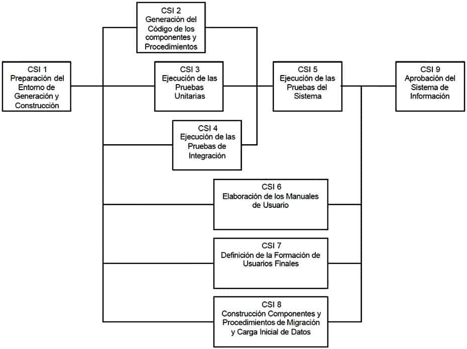
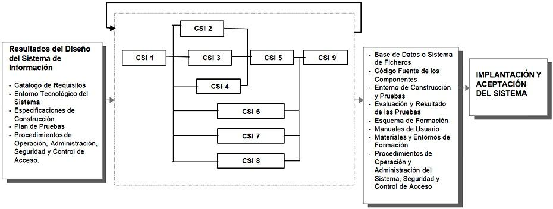

#  Construcción del Sistema de Información

## Descripción y objetivos

DESCRIPCIÓN Y OBJETIVOS

En este proceso se genera el código de los componentes del Sistema de Información, se desarrollan todos los procedimientos de operación y seguridad y se elaboran todos los manuales de usuario final y de explotación con el objetivo de asegurar el correcto funcionamiento del Sistema para su posterior implantación.

Para conseguir dicho objetivo, en este proceso se realizan las pruebas unitarias, las pruebas de integración de los subsistemas y componentes y las pruebas del sistema, de acuerdo al plan de pruebas establecido.

Asimismo, se define la formación de usuario final y, si procede, se construyen los procedimientos de migración y carga inicial de datos.

Al ser MÉTRICA Versión 3 una metodología que cubre tanto desarrollos estructurados como orientados a objetos, las actividades de ambas aproximaciones están integradas en una estructura común.

El producto Especificaciones de Construcción del Sistema de Información, obtenido en la actividad de Generación de Especificaciones de Construcción (DSI 8), es la base para la construcción del sistema de información. En dicho producto se recoge la información relativa al entorno de construcción del sistema de información, la especificación detallada de los componentes y la descripción de la estructura física de datos, tanto bases de datos como sistemas de ficheros. Opcionalmente, incluye un plan de integración del sistema de información, en el que se especifica la secuencia y organización de la construcción de los distintos componentes.

En la actividad Preparación del Entorno de Generación y Construcción (CSI 1), se asegura la disponibilidad de la infraestructura necesaria para la generación del código de los componentes y procedimientos del sistema de información.

Una vez configurado el entorno de construcción, se realiza la codificación y las pruebas de los distintos componentes que conforman el sistema de información, en las actividades:

    Generación del Código de los Componentes y Procedimientos (CSI 2), que se hace según las especificaciones de construcción del sistema de información, y conforme al plan de integración del sistema de información.
    Ejecución de las Pruebas Unitarias (CSI 3), dónde se llevan a cabo las verificaciones definidas en el plan de pruebas para cada uno de los componentes.
    Ejecución de las Pruebas de Integración (CSI 4), que incluye la ejecución de las verificaciones asociadas a los subsistemas y componentes, a partir de los componentes verificados individualmente, y la evaluación de los resultados.

Una vez construido el sistema de información y realizadas las verificaciones correspondientes, se lleva a cabo la integración final del sistema de información en la actividad Ejecución de las Pruebas del Sistema (CSI 5), comprobando tanto las interfaces entre subsistemas y sistemas externos como los requisitos, de acuerdo a las verificaciones establecidas en el plan de pruebas para el nivel de pruebas del sistema.

En la actividad Elaboración de los Manuales de Usuario (CSI 6), se genera la documentación de usuario final o explotación, conforme a los requisitos definidos en el proceso Diseño del Sistema de Información (DSI).

La formación necesaria para que los usuarios finales sean capaces de utilizar el sistema de forma satisfactoria se especifica en la actividad Definición de la Formación de Usuarios Finales (CSI 7).

Si se ha establecido la necesidad de realizar una migración de datos, la construcción y pruebas de los componentes y procedimientos relativos a dicha migración y a la carga inicial de datos se realiza en la actividad Construcción de los Componentes y Procedimientos de Migración y Carga Inicial de Datos (CSI 8).

Construcción del sistema de información

PARTICIPANTES EN LAS ACTIVIDADES DEL PROCESO CSI
CONSTRUCCIÓN DEL SISTEMA DE INFORMACIÓN 	ACTIVIDADES
CSI 1 	CSI 2 	CSI 3 	CSI 4 	CSI 5 	CSI 6 	CSI 7 	CSI 8 	CSI 9
Administrador de B/D 	X 							X 	
Analistas 				X 	X 		X 		
Comité de Dirección 									
Comité de Seguimiento 									X
Equipo de Arquitectura 				X 	X 				
Equipo de Formación 							X 		
Equipo de Operación 	X 							X 	
Equipo de Proyecto 	X 			X 	X 	X 		X 	
Equipo de Seguridad 								X 	
Jefe de Proyecto 					X 				X
Responsable de Operación 									
Técnico de Comunicaciones 				X 	X 				
Técnico de Sistemas 	X 		X 	X 	X 			X 	
Programadores 		X 	X 					X 	
TÉCNICAS/PRÁCTICAS UTILIZADAS EN LAS ACTIVIDADES DEL PROCESO CSI
CONSTRUCCIÓN DEL SISTEMA DE INFORMACIÓN 	ACTIVIDADES
CSI 1 	CSI 2 	CSI 3 	CSI 4 	CSI 5 	CSI 6 	CSI 7 	CSI 8 	CSI 9
Pruebas de Integración 				X 				X 	
Pruebas del Sistema 					X 				
Pruebas Unitarias 			X 					X 	
Actividades

    Actividad CSI 1: Preparación del Entorno de Generación y Construcción
    Actividad CSI 2: Generación del Código de los Componentes y Procedimientos
    Actividad CSI 3: Ejecución de las Pruebas Unitarias
    Actividad CSI 4: Ejecución de las Pruebas de Integración
    Actividad CSI 5: Ejecución de las Pruebas del Sistema
    Actividad CSI 6: Elaboración de los Manuales de Usuario
    Actividad CSI 7: Definición de la Formación de Usuarios Finales
    Actividad CSI 8: Construcción de los Componentes y Procedimientos de Migración y Carga Inicial de Datos
    Actividad CSI 9: Aprobación del Sistema de Información

### Actividad CSI 1: Preparación del Entorno de Generación y Construcción

El objetivo de esta actividad es asegurar la disponibilidad de todos los medios y facilidades para que se pueda llevar a cabo la construcción del sistema de información. Entre estos medios, cabe destacar la preparación de los puestos de trabajo, equipos físicos y lógicos, gestores de bases de datos, bibliotecas de programas, herramientas de generación de código, bases de datos o ficheros de prueba, entre otros.

Las características del entorno de construcción y sus requisitos de operación y seguridad, así como las especificaciones de construcción de la estructura física de datos, se establecen en la actividad Generación de Especificaciones de Construcción (DSI 8), y constituyen el punto de partida para la realización de esta actividad.
TAREA 	PRODUCTOS 	TÉCNICAS Y PRÁCTICAS 	PARTICIPANTES
CSI 1.1: Implantación de la Base de Datos Física o Ficheros 	

    Base de Datos Física o Sistema de Ficheros

		

    Equipo del Proyecto
    Administradores de Bases de Datos

CSI 1.2: Preparación del Entorno de Construcción 	

    Entorno de Construcción

		

    Equipo del Proyecto
    Técnicos de Sistemas
    Equipo de Operación
    Administradores de Bases de Datos

#### Tarea CSI 1.1: Implantación de la Base de Datos Física o Ficheros

En esta tarea hay que:

    Crear los elementos del sistema gestor de base de datos o sistema de ficheros
    Reservar el espacio de almacenamiento, definiendo, entre otros, los dispositivos físicos a emplear, tamaño de los bloques, tipo de registro físico, zona de desbordamiento, opciones de almacenamiento de datos, etc.
    Inicializar la base de datos o ficheros, cargando los datos considerados necesarios en el espacio de almacenamiento previamente definido.

Productos

De entrada

    Entorno Tecnológico del Sistema (DSI 7.2)
    Diseño de la Arquitectura del Sistema (DSI 7.2)
    Especificaciones de Construcción del Sistema de Información (DSI 8.4)

De salida

    Base de Datos Física o Sistema de Ficheros

Participantes

    Equipo del Proyecto
    Administradores de Bases de Datos

#### Tarea CSI 1.2: Preparación del Entorno de Construcción

En esta tarea se prepara el entorno en el que se construirán los componentes del sistema de información, contemplando aspectos tales como:

    Bibliotecas o librerías a utilizar
    Herramientas: generadores de código, editores, compiladores, verificadores sintácticos, montadores de enlace,
    Puestos de trabajo
    Implementación de los procedimientos de operación y seguridad propios del entorno de construcción, de acuerdo a los requisitos de seguridad y operación establecidos en la tarea Especificación del Entorno de Construcción (DSI 8.1).

Productos

De entrada

    Especificaciones de Construcción del Sistema de Información (DSI 8.1)

De salida

    Entorno de Construcción

Participantes

    Equipo del Proyecto
    Técnicos de Sistemas
    Equipo de Operación
    Administradores de Bases de Datos

### Actividad CSI 2: Generación del Código de los Componentes y Procedimientos

El objetivo de esta actividad es la codificación de los componentes del sistema de información, a partir de las especificaciones de construcción obtenidas en el proceso Diseño del Sistema de Información (DSI), así como la construcción de los procedimientos de operación y seguridad establecidos para el mismo.

En paralelo a esta actividad, se desarrollan las actividades relacionadas con las pruebas unitarias y de integración del sistema de información. Esto permite una construcción incremental, en el caso de que así se haya especificado en el plan de pruebas y en el plan de integración del sistema de información.
TAREA 	PRODUCTOS 	TÉCNICAS Y PRÁCTICAS 	PARTICIPANTES
CSI 2.1: Generación del Código de Componentes 	

    Producto Software:
        Código Fuente de los Componentes

		

    Programadores

CSI 2.2: Generación del Código de los Procedimientos de Operación y Seguridad 	

    Producto Software:
        Procedimientos de Operación y Administración del Sistema
        Procedimientos de Seguridad y Control de Acceso

		

    Técnicos de Sistemas
    Equipo de Operación
    Administrador de la Base de Datos
    Programadores

#### Tarea CSI 2.1: Generación del Código de Componentes

En esta tarea se genera el código correspondiente a cada uno de los componentes del sistema de información, identificados en la tarea Definición de Componentes y Subsistemas de Construcción (DSI 8.2).

Para generar el código fuente se tienen en cuenta los estándares de nomenclatura, codificación y calidad utilizados por la organización y recogidos en el catálogo de normas.

Con el fin de verificar que el código fuente especifica de forma correcta el componente, se realiza su ensamblaje o compilación, verificando y corrigiendo los errores sintácticos, y el enlace del código objeto obtenido con las correspondientes bibliotecas.
Productos

De entrada

    Catálogo de Normas (DSI 1.4)
    Especificaciones de Construcción del Sistema de Información (DSI 8.2)

De salida

    Producto Software
        Código Fuente de los Componentes

Participantes

    Programadores

#### Tarea CSI 2.2: Generación del Código de los Procedimientos de Operación y Seguridad

El objetivo de esta tarea es generar los procedimientos de operación y administración del sistema de información, así como los procedimientos de seguridad y control de acceso, necesarios para ejecutar el sistema una vez que se haya implantado y esté en producción.

Para la generación de dichos procedimientos se tienen en cuenta, también, los estándares y normas de la instalación recogidos en el catálogo de normas.
Productos

De entrada

    Catálogo de Normas (DSI 1.4)
    Diseño de la Arquitectura del Sistema (DSI 7.2)
    Entorno Tecnológico del Sistema (DSI 7.2)
    Procedimientos de Operación y Administración del Sistema (DSI 1.7)
    Procedimientos de Seguridad y Control de Acceso (DSI 1.7)
    Producto Software (CSI 2.1)

De salida

    Producto Software
        Procedimientos de Operación y Administración del Sistema
        Procedimientos de seguridad y control de acceso

Participantes

    Técnicos de Sistemas
    Equipo de Operación
    Administrador de la Base de Datos
    Programadores

### Actividad CSI 3: Ejecución de las Pruebas Unitarias

En esta actividad se realizan las pruebas unitarias de cada uno de los componentes del sistema de información, una vez codificados, con el objeto de comprobar que su estructura es correcta y que se ajustan a la funcionalidad establecida.

En el plan de pruebas se ha definido el entorno necesario para la realización de cada nivel de prueba, así como las verificaciones asociadas a las pruebas unitarias, la coordinación y secuencia a seguir en la ejecución de las mismas y los criterios de registro y aceptación de los resultados.
TAREA 	PRODUCTOS 	TÉCNICAS Y PRÁCTICAS 	PARTICIPANTES
CSI 3.1: Preparación del Entorno de Pruebas Unitarias 	

    Entorno de pruebas unitarias

		

    Técnicos de Sistemas
    Programadores

CSI 3.2: Realización y Evaluación de las Pruebas Unitarias 	

    Resultado de las pruebas unitarias

	

    Pruebas Unitarias

	

    Programadores

#### Tarea CSI 3.1: Preparación del Entorno de las Pruebas Unitarias

En esta tarea se preparan todos los recursos necesarios para realizar las pruebas unitarias de cada uno de los componentes del sistema de información.

Para ello, se asegura la disponibilidad del entorno y de los datos necesarios para ejecutar estas pruebas, se preparan las bibliotecas o librerías oportunas para la realización de las mismas, así como los procedimientos manuales o automáticos necesarios, conforme a la especificación del entorno definida en el plan de pruebas.
Productos

De entrada

    Plan de Pruebas (DSI 10.3)

De salida

    Entorno de Pruebas Unitarias

Participantes

    Técnicos de Sistemas
    Programadores

#### Tarea CSI 3.2: Realización y Evaluación de las Pruebas Unitarias

El objetivo de esta tarea es comprobar el correcto funcionamiento de los componentes del sistema de información, codificados en la actividad Generación del Código de los Componentes y Procedimientos (CSI 2), conforme a las verificaciones establecidas en el plan de pruebas para el nivel de pruebas unitarias, en la actividad Especificación Técnica del Plan de Pruebas (DSI 10).

Para cada verificación establecida, se realizan las pruebas con los casos de pruebas asociados, efectuando el correspondiente análisis y evaluación de los resultados, y generando un registro conforme a los criterios establecidos en el plan de pruebas.

Seguidamente, se analizan los resultados de las pruebas unitarias, evaluándose las mismas para comprobar que los resultados son los esperados. Si los resultados no son los esperados hay que proceder a realizar las correcciones pertinentes.
Productos

De entrada

    Producto Software (CSI 2.2)
    Entorno de Pruebas Unitarias (CSI 3.1)
    Plan de Pruebas (DSI 10.3)

De salida

    Resultado y evaluación de las Pruebas Unitarias

Prácticas

    Pruebas Unitarias

Participantes

    Programadores

### Actividad CSI 4: Ejecución de las Pruebas de Integración

El objetivo de las pruebas de integración es verificar si los componentes o subsistemas interactúan correctamente a través de sus interfaces, tanto internas como externas, cubren la funcionalidad establecida, y se ajustan a los requisitos especificados en las verificaciones correspondientes.

La estrategia a seguir en las pruebas de integración se establece en el plan de pruebas, dónde se habrá tenido en cuenta el plan de integración del sistema de información, siempre y cuando se haya especificado en la tarea Definición de  Componentes y Subsistemas de Construcción (DSI 8.2).

Esta actividad se realiza en paralelo a las actividades Generación del Código de los Componentes y Procedimientos (CSI 2) y Ejecución de las Pruebas Unitarias (CSI 3). Sin embargo, es necesario que los componentes objeto de las pruebas de integración se hayan verificado de manera unitaria.
TAREA 	PRODUCTOS 	TÉCNICAS Y PRÁCTICAS 	PARTICIPANTES
CSI 4.1: Preparación del Entorno de Pruebas de Integración 	

    Entorno de Pruebas de Integración

		

    Técnicos de Sistemas
    Técnicos de Comunicaciones
    Equipo de Arquitectura
    Equipo del Proyecto

CSI 4.2: Realización de las Pruebas de Integración 	

    Resultado de las Pruebas de Integración

	

    Pruebas de Integración

	

    Equipo del Proyecto

CSI 4.3: Evaluación del Resultado de las Pruebas de Integración 	

    Evaluación del Resultado de las Pruebas de Integración
    Analistas

#### Tarea CSI 4.1: Preparación del Entorno de las Pruebas de Integración

En esta tarea se disponen todos los recursos necesarios para realizar las pruebas de integración de los componentes y subsistemas que conforman el sistema de información.

Para ello, se asegura la disponibilidad del entorno y de los datos necesarios para ejecutar estas pruebas, se preparan las bibliotecas o librerías que se estimen oportunas para la realización de las mismas, así como los procedimientos manuales o automáticos asociados, conforme a la especificación del entorno definida en el plan de pruebas.
Productos

De entrada

    Plan de Pruebas (DSI 10.3)

De salida

    Entorno de Pruebas de Integración

Participantes

    Técnicos de Sistemas
    Especialistas en Comunicaciones
    Equipo de Arquitectura
    Equipo del Proyecto

#### Tarea CSI 4.2: Realización de las Pruebas de Integración

El objetivo de esta tarea es verificar el correcto funcionamiento de las interfaces existentes entre los distintos componentes y subsistemas, conforme a las verificaciones establecidas para el nivel de pruebas de integración.

Para cada verificación establecida, se realizan las pruebas con los casos de pruebas asociados, efectuando el correspondiente análisis e informe de los resultados de cada verificación, y generando un registro conforme a los criterios establecidos en el plan de pruebas.
Productos

De entrada

    Producto Software (CSI 2.1 y CSI 2.2)
    Entorno de Pruebas de Integración (CSI 4.1)
    Plan de Pruebas (DSI 10.3)

De salida

    Resultado de las Pruebas de Integración

Prácticas

    Pruebas de Integración

Participantes

    Equipo del Proyecto

#### Tarea CSI 4.3: Evaluación del Resultado de las Pruebas de Integración

El objetivo de esta tarea es analizar los resultados de las pruebas de integración y efectuar su evaluación. Dicha evaluación recoge el grado de cumplimiento de las pruebas y consiste en:

    Comparar los resultados obtenidos con los esperados
    Identificar el origen de cada problema detectado para poder remitirlo a quien proceda, determinar la envergadura de las modificaciones y qué acciones deben llevarse a cabo para resolverlo de forma satisfactoria.
    Indicar si el plan de pruebas debe volver a realizarse total o parcialmente, y si será necesario contemplar nuevos casos de prueba no considerados anteriormente.

Productos

De entrada

    Resultado de las Pruebas de Integración (CSI 4.2)
    Plan de Pruebas (DSI 10.3)

De salida

    Evaluación del Resultado de las Pruebas de Integración

Participantes

    Analistas

### Actividad CSI 5: Ejecución de las Pruebas del Sistema

El objetivo de las pruebas del sistema es comprobar la integración del sistema de información globalmente, verificando el funcionamiento correcto de las interfaces entre los distintos subsistemas que lo componen y con el resto de sistemas de información con los que se comunica.

En la realización de estas pruebas es importante comprobar la cobertura de los requisitos, dado que su incumplimiento puede comprometer la aceptación del sistema por el equipo de operación responsable de realizar las pruebas de implantación del sistema, que se llevarán a cabo en el proceso Implantación y Aceptación del Sistema (IAS).
TAREA 	PRODUCTOS 	TÉCNICAS Y PRÁCTICAS 	PARTICIPANTES
CSI 5.1: Preparación del Entorno de Pruebas del Sistema 	

    Entorno de Pruebas del Sistema

		

    Técnicos de Sistemas
    Técnicos de Comunicaciones
    Equipo de Arquitectura
    Equipo del Proyecto

CSI 5.2: Realización de las Pruebas del Sistema 	

    Resultado de las Pruebas del Sistema

	

    Pruebas del Sistema

	

    Equipo del Proyecto

CSI 5.3: Evaluación del Resultado de las Pruebas del Sistema 	

    Evaluación del Resultado de las Pruebas del Sistema

		

    Analistas
    Jefe de Proyecto

#### Tarea CSI 5.1: Preparación del Entorno de las Pruebas del Sistema

En esta tarea se preparan todos los recursos necesarios para realizar las pruebas del sistema, de acuerdo a las características del entorno establecidas en el plan de pruebas.

Para ello se asegura la disponibilidad del entorno y de los datos necesarios para ejecutar estas pruebas, se preparan las bibliotecas o librerías que se estimen oportunas para la realización de las mismas, así como los procedimientos manuales o automáticos asociados.
Productos

De entrada

    Plan de Pruebas (DSI 10.3)

De salida

    Entorno de Pruebas del Sistema

Participantes

    Técnicos de Sistemas
    Especialistas en Comunicaciones
    Equipo de Arquitectura
    Equipo del Proyecto

#### Tarea CSI 5.2: Realización de las Pruebas del Sistema

El objetivo de esta tarea es comprobar la integración de todos los subsistemas y componentes del sistema de información, así como la interacción del mismo con otros sistemas de información con los que se relaciona, de acuerdo a las verificaciones establecidas para el nivel de pruebas del sistema.

Para cada verificación establecida, se realizan las pruebas con los casos de pruebas asociados, efectuando el correspondiente análisis e informe de los resultados y generando un registro conforme a los criterios establecidos en el plan de pruebas.
Productos

De entrada

    Producto Software (CSI 2.1 y CSI 2.2)
    Entorno de Pruebas del Sistema (CSI 5.1)
    Plan de Pruebas (DSI 10.3)

De salida

    Resultado de las Pruebas del Sistema

Prácticas

    Pruebas del Sistema

Participantes

    Equipo del Proyecto

#### Tarea CSI 5.3: Evaluación del Resultado de las Pruebas del Sistema

El objetivo de esta actividad es analizar los resultados de las pruebas del sistema de información y efectuar su evaluación. Dicha evaluación recoge el grado de cumplimiento de las mismas, y consiste en:

    Comparar los resultados obtenidos con los esperados
    Identificar el origen de cada problema detectado para poder remitirlo a quien proceda, determinar la envergadura de las modificaciones y qué acciones deben llevarse a cabo para resolverlo de forma satisfactoria.
    Indicar si el plan de pruebas debe volver a realizarse total o parcialmente, y si será necesario contemplar nuevos casos de prueba no considerados anteriormente.

Productos

De entrada

    Resultado de las pruebas del Sistema (CSI 5.2)
    Plan de Pruebas (DSI 10.3)

De salida

    Evaluación del Resultado de las Pruebas del Sistema

Participantes

    Analistas
    Jefe de Proyecto

### Actividad CSI 6: Elaboración de los Manuales de Usuario

TAREA 	PRODUCTOS 	TÉCNICAS Y PRÁCTICAS 	PARTICIPANTES
CSI 6.1: Elaboración de los Manuales de Usuario 	

    Producto Software:
        Manuales de Usuario

		

    Equipo del Proyecto

#### Tarea CSI 6.1: Elaboración de los Manuales de Usuario

El objetivo de esta tarea es elaborar la documentación de usuario, tanto usuario final como de explotación, de acuerdo a los requisitos establecidos en la tarea Especificación de Requisitos de Documentación de Usuario (DSI 11.1), y recogidos en el catálogo de requisitos.

Los requisitos de documentación especifican aspectos relativos a los tipos de documentos a elaborar y estándares a seguir en la generación de los mismos, y para cada uno de ellos:

    Formato y soporte en el que se desarrollarán
    Estructura
    Distribución y mantenimiento de la documentación y número de copias a editar.

Productos

De entrada

    Catálogo de Requisitos (DSI 11.1)
    Producto Software (CSI 2.2)

De salida

    Producto Software:
        Manuales de Usuario

Participantes

    Equipo del Proyecto

### Actividad CSI 7: Definición de la Formación de Usuarios Finales

En esta actividad se establecen las necesidades de formación del usuario final, con el objetivo de conseguir la explotación eficaz del nuevo sistema.

Para la definición de la formación hay que tener en cuenta las características funcionales y técnicas propias del sistema de información, así como los requisitos relacionados con la formación del usuario final, establecidos en la tarea Especificación de Requisitos de Implantación (DSI 11.2).

El producto resultante de esta actividad es la especificación de la formación de usuarios finales, que consta de los siguientes elementos:

    Esquema de formación
    Materiales y entornos de formación.

En el proceso Implantación y Aceptación del Sistema (IAS), se unifican las especificaciones de formación de cada sistema de información implicado en la implantación y se elabora un único plan de formación que esté alineado con el plan de implantación del sistema.
TAREA 	PRODUCTOS 	TÉCNICAS Y PRÁCTICAS 	PARTICIPANTES
CSI 7.1: Definición del Esquema de Formación 	

    Especificación de la Formación a Usuarios Finales:
        Esquema de Formación

		

    Analistas

CSI 7.2: Especificación de los Recursos y Entornos de Formación 	

    Especificación de la Formación a Usuarios Finales:
        Materiales y Entornos de Formación

		

    Analistas
    Equipo de Formación

#### Tarea CSI 7.1: Definición del Esquema de Formación

El objetivo de esta tarea es la definición del contenido de la formación del usuario final del sistema, realizando, a su vez, una estimación de la duración de los distintos apartados o acciones formativas que se contemplen.

La especificación de los esquemas de formación se puede particularizar para cada perfil de usuario identificado en el proceso Análisis del Sistema de Información (ASI), si se considera necesario.
Productos

De entrada

    Catálogo de Requisitos (DSI 11.2)

De salida

    Especificación de la Formación a Usuarios Finales
        Esquema de Formación

Participantes

    Analistas

#### Tarea CSI 7.2: Especificación de los Recursos y Entornos de Formación

El objetivo de esta tarea es detallar los recursos necesarios para llevar a cabo la formación, relativos a los materiales de formación, equipos físicos y lógicos, aulas, etc.

También se determinan las características que debe reunir el entorno para realizar la formación, en cuanto a la necesidad de hacer cargas iniciales o migración de datos, activar los procedimientos de seguridad y control de acceso específicos etc.
Productos

De entrada

    Catálogo de Requisitos (DSI 11.2)
    Especificación de la Formación a Usuarios Finales (CSI 7.1)

De salida

    Especificación de la Formación a Usuarios Finales
        Materiales y Entornos de Formación

Participantes

    Analistas
    Equipo de Formación

### Actividad CSI 8: Construcción de los Componentes y Procedimientos de Migración y Carga Inicial de Datos

El objetivo de esta actividad es la codificación y prueba de los componentes y procedimientos de migración y carga inicial de datos, a partir de las especificaciones recogidas en el plan de migración y carga inicial de datos obtenido en el proceso Diseño del Sistema de Información (DSI).

Previamente a la generación del código, se prepara la infraestructura tecnológica necesaria para realizar la codificación y las pruebas de los distintos componentes y procedimientos asociados, de acuerdo a las características del entorno de migración especificado en el plan de migración y carga inicial de datos.

Finalmente, se llevan a cabo las verificaciones establecidas en la especificación técnica del plan de pruebas propio de la migración.
TAREA 	PRODUCTOS 	TÉCNICAS Y PRÁCTICAS 	PARTICIPANTES
CSI 8.1: Preparación del Entorno de Migración y Carga Inicial de Datos 	

    Entorno de Migración

		

    Equipo del Proyecto
    Técnicos de Sistemas
    Equipo de Operación
    Equipo de Seguridad
    Administradores de Bases de Datos

CSI 8.2: Generación del Código de los Componentes y Procedimientos de Migración y Carga Inicial de Datos 	

    Código Fuente de los Componentes de Migración y Carga Inicial de Datos
    Procedimientos de Migración y Carga Inicial de Datos

		

    Programadores

CSI 8.3: Realización y Evaluación de las Pruebas de Migración y Carga Inicial de Datos 	

    Resultado de las Pruebas de Migración y Carga Inicial de Datos
    Evaluación del Resultado de las Pruebas de Migración y Carga Inicial de Datos

	

    Pruebas Unitarias
    Pruebas de Integración

	

    Equipo del Proyecto

#### Tarea CSI 8.1: Preparación del Entorno de Migración y Carga Inicial de Datos

Se dispone el entorno en el que se van a construir los componentes y procedimientos de migración y carga inicial de datos, considerando las bibliotecas o librerías a utilizar, herramientas o utilidades específicas para la conversión, y compiladores, entre otros, cuya necesidad se habrá establecido en la tarea Especificación del Entorno de Migración (DSI 9.1).

Asimismo, se determinan los datos necesarios para realizar las pruebas de los componentes y procedimientos asociados y se configura el entorno de acuerdo a dichas necesidades.
Productos

De entrada

    Plan de Migración y Carga Inicial de Datos (DSI 9.4)

De salida

    Entorno de Migración

Participantes

    Equipo del Proyecto
    Técnicos de Sistemas
    Equipo de Operación
    Equipo de Seguridad
    Administradores de Bases de Datos

#### Tarea CSI 8.2: Generación del Código de los Componentes y Procedimientos de Migración y Carga Inicial de Datos

El objetivo de esta tarea es la generación del código correspondiente a los procedimientos y componentes necesarios para llevar a cabo la migración, definidos en el plan de migración y carga inicial de datos obtenido en las tareas Diseño de Procedimientos de Migración y Carga Inicial (DSI 9.2) y Diseño Detallado de Componentes de Migración y Carga Inicial (DSI 9.3).

Para generar el código fuente se tienen en cuenta los estándares de nomenclatura y codificación utilizados por la organización y recogidos en el catálogo de normas para este tipo de componentes.
Productos

De entrada

    Catálogo de Normas (DSI 1.4)
    Plan de Migración y Carga Inicial de Datos (DSI 9.4)

De salida

    Código Fuente de los Componentes de Migración y Carga Inicial de Datos
    Procedimientos de Migración y Carga Inicial de Datos

Participantes

    Programadores

#### Tarea CSI 8.3: Realización y Evaluación de las Pruebas de Migración y Carga Inicial de Datos

El objetivo de esta tarea es efectuar las pruebas de los distintos componentes y procedimientos de migración y evaluar su resultado. Esta evaluación recoge el grado de cumplimiento de las mismas, y consiste en:

    Comparar los resultados obtenidos con los esperados
    Identificar el origen de cada problema detectado para poder remitirlo a quien proceda, determinar la envergadura de las modificaciones y qué acciones deben llevarse a cabo para resolverlo de forma satisfactoria.
    Indicar si el plan de pruebas debe volver a realizarse total o parcialmente, y si será necesario contemplar nuevos casos de prueba no considerados anteriormente.

Productos

De entrada

    Plan de Migración y Carga Inicial de Datos (DSI 9.4)
    Código Fuente de los Componentes de Migración y Carga Inicial de Datos (CSI 8.2)
    Procedimientos de Migración y Carga Inicial de Datos (CSI 8.2)

De salida

    Resultado de las Pruebas de Migración y Carga Inicial de Datos
    Evaluación del Resultado de las Pruebas de Migración y Carga Inicial de Datos

Prácticas

    Pruebas Unitarias
    Pruebas de Integración

Participantes

    Equipo del Proyecto

### Actividad CSI 9: Aprobación del Sistema de Información

| Tarea | Productos | Técnicas y prácticas | Participantes |
| - | - | - | - |
| [CSI 9.1: Presentación y Aprobación del Sistema de Información](#sec-9-1) | Sistema de Información: Aprobación del Sistema de Información | |  - Comité de Seguimiento - Jefe de Proyecto |

#### 

En esta tarea se recopilan los productos del sistema de información y se presentan al Comité de Seguimiento para su aprobación.
Productos

De entrada

    Resultado y evaluación de las Pruebas Unitarias (CSI 3.2)
    Evaluación del Resultado de las Pruebas de Integración (CSI 4.3)
    Evaluación del Resultado de las Pruebas del Sistema (CSI 5.3)
    Producto Software (CSI 6.1)
    Especificación de la Formación a Usuarios Finales (CSI 7.2)
    Código Fuente de los Componentes de Migración y Carga Inicial de Datos (CSI 8.2)
    Procedimientos de Migración y Carga Inicial de Datos (CSI 8.2)
    Evaluación del Resultado de las Pruebas de Migración y Carga Inicial de Datos (CSI 8.3)

De salida

    Sistema de Información:
        Aprobación del Sistema de Información

Prácticas

    Presentación

Participantes

    Comité de Seguimiento
    Jefe de Proyecto

