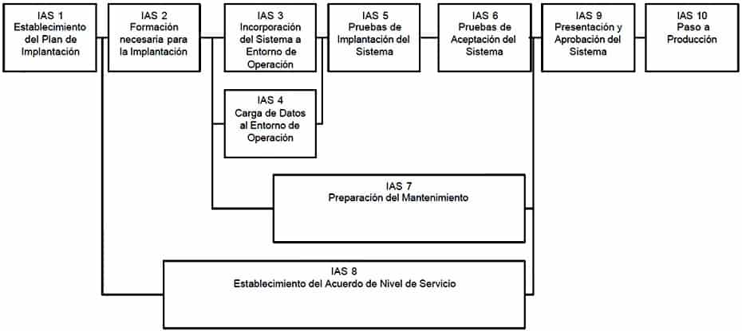
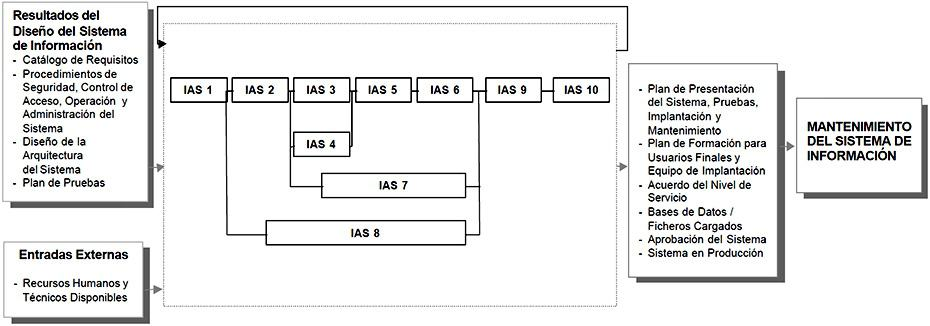

# Implantación y Aceptación del Sistema

DESCRIPCIÓN Y OBJETIVOS

Este proceso tiene como objetivo principal la entrega y aceptación del sistema en su totalidad, y la realización de todas las actividades necesarias para el paso a producción del mismo.

En primer lugar, se revisa la estrategia de implantación que ya se determinó en el proceso Estudio de Viabilidad del Sistema (EVS). Se estudia su alcance y, en función de sus características, se define un plan de implantación y se especifica el equipo que lo va a llevar a cabo. Conviene señalar la participación del usuario de operación en las pruebas de implantación, del usuario final en las pruebas de aceptación, y del responsable de mantenimiento.

Las actividades previas al inicio de la producción incluyen la preparación de la infraestructura necesaria para configurar el entorno, la instalación de los componentes, la activación de los procedimientos manuales y automáticos asociados y, cuando proceda, la migración o carga inicial de datos. Para ello se toman como punto de partida los productos software probados, obtenidos en el proceso Construcción del Sistema de Información (CSI) y su documentación asociada.

Se realizan las pruebas de implantación y de aceptación del sistema en su totalidad. Responden a los siguientes propósitos:

    Las pruebas de implantación cubren un rango muy amplio, que va desde la comprobación de cualquier detalle de diseño interno hasta aspectos tales como las comunicaciones. Se debe comprobar que el sistema puede gestionar los volúmenes de información requeridos, se ajusta a los tiempos de respuesta deseados y que los procedimientos de respaldo, seguridad e interfaces con otros sistemas funcionan correctamente. Se debe verificar también el comportamiento del sistema bajo las condiciones más extremas.
    Las pruebas de aceptación se realizan por y para los usuarios. Tienen como objetivo validar formalmente que el sistema se ajusta a sus necesidades.

Asimismo, se llevan a cabo las tareas necesarias para la preparación del mantenimiento, siempre y cuando se haya decidido que éste va a efectuarse. En cualquier caso, es necesario que la persona que vaya a asumir el mantenimiento conozca el sistema, antes de su incorporación al entorno de producción.

Además hay que determinar los servicios (y niveles para cada uno) que requiere el sistema que se va a implantar, y el acuerdo que se adquiere una vez que se inicie la producción. Hay que distinguir entre servicios de gestión de operaciones (servicios por lotes, seguridad, comunicaciones, etc.) y servicios al cliente (servicio de atención a usuario, mantenimiento, etc.) que se deben negociar en cuanto a recursos, horarios, coste, etc. Se fija el nivel con el que se prestará el servicio como indicador de la calidad del mismo.

Conviene señalar que la implantación puede ser un proceso iterativo que se realiza de acuerdo al plan establecido para el comienzo de la producción del sistema en su entorno de operación. Para establecer este plan se tiene en cuenta:

    El cumplimiento de los requisitos de implantación definidos en la actividad Establecimiento de Requisitos (ASI 2) y especificados en la actividad Establecimiento de Requisitos de Implantación (DSI 11).
    La estrategia de transición del sistema antiguo al nuevo.

Finalmente, se realizan las acciones necesarias para el inicio de la producción.

En el siguiente gráfico se muestra la relación de actividades de este proceso.

IMPLANTACIÓN Y ACEPTACIÓN DEL SISTEMA

## PARTICIPANTES EN LAS ACTIVIDADES DEL PROCESO IAS

IMPLANTACIÓN Y ACEPTACIÓN DEL SISTEMA 	ACTIVIDADES
IAS 1 	IAS 2 	IAS 3 	IAS 4 	IAS 5 	IAS 6 	IAS 7 	IAS 8 	IAS 9 	IAS 10
Administrador de B/D 				X 						
Comité de Dirección 								X 	X 	X
Comité de Seguimiento 								X 		
Directores Usuarios 	X 	X 				X 	X 	X 	X 	
Equipo de Formación 		X 								
Equipo de Implantación 		X 	X 	X 	X 					X
Equipo de Operación 		X 		X 						
Equipo de Soporte Técnico 							X 			X
Jefe de Proyecto 	X 	X 	X 		X 	X 	X 	X 	X 	X
Responsable de Implantación 	X 	X 	X 		X 			X 	X 	X
Responsable de Mantenimiento 							X 			
Responsable de Operación 	X 									
Responsable de Sistemas 	X 									
Usuarios Expertos 				X 		X 	

## TÉCNICAS/PRÁCTICAS UTILIZADAS EN LAS ACTIVIDADES DEL PROCESO IAS

IMPLANTACIÓN Y ACEPTACIÓN DEL SISTEMA 	ACTIVIDADES
IAS 1 	IAS 2 	IAS 3 	IAS 4 	IAS 5 	IAS 6 	IAS 7 	IAS 8 	IAS 9 	IAS 10
Diagrama de Representación 							X 			
Presentación 									X 	
Pruebas de Aceptación 						X 				
Pruebas de Implantación 					X 					
Sesiones de Trabajo 	X 						X 	X 		
Actividades

    Actividad IAS 1: Establecimiento del Plan de Implantación
    Actividad IAS 2: Formación Necesaria para la Implantación
    Actividad IAS 3: Incorporación del Sistema al Entorno de Operación
    Actividad IAS 4: Carga de Datos al Entorno de Operación
    Actividad IAS 5: Pruebas de Implantación del Sistema
    Actividad IAS 6: Pruebas de Aceptación del Sistema
    Actividad IAS 7: Preparación del Mantenimiento del Sistema
    Actividad IAS 8: Establecimiento del Acuerdo de Nivel de Servicio
    Actividad IAS 9: Presentación y Aprobación del Sistema
    Actividad IAS 10: Paso a Producción 

### Actividad IAS 1: Establecimiento del Plan de Implantación

En esta actividad se revisa la estrategia de implantación para el sistema, establecida inicialmente en el proceso Estudio de Viabilidad del Sistema (EVS). Se identifican los distintos sistemas de información que forman parte del sistema objeto de la implantación. Para cada sistema se analizan las posibles dependencias con otros proyectos, que puedan condicionar el plan de implantación.

Una vez estudiado el alcance y los condicionantes de la implantación, se decide si ésta se puede llevar a cabo. Será preciso establecer, en su caso, la estrategia que se concretará de forma definitiva en el plan de implantación.

Se constituye el equipo de implantación, determinando los recursos humanos necesarios para la propia instalación del sistema, para las pruebas de implantación y aceptación, y para la preparación del mantenimiento. Se identifican, para cada uno de ellos, sus perfiles y niveles de responsabilidad.
TAREA 	PRODUCTOS 	TÉCNICAS Y PRÁCTICAS 	PARTICIPANTES
IAS 1.1: Definición del Plan de Implantación 	

    Plan de implantación

	

    Sesiones de trabajo

	

    Jefe de Proyecto
    Responsable de Implantación
    Responsable de Operación
    Responsable de Sistemas
    Directores de los Usuarios

IAS 1.2: Especificación del Equipo de Implantación 	

    Equipo de implantación
    Jefe de Proyecto
    Responsable de Implantación
    Responsable de Operación
    Responsable de Sistemas
    Directores de los Usuarios

#### Tarea IAS 1.1: Definición del Plan de Implantación

La estrategia de implantación del sistema se habrá determinado en la tarea Evaluación de las Alternativas y Selección (EVS 6.2) del proceso Estudio de Viabilidad del Sistema (EVS), en función de la envergadura del sistema, es decir el número de sistemas de información implicados en la implantación y la cobertura geográfica, cuyo alcance depende de las características y complejidad de los sistemas de información que conforman el sistema objeto de la implantación.

Se revisan los requisitos de implantación (instalación, infraestructura, formación) establecidos en la tarea Especificación de Requisitos de Implantación (DSI 11.2) y los procedimientos implicados en la implantación, establecidos para cada uno de los sistemas de información en la tarea Especificación de Requisitos de Operación y Seguridad (DSI 1.7), con el fin de asegurar su adecuación a la estrategia global de implantación.

Una vez analizada la información anterior, se define un plan de implantación que permita calc ular adecuadamente el esfuerzo y los recursos necesarios para llevar a cabo con éxito la implantación. Dicho plan debe contemplar todas las tareas relacionadas con:

    La formación necesaria para la implantación, tanto a usuarios finales como al equipo que se encarga de realizar las pruebas de implantación y aceptación del sistema.
    La preparación de la infraestructura necesaria para la incorporación del sistema al entorno de operación.
    La instalación de todos los componentes y procedimientos manuales y automáticos asociados a cada sistema de información implicado en la implantación.
    La ejecución de los procedimientos de carga inicial y migración de datos, si se determinó su necesidad.
    La realización de las pruebas de implantación y aceptación del sistema.
    La formalización del plan de mantenimiento.

Productos

De entrada

    Solución Propuesta (EVS 6.2)
    Diseño de la Arquitectura del Sistema (DSI 7.2)
    Entorno Tecnológico del Sistema (DSI 7.2)
    Procedimientos de Operación y Administración del Sistema (DSI 1.7)
    Procedimientos de Seguridad y Control de Acceso (DSI 1.7)
    Plan de Migración y Carga Inicial de Datos (DSI 9.4)
    Plan de Pruebas (DSI 10.3)
    Catálogo de Requisitos (DSI 11.2)

De salida

    Plan de Implantación

Prácticas

    Sesiones de trabajo

Participantes

    Jefe de Proyecto
    Responsable de Implantación
    Responsable de Operación
    Responsable de Sistemas
    Directores de los Usuarios

#### Tarea IAS 1.2: Especificación del Equipo de Implantación

Se constituye el equipo de trabajo necesario para llevar a cabo la implantación y aceptación del sistema, según el plan de implantación establecido en la tarea anterior.

Para ello se identifican, en función del nivel de esfuerzo requerido, los distintos participantes implicados en la implantación del sistema (usuarios, equipo técnico y responsable de mantenimiento), determinando previamente sus perfiles, responsabilidades, nivel de implicación y fechas previstas de participación a lo largo de toda la implantación.
Productos

De entrada

    Recursos Humanos y Técnicos Disponibles (externo)
    Catálogo de Usuarios (ASI 1.4)
    Plan de Implantación (IAS 1.1)

De salida

    Equipo de Implantación

Participantes

    Jefe de Proyecto
    Responsable de Implantación
    Responsable de Operación
    Responsable de Sistemas
    Directores de los Usuarios

### Actividad IAS 2: Formación Necesaria para la Implantación

En esta actividad se prepara y se imparte la formación al equipo que participará en la implantación y aceptación del sistema. Se realiza también el seguimiento de la formación de los usuarios finales, cuya impartición queda fuera del ámbito de MÉTRICA Versión 3. De esta forma, se asegura que la implantación se va a llevar a cabo correctamente.

Se determina la formación necesaria para el equipo de implantación, en función de los distintos perfiles y niveles de responsabilidad identificados en la actividad anterior. Para ello, se establece un plan de formación que incluye los esquemas de formación correspondientes, los recursos humanos y de infraestructura requeridos para llevarlo a cabo, así como una planificación que queda reflejada en el plan de formación.

La formación para que los usuarios finales sean capaces de utilizar el sistema de manera satisfactoria ha sido establecida, previamente, en la actividad Definición de la Formación de Usuarios Finales (CSI 7). En esta actividad, se analizan los esquemas de formación definidos según los diferentes perfiles, y se elabora un plan de formación que esté alineado con el plan de implantación.
TAREA 	PRODUCTOS 	TÉCNICAS Y PRÁCTICAS 	PARTICIPANTES
IAS 2.1: Preparación de la Formación del Equipo de Implantación 	

    Plan de Formación del Equipo de Implantación
        Esquema de Formación
        Materiales de Formación
        Recursos de Formación
        Planificación de Formación

		

    Jefe de Proyecto
    Responsable de Implantación
    Directores de los Usuarios
    Equipo de Formación

IAS 2.2: Formación del Equipo de Implantación 	

    Plan de Formación del Equipo de Implantación
        Registro de Asistencia

		

    Equipo de Formación
    Equipo de Implantación

IAS 2.3: Preparación de la Formación a Usuarios Finales 	

    Plan de Formación a Usuarios Finales
        Esquema de Formación
        Materiales de Formación
        Planificación de la Formación

		

    Equipo de Operación
    Jefe de Proyecto
    Directores de los Usuarios

IAS 2.4: Seguimiento de la Formación a Usuarios Finales 	

    Plan de Formación a Usuarios Finales
        Registro de Asistencia

		

    Jefe de Proyecto
    Directores de los Usuarios

#### Tarea IAS 2.1: Preparación de la Formación del Equipo de Implantación

Se define la formación necesaria para el equipo de trabajo responsable de la implantación y aceptación del sistema, estableciendo el esquema de formación para cada tipo de perfil dentro del equipo y la duración estimada de los cursos.

Asimismo, se aseguran los recursos humanos, técnicos y materiales necesarios para realizar la formación al equipo de implantación.

Por último, se convoca a las personas que deben asistir a los cursos de formación y se espera la confirmación.
Productos

De entrada

    Plan de Implantación (IAS 1.1)
    Equipo de Implantación (IAS 1.2)

De salida

    Plan de Formación del Equipo de Implantación:
        Esquema de Formación
        Materiales de Formación
        Recursos de Formación
        Planificación de la Formación

Participantes

    Jefe de Proyecto
    Responsable de Implantación
    Directores de los Usuarios
    Equipo de Formación

#### Tarea IAS 2.2: Formación del Equipo de Implantación

En esta tarea se lleva a cabo la formación del equipo que va a ser responsable de la implantación y aceptación del sistema, según el plan de formación que se haya establecido en la tarea anterior, asegurando la asistencia de todos sus integrantes.
Productos

De entrada

    Equipo de Implantación (IAS 1.2)
    Plan de Formación del Equipo de Implantación (IAS 2.1)

De salida

    Plan de Formación del Equipo de Implantación:
        Registro de Asistencia

Participantes

    Equipo de Formación
    Equipo de Implantación

#### Tarea IAS 2.3: Preparación de la Formación a Usuarios finales

En función del plan de implantación establecido, se revisa el esquema de formación a los usuarios finales, elaborado en la actividad Definición de la Formación de Usuarios Finales (CSI 7). Se asegura que se cuenta con los recursos humanos, técnicos y materiales necesarios para realizar la formación correspondiente.

Se establece el plan de formación del sistema a implantar en su totalidad, con el fin de garantizar el éxito de la implantación. Se determina, en función de los esquemas de formación asociados a los distintos perfiles, los contenidos definitivos que tienen los cursos, cuándo deben impartirse, quiénes han de recibirlos y con qué prioridad.
Productos

De entrada

    Plan de Implantación (IAS 1.1)
    Catálogo de Usuarios (ASI 1.4)
    Especificación de la Formación a Usuarios Finales (CSI 7.2)

De salida

    Plan de Formación a Usuarios Finales:
        Esquema de Formación
        Materiales de Formación
        Planificación de la Formación

Participantes

    Equipo de Formación
    Jefe de Proyecto
    Directores de los Usuarios

#### Tarea IAS 2.4: Seguimiento de la Formación a Usuarios Finales

La impartición de la formación a los usuarios finales queda fuera del ámbito de MÉTRICA Versión 3. Sin embargo, es necesario llevar a cabo su seguimiento con el fin de asegurar el cumplimiento del plan de formación previsto e informar de las posibles desviaciones para tomar las medidas oportunas.
Productos

De entrada

    Plan de Formación a Usuarios Finales (IAS 2.3)

De salida

    Plan de Formación a Usuarios Finales:
        Registro de Asistencia

Participantes

    Jefe de Proyecto
    Directores de los Usuarios

### Actividad IAS 3: Incorporación del Sistema al Entorno de Operación

En esta actividad se realizan todas las tareas necesarias para la incorporación del sistema al entorno de operación en el que se van a llevar a cabo las pruebas de implantación y aceptación del sistema.

Mientras que las pruebas unitarias, de integración y del sistema se pueden ejecutar en un entorno distinto de aquél en el que finalmente se implantará, las pruebas de implantación y aceptación del sistema deben ejecutarse en el entorno real de operación. El propósito es comprobar que el sistema satisface todos los requisitos especificados por el usuario en las mismas condiciones que cuando se inicie la producción.

Por tanto, como paso previo a la realización de dichas pruebas y de acuerdo al plan de implantación establecido, se verifica que los recursos necesarios están disponibles para que se pueda realizar, adecuadamente, la instalación de todos los componentes que integran el sistema, así como la creación y puesta a punto de las bases de datos en el entorno de operación. Asimismo, se establecen los procedimientos de explotación y uso de las bases de datos de acuerdo a la normativa existente en dicho entorno.
TAREA 	PRODUCTOS 	TÉCNICAS Y PRÁCTICAS 	PARTICIPANTES
IAS 3.1: Preparación de la Instalación 	

    Incidencias de Preparación de Instalación

		

    Jefe de Proyecto
    Responsable de Implantación
    Equipo de Implantación

IAS 3.2: Realización de la Instalación 	

    Producto Software (instalado)
    Código Fuente de los Componentes de Migración y Carga Inicial de Datos (instalado)
    Procedimientos de Migración y Carga Inicial de Datos (instalado)

		

    Jefe de Proyecto
    Equipo de Implantación

#### Tarea IAS 3.1: Preparación de la Instalación

En esta tarea se verifica que está disponible la infraestructura necesaria para configurar el entorno. Dicha infraestructura debe cumplir los requisitos de implantación (instalación e infraestructura) y tener en cuenta los procedimientos de seguridad y control de acceso (mantenimiento de la integridad y confidencialidad de los datos, control de accesos al sistema, copias de seguridad y recuperación de datos, etc.), y operación y administración del sistema (estándares, recuperación y reanudación de trabajos, planificación de trabajos, etc.).

Además, si alguno de los sistemas de información implicados en la implantación lleva implícita una migración de datos habrá que tener en cuenta, también, las características del entorno y los procedimientos propios de la migración establecidos en el plan de migración y carga inicial de datos, obtenido en la actividad Diseño de la Migración y Carga Inicial de Datos (DSI 9).

Una vez comprobada la idoneidad de los distintos elementos relacionados con la infraestructura, se realiza la instalación del software de base necesario para la incorporación posterior de los componentes asociados a los sistemas de información implicados en la implantación.

También se debe asegurar que el equipo responsable de la realización de las pruebas de implantación y aceptación del sistema ha recibido la formación necesaria.
Productos

De entrada

    Plan de Implantación (IAS 1.1)
    Plan de Formación del Equipo de Implantación (IAS 2.2)
    Catálogo de Requisitos (DSI 11.2)
    Diseño de la Arquitectura del Sistema (DSI 7.2)
    Entorno Tecnológico del Sistema (DSI 7.2)
    Especificaciones de Construcción del Sistema de Información (DSI 8.4)
    Plan de Migración y Carga Inicial de Datos (DSI 9.4)

De salida

    Incidencias de Preparación de Instalación

Participantes

    Jefe de Proyecto
    Responsable de Implantación
    Equipo de Implantación

#### Tarea IAS 3.2: Realización de la Instalación

Se realiza la instalación de todos los componentes del nuevo sistema, incluidos los procedimientos manuales y automáticos, de acuerdo al plan de implantación y a su ubicación física, establecida en el proceso Diseño del Sistema de Información (DSI). Se deben tener en cuenta los estándares y normativas por los que se rige la organización en los entornos de operación.

Asimismo, se prepara el entorno de datos identificando los sistemas de información que forman parte del sistema objeto de la implantación. Para cada uno de ellos:

    Se crean las bases de datos a partir del esquema físico elaborado en el proceso de construcción.
    Se establecen los procedimientos de explotación y uso de las bases de datos, es decir, la normativa necesaria para la utilización de las bases de datos, actualización, consulta, etc.
    Se revisan los procedimientos necesarios para realizar las copias de seguridad de los datos y de restauración de las copias indicando su frecuencia, así como los procedimientos de consolidación y sincronización de la información, éstos últimos cuando proceda.
    Se preparan las autorizaciones de acceso a los datos para los distintos perfiles de usuarios.

Una vez comprobada la correcta instalación del nuevo sistema, se activan los procedimientos de operación, de administración del sistema, de seguridad y de control de acceso. Incluyen el arranque y cierre del sistema según la frecuencia establecida, la planificación de trabajos, su recuperación y reanudación, las autorizaciones de acceso al sistema según los distintos perfiles de usuario, etc.

Asimismo, si es necesaria una migración de datos se activarán también los procedimientos asociados.
Productos

De entrada

    Plan de Implantación (IAS 1.1)
    Equipo de Implantación (IAS 1.2)
    Especificaciones de Construcción del Sistema de Información (DSI 8.4)
    Producto Software (CSI 6.1)
    Código Fuente de los Componentes de Migración y Carga Inicial de Datos (CSI 8.2)
    Procedimientos de Migración y Carga Inicial de Datos (CSI 8.2)

De salida

    Producto Software (instalado)
    Código Fuente de los Componentes de Migración y Carga Inicial de Datos (instalado)
    Procedimientos de Migración y Carga Inicial de Datos (instalado)

Participantes

    Jefe de Proyecto
    Equipo de Implantación

### Actividad IAS 4: Carga de Datos al Entorno de Operación

Teniendo en cuenta que los sistemas de información que forman parte del sistema a implantar pueden mejorar, ampliar o sustituir a otros ya existentes en la organización, puede ser necesaria una carga inicial y/o una migración de datos cuyo alcance dependerá de las características y cobertura de cada sistema de información implicado. Por tanto, la necesidad de una migración de datos puede venir determinada desde el proceso Estudio de Viabilidad del Sistema (EVS), en la actividad Selección de la Solución (EVS 6). Allí se habrá establecido la estrategia a seguir en la sustitución, evaluando las opciones del enfoque de desarrollo e instalación más apropiados para llevarlo a cabo.

En cualquier caso, en la actividad Diseño de la Migración y Carga Inicial de Datos (DSI 9) se habrán definido y planificado los procesos y procedimientos necesarios para llevar a cabo la migración, realizándose su codificación en la actividad Construcción de los Componentes y Procedimientos de Migración y Carga Inicial de Datos (CSI 8).
TAREA 	PRODUCTOS 	TÉCNICAS Y PRÁCTICAS 	PARTICIPANTES
IAS 4.1: Migración y Carga Inicial de Datos 	

    Bases de datos / ficheros cargados
    Equipo de Implantación
    Equipo de Operación
    Administradores de Bases de Datos
    Usuarios Expertos

#### Tarea IAS 4.1: Migración y Carga inicial de Datos

Se realiza la carga inicial de datos del nuevo sistema, y se comprueba que ha finalizado correctamente.

A continuación, si procede, se hace la migración de datos, activando los procedimientos correspondientes, para efectuar la transformación de los datos de la estructura existente a la nueva. Se lleva a cabo la depuración de los datos que no sean consistentes, hasta comprobar su correcta finalización.
Productos

De entrada

    Plan de implantación (IAS 1.1)
    Equipo de implantación (IAS 1.2)
    Plan de migración y carga inicial de datos (DSI 9.4)
    Código Fuente de los Componentes de Migración y Carga Inicial de Datos (instalado) (IAS 3.2)
    Procedimientos de Migración y Carga Inicial de Datos (instalados) (IAS 3.2)

De salida

    Bases de Datos / Ficheros Cargados

Participantes

    Equipo de Implantación
    Equipo de Operación
    Administradores de Bases de Datos
    Usuarios Expertos

### Actividad IAS 5: Pruebas de Implantación del Sistema

La finalidad de las pruebas de implantación es doble:

    Comprobar el funcionamiento correcto del mismo en el entorno de operación.
    Permitir que el usuario determine, desde el punto de vista de operación, la aceptación del sistema instalado en su entorno real, según el cumplimiento de los requisitos especificados.

Para ello, el responsable de implantación revisa el plan de pruebas de implantación y los criterios de aceptación del sistema, previamente elaborados. Las pruebas las realizan los técnicos de sistemas y de operación, que forman parte del grupo de usuarios técnicos que ha recibido la formación necesaria para llevarlas a cabo.

Una vez ejecutadas estas pruebas, el equipo de usuarios técnicos informa de las incidencias detectadas al responsable de implantación, el cual analiza la información y toma las medidas correctoras que considere necesarias para que el sistema dé respuesta a las especificaciones previstas, momento en el que el equipo de operación lo da por probado.
TAREA 	PRODUCTOS 	TÉCNICAS Y PRÁCTICAS 	PARTICIPANTES
IAS 5.1: Preparación de las Pruebas de Implantación 	

    Plan de pruebas

		

    Jefe de Proyecto
    Responsable de Implantación

IAS 5.2: Realización de las Pruebas de Implantación 	

    Resultado de las pruebas de implantación

	

    Pruebas de implantación

	

    Equipo de Implantación

IAS 5.3: Evaluación del Resultado de las Pruebas de Implantación 	

    Evaluación del resultado de las pruebas de implantación

		

    Jefe de Proyecto
    Responsable de Implantación
    
    
#### Tarea IAS 5.1: Preparación de las Pruebas de Implantación

Se comprueba la disponibilidad de los recursos humanos y técnicos necesarios para realizar las pruebas de implantación. Se revisan las verificaciones establecidas en el plan de pruebas.

Si fuera necesario, se crea algún caso de prueba adicional que se considere importante y que no se haya tenido en cuenta hasta entonces. Se preparan las condiciones que permitan simular las situaciones límite previstas para las pruebas.

Se comunica el plan de pruebas de implantación al equipo responsable de llevarlas a cabo.
Productos

De entrada

    Plan de Implantación (IAS 1.1)
    Equipo de Implantación (IAS 1.2)
    Plan de Pruebas (DSI 10.3)

De salida

    Plan de Pruebas

Participantes

    Jefe de Proyecto
    Responsable de Implantación

#### Tarea IAS 5.2: Realización de las Pruebas de implantación

Se realizan las pruebas de implantación, de acuerdo a las verificaciones establecidas en el plan de pruebas definido en la actividad Especificación Técnica del Plan de Pruebas (DSI 10). Es necesario tener en cuenta las posibles pruebas adicionales incorporadas a dicho plan en la tarea anterior.

El objetivo de estas pruebas es asegurar que el sistema se comporta de la forma prevista en el entorno de operación, y que responde a todas las especificaciones dadas en cuanto a:

    Recuperación, forzando el fallo del sistema y verificando si la recuperación se lleva a cabo de forma apropiada. En caso de que sea de forma automática, se evalúa la inicialización, los mecanismos de recuperación del estado del sistema, datos, etc.
    Seguridad, verificando que los mecanismos de protección incorporados al sistema cumplen su objetivo.
    Rendimiento, probando el sistema en cuanto al tiempo de respuesta de ejecución y al tiempo de utilización de recursos.
    Comunicaciones, etc.

Se registra la realización de las pruebas incluyendo un informe que recoja la desviación de los requisitos establecidos y los problemas que quedan sin resolver.
Productos

De entrada

    Producto Software (IAS 3.2)
    Bases de Datos / Ficheros Cargados (IAS 4.1)
    Plan de Pruebas (IAS 5.1)

De salida

    Resultado de las Pruebas de Implantación

Prácticas

    Pruebas de Implantación

Participantes

    Equipo de Implantación

#### Tarea IAS 5.3: Evaluación del Resultado de las Pruebas de Implantación

Se evalúan los resultados de las pruebas analizando las incidencias recibidas y comprobando que se han llevado a cabo todos los casos de pruebas establecidos en el plan de pruebas. Dicha evaluación consiste en:

    Comparar los resultados obtenidos con los esperados.
    Identificar el origen de cada problema para poder remitirlo a quién proceda, determinar la envergadura de las modificaciones y las acciones que deben llevarse a cabo para resolverlo de forma satisfactoria.
    Indicar si el plan de pruebas debe volver a realizarse total o parcialmente, y si será necesario contemplar nuevos casos de prueba no considerados anteriormente.

Una vez realizadas las medidas correctoras consideradas necesarias y comprobado que el sistema cumple todos los requisitos de implantación, se registra el resultado de la evaluación de las pruebas de implantación que incluye la aprobación o rechazo del sistema por parte de operación.
Productos

De entrada

    Plan de Pruebas (IAS 5.1)
    Resultado de las Pruebas de Implantación (IAS 5.2)

De salida

    Evaluación del Resultado de las Pruebas de Implantación

Participantes

    Jefe de Proyecto
    Responsable de Implantación

    
### Actividad IAS 6: Pruebas de Aceptación del Sistema

Las pruebas de aceptación tienen como fin validar que el sistema cumple los requisitos básicos de funcionamiento esperado y permitir que el usuario determine la aceptación del sistema. Por este motivo, estas pruebas son realizadas por el usuario final que, durante este periodo de tiempo, debe plantear todas las deficiencias o errores que encuentre antes de dar por aprobado el sistema definitivamente.

Los Directores de los Usuarios revisan los criterios de aceptación, especificados previamente en el plan de pruebas del sistema, y dirigen las pruebas de aceptación final que llevan a cabo los usuarios expertos. A su vez, éstos últimos deben elaborar un informe que los Directores de los Usuarios analizan y evalúan para determinar la aceptación o rechazo del
sistema.
TAREA 	PRODUCTOS 	TÉCNICAS Y PRÁCTICAS 	PARTICIPANTES
IAS 6.1: Preparación de las Pruebas de Aceptación 	

    Plan de Pruebas

		

    Jefe de Proyecto
    Directores de los Usuarios

IAS 6.2: Realización de las Pruebas de Aceptación 	

    Resultado de las Pruebas de Aceptación

	

    Pruebas de Aceptación

	

    Usuarios Expertos

IAS 6.3: Evaluación del Resultado de las Pruebas de Aceptación 	

    Evaluación del Resultado de las Pruebas de Aceptación

		

    Jefe de Proyecto
    Directores de los Usuarios

#### Tarea IAS 6.1: Preparación de las Pruebas de Aceptación

Se analizan los criterios de aceptación establecidos por el usuario y recogidos en las verificaciones del plan de pruebas, por si fuera necesario incorporar algún caso de prueba adicional.

Se comunica el plan de pruebas de aceptación una vez actualizado, a los usuarios implicados según los distintos perfiles identificados en la tarea Especificación del equipo de implantación (IAS 1.2).
Productos

De entrada

    Plan de Pruebas (DSI 10.3)
    Plan de implantación (IAS 1.1)
    Equipo de implantación (IAS 1.2)
    Plan de pruebas (IAS 5.1)

De salida

    Plan de pruebas

Participantes

    Jefe de Proyecto
    Directores de los Usuarios

#### Tarea IAS 6.2: Realización de las Pruebas de Aceptación

Se llevan a cabo las pruebas de aceptación final del sistema para asegurar que todos los componentes responden a los criterios de aceptación especificados.

Se registra la realización de las pruebas, incluyendo un informe que recoja la desviación de los requisitos establecidos y los problemas que quedan sin resolver.
Productos

De entrada

    Producto Software (IAS 3.2)
    Bases de Datos / Ficheros Cargados (IAS 4.1)
    Plan de Pruebas (IAS 6.1)

De salida

    Resultado de las Pruebas de Aceptación

Técnicas

    Pruebas de Aceptación

Participantes

    Usuarios Expertos

#### Tarea IAS 6.3: Evaluación del Resultado de las Pruebas de Aceptación

Se evalúan los resultados de las pruebas, analizando las incidencias recibidas y comprobando que se han llevado a cabo todos los casos de pruebas establecidos en el plan de pruebas. Dicha evaluación consiste en:

    Comparar los resultados obtenidos con los esperados.
    Identificar el origen de cada problema para poder remitirlo a quién proceda y determinar qué acciones o medidas correctoras es preciso llevar a cabo para resolverlo de forma satisfactoria.
    Indicar qué pruebas se debe volver a realizar, o si será necesario contemplar nuevos casos de prueba.

Una vez realizadas las medidas correctoras necesarias, y comprobado que su comportamiento es adecuado, se documenta el resultado global de la evaluación de las pruebas de aceptación que incluye la aprobación del sistema por parte del usuario final.
Productos

De entrada

    Plan de Pruebas (IAS 6.1)
    Resultado de las Pruebas de Aceptación (IAS 6.2)

De salida

    Evaluación del Resultado de las Pruebas de Aceptación

Participantes

    Jefe de Proyecto
    Directores de los Usuarios

### Actividad IAS 7: Preparación del Mantenimiento del Sistema

El objetivo de esta actividad es permitir que el equipo que va a asumir el mantenimiento del sistema esté familiarizado con él antes de que el sistema pase a producción. Para conseguir este objetivo, se ha considerado al responsable de mantenimiento como parte integrante del equipo de implantación. Por lo tanto, se habrá tenido en cuenta su perfil al elaborar el esquema de formación correspondiente.

Una vez que el responsable de mantenimiento ha recibido la formación necesaria y adquirido una visión global del sistema que se va a implantar, se le entregan los productos que serán objeto del mantenimiento. De esta manera, obtiene de una forma gradual un conocimiento profundo del funcionamiento y facilidades que incorpora el sistema, que van a permitirle acometer los cambios solicitados por los usuarios con mayor facilidad y eficiencia. Se reduce, en consecuencia, el esfuerzo invertido en el mantenimiento.

Es importante resaltar que la existencia de una configuración del software permite reducir el esfuerzo requerido y mejora la calidad general del software a mantener, aunque no garantiza un mantenimiento libre de problemas. Una pobre configuración del software puede tener un impacto negativo sobre su facilidad de mantenimiento.
TAREA 	PRODUCTOS 	TÉCNICAS Y PRÁCTICAS 	PARTICIPANTES
IAS 7.1: Establecimiento de la Infraestructura para el Mantenimiento 	

    Plan de Mantenimiento

	

    Diagrama de Representación
    Sesiones de trabajo

	

    Jefe de Proyecto
    Responsable de Mantenimiento
    Equipo de Soporte Técnico

IAS 7.2: Formalización del Plan de Mantenimiento 	

    Plan de Mantenimiento

	

    Sesiones de trabajo

	

    Responsable de Mantenimiento
    Directores de los Usuarios

#### Tarea IAS 7.1: Establecimiento de la Infraestructura para el Mantenimiento

En esta tarea se recopilan los productos de cada uno de los sistemas de información implicados en la implantación que van a ser objeto de mantenimiento. Se entregan a su responsable con el fin de implicarle más activamente en el dominio del sistema, para que una vez aceptado e implantado responda de forma satisfactoria a las peticiones de mantenimiento. El conjunto de productos a entregar dependerá del alcance y nivel de soporte que se haya establecido previamente para el mantenimiento del sistema.

Una vez que el responsable de mantenimiento ha analizado en detalle la funcionalidad del sistema a implantar, valorará si la información disponible es suficiente para poder abordar en condiciones óptimas el futuro mantenimiento, asegurando que cuando el sistema se incorpore al entorno de producción todos los productos relacionados estén completos, actualizados y sean consistentes y precisos. La revisión de la configuración asegura que todos los elementos de la configuración delsoftware son completos y comprensibles, garantizando el control de modificaciones futuras.

Asimismo, aunque el entorno en que va a funcionar el sistema ya está predefinido, es necesario preparar el entorno en el que se va a realizar el mantenimiento identificando las necesidades de hardware y software adicional para acometer los cambios de una forma más ágil y segura. Por tanto, es necesario evaluar las herramientas disponibles en la organización para la gestión del mantenimiento y determinar su nivel de adecuación a las necesidades del nuevo sistema. Si las herramientas son insuficientes, o no están del todo integradas, se debe analizar y valorar qué herramientas de las existentes en el mercado son las más apropiadas, y seleccionar aquéllas que garanticen la integración entre los distintos productos objeto del mantenimiento.

Es conveniente definir mecanismos para registrar y evaluar cada petición de mantenimiento, controlar y realizar los cambios y asegurar que se implementan adecuadamente.

Finalmente, se recoge en el plan de mantenimiento toda la infraestructura necesaria para la gestión del futuro mantenimiento.
Productos

De entrada

    Catálogo de Requisitos (DSI 11.2)

De salida

    Plan de Mantenimiento

Prácticas

    Diagrama de Representación
    Sesiones de trabajo

Participantes

    Jefe de Proyecto
    Responsable de Mantenimiento
    Equipo de Soporte Técnico

#### Tarea IAS 7.2: Formalización del Plan de Mantenimiento

Se establece formalmente el plan de mantenimiento para el sistema, una vez que haya sido aceptado y se incorpore al entorno de producción. Se fija el tipo de mantenimiento que se va a asumir para cada sistema de información, determinando los criterios de regulación necesarios para cada tipo de mantenimiento contemplado y reflejando los requisitos de formación esenciales, de manera que se pueda responder satisfactoriamente a las peticiones de mantenimiento.

Se estiman los recursos humanos necesarios para el servicio de mantenimiento establecido, definiendo claramente sus perfiles, asignando responsabilidades y determinando las funciones que van a llevar a cabo, con el fin de garantizar la coordinación en la gestión del mantenimiento.
Productos

De entrada

    Plan de Mantenimiento (IAS 7.1)

De salida

    Plan de Mantenimiento

Prácticas

    Sesiones de trabajo

Participantes

    Responsable de Mantenimiento
    Directores de los Usuarios

### Actividad IAS 8: Establecimiento del Acuerdo de Nivel de Servicio

Antes de la aprobación definitiva del sistema por parte del Comité de Dirección es conveniente:

    Determinar los servicios que requiere el mismo.
    Especificar los niveles de servicio con los que se va a valorar la calidad de ese prestación.
    Definir qué compromisos se adquieren con la entrega del sistema.

Para ello, en primer lugar, se negocia entre los máximos responsables del usuario y de operación qué servicios y de qué tipo se van a prestar. Una vez acordados, se detallan los niveles de servicio definiendo sus propiedades funcionales y de calidad. Se establece cuáles de ellas son cuantificables y qué indicadores se van a aplicar. Es importante señalar que los niveles de servicio son específicos para cada uno de los subsistemas que componen el sistema de información, y dependen del entorno de operación y de la localización geográfica en que se implante un sistema de información concreto, pudiendo haber servicios básicos para todo el sistema o específicos para un subsistema de información concreto.

Por último, se establece formalmente el acuerdo de nivel de servicio, considerando los recursos necesarios, plazos de restablecimiento del servicio, coste y mecanismos de regulación que están asociados a cada servicio especificado anteriormente.

Según el ámbito y el alcance de los tipos de servicio que se vayan a prestar, se determinar los productos del ciclo de vida del software necesarios para poder establecer el acuerdo de nivel de servicio.
TAREA 	PRODUCTOS 	TÉCNICAS Y PRÁCTICAS 	PARTICIPANTES
IAS 8.1: Identificación de los Servicios 	

    Especificación de Tipos de Servicio

	

    Sesiones de trabajo

	

    Jefe de Proyecto
    Directores de los Usuarios
    Comité de Dirección

IAS 8.2: Descripción de las Propiedades de cada Servicio 	

    Especificación de Tipos de Servicio:
        Niveles de Servicio

	

    Sesiones de trabajo

	

    Jefe de Proyecto
    Directores de los Usuarios
    Comité de Dirección
    Comité de Seguimiento

IAS 8.3: Determinación del Acuerdo de Nivel de Servicio 	

    Acuerdo de Niveles de Servicio

	

    Sesiones de trabajo

	

    Comité de Dirección
    Jefe de Proyecto
    Responsable de Implantación

#### Tarea IAS 8.1: Identificación de los Servicios

Se identifican los tipos de servicio requeridos por el sistema objeto de la implantación, en función de los sistemas de información que componen el sistema, sus requisitos y su localización geográfica.

Entre los tipos de servicio se pueden distinguir los servicios al cliente (servicio de atención a usuario, etc.) y servicios de gestión de operaciones:

    Servicios en línea (tiempo de respuesta, rendimiento, disponibilidad).
    Servicios por lotes (planificación y reanudación de trabajos, prerrequisitos y condiciones de ejecución, condiciones de rearranque, etc.).
    Comunicaciones (gestión y control de red, estaciones de trabajo locales, etc.).
    Seguridad (vigilar el uso no autorizado de sistemas, redes y software; garantizar y restaurar la disponibilidad de sistemas y funciones, mediante procedimientos de copias de seguridad y recuperación).
    Gestión de la capacidad (posibilitar el cumplimiento de los requisitos de usuario en cuanto a horas de servicio, recuperación, etc.).

Se consideran los servicios comunes de los sistemas de información implicados en la implantación y los específicos de cada uno de ellos, teniendo en cuenta en ambos casos la cobertura geográfica.
Productos

De entrada

    Catálogo de Requisitos (DSI 11.2)
    Plan de Implantación (IAS 1.1)

De salida

    Especificación de Tipos de Servicio

Prácticas

    Sesiones de trabajo

Participantes

    Jefe de Proyecto
    Directores de los Usuarios
    Comité de Dirección

#### Tarea IAS 8.2: Descripción de las Propiedades de cada Servicio

Para cada tipo de servicio identificado anteriormente se detallan sus propiedades funcionales, estableciendo las características que permiten especificar el funcionamiento del servicio (agentes que intervienen, acciones que se llevan a cabo, condiciones de activación, etc.).

Asimismo, se especifican las propiedades de calidad que constituyen el nivel de servicio, y que permitenvalorar la calidad de dicho servicio. Estas propiedades hacen referencia a la eficiencia del sistema (en relación con el tiempo y recursos necesarios), y su fiabilidad y facilidad de uso, entre otros. Se debe determinar cuáles de estas propiedades son cuantificables y establecer, en caso de que lo sean:

    en qué términos deben expresarse, es decir volumen, capacidad, carga de trabajo, tiempo, duración, frecuencia, etc.
    qué unidades de medida deben utilizarse, indicando todos los supuestos relativos a las condiciones en que se garantiza el nivel de servicio.

Productos

De entrada

    Especificación de Tipos de Servicio (IAS 8.1)

De salida

    Especificación de Tipos de Servicio:
        Niveles de Servicio

Prácticas

    Sesiones de trabajo

Participantes

    Jefe de Proyecto
    Directores de los Usuarios
    Comité de Dirección
    Comité de Seguimiento

#### Tarea IAS 8.3: Determinación del Acuerdo de Nivel de Servicio

Una vez que el sistema se encuentra en su entorno de operación y ha sido aceptado se establecen formalmente los tipos de servicios a los que se debe dar respuesta, tanto por operación como por el usuario, mediante la especificación del acuerdo de servicio. En esta especificación se recoge el compromiso adquirido para cada tipo de servicio en términos de cumplimiento de los objetivos de nivel de servicio, considerando los recursos, plazos, coste, etc.

Se determinan los mecanismos de regulación de los niveles de servicio para el nuevo sistema con el objeto de garantizar la prestación del servicio, tanto en el ámbito de soporte al usuario, como en el de operación.

Se hace una estimación de los recursos humanos y de infraestructura necesaria para prestar el servicio con el nivel de calidad deseado, en función de la cobertura y grado de formalismo de los mecanismos de regulación establecidos. En cuanto a los recursos humanos, es conveniente especificar la cantidad y perfil de las personas requeridas, y su responsabilidad, determinando los niveles de cualificación necesarios. En cuanto a los recursos de infraestructura, se deben valorar, entre otros, la necesidad de software de apoyo.
Productos

De entrada

    Especificación de Tipos de Servicio (IAS 8.2)

De salida

    Acuerdo de Nivel de Servicio

Prácticas

    Sesiones de trabajo

Participantes

    Comité de Dirección
    Jefe de Proyecto
    Responsable de Implantación

### Actividad IAS 9: Presentación y Aprobación del Sistema

Una vez que se han efectuado las pruebas de implantación y de aceptación, y que se ha fijado el acuerdo de nivel de servicio, el Comité de Dirección debe formalizar la aprobación del sistema. Para esto, se lleva a cabo una presentación general del sistema al Comité de Dirección y se espera la confirmación de su aprobación.
TAREA 	PRODUCTOS 	TÉCNICAS Y PRÁCTICAS 	PARTICIPANTES
IAS 9.1: Convocatoria de la Presentación del Sistema 	

    Plan de presentación del sistema

	

    Presentación

	

    Jefe de Proyecto
    Responsable de Implantación
    Directores de los Usuarios

IAS 9.2: Aprobación del Sistema 	

    Aprobación del sistema

	

    Presentación

	

    Comité de Dirección
    Jefe de Proyecto
    Directores de los Usuarios
    Responsable de Implantación

##### Tarea IAS 9.1: Convocatoria de la Presentación del Sistema

Se recopila la información del sistema que se debe entregar al Comité de Dirección (evaluación de las pruebas, acuerdo de nivel de servicio y plan de mantenimiento) y se realiza la convocatoria para la presentación del sistema.

Se recibe la confirmación por parte del Comité de Dirección y se prepara la presentación del sistema.
Productos

De entrada

    Evaluación del Resultado de las Pruebas de Implantación (IAS 5.3)
    Evaluación del Resultado de las Pruebas de Aceptación (IAS 6.3)
    Plan de Mantenimiento (IAS 7.2)
    Acuerdo de Nivel de Servicio (IAS 8.3)

De salida

    Plan de Presentación del Sistema

Prácticas

    Presentación

Participantes

    Jefe de Proyecto
    Responsable de Implantación
    Directores de los Usuarios

##### Tarea IAS 9.2: Aprobación del Sistema

Se presenta el sistema al Comité de Dirección según el plan previsto y se aprueba formalmente el sistema.
Productos

De entrada

    Plan de Presentación (IAS 9.1)

De salida

    Aprobación del Sistema

Prácticas

    Presentación

Participantes

    Comité de Dirección
    Jefe de proyecto
    Directores de los Usuarios
    Responsable de Implantación

### Actividad IAS 10: Paso a Producción

Esta actividad tiene como objetivo establecer el punto de inicio en que el sistema pasa a producción, se traspasa la responsabilidad al equipo de mantenimiento y se empiezan a dar los servicios establecidos en el acuerdo de nivel de servicio, una vez que el Comité de Dirección ha aprobado el sistema.

Para ello es necesario que, después de haber realizado las pruebas de implantación y de aceptación del sistema, se disponga del entorno de producción perfectamente instalado en cuanto a hardware y software de base, componentes del nuevo sistema y procedimientos manuales y automáticos.

En función del entorno en el que se hayan llevado a cabo las pruebas de implantación y aceptación del sistema, habrá que instalar los componentes del sistema total o parcialmente. También se tendrá en cuenta la necesidad de migrar todos los datos o una parte de ellos.

Una vez que el sistema ya está en producción, se le notifica al responsable de mantenimiento, al responsable de operación y al Comité de Dirección.
TAREA 	PRODUCTOS 	TÉCNICAS Y PRÁCTICAS 	PARTICIPANTES
IAS 10.1: Preparación del Entorno de Producción 	

    Incidencias del Paso a Producción
    Jefe de Proyecto
    Responsable de Implantación
    Equipo de Implantación
    Equipo de Soporte Técnico

IAS 10.2: Activación del Sistema de Producción 	

    Sistema en Producción
    Comité de Dirección
    Responsable de Implantación

#### Tarea IAS 10.1: Preparación del Entorno de Producción

Se analiza qué componentes es necesario incorporar al entorno de producción, de acuerdo a las características y condiciones del entorno en que se hayan llevado a cabo las pruebas y se realiza la instalación de los componentes necesarios. Se va lora también, en cuanto a los datos, la necesidad de realizar una nueva carga, una inicialización o una restauración.

Se comprueba que la instalación del sistema es correcta. Por último, se determina la fecha para la activación del sistema y la eliminación del antiguo, si existiera, estableciendo cómo se va a llevar a cabo la transición de uno a otro.
Productos

De entrada

    Plan de Implantación (IAS 1.1)
    Equipo de Implantación (IAS 1.2)
    Catálogo de Requisitos (DSI 11.2)
    Especificaciones de Construcción del Sistema de Información (DSI 8.4)
    Producto Software (CSI 6.1)
    Código Fuente de los Componentes de Migración y Carga Inicial de Datos (CSI 8.2)
    Procedimientos de Migración y Carga Inicial de Datos (CSI 8.2)
    Aprobación del Sistema (IAS 9.2)

De salida

    Incidencias del Paso a Producción

Participantes

    Jefe de Proyecto
    Responsable de Implantación
    Equipo de Implantación
    Equipo de Soporte Técnico

#### Tarea IAS 10.2: Activación del Sistema en Producción

Se arranca el nuevo sistema en producción activando tanto el proceso de Mantenimiento, si se ha determinado en el sistema, como los servicios que se van a prestar.
Productos

De salida

    Sistema en Producción

Participantes

    Comité de Dirección
    Responsable de Implantación

