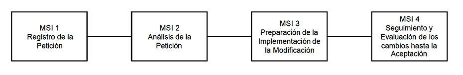
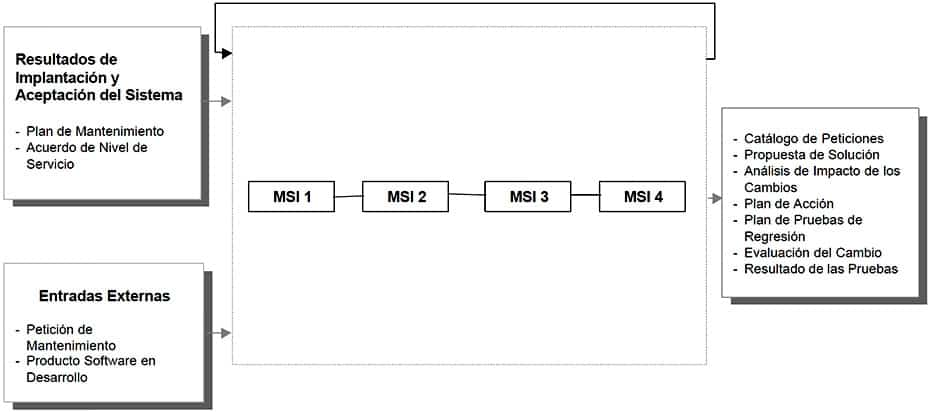

# Mantenimiento del Sistema de Información

El objetivo de este proceso es la obtención de una nueva versión de un sistema de información desarrollado con MÉTRICA Versión 3 ó Versión 2, a partir de las peticiones de mantenimiento que los usuarios realizan con motivo de un problema detectado en el sistema, o por la necesidad de una mejora del mismo.

En este proceso se realiza el registro de las peticiones de mantenimiento recibidas, con el fin de llevar el control de las mismas y de proporcionar, si fuera necesario, datos estadísticos de peticiones recibidas o atendidas en un determinado periodo, sistemas que se han visto afectados por los cambios, en qué medida y el tiempo empleado en la resolución de dichos cambios. Es recomendable, por lo tanto, llevar un catálogo de peticiones de mantenimiento sobre los sistemas de información, en el que se registren una serie de datos que nos permitan disponer de la información antes mencionada.

En el momento en el que se registra la petición, se procede a diagnosticar de qué tipo de mantenimiento se trata. Atendiendo a los fines, podemos establecer los siguientes tipos de mantenimiento:

    Correctivo: son aquellos cambios precisos para corregir errores del producto software.
    Evolutivo: son las incorporaciones, modificaciones y eliminaciones necesarias en un producto software para cubrir la expansión o cambio en las necesidades del usuario.
    Adaptativo: son las modificaciones que afectan a los entornos en los que el sistema opera, por ejemplo, cambios de configuración del hardware, software de base, gestores de base de datos, comunicaciones, etc.
    Perfectivo: son las acciones llevadas a cabo para mejorar la calidad interna de los sistemas en cualquiera de sus aspectos: reestructuración del código, definición más clara del sistema y optimización del rendimiento y eficiencia.

Estos dos últimos tipos quedan fuera del ámbito de MÉTRICA Versión 3 ya que requieren actividades y perfiles distintos de los del proceso de desarrollo.

Una vez registrada la petición e identificado el tipo de mantenimiento y su origen, se determina de quién es la responsabilidad de atender la petición. En el supuesto de que la petición sea remitida, se registra en el catálogo de peticiones de mantenimiento y continua el proceso. La petición puede ser denegada. En este caso, se notifica al usuario y acaba el proceso.

Posteriormente, según se trate de un mantenimiento correctivo o evolutivo, se verifica y reproduce el problema, o se estudia la viabilidad del cambio propuesto por el usuario. En ambos casos se estudia el alcance de la modificación. Hay que analizar las alternativas de solución identificando, según el tipo de mantenimiento de que se trate, cuál es la más adecuada. El plazo y urgencia de la solución a la petición se establece de acuerdo con el estudio anterior.

La definición de la solución incluye el estudio del impacto de la solución propuesta para la petición en los sistemas de información afectados. Mediante el análisis de dicho estudio, la persona encargada del Proceso de Mantenimiento valora el esfuerzo y coste necesario para la implementación de la modificación.

Las tareas de los procesos de desarrollo que va a ser necesario realizar son determinadas en función de los componentes del sistema actual afectados por la modificación. Estas tareas pertenecen a actividades de los procesos Análisis, Diseño, Construcción e Implantación.

Por último, y antes de la aceptación del usuario, es preciso establecer un plan de pruebas de regresión que asegure la integridad del sistema de información afectado.

La mejor forma de mantener el coste de mantenimiento bajo control es una gestión del Proceso de Mantenimiento efectiva y comprometida. Por lo tanto, es necesario registrar de forma disciplinada los cambios realizados en los sistemas de información y en su documentación. Esto repercutirá directamente en la mayor calidad de los sistemas resultantes.

La estructura propuesta para el Proceso de Mantenimiento de MÉTRICA Versión 3 comprende las siguientes actividades:

MANTENIMIENTO DE SISTEMAS DE INFORMACIÓN

### Actividad MSI 1: Registro de la Petición

El objetivo de esta actividad es establecer un sistema estandarizado de registro de información para las peticiones de mantenimiento, con el fin de controlar y canalizar los cambios propuestos por un usuario o cliente, mejorando el flujo de trabajo de la organización y proporcionando una gestión efectiva del mantenimiento.

Es importante asignar responsabilidades para evitar la realización de cambios que beneficien a un usuario, pero que produzcan un impacto negativo sobre otros muchos. Por tanto, es necesario que todas las peticiones de mantenimiento sean presentadas de una forma estandarizada, que permita su clasificación y facilite la identificación del tipo de mantenimiento requerido.

Una vez que la petición ha sido registrada, que ha determinado el tipo de mantenimiento y los sistemas de información a los que inicialmente puede afectar, se comprueba su viabilidad, de acuerdo a las prestaciones de mantenimiento establecidas para dichos sistemas de información.
TAREA 	PRODUCTOS 	TÉCNICAS Y PRÁCTICAS 	PARTICIPANTES
MSI 1.1: Registro de la Petición 	

    Catálogo de Peticiones

	

    Catalogación
    
    
    
    Responsable de Mantenimiento

MSI 1.2: Asignación de la Petición 	

    Catálogo de Peticiones:
        Aceptación / Rechazo de la Petición
        Asignación de Responsable

	

    Catalogación

	

    Responsable de Mantenimiento

#### MSI 1.1: Registro de la Petición

Tarea MSI 1.1: Registro de la Petición

Esta tarea tiene como objetivo registrar las peticiones que los usuarios solicitan con motivo de la detección de un problema o por la necesidad de una mejora. Se crea un catálogo que constituye un medio para la comunicación entre el usuario o cliente y el responsable de mantenimiento. Este catálogo servirá de base para abordar, en tareas posteriores, el análisis de la petición, realizar la modificación solicitada y proporcionar datos estadísticos sobre peticiones recibidas o atendidas.

La información que debe incluir dicho registro se determina de acuerdo a las normas o estándares existentes en la organización para la recepción de peticiones de mantenimiento. En el caso de un error se debe incluir una completa descripción de las circunstancias que llevaron al fallo, adjuntando datos de entrada, listados, o cualquier otro material de soporte que se considere oportuno. Para peticiones de mejora se debe remitir una especificación de los requisitos a contemplar.

En cualquier caso, será imprescindible recoger la identificación, origen y tipo de petición, asignarle una prioridad inicial e incorporar una descripción, lo más precisa posible, que facilite su posterior análisis.
Productos

De entrada

    Petición de Mantenimiento (externo)

De salida

    Catálogo de Peticiones

Prácticas

    Catalogación

Participantes

    Responsable del Mantenimiento

#### Tarea MSI 1.2: Asignación de la Petición

En esta tarea se determina el tipo de mantenimiento requerido por la petición catalogada, teniendo en cuenta toda la información que se ha registrado en la tarea anterior. Hay que identificar también los sistemas de información inicialmente afectados por petición.

A continuación, se comprueba que el servicio de mantenimiento, definido en el plan de mantenimiento para el sistema de información, cubre el tipo de mantenimiento que requiere la petición. Sobre la base de estos criterios, se acepta o rechaza la petición y se notifica a quién corresponda.

Si la petición es aceptada, se determina de quién es la responsabilidad de atender la solicitud para proceder a su estudio posterior.
Productos

De entrada

    Plan de Mantenimiento (IAS 7.2)
    Catálogo de Peticiones (MSI 1.1)

De salida

    Catálogo de Peticiones:
        Aceptación / Rechazo de la Petición
        Asignación de Responsable

Prácticas

    Catalogación

Participantes

    Responsable del Mantenimiento

### Actividad MSI 2: Análisis de la Petición

En esta actividad se lleva a cabo el diagnóstico y análisis del cambio para dar respuesta a las peticiones de mantenimiento que han sido aceptadas en la actividad anterior.

Se analiza el alcance de la petición en lo referente a los sistemas de información afectados, valorando hasta que punto pueden ser modificados en función del ciclo de vida estimado para los mismos y determinando la necesidad de desviar la petición hacia el proceso Estudio de Viabilidad del Sistema (EVS) o Análisis del Sistema de Información (ASI), en función del impacto sobre los sistemas de información afectados.

El enfoque de este estudio varía según el tipo de mantenimiento, teniendo en cuenta que en el caso de un mantenimiento correctivo que implique un error crítico debe abordarse el cambio de forma inmediata sin profundizar en el origen del mismo. No obstante, una vez reanudado el servicio, es imprescindible analizar el problema y determinar cuál es la solución definitiva.
TAREA 	PRODUCTOS 	TÉCNICAS Y PRÁCTICAS 	PARTICIPANTES
MSI 2.1: Verificación y Estudio de la Petición 	

    Catálogo de Peticiones:
        Verificación de la Petición
    Resultado del Estudio de la Petición

	

    Sesiones de trabajo
    Catalogación

	

    Equipo de Mantenimiento

MSI 2.2: Estudio de la Propuesta de Solución 	

    Propuesta de Solución
    Catálogo de Peticiones:
        Estudio del Impacto
        Aceptación / Rechazo de la Solución

	
    Sesiones de trabajo
    Catalogación
    Responsable de Mantenimiento
    Equipo de Mantenimiento

#### Tarea MSI 2.1: Verificación y Estudio de la Petición

Antes de iniciar el estudio de la petición, se verifica que la información registrada es correcta. Para determinar su validez:

    Si se trata de un mantenimiento correctivo, se debe reproducir el problema.
    En el caso de un mantenimiento evolutivo, hay que comprobar que la petición es razonable o factible.

Una vez examinada la petición comienza su estudio, que será diferente en función del tipo de mantenimiento establecido:

    Si se trata de una petición de mantenimiento correctivo, y según el acuerdo de nivel de servicio establecido para los sistemas de información afectados, se evalúa hasta qué punto es crítico el problema. Así es posible determinar si la solución es a corto plazo, es decir, urgente o inmediata, o si es a medio o a largo plazo:
        Si el problema es crítico, su análisis y solución comienza inmediatamente con el fin de reanudar rápidamente el nivel de servicio. Sin embargo, este modo de actuación no elimina la necesidad de una revisión posterior del problema para valorar los posibles efectos secundarios, establecer una solución definitiva y actualizar todos los productos implicados.
        Si no es crítico, la petición se clasifica para proceder en la tarea siguiente a determinar cuál es la solución más adecuada.
    En el caso de un mantenimiento evolutivo se delimita su alcance determinando si se trata de una modificación a los sistemas de información inicialmente afectados o de una incorporación para cubrir nuevas funcionalidades no contempladas hasta el momento en dichos sistemas de información.

Productos

De entrada

    Catálogo de Peticiones (MSI 1.2)
    Acuerdo de Nivel de Servicio (IAS 8.3)

De salida

    Catálogo de Peticiones:
        Verificación de la Petición.
    Resultado del Estudio de la Petición

Prácticas

    Sesiones de trabajo
    Catalogación

Participantes

    Equipo de Mantenimiento

#### Tarea MSI 2.2: Estudio de la Propuesta de Solución

A partir del catálogo de peticiones, y para cada una de ellas, se estima su alcance valorando la prioridad inicialmente asignada, de acuerdo a los requisitos planteados. A continuación, se analiza la relación entre peticiones. Se decide cuáles pueden abordarse de forma conjunta asignando, si procede, una prioridad global a los grupos identificados y determinando en qué secuencia deben implementarse los cambios.

Asimismo, es necesario concretar los requisitos solicitados para cada petición y analizar con más detalle los sistemas de información implicados, valorando las características de mantenimiento de los mismos y la cantidad de cambios sufridos desde su puesta en producción.

También se debe comprobar la existencia de otras peticiones en curso que afecten a los mismos sistemas de información, evaluando la repercusión que puede tener la realización de la petición de mantenimiento sobre estos cambios o desarrollos y analizar su convivencia. Además, se analiza el impacto que la modificación puede provocar en el entorno tecnológico y en los niveles de servicio inicialmente acordados para cada uno de los sistemas de información, valorando hasta que punto pueden verse comprometidos.

En el caso de una petición de mantenimiento evolutivo, se estudia cómo atenderla teniendo en cuenta la política de versiones vigente en ese momento. Si se trata de una incorporación o eliminación, se determina la necesidad de llevar a cabo algunas actividades del proceso Análisis del Sistema de Información de modo previo a la identificación de los elementos afectados.

Igualmente, se puede tomar la decisión de abordar el proceso Estudio de Viabilidad del Sistema atendiendo a los requisitos a cubrir, al alcance de la modificación, a las implicaciones en el entorno tecnológico, y al ciclo de vida estimado para los sistemas de información afectados, así como a la existencia de opciones de mercado más idóneas.

En el caso de peticiones de mantenimiento correctivo que hayan precisado de una solución de emergencia, no se darán por cerradas hasta que, o bien se compruebe que con dicha solución el sistema no se ha visto comprometido ni tampoco otros sistemas relacionados con él, o bien que después de haber aplicado una solución a corto/medio plazo y realizadas las pruebas pertinentes, el sistema conserva su integridad y operatividad. Por tanto, una vez que se ha reanudado el servicio, hay que realizar las restantes actividades para detectar el origen del problema y asegurar que los cambios introducidos no generan otros de mayor envergadura o comprometen el correcto funcionamiento de otros sistemas de información relacionados.

En cualquiera de las situaciones anteriores, se hace una estimación preliminar del esfuerzo requerido mediante los indicadores establecidos en el acuerdo de nivel de servicio para cada sistema de información, según la tecnología aplicada, naturaleza y tamaño del sistema de información y los tipos de lenguajes utilizados, bases de datos, etc.

Por último, si se considera necesario, hay que proponer alternativas de solución para dar respuesta de forma satisfactoria a los requisitos planteados o problemas detectados, determinando una fecha límite de implantación y un coste aproximado en función de la estimación realizada anteriormente. Se elige, junto con el usuario, la solución más adecuada, y se obtiene la aprobación o rechazo de la petición. En caso de rechazo, la petición se da por cerrada en el catálogo.
Productos

De entrada

    Plan de Mantenimiento (IAS 7.2)
    Acuerdo de Nivel de Servicio (IAS 8.3)
    Catálogo de Peticiones (MSI 2.1)
    Resultado del Estudio de la Petición (MSI 2.1)

De salida

    Propuesta de Solución
    Catálogo de Peticiones:
        Estudio del Impacto
        Aceptación / Rechazo de la Solución

Prácticas

    Sesiones de trabajo
    Catalogación

Participantes

    Responsable de Mantenimiento
    Equipo de Mantenimiento

### Actividad MSI 3: Preparación de la Implementación de la Modificación

Una vez finalizado el estudio previo de la petición y aprobada su implementación, se pasa a identificar de forma detallada cada uno de los elementos afectados por el cambio mediante el análisis de impacto. Este análisis tiene como objetivo determinar qué parte del sistema de información se ve afectada, y en qué medida, dejando claramente definido y documentado qué componentes hay que modificar, tanto de software como de hardware.

Con el resultado de este análisis se dispone de los datos cuantitativos sobre los que aplicar los indicadores establecidos. Esto permitirá fijar un plan de acción, valorando la necesidad de realizar un reajuste de dichos indicadores, con el fin de cumplir el plazo máximo de entrega.

Una vez aceptado el plan de acción, se activan los correspondientes procesos de desarrollo para llevar a cabo la implementación de la solución. Al mismo tiempo, se especifican las pruebas de regresión con el fin de evitar el efecto onda en el sistema, una vez realizados los cambios.
TAREA 	PRODUCTOS 	TÉCNICAS Y PRÁCTICAS 	PARTICIPANTES
MSI 3.1: Identificación de Elementos Afectados 	

    Catálogo de Peticiones:
        Elementos Afectados
    Análisis de Impacto de los Cambios

	

    Catalogación
    Análisis de Impacto

	

    Equipo de Mantenimiento
    Jefe de Proyecto

MSI 3.2: Establecimiento del Plan de Acción 	

    Catálogo de Peticiones:
        Actividades y Tareas de los Procesos de Desarrollo a Realizar
    Plan de Acción para la Modificación

	

    Planificación
    Catalogación

	

    Responsable de Mantenimiento
    Equipo de Mantenimiento
    Jefe de Proyecto

MSI 3.3: Especificación del Plan de Pruebas de Regresión 	

    Plan de Pruebas de Regresión

		

    Equipo de Mantenimiento
    Jefe de Proyecto

#### Tarea MSI 3.1: Identificación de Elementos Afectados

Se realiza un análisis detallado del impacto de la petición, con el fin de conocer el alcance real de la modificación en función del número, características y relaciones existentes entre los elementos afectados. De esta manera se puede establecer una secuencia y planificación correcta del desarrollo de los cambios, valorando los recursos necesarios para llevarlo a cabo. En el caso de un mantenimiento evolutivo que implique una incorporación o eliminación, el alcance real de la modificación se determina después de realizar el proceso Análisis del Sistema de Información, según se indicó en la actividad anterior.

Por tanto, a partir del resultado del estudio obtenido en la actividad anterior, se identifica cada sistema de información afectado creando argumentos de búsqueda para determinar qué elementos y en qué medida están implicados en el proceso de cambio.

En este análisis quedarán reflejados, de la forma que se considere más conveniente, los elementos de la infraestructura tecnológica (hardware, software de base, comunicaciones, etc.) y los elementos asociados a los productos software implicados en cada petición (modelos, pantallas, informes, módulos, programas fuentes, programas objetos, JCL´s, archivos de datos, manuales de usuario, manuales de explotación…), así como las referencias cruzadas. La asociación de elementos a cada petición, permitirá el control de la gestión del cambio sobre un mismo elemento.
Productos

De entrada

    Catálogo de Peticiones (MSI 2.2)
    Propuesta de Solución (MSI 2.2)

De salida

    Catálogo de Peticiones:
        Elementos Afectados
    Análisis de Impacto de los Cambios

Prácticas

    Catalogación
    Análisis de Impacto

Participantes

    Equipo de Mantenimiento
    Jefe de Proyecto

#### Tarea MSI 3.2: Establecimiento del Plan de Acción

Se identifican las actividades y tareas de los procesos de desarrollo Estudio de Viabilidad del Sistema, Análisis del Sistema de Información, Diseño del Sistema de Información, Construcción del Sistema de Información e Implantación y Aceptación del Sistema que es preciso realizar, en función de las características, complejidad y alcance de la petición estudiada, así como del plan de mantenimiento establecido para los sistemas de información implicados.

Una vez delimitado el alcance del plan de acción, se aplican los indicadores establecidos para el conjunto de componentes afectados, realizando los reajustes que oportunos. Se establece un plan de trabajo en el que se determina el coste asociado, los plazos estimados para su implementación con las fechas de comienzo y fin, y la composición del equipo de trabajo inicial necesario, teniendo en cuenta el alcance de la modificación, el nivel de esfuerzo requerido y el plan de trabajo establecido.

Finalmente, se definen puntos de control que permiten hacer un seguimiento del plan de trabajo durante la implementación de la modificación, determinando con qué frecuencia y en que situaciones se llevará a cabo.

Una vez aprobado el plan de acción y asignados los recursos, se lleva a cabo su inicio.
Productos

De entrada

    Plan de Mantenimiento (IAS 7.2)
    Propuesta de Solución (MSI 2.2)
    Análisis de Impacto de los Cambios (MSI 3.1)
    Catálogo de Peticiones (MSI 3.1)

De salida

    Catálogo de Peticiones:
        Actividades y Tareas de los Procesos de Desarrollo a Realizar
    Plan de Acción para la Modificación

Técnicas

    Planificación

Prácticas

    Catalogación

Participantes

    Responsable de Mantenimiento
    Equipo de Mantenimiento
    Jefe de Proyecto

#### Tarea MSI 3.3: Especificación del Plan de Pruebas de Regresión

Las pruebas de regresión tratan de eliminar el llamado efecto onda, es decir, que los cambios provocados por una petición no introduzcan un comportamiento no deseado o errores adicionales en otros componentes no modificados. Por tanto, es necesario comprobar que los cambios que se lleven a cabo en los componentes afectados, no produzcan estos efectos sobre el mismo u otros componentes.

Con este objetivo se deben especificar los casos de prueba en función de las relaciones existentes entre los distintos componentes identificados en la tarea Identificación de Elementos Afectados (MSI 3.1). De esta forma, los casos de prueba aseguran que la nueva versión satisface las necesidades planteadas al considerar, a su vez, los sistemas de información que no han sido modificados pero están directamente relacionados con ellos y, en consecuencia, pueden verse afectados.
Productos

De entrada

    Propuesta de Solución (MSI 2.2)
    Análisis de Impacto de los Cambios (MSI 3.1)
    Catálogo de Peticiones (MSI 3.2)

De salida

    Plan de Pruebas de Regresión

Participantes

    Equipo de Mantenimiento
    Jefe de Proyecto

### Actividad MSI 4: Seguimiento y Evaluación de los Cambios hasta la Aceptación

#### Tarea MSI 4.1: Seguimiento de los Cambios

Se hace el seguimiento del plan de acción de acuerdo a los puntos de control establecidos en la actividad anterior.

Se realiza el seguimiento de los cambios necesarios en los componentes de cada sistema de información afectado, así como en los productos asociados, siguiendo las actividades correspondientes a los procesos de Análisis, Diseño, Construcción e Implantación identificadas en la actividad anterior.

Asimismo, se lleva a cabo el control de la planificación establecida, que abarca los siguientes aspectos:

    Realizar la traza de los cambios que la petición ha provocado a lo largo de los procesos de desarrollo implicados.
    Verificar que se han realizado satisfactoriamente las pruebas unitarias, de integración y del sistema que se consideraron necesarias para los componentes a modificar.
    Comprobar que sólo se ha modificado lo establecido y, en caso contrario, justificar el motivo.
    Asegurar que se han actualizado los productos correspondientes.
    Llevar el control de los distintos desarrollos existentes en paralelo sobre un mismo componente, con el fin de coordinar las modificaciones incluidas en cada uno de ellos, y asegurar que en el paso a producción se implantan correctamente.

Productos

De entrada

    Producto Software en Desarrollo (externo, procedente de los procesos de desarrollo)
    Análisis de Impacto de los Cambios (MSI 3.1) (convivencia de distintas versiones)
    Plan de Acción para la Modificación (MSI 3.2)

De salida

    Evaluación del Cambio

Participantes

    Equipo de Mantenimiento
    Responsable de Mantenimiento
    Jefe de Proyecto

#### Tarea MSI 4.2: Realización de las Pruebas de Regresión

Una vez finalizadas las actividades correspondientes al proceso de construcción, se realizan las pruebas de regresión definidas en la actividad anterior con el objeto de asegurar que ningún sistema de información implicado en el cambio ve comprometido su funcionamiento normal.

En el caso de detectarse problemas, se elabora un informe que recoge las incidencias y se remite a quién proceda para que tome las medidas correctivas que considere oportunas.

Finalmente, una vez que el comportamiento es correcto, se documenta el resultado global de la evaluación de las pruebas que incluye la aprobación por parte del responsable de mantenimiento.
Productos

De entrada

    Plan de Pruebas de Regresión (MSI 3.3)
    Producto Software en Desarrollo (externo)

De salida

    Resultado de las Pruebas de Regresión
    Evaluación del Resultado de las Pruebas de Regresión

Prácticas

    Pruebas de Regresión

Participantes

    Responsable de Mantenimiento
    Equipo de Mantenimiento
    Jefe de Proyecto

#### Tarea MSI 4.3: Aprobación y Cierre de la Petición

Se aprueba formalmente la finalización de la petición de mantenimiento de acuerdo a los resultados obtenidos en la tarea anterior. Se actualiza el catálogo de peticiones registrando el cierre de la petición tratada.

Asimismo, para llevar un control del coste y al mismo tiempo evaluar la facilidad de mantenimiento, es conveniente registrar datos cuantitativos relativos al tiempo empleado en el análisis de la petición, en el estudio del impacto, resolución del cambio, recursos empleados, etc.

El registro de este tipo de información proporciona una base cuantitativa sobre la que tomar decisiones relativas a la eficacia de las técnicas y procedimientos de mantenimiento.
Productos

De entrada

    Catálogo de Peticiones (MSI 3.2)
    Plan de Pruebas de Regresión (MSI 3.3)
    Evaluación del Cambio (MSI 4.1)
    Evaluación del Resultado de las Pruebas de Regresión (MSI 4.2)

De salida

    Catálogo de Peticiones:
        Nueva versión y Aprobación

Prácticas

    Catalogación

Participantes

    Directores de los Usuarios
    Responsable de Mantenimiento

## PARTICIPANTES EN LAS ACTIVIDADES DEL PROCESO MSI

MANTENIMIENTO DEL SISTEMA DE INFORMACIÓN 	ACTIVIDADES
MSI 1 	MSI 2 	MSI 3 	MSI 4
Directores Usuarios 				X
Equipo de Mantenimiento 		X 	X 	X
Jefe de Proyecto 			X 	X
Responsable Mantenimiento 	X 	X 	X 	X
TÉCNICAS/PRÁCTICAS UTILIZADAS EN LAS ACTIVIDADES DEL PROCESO MSI
MANTENIMIENTO DEL SISTEMA DE INFORMACIÓN 	ACTIVIDADES
MSI 1 	MSI 2 	MSI 3 	MSI 4
Análisis de Impacto 			X 	X
Catalogación 	X 	X 	X 	X
Planificación 			X 	
Pruebas de Regresión 				X
Sesiones de Trabajo 		X 	

## Actividades

    Actividad MSI 1: Registro de la Petición
    Actividad MSI 2: Análisis de la Petición
    Actividad MSI 3: Preparación de la Implementación de la Modificación
    Actividad MSI 4: Seguimiento y Evaluación de los Cambios hasta la Aceptación

