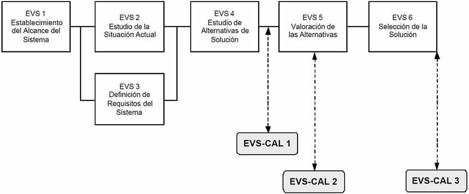
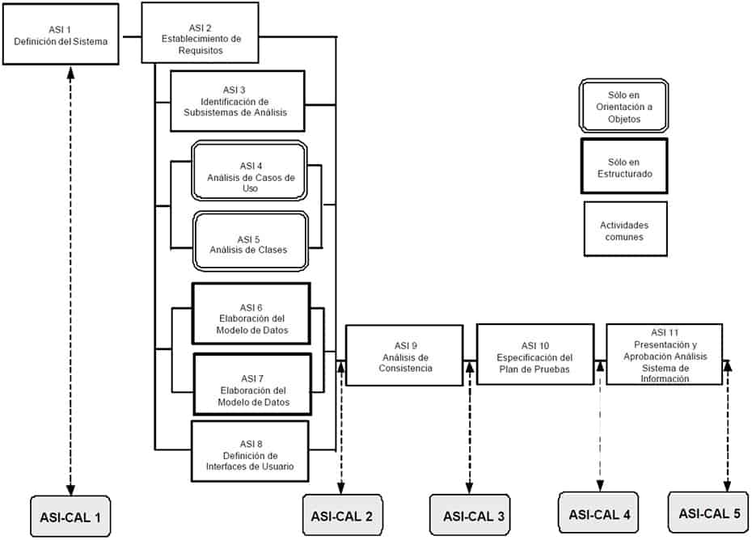

# Aseguramiento de la Calidad

## Descripción y objetivos

El objetivo de la interfaz de Aseguramiento de la Calidad de MÉTRICA Versión 3 es proporcionar un marco común de referencia para la definición y puesta en marcha de planes específicos de aseguramiento de calidad aplicables a proyectos concretos. Si en la organización ya existe un sistema de calidad, dichos planes deberán ser coherentes con el mismo, completándolo en los aspectos no contemplados relativos a normas particulares del cliente, usuario o sistema concreto.

La calidad se define como “**grado en que un conjunto de características inherentes cumple con unos requisitos**” [ISO 9000:2000]. El Aseguramiento de la Calidad pretende dar confianza en que el producto reune las características necesarias para satisfacer todos los requisitos del Sistema de Información.

Por tanto, para asegurar la calidad de los productos resultantes el equipo de calidad deberá realizar un conjunto de actividades que servirán para:

    Reducir, eliminar y lo más importante, prevenir las deficiencias de calidad de los productos a obtener.
    Alcanzar una razonable confianza en que las prestaciones y servicios esperados por el cliente o el usuario queden satisfechas.

Para conseguir estos objetivos, es necesario desarrollar un plan de aseguramiento de calidad específico que se aplicará durante la planificación del proyecto de acuerdo a la estrategia de desarrollo adoptada en la gestión del proyecto. En el plan de aseguramiento de calidad se reflejan las actividades de calidad a realizar (normales o extraordinarias), los estándares a aplicar, los productos a revisar, los procedimientos a seguir en la obtención de los distintos productos durante el desarrollo en MÉTRICA Versión 3 y la normativa para informar de los defectos detectados a sus responsables y realizar el seguimiento de los mismos hasta su corrección.

El grupo de aseguramiento de calidad participa en la revisión de los productos seleccionados para determinar si son conformes o no a los procedimientos, normas o criterios especificados, siendo totalmente independiente del equipo de desarrollo. Las actividades a realizar por el grupo de aseguramiento de calidad vienen gobernadas por el plan. Sus funciones están dirigidas a:

    Identificar las posibles desviaciones en los estándares aplicados, así como en los requisitos y procedimientos especificados.
    Comprobar que se han llevado a cabo las medidas preventivas o correctoras necesarias.

Las revisiones son una de las actividades más importantes del aseguramiento de la calidad, debido a que permiten eliminar defectos lo más pronto posible, cuando son menos costosos de corregir. Además existen procedimientos extraordinarios, como las auditorías, aplicables en desarrollos singulares y en el transcurso de las cuales se revisarán tanto las actividades de desarrollo como las propias de aseguramiento de calidad. La detección anticipada de errores evita el que se propaguen a los restantes procesos de desarrollo, reduciendo substancialmente el esfuerzo invertido en los mismos. En este sentido es importante destacar que el establecimiento del plan de aseguramiento de calidad comienza en el Estudio de Viabilidad del Sistema y se aplica a lo largo de todo el desarrollo, en los procesos de Análisis, Diseño, Construcción, Implantación y Aceptación del Sistema y en su posterior Mantenimiento.
Actividades

ESTUDIO DE VIABILIDAD DEL SISTEMA

    Actividad EVS-CAL 1: Identificación de las Propiedades de Calidad par el Sistema
    Actividad EVS-CAL 2: Establecimiento del Plan de Aseguramiento de Calidad
    Actividad EVS-CAL 3: Adecuación del Plan de Aseguramiento de Calidad a la Solución

ANÁLISIS DEL SISTEMA DE INFORMACIÓN

    Actividad ASI-CAL 1: Especificación Inicial del Plan de Aseguramiento de Calidad
    Actividad ASI-CAL 2: Especificación Detallada del Plan de Aseguramiento de Calidad
    Actividad ASI-CAL 3: Revisión del Análisis de Consistencia
    Actividad ASI-CAL 4: Revisión del Plan de Pruebas
    Actividad ASI-CAL 5: Registro de la Aprobación del Análisis del Sistema

DISEÑO DEL SISTEMA DE INFORMACIÓN

    Actividad DSI-CAL 1: Revisión de la Verificación de la Arquitectura del Sistema
    Actividad DSI-CAL 2: Revisión de la Especificación Técnica del Plan de Pruebas
    Actividad DSI-CAL 3: Revisión de los Requisitos de Implantación
    Actividad DSI-CAL 4: Registro de la Aprobación del Diseño del Sistema de Información

CONSTRUCCIÓN DEL SISTEMA DE INFORMACIÓN

    Actividad CSI-CAL 1: Revisión del Código de Componentes y Procedimientos
    Actividad CSI-CAL 2: Revisión de las Pruebas Unitarias, de Integración y del Sistema
    Actividad CSI-CAL 3: Revisión de los Manuales de Usuario
    Actividad CSI-CAL 4: Revisión de la Formación a Usuarios Finales
    Actividad CSI-CAL 5: Registro de la Aprobación del Sistema de Información

IMPLANTACIÓN Y ACEPTACIÓN DEL SISTEMA

    Actividad IAS-CAL 1: Revisión del Plan de Implantación del Sistema
    Actividad IAS-CAL 2: Revisión de las Pruebas de Implantación del Sistema
    Actividad IAS-CAL 3: Revisión de las Pruebas de Aceptación del Sistema
    Actividad IAS-CAL 4: Revisión del Plan de Mantenimiento del Sistema
    Actividad IAS-CAL 5: Registro de la Aprobación de la Implantación del Sistema

MANTENIMIENTO DEL SISTEMA DE INFORMACIÓN

    Actividad MSI-CAL 1: Revisión del Mantenimiento del Sistema de Información
    Actividad MSI-CAL 2: Revisión del Plan de Pruebas de Regresión
    Actividad MSI-CAL 3: Revisión de la Realización de las Prueba de Regresión

## Estudio de viabilidad del sistema

En este proceso el grupo de aseguramiento de calidad inicia el estudio de los sistemas de información definidos en cada alternativa de solución propuesta, con el fin de identificar las condiciones en que se van a desarrollar y/o a implantar, así como las características que deben reunir en cuanto a operación, mantenibilidad y portabilidad, para satisfacer las necesidades del cliente y los requisitos especificados.

La necesidad de establecer un plan específico de aseguramiento de calidad y el grado de intensidad con el que se aplican las actuaciones de calidad, vendrá determinada en función de este estudio y de los riesgos analizados por el equipo de desarrollo.

Una vez tomada la decisión de llevar a cabo un plan de aseguramiento de calidad en las alternativas propuestas, se define el contenido de dicho plan, de acuerdo a los estándares de calidad, si existen en la organización, sino se recomienda acudir a los estándares *UNE-EN-ISO 9001:2000 Sistemas de Gestión de la Calidad – Requisitos y UNE-EN-ISO 9000:2000 Sistemas de Gestión de la Calidad – Fundamentos y vocabulario*. El plan de aseguramiento de calidad debe cubrir todas las necesidades establecidas de modo que, aquellas normas impuestas por los usuarios o clientes que difieran de las existentes en el sistema de calidad, deben quedar también reflejadas en el plan.

El siguiente esquema muestra la correspondencia entre las actividades del proceso EVS y las de la interfaz de Aseguramiento de la Calidad.

### Actividad EVS-CAL 1: Identificación de las Propiedades de Calidad para el Sistema

TAREA 	PRODUCTOS 	TÉCNICAS Y PRÁCTICAS 	PARTICIPANTES
EVS-CAL 1.1: Constitución del Equipo de Aseguramiento de Calidad 	

    Equipo de aseguramiento de calidad
    Plan de acción

	

    Sesiones de trabajo
    Planificación

	

    Grupo de Aseguramiento de la Calidad
    Jefe de Proyecto

EVS-CAL 1.2: Determinación de los Sistemas de Información objeto de Aseguramiento de Calidad 	

    Sistemas de Información objeto de aseguramiento de calidad

	

    Sesiones de trabajo

	

    Grupo de Aseguramiento de la Calidad
    Jefe de Proyecto

EVS-CAL 1.3: Identificación de las Propiedades de Calidad 	

    Sistemas de Información objeto de aseguramiento de calidad
        Propiedades de calidad

	

    Sesiones de trabajo

	

    Grupo de Aseguramiento de la Calidad
    Jefe de Proyecto

#### Tarea EVS-CAL 1.1: Constitución del Equipo de Aseguramiento de Calidad

Se constituye el equipo de trabajo inicial necesario para determinar y valorar la conveniencia de establecer un plan de aseguramiento de calidad para las alternativas de solución propuestas y se fija un plan de acción.
Productos

De entrada

    Recursos disponibles (externo)

De salida

    Equipo de aseguramiento de calidad
    Plan de acción

Técnicas

    Planificación

Prácticas

    Sesiones de Trabajo

Participantes

    Grupo de Aseguramiento de la Calidad
    Jefe de Proyecto

#### Tarea EVS-CAL 1.2: Determinación de los Sistemas de Información objeto de Aseguramiento de Calidad

Para cada alternativa de solución propuesta se determina qué sistemas de información van a estar afectados por un plan de aseguramiento de calidad. Para ello se pueden considerar varios criterios relativos a las características que reúna el sistema, como pueden ser:

    Un período de vida largo.
    Sujeto a cambios constantes.
    Equipo de trabajo heterogéneo en el desarrollo del sistema.
    Operación continua.
    Alta disponibilidad.
    Fuerte interacción con otros sistemas.
    Portabilidad.

Productos

De entrada

    Equipo de aseguramiento de calidad
    Alternativas de solución a estudiar (EVS 4.2)

De salida

    Sistemas de Información objeto de aseguramiento de calidad

Prácticas

    Sesiones de Trabajo

Participantes

    Grupo de Aseguramiento de la Calidad
    Jefe de Proyecto

#### Tarea EVS-CAL 1.3: Identificación de las Propiedades de Calidad

Una vez identificados para cada alternativa propuesta los sistemas de información, se definen para cada uno de ellos aquellas propiedades que permitan evaluar la calidad en cuanto a las características de operación, facilidad de mantenimiento y adaptabilidad a nuevos entornos. Algunas de estas propiedades pueden ser, por ejemplo, la facilidad de uso, eficiencia, seguridad, portabilidad, integridad y fiabilidad.
Productos

De entrada

    Sistemas de Información objeto de aseguramiento de calidad (EVS-CAL 1.2)

De salida

    Sistemas de Información objeto de aseguramiento de calidad:
        Propiedades de calidad

Prácticas

    Sesiones de Trabajo

Participantes

    Grupo de Aseguramiento de la Calidad
    Jefe de Proyecto

### Actividad EVS-CAL 2: Establecimiento del Plan de Aseguramiento de Calidad

TAREA 	PRODUCTOS 	TÉCNICAS Y PRÁCTICAS 	PARTICIPANTES
EVS-CAL 2.1: Necesidad del Plan de Aseguramiento de Calidad para las Alternativas Propuestas 	

    Sistemas de Información objeto de aseguramiento de calidad
        Necesidad de un plan de aseguramiento de calidad

	

    Sesiones de trabajo

	

    Grupo de Aseguramiento de la Calidad

EVS-CAL 2.2: Alcance del Plan de Aseguramiento de Calidad 	

    Plan de aseguramiento de calidad de cada alternativa

	

    Sesiones de trabajo

	

    Grupo de Aseguramiento de la Calidad

EVS-CAL 2.3: Impacto en el Coste del Sistema 	

    Valoración de alternativas
        Coste del plan de aseguramiento de calidad

	

    Análisis coste/beneficio
    Grupo de Aseguramiento de la Calidad
    Jefe de Proyecto

#### Tarea EVS-CAL 2.1: Necesidad del Plan de Aseguramiento de Calidad para las Alternativas Propuestas

Se determina la necesidad de incluir un plan de aseguramiento de calidad en las alternativas propuestas teniendo en cuenta el análisis de riesgos y el enfoque del plan de trabajo establecido en la actividad Valoración de las Alternativas (EVS 5), así como las propiedades de calidad establecidas, para cada sistema de información objeto de aseguramiento de calidad, en la tarea Identificación de las Propiedades de Calidad (EVS-CAL 1.3).
Productos

De entrada

    Valoración de alternativas (EVS 5.2)
    Plan de trabajo de cada alternativa (EVS 5.3)
    Necesidad de aseguramiento de calidad (EVS-CAL 1.3)

De salida

    Sistemas de Información objeto de aseguramiento de calidad:
        Necesidad de un plan de aseguramiento de calidad

Prácticas

    Sesiones de Trabajo

Participantes

    Grupo de Aseguramiento de la Calidad

#### Tarea EVS-CAL 2.2: Alcance del Plan de Aseguramiento de Calidad

Si en la organización existe un sistema de calidad, se realiza una valoración de las directrices generales establecidas en el mismo, con el fin de proceder a su adaptación al plan de aseguramiento de calidad específico de cada sistema de información implicado, con el que se deben cubrir las propiedades de calidad identificadas anteriormente.

En algunos casos puede ser necesario reflejar en el plan de aseguramiento de calidad ciertas normas que difieran en mayor o menor medida de las establecidas en el sistema de calidad. El contenido del plan de aseguramiento de calidad se fijará de acuerdo a los estándares del sistema de calidad, si existen, y en cualquier caso se incluirán aspectos tales como:

    Propósito y alcance del plan en términos de propiedades de calidad.
    Objetivos.
    Actividades y tareas relacionadas con el aseguramiento de calidad a realizar a lo largo del desarrollo del software y responsabilidades.
    Productos mínimos exigibles de ingeniería del software.
    Estándares, prácticas y normas aplicables durante el desarrollo del software.
    Tipos de revisiones, verificaciones y validaciones que se van a llevar a cabo, así como los responsables de su realización.
    Criterios para la aceptación o rechazo de cada producto resultante de un proceso.
    Procedimientos para implementar acciones correctoras o preventivas y realizar su seguimiento, identificando responsables.
    Métodos para la salvaguarda y mantenimiento de la documentación obtenida en las actividades de aseguramiento de calidad..

Productos

De entrada

    Sistema de calidad existente en la organización (externo)
    Necesidad de aseguramiento de calidad (EVS-CAL 2.1)

De salida

    Plan de aseguramiento de calidad de cada alternativa

Prácticas

    Sesiones de Trabajo

Participantes

    Grupo de Aseguramiento de la Calidad

#### Tarea EVS-CAL 2.3: Impacto en el Coste del Sistema

Una vez identificada la necesidad de un plan de aseguramiento de calidad y definido su alcance, se establece el coste adicional asociado a cada sistema de información en las alternativas propuestas, con el fin de aportar esta información al coste total del sistema y en consecuencia determinar su viabilidad económica.

Este coste aporta la información necesaria para poder valorar globalmente cada alternativa de solución y determinar su viabilidad en el caso de que sea necesario un plan de aseguramiento de calidad.
Productos

De entrada

    Plan de aseguramiento de calidad (EVS-CAL 2.2)
    Valoración de alternativas (EVS 5.1)

De salida

    Valoración de alternativas:
        Coste del plan de aseguramiento de calidad

Técnicas

    Análisis Coste/Beneficio

Participantes

    Grupo de Aseguramiento de la Calidad
    Jefe de Proyecto

### Actividad EVS-CAL 3: Adecuación del Plan de Aseguramiento de Calidad a la Solución

TAREA 	PRODUCTOS 	TÉCNICAS Y PRÁCTICAS 	PARTICIPANTES
EVS-CAL 3.1: Ajuste del Plan de Aseguramiento de Calidad 	

    Plan de aseguramiento de calidad de la alternativa elegida

	

    Sesiones de trabajo

	

    Grupo de Aseguramiento de la Calidad
    Jefe de Proyecto

EVS-CAL 3.2: Aprobación del Plan de Aseguramiento de Calidad 	

    Registro de aprobación / rechazo

		

    Grupo de Aseguramiento de la Calidad

#### Tarea EVS-CAL 3.1

Una vez ponderadas las dificultades económicas, técnicas, etc. que surjan como consecuencia de incluir un plan de aseguramiento de calidad en la solución seleccionada, puede ser necesario modificar el enfoque de algunas de las propiedades de calidad y el modo en que se les da respuesta, recogiendo estas variaciones en el plan de aseguramiento de calidad.
Productos

De entrada

    Plan de Aseguramiento de Calidad (EVS-CAL 2.2)
    Solución propuesta (EVS 6.2)

De salida

    Plan de aseguramiento de calidad para la alternativa elegida

Prácticas

    Sesiones de Trabajo

Participantes

    Grupo de Aseguramiento de la Calidad
    Jefe de Proyecto

#### Tarea EVS-CAL 3.2

Se registra la aprobación del plan de aseguramiento de calidad asociado a cada sistema de información que conforman la solución seleccionada. En caso de rechazo se incluirá el motivo.
Productos

De entrada

    Aprobación de la solución (EVS 6.3)
    Plan de aseguramiento de calidad (EVS-CAL 3.1)

De salida

    Registro de aprobación/rechazo del Plan de Aseguramiento de Calidad

Participantes

    Grupo de Aseguramiento de la Calidad

## Análisis del sistema de información

En este proceso se define de forma detallada el plan de aseguramiento de calidad para un sistema de información, a partir de la especificación resultante del proceso Estudio de Viabilidad del Sistema (EVS).

También se detallan los estándares y normas a cumplir, las revisiones a llevar a cabo y sobre qué productos, así como los procedimientos y mecanismos necesarios para resolver los problemas que surjan, definiendo las acciones preventivas o correctoras para su posterior corrección e identificando quiénes son los responsables en cada caso.

En el proceso Análisis del Sistema de Información (ASI), el grupo de aseguramiento de calidad se implica directamente en la revisión de los siguientes productos:

    Catálogo de requisitos, comprobando hasta que punto se han definido de una forma que facilite su comprensión y seguimiento.
    Modelos resultantes del análisis, asegurando que se han verificado y validado y que se ha realizado la trazabilidad de requisitos.
    Plan de pruebas, comprobando que se han tenido en cuenta en su definición los criterios establecidos en el plan de aseguramiento de calidad, con el fin de facilitar en los procesos Diseño del Sistema de Información (DSI), Construcción del Sistema de Información (CSI) e Implantación y Aceptación del Sistema (IAS) la revisión de los distintos niveles de prueba.

### Actividad ASI-CAL 1: Especificación Inicial del Plan de Aseguramiento de Calidad
#### Tarea ASI-CAL 1.1
### Actividad ASI-CAL 2: Especificación Detallada del Plan de Aseguramiento de Calidad
#### Tarea ASI-CAL 2.1
### Actividad ASI-CAL 3: Revisión del Análisis de Consistencia
#### Tarea ASI-CAL 3.1
#### Tarea ASI-CAL 3.2
### Actividad ASI-CAL 4: Revisión del Plan de Pruebas
#### Tarea ASI-CAL 4.1
#### Actividad ASI-CAL 5: Registro de la Aprobación del Análisis del Sistema
#### Tarea ASI-CAL 5.1

## Diseño del sistema de información

### Actividad DSI-CAL 1: Revisión de la Verificación de la Arquitectura del Sistema
#### Tarea DSI-CAL 1.1
#### Tarea DSI-CAL 1.2
### Actividad DSI-CAL 2: Revisión de la Especificación Técnica del Plan de Pruebas
#### Tarea DSI-CAL 2.1
#### Tarea DSI-CAL 2.2
### Actividad DSI-CAL 3: Revisión de los Requisitos de Implantación
#### Tarea DSI-CAL 3.1
#### Tarea DSI-CAL 3.2
### Actividad DSI-CAL 4: Registro de la Aprobación del Diseño del Sistema de Información
#### Tarea DSI-CAL 4.1

## Construcción del sistema de información

### Actividad CSI-CAL 1: Revisión del Código de Componentes y Procedimientos
#### Tarea CSI-CAL 1.1
### Actividad CSI-CAL 2: Revisión de las Pruebas Unitarias, de Integración y del Sistema
#### Tarea CSI-CAL 2.1
#### Tarea CSI-CAL 2.2
#### Tarea CSI-CAL 2.3
### Actividad CSI-CAL 3: Revisión de los Manuales de Usuario
#### Tarea CSI-CAL 3.1
### Actividad CSI-CAL 4: Revisión de la Formación a Usuarios Finales
#### Tarea CSI-CAL 4.1
### Actividad CSI-CAL 5: Registro de la Aprobación del Sistema de Información
#### Tarea CSI-CAL 5.1

## Implantación y aceptación del sistema

### Actividad IAS-CAL 1: Revisión del Plan de Implantación del Sistema
#### Tarea IAS-CAL 1.1
### Actividad IAS-CAL 2: Revisión de las Pruebas de Implantación del Sistema
#### Tarea IAS-CAL 2.1
#### Tarea IAS-CAL 2.2
### Actividad IAS-CAL 3: Revisión de las Pruebas de Aceptación del Sistema
#### Tarea IAS-CAL 3.1
#### Tarea IAS-CAL 3.2
### Actividad IAS-CAL 4: Revisión del Plan de Mantenimiento del Sistema
#### Tarea IAS-CAL 4.1
### Actividad IAS-CAL 5: Registro de la Aprobación de la Implantación del Sistema
#### Tarea IAS-CAL 5.1

## Mantenimineto del sistema de información

### Actividad MSI-CAL 1: Revisión del Mantenimiento del Sistema de Información
#### Tarea MSI-CAL 1.1
### Actividad MSI-CAL 2: Revisión del Plan de Pruebas de Regresión
#### Tarea MSI-CAL 2.1
### Actividad MSI-CAL 3: Revisión de la Realización de las Pruebas de Regresión
#### Tarea MSI-CAL 3.1

