# Técnicas

## Introducción

El objetivo de este documento es describir las técnicas utilizadas en los procesos principales y en el proceso de Gestión de Proyectos.

En el proceso de Desarrollo de Sistemas de Información se incluyen tanto las técnicas propias de un desarrollo orientado a objetos como estructurado, ya que las actividades de ambas aproximaciones están integradas en una estructura común.

La metodología MÉTRICA Versión 3 proporciona un conjunto de métodos y técnicas que guía a los distintos profesionales de Sistemas y Tecnologías de la Información y Comunicaciones (STIC) en la obtención de los diversos productos de los procesos del ciclo de vida de un proyecto informático. Con el fin de mejorar la productividad de los distintos participantes y asegurar la calidad de los productos resultantes, la mayoría de las técnicas propuestas están soportadas por herramientas disponibles en el mercado que automatizan en mayor o menor grado su utilización. En cualquier caso, no todos los productos resultantes de cada tarea son susceptibles de obtenerse de forma automatizada.

Se hace una distinción entre técnicas y prácticas en función del propósito al que respondan. Se considera técnica al conjunto de heurísticas y procedimientos que se apoyan en estándares, es decir, que utilizan una o varias notaciones específicas en términos de sintaxis y semántica y cumplen unos criterios de calidad en cuanto a la forma de obtención del producto asociado. Las prácticas representan un medio para la consecución de unos objetivos específicos de manera rápida, segura y precisa, sin necesidad de cumplir unos criterios o reglas preestablecidas.

Para cada una de las técnicas y prácticas referenciadas en el documento se explica brevemente el objetivo que se persigue al utilizarlas. Se describen: los elementos básicos asociados y los principios fundamentales de elaboración; la notación utilizada, en el caso de técnicas gráficas, para la representación de cada uno de los elementos implicados. En los capítulos finales se incluye el soporte que ofrecen las herramientas del mercado actualmente para las técnicas y las referencias bibliográficas que permitan, a aquellos profesionales que lo deseen, profundizar en un mayor nivel de detalle.

Por continuidad con MÉTRICA Versión 2.1 la notación empleada es la misma para aquellas técnicas que son comunes en ambas versiones. En el caso de desarrollos orientados a objetos se ha seguido la notación de UML.

Es importante resaltar que la notación que se propone en la aplicación de la técnica en ningún caso se considerará obligatoria. Cada organización podrá utilizar la notación que desee, la que suele utilizar o la que ofrecen sus herramientas de desarrollo, respetando las reglas y restricciones específicas de las distintas técnicas.

## Técnicas de desarrollo

Las técnicas de desarrollo son un conjunto de procedimientos que se basan en reglas y notaciones específicas en términos de sintaxis, semántica y gráficos, orientadas a la obtención de productos en el desarrollo de un sistema de información. En desarrollos del tipo estructurado o de orientación a objetos merecen especial atención las técnicas gráficas, que proponen símbolos y notaciones estándares para una mejor comprensión de los sistemas o sus componentes. De todos modos, y debido a la diversidad existente, las notaciones aquí propuestas no se consideran obligatorias en la metodología MÉTRICA Versión 3, pero sí que se deben aplicar rigurosamente sus reglas y validaciones para conseguir el objetivo propuesto con la mayor eficacia.

Análisis Coste/Beneficio
Casos de Uso
Diagrama de Clases
Diagrama de Componentes
Diagrama de Descomposición
Diagrama de Despliegue
Diagrama de Estructura
Diagrama de Flujo de Datos
Diagrama de Interacción

    Diagrama de Secuencia
    Diagrama de Colaboración

Diagrama de Paquetes
Diagrama de Transición de Estados
Modelado de Procesos de la Organización

    SADT (Structured Analysis and Design Technique)

Modelo Entidad/Relación Extendido
Normalización
Optimización
Reglas de Obtención del Modelo Físico a partir del Lógico
Reglas de Transformación
Técnicas Matriciales

### Análisis Coste/Beneficio

La técnica de análisis coste/beneficio tiene como objetivo fundamental proporcionar una medida de los costes en que se incurre en la realización de un proyecto y comparar dichos costes previstos con los beneficios esperados de la realización de dicho proyecto. Esta medida o estimación servirá para:

    Valorar la necesidad y oportunidad de acometer la realización del proyecto.
    Seleccionar la alternativa más beneficiosa para la realización del proyecto.
    Estimar adecuadamente los recursos económicos necesarios en el plazo de realización del proyecto.

Es de destacar la necesidad cada vez mayor de guiarse por criterios económicos y no sólo técnicos para la planificación de trabajos y proyectos. Por ello se hace una primera introducción sobre las técnicas y métodos de evaluación de conceptos económicos, con el fin de proporcionar a los profesionales criterios que les ayuden en la planificación de proyectos y evaluación de alternativas.
Conceptos

Punto de amortización (Break-Even Point)

Es el momento en el tiempo en que el conjunto de beneficios obtenidos por la explotación del nuevo sistema iguala al conjunto de costes de todo tipo que ha ocasionado. A partir del punto de amortización (Break-Even Point), el sistema entra en fase de aportar beneficios netos a la organización.

Periodo de amortización (PayBack)

Es el periodo de tiempo que transcurre desde que los costes son máximos hasta que se alcanza el punto de amortización (Break-Even Point), es decir, en cuanto el sistema empieza a aportar beneficios. Cuanto menor sea el periodo de amortización (Payback) de un Sistema, más atractivo será para la organización acometer su implantación.

Retorno de la Inversión – ROI (Return of Investment)

Es el rendimiento de la inversión expresada en términos de porcentaje. Se calcula mediante la fórmula siguiente:

ROI = 100 x (Beneficio Neto Anual – Coste Desarrollo Anualizado) / Inversión Promedio

Siendo:

Beneficio Neto Anual: Es la ganancia que aporta el sistema como consecuencia de su uso, es decir los beneficios obtenidos más los gastos no incurridos. Deben restársele los gastos operacionales anuales y los de mantenimiento del sistema.

Coste Desarrollo Anualizado: Total del gasto inicial de desarrollo del sistema, dividido por los años que se supone que va a ser operativo.

Inversión Promedio: Total de la inversión realizada (costes de desarrollo, hardware, software, etc.) dividido por el total de conceptos en los que se invierte.

Descripción

Para la realización del análisis coste/beneficio se seguirán los siguientes pasos:

    Producir estimaciones de costes/beneficios.
    Determinar la viabilidad del proyecto y su aceptación.

1. PRODUCIR ESTIMACIONES DE COSTES-BENEFICIOS

Se realizará una lista de todo lo que es necesario para implementar el sistema y una lista de los beneficios esperados del nuevo sistema.

En general, los costes suelen ser medibles y estimables en unidades económicas, no así los beneficios, los cuales pueden ser tangibles o no tangibles. En un análisis de costes y beneficios se deben considerar aquellos aspectos tangibles, es decir, medibles en valores como dinero, tiempo, etc., y no tangibles, es decir, no ponderables de una forma objetiva.

Entre los beneficios no tangibles pueden estar:

    El aumento de cuentas debido a un mejor servicio a los clientes.
    La mejora en la toma de decisiones debido a una mejora en el soporte informático.

La valoración de los beneficios no tangibles se debe estimar de una forma subjetiva y será realizada por las áreas correspondientes.

A menudo es conveniente desglosar los costes estimados a lo largo del proyecto, para ofrecer una información más detallada de la distribución de los recursos de cara a la dirección.

En la estimación de costes se considerarán, entre otros, los siguientes aspectos:

    Adquisición de hardware y software: El que sea preciso para el desarrollo, implantación y normal funcionamiento del sistema. Se debe considerar la saturación de máquinas o sistemas actuales como consecuencia de la entrada en vigor del nuevo sistema.
    Gastos de mantenimiento de hardware y software anteriores.
    Gastos de comunicaciones: Líneas, teléfono, correo, etc.
    Gastos de instalación: Cableado, acondicionamiento de sala, recursos humanos y materiales, gastos de viaje, etc.
    Coste de desarrollo del sistema.
    Gastos del mantenimiento del sistema: Coste anual.
    Gastos de consultoría: En caso de requerirse algún consultor externo en cualquier etapa del proyecto.
    Gastos de formación: De todo tipo (Desarrolladores, Operadores, Implantadores, Usuario Final, etc.).
    Gastos de material: Papel, toner, etc.
    Costes derivados de la curva de aprendizaje: De todo el personal involucrado: Desarrolladores, Técnicos de Sistemas, Operadores, y desde luego, Usuarios.
    Costes financieros, de publicidad, etc.

En la estimación de beneficios se pueden considerar cuestiones como las siguientes:

    Incremento de la productividad: Ahorro o mejor utilización de recursos humanos.
    Ahorro de gastos de mantenimiento del sistema actual.
    Ahorros de adquisición y mantenimiento de hardware y software, o reutilización de plataformas sustituidas.
    Incremento de ventas o resultados, disminución de costes: Producidos por una mejora de la gestión (rotación de stock, «just in time», analítica de clientes, etc.).
    Ahorro de material de todo tipo: Sustituido por datos electrónicos que proporciona el sistema, como por ejemplo: papel, correo, etc.
    Beneficios financieros.
    Otros beneficios tangibles: Ahorro de recursos externos, consultoría, formación, etc.
    Beneficios intangibles: Incremento de la calidad del producto o servicio, mejora de la imagen de la compañía, mejora en la atención al cliente, mejora en la explotación, etc.

2. DETERMINAR LA VIABILIDAD DEL PROYECTO

Se basará en uno de los métodos siguientes:

Retorno de la Inversión:

Este método consiste en calcular el coste y el beneficio anual, conociendo el coste total al inicio del proyecto «C0”, para determinar en qué año se recupera el coste total inicialmente estimado.
AÑO 	COSTE 	BENEFICIO 	BENEFICIO NETO
0 	C0 	0 	
1 	C1 	B1 	B1 – C1
2 	C2 	B2 	B2 – C2
… 			
n 	Cn 	Bn 	Bn – Cn

El año de recuperación de la inversión se produce cuando ∑ Beneficio Neto = C0.

Valor Actual:

Este método permite tener en cuenta que un gasto invertido durante un cierto tiempo produce un beneficio.

El método consiste en determinar el dinero que es viable invertir inicialmente para que se recupere la inversión en un periodo de tiempo definido previamente.

El resultado depende del tipo de interés (r) utilizado en la evaluación.

Se debe calcular, en primer lugar, el beneficio neto que se obtendrá cada año. Dicho beneficio no es real, ya que se debe estimar el valor real de dicha cantidad en el año n.

Para ello se aplica la fórmula:

Valor Actual = Beneficio neto / (1 + r/100)n    siendo n = año 1,..,i

Se debe estudiar en cuántos años se recupera la inversión realizada inicialmente, o bien, si en un periodo de años fijado previamente se retorna la inversión y, por tanto, es viable el proyecto.

Si la inversión es el C0, se determinará la viabilidad del proyecto consultando la siguiente tabla:

AÑO 	COSTE 	BENEFICIO 	VALOR ACTUAL
0 	C0 		
1 	C1 	B1 	V.A1 = (B1 – C1) / (1 + r / 100)
2 	C2 	B2 	V.A2 = (B2 – C2) / (1 + r / 100) 2
… 			
n 	Cn 	Bn 	V.An = (Bn – Cn) / (1 + r / 100) n

El proyecto será viable si ∑ VAi > C0 a lo largo del periodo fijado.

### Casos de Uso {#casos-de-uso}

Los objetivos de los casos de uso son los siguientes:

* Capturar los requisitos funcionales del sistema y expresarlos desde el punto de vista del usuario.
* Guiar todo el proceso de desarrollo del sistema de información.

Los casos de uso proporcionan, por tanto, un modo claro y preciso de comunicación entre cliente y desarrollador. Desde el punto de vista del cliente proporcionan una visión de “caja negra” del sistema, esto es, cómo aparece el sistema desde el exterior sin necesidad de entrar en los detalles de su construcción. Para los desarrolladores, suponen el punto de partida y el eje sobre el que se apoya todo el desarrollo del sistema en sus procesos de análisis y diseño.

### Descripción {.unnumbered .unlisted}

Un caso de uso es una secuencia de acciones realizadas por el sistema, que producen un resultado observable y valioso para un usuario en particular, es decir, representa el comportamiento del sistema con el fin de dar respuestas a los usuarios.

Aquellos casos de uso que resulten demasiado complejos se pueden descomponer en un segundo nivel, en el que los nuevos casos de uso que intervengan resulten más sencillos y manejables.

Para especificar este comportamiento existen una serie de recomendaciones o técnicas que se aplican dependiendo del momento del desarrollo que se esté y de la complejidad del caso de uso. Puede ser desde una simple descripción textual que recoja un requisito funcional a una especificación del caso de uso, e incluso un conjunto de diagramas:

#### Especificación de un caso de uso {.unnumbered .unlisted}

Un caso de uso recoge, en un primer momento, una descripción general. Esta descripción reflejará posiblemente uno o varios requisitos funcionales del sistema o formará parte de algún requisito.

Se puede completar la descripción definiendo cuáles son las precondiciones y postcondiciones del sistema, es decir, qué condiciones deben cumplirse para que se realice un caso de uso y cuáles son aquellas condiciones que se cumplen posteriormente al caso de uso.

También se pueden enumerar los diferentes escenarios del caso de uso si los tuviese y dar una breve descripción de ellos. Los escenarios son los distintos caminos por los que puede evolucionar un caso de uso, dependiendo de las condiciones que se van dando en su realización.

#### Diagrama de casos de uso {.unnumbered .unlisted}

Estos diagramas presentan dos tipos de elementos fundamentales:

* *Actores*. Un actor es algo o alguien que se encuentra fuera del sistema y que interactúa con él. En general, los actores serán los usuarios del sistema y los sistemas externos al que se esté desarrollando. Si se habla de usuarios, un actor es el papel que puede llevar a cabo en cuanto a su forma de interactuar con el sistema, es decir, un único actor puede representar a muchos usuarios diferentes y de la misma forma, un usuario puede actuar como actores diferentes.
* *Casos de uso*. Un caso de uso representa el comportamiento que ofrece el sistema de información desde el punto de vista del usuario. Típicamente será un conjunto de transacciones ejecutadas entre el sistema y los actores. Para facilitar la comprensión de los casos de uso del sistema de información en el análisis, es posible agruparlos en paquetes según funcionalidades semejantes o relacionadas.

Además de estos elementos, un diagrama de casos de uso presenta relaciones. Las relaciones pueden tener lugar entre actores y casos de uso o entre casos de uso.

La relación entre un actor y un caso de uso es una relación de comunicación, que indica que un actor interviene en el caso de uso. Normalmente, el actor aporta información para la realización de un caso de uso o recibe información como resultado de la realización del mismo, por ello, esta relación puede ser unidireccional o bidireccional, aunque generalmente se muestra como bidireccional, ya que no es necesario especificar en detalle estas relaciones.

La relación entre casos de uso es una relación unidireccional. Esta relación puede presentar uno de los dos siguientes tipos: “usa” y “extiende”.

* La relación “usa” se utiliza cuando se quiere reflejar un comportamiento común en varios casos de uso. Es decir, si los casos de uso A y B presentan una parte común, ésta se puede sacar a un tercer caso de uso C. Entonces, habrá una relación “usa” del caso de uso A al C y otra del B al C.

  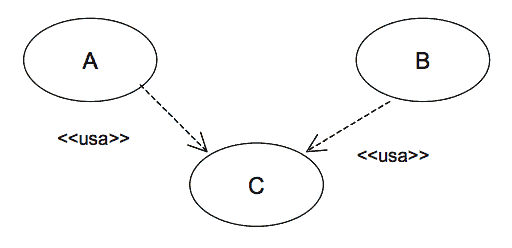

* La relación “extiende” se utiliza cuando se quiere reflejar un comportamiento opcional de un caso de uso. Por ejemplo, se tiene el caso de uso A que representa un comportamiento habitual del sistema. Sin embargo, dependiendo de algún factor, este caso de uso puede presentar un comportamiento adicional o ligeramente diferente, que se podría reflejar en un caso de uso B. En este caso, habrá una relación “extiende” del caso de uso B al A.

  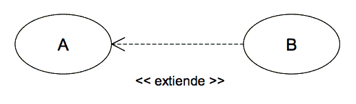

#### Notación {.unnumbered .unlisted}

El diagrama de casos de uso es un grafo de actores, casos de uso y las relaciones entre estos elementos.

Opcionalmente, los casos de uso se pueden enmarcar en un cuadrado que representa los límites del sistema.

##### Caso de Uso {.unnumbered .unlisted}

Un caso de uso se representa mediante una elipse con el nombre del caso de uso dentro o debajo.

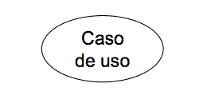

##### Actor {.unnumbered .unlisted}

Un actor se representa con una figura de ‘hombre de palo’ con el nombre del actor debajo de la figura.

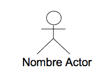

##### Relación {.unnumbered .unlisted}

Dependiendo del tipo de relación, la representación en los diagramas será distinta. Así pues, las relaciones entre un actor y un caso de uso se representan mediante una línea continua entre ellos. Las relaciones entre casos de uso se representan con una flecha discontinua con el nombre del tipo de relación como etiqueta. En las relaciones “extensión” la flecha parte del caso de uso con el comportamiento adicional hacia aquel que recoge el comportamiento básico y en las relaciones “usa” desde el caso de uso básico hacia el que representa el comportamiento común.

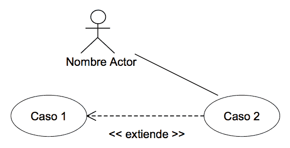

Paquete

Un paquete se representa con un icono con forma de carpeta y con el nombre colocado en la ‘pestaña’. Los paquetes también pueden formar diagramas que complementen al diagrama de casos de uso (ver [Diagrama de paquetes](#diagrama-de-paquetes)).

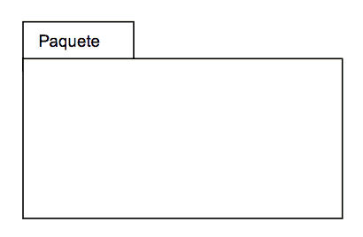

(Nota.- Esta notación es la más habitual, pero MÉTRICA Versión 3 no exige su utilización).

#### Ejemplo {.unnumbered .unlisted}

Estudio de una aplicación que se encarga de la gestión de los préstamos y reservas de libros y revistas en una biblioteca.

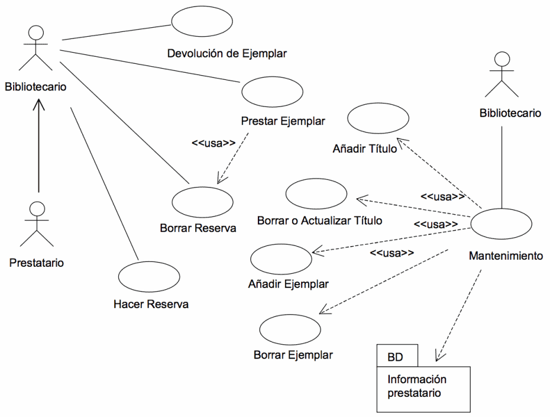

### Diagrama de Clases

El objetivo principal de este modelo es la representación de los aspectos estáticos del sistema, utilizando diversos mecanismos de abstracción (clasificación, generalización, agregación).
Descripción

El diagrama de clases recoge las clases de objetos y sus asociaciones. En este diagrama se representa la estructura y el comportamiento de cada uno de los objetos del sistema y sus relaciones con los demás objetos, pero no muestra información temporal.

Con el fin de facilitar la comprensión del diagrama, se pueden incluir paquetes como elementos del mismo, donde cada uno de ellos agrupa un conjunto de clases.

Este diagrama no refleja los comportamientos temporales de las clases, aunque para mostrarlos se puede utilizar un diagrama de transición de estados, otra de las técnicas propuestas en MÉTRICA Versión 3.

Los elementos básicos del diagrama son:

Clases

Una clase describe un conjunto de objetos con propiedades (atributos) similares y un comportamiento común. Los objetos son instancias de las clases.

No existe un procedimiento inmediato que permita localizar las clases del diagrama de clases. Éstas suelen corresponderse con sustantivos que hacen referencia al ámbito del sistema de información y que se encuentran en los documentos de las especificaciones de requisitos y los casos de uso.

Dentro de la estructura de una clase se definen los atributos y las operaciones o métodos:

    Los atributos de una clase representan los datos asociados a los objetos instanciados por esa clase.
    Las operaciones o métodos representan las funciones o procesos propios de los objetos de una clase, caracterizando a dichos objetos.

El diagrama de clases permite representar clases abstractas. Una Clase abstracta es una clase que no puede existir en la realidad, pero que es útil conceptualmente para el diseño del modelo orientado a objetos. Las clases abstractas no son instanciables directamente sino en sus descendientes. Una clase abstracta suele ser situada en la jerarquía de clases en una posición que le permita ser un depósito de métodos y atributos para ser compartidos o heredados por las subclases de nivel inferior.

Las clases y en general todos los elementos de los diagramas, pueden estar clasificados de acuerdo a varios criterios, como por ejemplo su objetivo dentro de un programa. Esta clasificación adicional se expresa mediante un Estereotipo. Algunos de los autores de métodos OO, establecen una clasificación de todos los objetos que pueden aparecer en un modelo. Los tipos son:

    Objetos Entidad.
    Objetos límite o interfaz.
    Objetos de control.

Éstos son estereotipos de clases. Un estereotipo representa una la meta-clasificación de un elemento.

Dependiendo de la herramienta utilizada, también se puede añadir información adicional a las clases para mostrar otras propiedades de las mismas, como son las reglas de negocio, responsabilidades, manejo de eventos, excepciones, etc.

Relaciones

Los tipos más importantes de relaciones estáticas entre clases son los siguientes:

    Asociación. Las relaciones de asociación representan un conjunto de enlaces entre objetos o instancias de clases. Es el tipo de relación más general, y denota básicamente una dependencia semántica. Por ejemplo, una Persona trabaja para una Empresa.
    Cada asociación puede presentar elementos adicionales que doten de mayor detalle al tipo de relación:
        Rol, o nombre de la asociación, que describe la semántica de la relación en el sentido indicado. Por ejemplo, la asociación entre Persona y Empresa recibe el nombre de trabaja para, como rol en ese sentido.
        Multiplicidad, que describe la cardinalidad de la relación, es decir, especifica cuántas instancias de una clase están asociadas a una instancia de la otra clase. Los tipos de multiplicidad son: Uno a uno, uno a muchos y muchos a muchos.
    Herencia. Las jerarquías de generalización/especialización se conocen como herencia. Herencia es el mecanismo que permite a una clase de objetos incorporar atributos y métodos de otra clase, añadiéndolos a los que ya posee. Con la herencia se refleja una relación “es_un” entre clases. La clase de la cual se hereda se denomina superclase, y la que hereda subclase.
    La generalización define una superclase a partir de otras. Por ejemplo, de las clases profesor y estudiante se obtiene la superclase persona. La especialización o especificación es la operación inversa, y en ella una clase se descompone en una o varias subclases. Por ejemplo, de la clase empleado se pueden obtener las subclases secretaria, técnico e ingeniero.
    Agregación. La agregación es un tipo de relación jerárquica entre un objeto que representa la totalidad de ese objeto y las partes que lo componen. Permite el agrupamiento físico de estructuras relacionadas lógicamente. Los objetos “son-parte-de” otro objeto completo. Por ejemplo, motor, ruedas, carrocería son parte de automóvil.
    Composición. La composición es una forma de agregación donde la relación de propiedad es más fuerte, e incluso coinciden los tiempos de vida del objeto completo y las partes que lo componen. Por ejemplo, en un sistema de Máquina de café, las relaciones entre la clase máquina y producto, o entre máquina y depósito de monedas, son de composición.
    Dependencia. Una relación de dependencia se utiliza entre dos clases o entre una clase y una interfaz, e indica que una clase requiere de otra para proporcionar alguno de sus servicios.

Interfaces

Una interfaz es una especificación de la semántica de un conjunto de operaciones de una clase o paquete que son visibles desde otras clases o paquetes. Normalmente, se corresponde con una parte del comportamiento del elemento que la proporciona.

Paquetes

Los paquetes se usan para dividir el modelo de clases del sistema de información, agrupando clases u otros paquetes según los criterios que sean oportunos. Las dependencias entre ellos se definen a partir de las relaciones establecidas entre los distintos elementos que se agrupan en estos paquetes (ver Diagrama de paquetes).
Notación

Clases

Una clase se representa como una caja, separada en tres zonas por líneas horizontales.

En la zona superior se muestra el nombre de la clase y propiedades generales como el estereotipo. El nombre de la clase aparece centrado y si la clase es abstracta se representa en cursiva. El estereotipo, si se muestra, se sitúa sobre el nombre y entre el símbolo: << .... >>.

La zona central contiene una lista de atributos, uno en cada línea. La notación utilizada para representarlos incluye, dependiendo del detalle, el nombre del atributo, su tipo y su valor por defecto, con el formato:

visibilidad nombre : tipo = valor-inicial { propiedades }

La visibilidad será en general publica (+), privada (-) o protegida (#), aunque puede haber otros tipos de visibilidad dependiendo del lenguaje de programación empleado.

En la zona inferior se incluye una lista con las operaciones que proporciona la clase. Cada operación aparece en una línea con formato:

visibilidad nombre (lista-de-parámetros): tipo-devuelto { propiedad }

La visibilidad será en general publica (+), privada (-) o protegida (#), aunque como con los atributos, puede haber otros tipos de visibilidad dependiendo del lenguaje de programación. La lista de parámetros es una lista con los parámetros recibidos en la operación separados por comas. El formato de un parámetro es:

nombre : tipo = valor-por-defecto

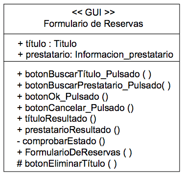

La notación especificada se puede simplificar según el nivel de detalle con el que se quiera trabajar en un momento dado.

Relaciones

Una relación de asociación se representa como una línea continua entre las clases asociadas. En una relación de asociación, ambos extremos de la línea pueden conectar con la misma clase, indicando que una instancia de una clase, está asociada a otras instancias de la misma clase, lo que se conoce como asociación reflexiva.

La relación puede tener un nombre y un estereotipo, que se colocan junto a la línea. El nombre suele corresponderse con expresiones verbales presentes en las especificaciones, y define la semántica de la asociación. Los estereotipos permiten clasificar las relaciones en familias y se escribirán entre el símbolo: << ... >>.

Las diferentes propiedades de la relación se pueden representar con la siguiente notación:

    Multiplicidad: La multiplicidad puede ser un número concreto, un rango o una colección de números. La letra ‘n’ y el símbolo ‘*’ representan cualquier número.
    Orden: Se puede especificar si las instancias guardan un orden con la palabra clave ‘{ordered}’. Si el modelo es suficientemente detallado, se puede incluir una restricción que indique el criterio de ordenación.
    Navegabilidad: La navegación desde una clase a la otra se representa poniendo una flecha sin relleno en el extremo de la línea, indicando el sentido de la navegación.
    Rol o nombre de la asociación: Este nombre se coloca junto al extremo de la línea que esta unida a una clase, para expresar cómo esa clase hace uso de la otra clase con la que mantiene la asociación.

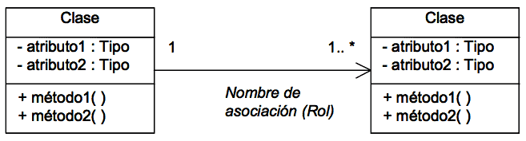

Además, existen notaciones específicas para los otros tipos de relación, como son:

    Agregación: Se representa con un rombo hueco en la clase cuya instancia es una agregación de las instancias de la otra.
    Composición: Se representa con un rombo lleno en la clase cuya instancia contiene las instancias de la otra clase.
    Dependencia: Una línea discontinua con una flecha apuntando a la clase cliente. La relación puede tener un estereotipo que se coloca junto a la línea, y entre el símbolo: << ... >>.
    Herencia: Esta relación se representa como una línea continua con una flecha hueca en el extremo que apunta a la superclase.

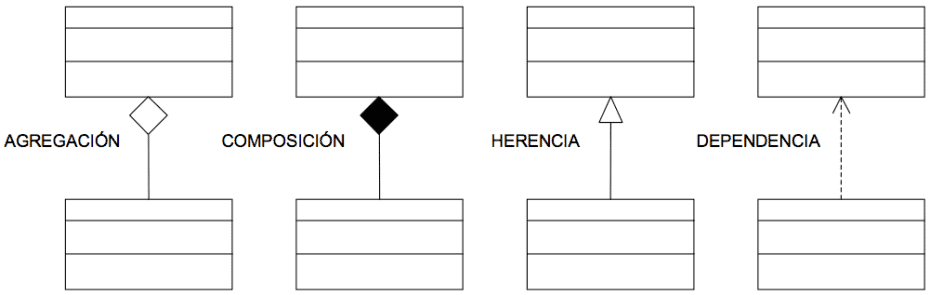

Interfaces

Una interfaz se representa como una caja con compartimentos, igual que las clases. En la zona superior se incluye el nombre y el estereotipo <>. La lista de operaciones se coloca en la zona inferior, igual que en las representaciones de clases. La zona en la que se listan los atributos estará vacía o puede omitirse.

Existe una representación más simple para la interfaz: un círculo pequeño asociado a una clase con el nombre de la interfaz debajo. Las operaciones de la interfaz no aparecen en esta representación; si se quiere que aparezcan, debe usarse la primera notación.

Entre una clase que implementa las operaciones que una interfaz ofrece y esa interfaz se establece una relación de realización que, dependiendo de la notación elegida, se representará con una línea continua entre ellas cuando la interfaz se representa como un círculo y con una flecha hueca discontinua apuntando a la interfaz cuando se represente como una clase.

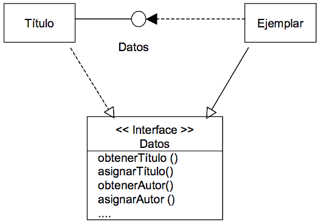

Paquetes

Los paquetes se representan mediante un icono con forma de carpeta y las dependencias con flechas discontinuas entre los paquetes dependientes (ver Diagrama de paquetes).
Ejemplo

Estudio del sistema encargado de la gestión de préstamos y reservas de libros y revistas de una biblioteca. Dependiendo del momento del desarrollo el diagrama estará más o menos detallado. Así, el diagrama tendría la siguiente estructura en el proceso de análisis:

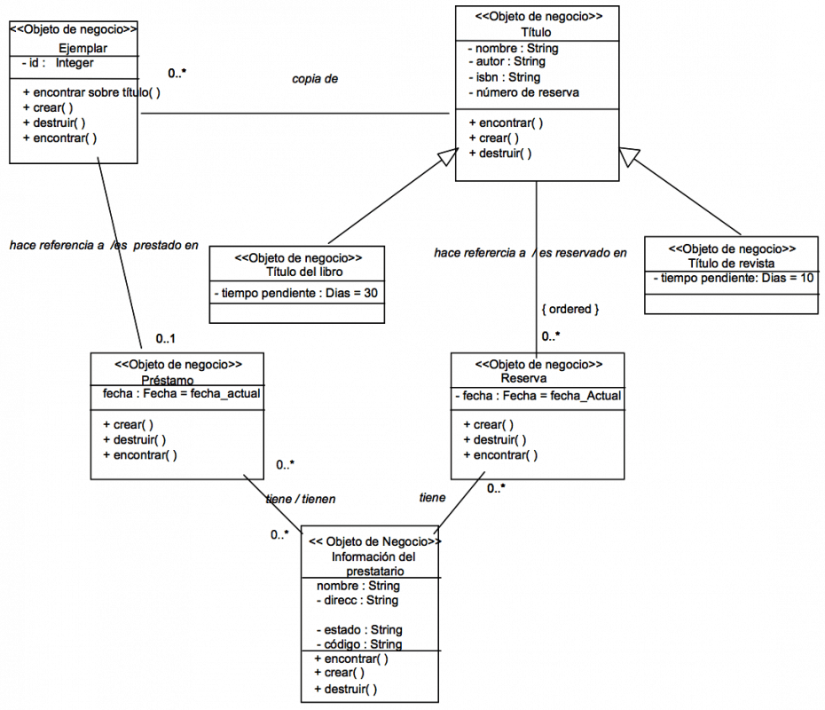

(Nota.- Esta notación es la más habitual, pero MÉTRICA Versión 3 no exige su utilización).

### Diagrama de Componentes

El diagrama de componentes proporciona una visión física de la construcción del sistema de información. Muestra la organización de los componentes software, sus interfaces y las dependencias entre ellos.
Descripción

Como ya se ha indicado, los elementos de estos diagramas son los componentes software y las dependencias entre ellos.

Un componente es un módulo de software que puede ser código fuente, código binario, un ejecutable, o una librería con una interfaz definida. Una interfaz establece las operaciones externas de un componente, las cuales determinan una parte del comportamiento del mismo. Además se representan las dependencias entre componentes o entre un componente y la interfaz de otro, es decir uno de ellos usa los servicios o facilidades del otro.

Estos diagramas pueden incluir paquetes que permiten organizar la construcción del sistema de información en subsistemas y que recogen aspectos prácticos relacionados con la secuencia de compilación entre componentes, la agrupación de elementos en librerías, etc.
Notación

Componente

Un componente se representa como un rectángulo, con dos pequeños rectángulos superpuestos perpendicularmente en el lado izquierdo.

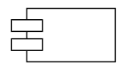

Para distinguir distintos tipos de componentes se les puede asignar un estereotipo, cuyo nombre estará dentro del símbolo: << ... >>

Interfaz

Se representa como un pequeño círculo situado junto al componente que lo implementa y unido a él por una línea continua. La interfaz puede tener un nombre que se escribe junto al círculo. Un componente puede proporcionar más de una interfaz.

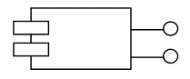

Paquete

Un paquete se representa con un icono de carpeta (ver Diagrama de Paquetes).

Relación de dependencia

Una relación de dependencia se representa mediante una línea discontinua con una flecha que apunta al componente o interfaz que provee del servicio o facilidad al otro. La relación puede tener un estereotipo que se coloca junto a la línea, entre el símbolo: <<...>>

Ejemplo

Sistema encargado de la gestión de los préstamos y reservas de libros y revistas en una biblioteca. El lenguaje de desarrollo será Java, y los accesos a la información del prestatario serán mediante un paquete de Base de Datos.

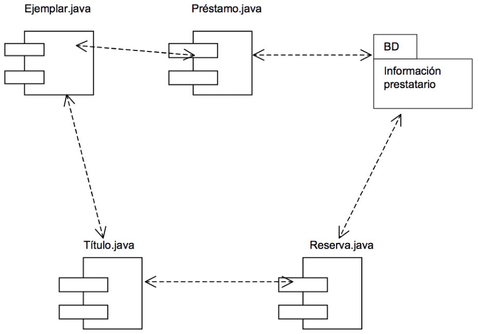

(Nota.- Esta notación es la más habitual, pero MÉTRICA Versión 3 no exige su utilización).

### Diagrama de Descomposición

El objetivo del diagrama de descomposición es representar la estructura jerárquica de un dominio concreto.
Descripción

La técnica es una estructura por niveles que se lee de arriba abajo y de izquierda a derecha, donde cada elemento se puede descomponer en otros de nivel inferior y puede ser descrito con el fin de aclarar su contenido.

El diagrama de descomposición, también conocido como diagrama jerárquico, tomará distintos nombres en función del dominio al que se aplique. En el caso de MÉTRICA Versión 3, se utilizan los diagramas de descomposición funcional, de descomposición organizativo y de descomposición en diálogos.
Notación

Los elementos del dominio que se esté tratando se representan mediante un rectángulo, que contiene un nombre que lo identifica. Las relaciones de unos elementos con otros se representan mediante líneas que los conectan.
Ejemplo

Diagrama de Descomposición Organizativo:

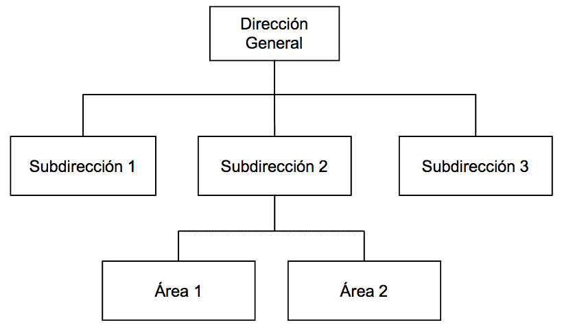

(Nota.- Esta notación es la más habitual, pero MÉTRICA Versión 3 no exige su utilización).

### Diagrama de Despliegue

El objetivo de estos diagramas es mostrar la disposición de las particiones físicas del sistema de información y la asignación de los componentes software a estas particiones. Es decir, las relaciones físicas entre los componentes software y hardware en el sistema a entregar.
Descripción

En estos diagramas se representan dos tipos de elementos, nodos y conexiones, así como la distribución de componentes del sistema de información con respecto a la partición física del sistema.

En MÉTRICA Versión 3 se propone una definición concreta de nodo, prescindiendo de determinados detalles, pero permitiendo una continuidad tanto en el diseño como en la construcción del sistema de información. Con este fin, se utiliza el nodo como partición física o funcional real, pero sin descender a detalles de infraestructura o dimensionamiento; por ejemplo, interesa si el nodo procesador es arquitectura Intel, pero no tanto si tiene dos o cuatro procesadores.

Las conexiones representan las formas de comunicación entre nodos.

Además, a cada nodo se le asocia un subsistema de construcción que agrupa componentes software, permitiendo de este modo, determinar la distribución de estos componentes. Por lo tanto, un diagrama de despliegue puede incluir, dependiendo del nivel de detalle, todos los elementos descritos en la técnica de diagrama de componentes, además los nodos y las conexiones propios de esta técnica.
Notación

Nodo

Se representa con la figura de un cubo. El nodo se etiqueta con un nombre representativo de la partición física que simboliza. Se pueden asociar a los nodos subsistemas de construcción.

Conexión

Las conexiones se representan con una línea continua que une ambos nodos y pueden tener una etiqueta que indique el tipo de conexión. (ejemplo: canal, red, protocolo, etc.)
Ejemplo

El diagrama representa una arquitectura compuesta por un servidor central de lógica de negocio y acceso a datos, en un monitor de teleproceso de tipo XXX, al cual hay conectados 10 servidores departamentales, con clientes (100) e impresora conectados a cada uno de ellos. No interesa tanto recoger en el diagrama la infraestructura real (la exactitud de la configuración, número de procesadores que pueden cambiar con el tiempo y en principio no afecta ni al diseño ni a la construcción), como el tipo “genérico” de los servidores, los volúmenes en el caso de que sean significativos (por ejemplo: 100 puestos por departamento).

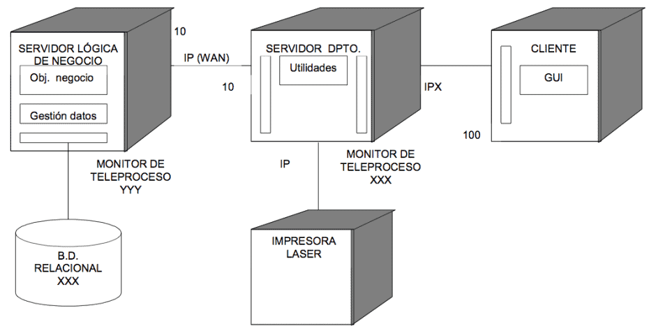

(Nota.- Esta notación es la más habitual, pero MÉTRICA Versión 3 no exige su utilización).

### Diagrama de Estructura

El objetivo de este diagrama es representar la estructura modular del sistema o de un componente del mismo y definir los parámetros de entrada y salida de cada uno de los módulos.

Para su realización se partirá del modelo de procesos obtenido como resultado de la aplicación de la técnica de diagrama de flujo de datos (DFD).
Descripción

Un diagrama de estructura se representa en forma de árbol con los siguientes elementos:

    Módulo: división del software clara y manejable con interfaces modulares perfectamente definidas. Un módulo puede representar un programa, subprograma o rutina dependiendo del lenguaje a utilizar. Admite parámetros de llamada y retorno. En el diseño de alto nivel hay que ver un módulo como una caja negra, donde se contemplan exclusivamente sus entradas y sus salidas y no los detalles de la lógica interna del módulo.
    Para que se reduzca la complejidad del cambio ante una determinada modificación, es necesario que los módulos cumplan las siguientes condiciones:
        Que sean de pequeño tamaño.
        Que sean independientes entre sí.
        Que realicen una función clara y sencilla.
    Conexión: representa una llamada de un módulo a otro.
    Parámetro: información que se intercambia entre los módulos. Pueden ser de dos tipos en función de la clase de información a procesar:
        Control: son valores de condición que afectan a la lógica de los módulos llamados. Sincronizan la operativa de los módulos.
        Datos: información compartida entre módulos y que es procesada en los módulos llamados.

Otros componentes que se pueden representar en el diagrama de estructura son:

    Módulo predefinido: es aquel módulo que está disponible en la biblioteca del sistema o de la propia aplicación, y por tanto no es necesario codificarlo.
    Almacén de datos: es la representación física del lugar donde están almacenados los datos del sistema.
    Dispositivo físico: es cualquier dispositivo por el cual se puede recibir o enviar información que necesite el sistema.

Estructuras del diagrama

Existen ciertas representaciones gráficas que permiten mostrar la secuencia de las llamadas entre módulos. Las posibles estructuras son:

- Secuencial: un módulo llama a otros módulos una sola vez y, se ejecutan de izquierda a derecha y de arriba abajo.
  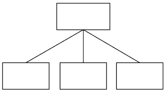
- Repetitiva: cada uno de los módulos inferiores se ejecuta varias veces mientras se cumpla una condición.
  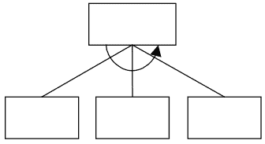
- Alternativa: cuando el módulo superior, en función de una decisión, llama a un módulo u otro de los de nivel inferior.
  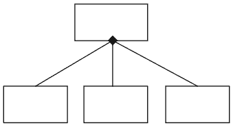

Principios del diseño estructurado

El diagrama de estructura se basa en tres principios fundamentales:

    La descomposición de los módulos, de manera que los módulos que realizan múltiples funciones se descompongan en otros que sólo realicen una. Los objetivos que se persiguen con la descomposición son:
        Reducir el tamaño del módulo.
        Hacer el sistema más fácil de entender y modificar y por lo tanto facilitar el mantenimiento del mismo.
        Minimizar la duplicidad de código.
        Crear módulos útiles.
    La jerarquía entre los módulos, de forma que los módulos de niveles superiores coordinen a los de niveles inferiores. Al dividir los módulos jerárquicamente, es posible controlar el número de módulos que interactúan con cualquiera de los otros.
    La independencia de los módulos, de manera que cada módulo se ve como una caja negra, y únicamente es importante su función y su apariencia externa, y no los detalles de su construcción.

Estrategias de diseño

Dependiendo de la estructura inicial del diagrama de flujo de datos sobre el que se va a realizar el diseño, existen dos estrategias para obtener el diagrama de estructura. El uso de una de las dos estrategias no implica que la otra no se utilice, eso dependerá de las características de los procesos representados en el DFD. Estas estrategias son:

    Análisis de transformación.
    Análisis de transacción.

1.- Análisis de Transformación

El análisis de transformación es un conjunto de pasos que permiten obtener, a partir de un DFD con características de transformación, la estructura del diseño de alto nivel del sistema. Un DFD con características de transformación es aquél en el que se pueden distinguir:

    Flujo de llegada o entrada.
    Flujo de transformación o centro de transformación que contiene los procesos esenciales del sistema y es independiente de las características particulares de la entrada y la salida.
    Flujo de salida.

Los datos que necesita el sistema se recogen por los módulos que se encuentren en las ramas de la izquierda, de modo que los datos que se intercambian en esa rama serán ascendentes. En las ramas centrales habrá movimiento de información compartida, tanto ascendente como descendente. En las ramas de la derecha, la información será de salida y, por lo tanto, descendente.

Los pasos a realizar en el análisis de transformación son:

    Identificar el centro de transformación. Para ello será necesario delimitar los flujos de llegada y salida de la parte del DFD que contiene las funciones esenciales del sistema.
    Realizar el “primer nivel de factorización” o descomposición del diagrama de estructura. Habrá que identificar tres módulos subordinados a un módulo de control del sistema:
        Módulo controlador del proceso de información de entrada.
        Módulo controlador del centro de transformación.
        Módulo controlador del proceso de la información de salida.
    Elaborar el “segundo nivel de factorización”. Se transforma cada proceso del DFD en un módulo del diagrama de estructura.
    Revisar la estructura del sistema utilizando medidas y guías de diseño.

A continuación se muestra un gráfico explicativo de dicha estrategia de diseño:

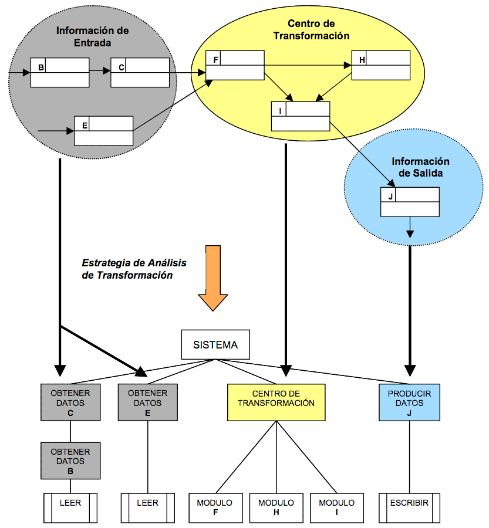

2.- Análisis de Transacción

El análisis de transacción se aplica cuando en un DFD existe un proceso que en función del flujo de llegada, determina la elección de uno o más flujos de información.

Se denomina centro de transacción al proceso desde el que parten los posibles caminos de información. Los pasos a realizar en el análisis de transacción son:

    Identificar el centro de transacción. Se delimita la parte del DFD en la que a partir de un camino de llegada se establecen varios caminos de acción.
    Transformar el DFD en la estructura adecuada al proceso de transacciones. El flujo de transacciones se convierte en una estructura de programa con una bifurcación de entrada y una de salida.
    Factorizar la estructura de cada camino de acción. Cada camino se convierte en una estructura que se corresponde con las características específicas del flujo (de transacción o de transformación).
    Refinar la estructura del sistema utilizando medidas y guías de diseño.

A continuación se muestra un gráfico explicativo de dicha estrategia de diseño:

![Estrategia de Diseño usando Análisis de Transacción][../images/estrategia-disenio-2.png]

Evaluación del diseño

Una vez que hayan sido elaborados los diagramas de estructura, habrá que evaluar el diseño estudiando distintos criterios y medidas. Se utilizan dos métricas que miden la calidad estructural de un diseño:

    Acoplamiento.
    Cohesión.

El acoplamiento se puede definir como el grado de interdependencia existente entre los módulos, por tanto, depende del número de parámetros que se intercambian. El objetivo es que el acoplamiento sea el mínimo posible, es decir, conseguir que los módulos sean lo más independientes entre sí.

Es deseable un bajo acoplamiento, debido a que cuantas menos conexiones existan entre dos módulos, menor será la posibilidad de que aparezcan efectos colaterales al modificar uno de ellos. Además, se mejora el mantenimiento, porque al cambiar un módulo por otro, hay menos riesgo de actualizar la lógica interna de los módulos asociados. Los diferentes grados de acoplamiento son:

    De datos: los módulos se comunican mediante parámetros que constituyen elementos de datos simples.
    De marca: es un caso particular del acoplamiento de datos, dónde la comunicación entre módulos es través de estructuras de datos.
    De control: aparece cuando uno o varios de los parámetros de comunicación son de control, es decir variables que controlan las decisiones de los módulos subordinados o superiores.
    Externo: los módulos están ligados a componentes externos (dispositivos E/S, protocolos de comunicaciones, etc.).
    Común: varios módulos hacen referencia a un área común de datos. Los módulos asociados al área común de datos pueden modificar los valores de los elementos de datos o estructuras de datos que se incluyen en dicha área.
    De contenido: ocurre cuando un módulo cualquiera accede o hace uso de los datos de una parte de otro módulo.

La cohesión es una medida de la relación funcional de los elementos de un módulo, es decir, la sentencia o grupo de sentencias que lo componen, las llamadas a otros módulos o las definiciones de los datos. Un módulo con alta cohesión realiza una tarea concreta y sencilla.

El objetivo es intentar obtener módulos con una cohesión alta o media. Los distintos niveles de cohesión, de mayor a menor, son:

    Funcional: todos los elementos que componen el módulo están relacionados en el desarrollo de una única función.
    Secuencial: un módulo empaqueta en secuencia varios módulos con cohesión funcional.
    De comunicación: todos los elementos de procesamiento utilizan los mismos datos de entrada y de salida.
    Procedimental: todos los elementos de procesamiento de un módulo están relacionados y deben ejecutarse en un orden determinado. En este tipo existe paso de controles.
    Temporal: un módulo contiene tareas relacionadas por el hecho de que todas deben realizarse en el mismo intervalo de tiempo.
    Lógica: un módulo realiza tareas relacionadas de forma lógica (por ejemplo un módulo que produce todas las salidas independientemente del tipo).
    Casual: un módulo realiza un conjunto de tareas que tienen poca o ninguna relación entre sí.

Un buen diseño debe ir orientado a conseguir que los módulos realicen una función sencilla e independiente de las demás (máxima cohesión), y que la dependencia con otros módulos sea mínima (acoplamiento mínimo), lo cual facilita el mantenimiento del diseño.
Notación

Módulo

Se representa mediante un rectángulo con su nombre en el interior.

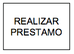

Un módulo predefinido se representa añadiendo dos líneas verticales y paralelas en el interior del rectángulo.

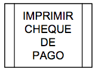

Conexión

Se representa mediante una línea terminada en punta de flecha cuya dirección indica el módulo llamado. Para llamadas a módulos estáticos se utiliza trazo continuo y para llamadas a módulos dinámicos trazo discontinuo.

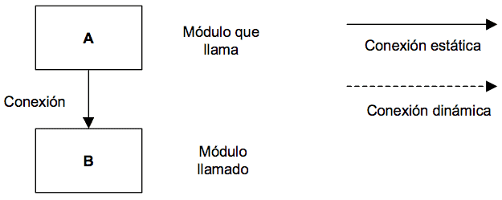

Parámetros

La representación varía según su tipo: control (flags) o datos.

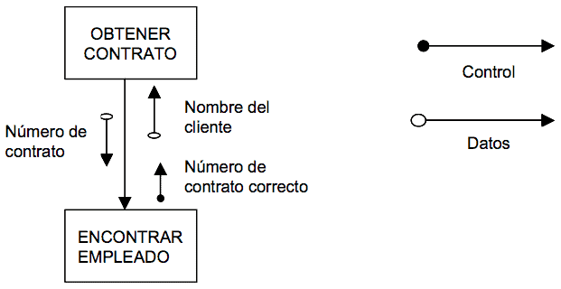

Almacén de datos

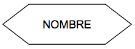

Dispositivo físico

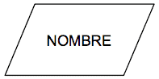

(Nota.- Esta notación es la más habitual, pero MÉTRICA Versión 3 no exige su utilización).
Ejemplo

El siguiente ejemplo muestra un proceso de emisión de cheques para el pago de nóminas de los empleados de una empresa. En él se diferencian los cálculos relativos a los trabajadores empleados por horas y los que poseen contrato. La lectura del fichero de empleados y la impresión de los cheques son módulos ya disponibles en las librerías del sistema, es decir, módulos predefinidos.

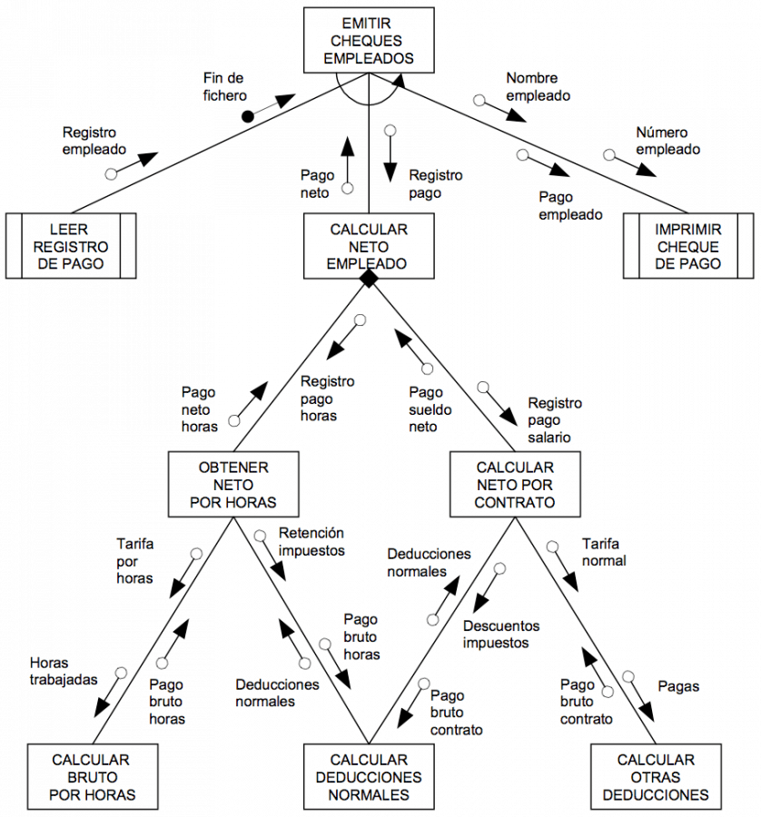 

### Diagrama de Flujo de Datos

El objetivo del diagrama de flujo de datos es la obtención de un modelo lógico de procesos que represente el sistema, con independencia de las restricciones físicas del entorno. Así se facilita su comprensión por los usuarios y los miembros del equipo de desarrollo.

El sistema se divide en distintos niveles de detalle, con el objetivo de:

* Simplificar la complejidad del sistema, representando los diferentes procesos de que consta.
* Facilitar el mantenimiento del sistema.

#### Descripción {.unnumbered .unlisted}

Un diagrama de flujo de datos es una técnica muy apropiada para reflejar de una forma clara y precisa los procesos que conforman el sistema de información. Permite representar gráficamente los límites del sistema y la lógica de los procesos, estableciendo qué funciones hay que desarrollar. Además, muestra el flujo o movimiento de los datos a través del sistema y sus transformaciones como resultado de la ejecución de los procesos.

Esta técnica consiste en la descomposición sucesiva de los procesos, desde un nivel general, hasta llegar al nivel de detalle necesario para reflejar toda la semántica que debe soportar el sistema en estudio.

El diagrama de flujo de datos se compone de los siguientes elementos:

* **Entidad externa**: representa un ente ajeno al sistema que proporciona o recibe información del mismo. Puede hacer referencia a departamentos, personas, máquinas, recursos u otros sistemas. El estudio de las relaciones entre entidades externas no forma parte del modelo.
  Puede aparecer varias veces en un mismo diagrama, así como en los distintos niveles del DFD para mejorar la claridad del diagrama.
* **Proceso**: representa una funcionalidad que tiene que llevar a cabo el sistema para transformar o manipular datos. El proceso debe ser capaz de generar los flujos de datos de salida a partir de los de entrada, más una información constante o variable al proceso.
  El proceso nunca es el origen ni el final de los datos, puede transformar un flujo de datos de entrada en varios de salida y siempre es necesario como intermediario entre una entidad externa y un almacén de datos.
* **Almacén de datos**: representa la información en reposo utilizada por el sistema independientemente del sistema de gestión de datos (por ejemplo un. fichero, base de datos, archivador, etc.). Contiene la información necesaria para la ejecución del proceso.
  El almacén no puede crear, transformar o destruir datos, no puede estar comunicado con otro almacén o entidad externa y aparecerá por primera vez en aquel nivel en que dos o más procesos accedan a él.
* **Flujo de datos:** representa el movimiento de los datos, y establece la comunicación entre los procesos y los almacenes de datos o las entidades externas.
* Un flujo de datos entre dos procesos sólo es posible cuando la información es síncrona, es decir, el proceso destino comienza cuando el proceso origen finaliza su función.
* Los flujos de datos que comunican procesos con almacenes pueden ser de los siguientes tipos:
  * *De consulta*: representan la utilización de los valores de uno o más campos de un almacén o la comprobación de que los valores de los campos seleccionados cumplen unos criterios determinados.
  * *De actualización*: representan la alteración de los datos de un almacén como consecuencia de la creación de un nuevo elemento, por eliminación o modificación de otros ya existentes.
  * *De diálogo:* es un flujo entre un proceso y un almacén que representa una consulta y una actualización.

Existen sistemas que precisan de información orientada al control de datos y requieren flujos y procesos de control, así como los mecanismos que desencadenan su ejecución. Para que resulte adecuado el análisis de estos sistemas, se ha ampliado la notación de los diagramas de flujo de datos incorporando los siguientes elementos:

* **Proceso de control**: representa procesos que coordinan y sincronizan las actividades de otros procesos del diagrama de flujo de datos.
* **Flujo de control**: representa el flujo entre un proceso de control y otro proceso. El flujo de control que sale de un proceso de control activa al proceso que lo recibe y el que entra le informa de la situación de un proceso. A diferencia de los flujos tradicionales, que pueden considerarse como procesadores de datos porque reflejan el movimiento y transformación de los mismos, los flujos de control no representan datos con valores, sino que en cierto modo, se trata de eventos que activan los procesos (señales o interrupciones).

##### Descomposición o explosión por niveles {.unnumbered .unlisted}

Los diagramas de flujo de datos han de representar el sistema de la forma más clara posible, por ello su construcción se basa en el principio de descomposición o explosión en distintos niveles de detalle.

La descomposición por niveles se realiza de arriba abajo (top-down), es decir, se comienza en el nivel más general y se termina en el más detallado, pasando por los niveles intermedios necesarios. De este modo se dispondrá de un conjunto de particiones del sistema que facilitarán su estudio y su desarrollo.

La explosión de cada proceso de un DFD origina otro DFD y es necesario comprobar que se mantiene la consistencia de información entre ellos, es decir, que la información de entrada y de salida de un proceso cualquiera se corresponde con la información de entrada y de salida del diagrama de flujo de datos en el que se descompone.

En cualquiera de las explosiones puede aparecer un proceso que no necesite descomposición. A éste se le denomina Proceso primitivo y sólo se detalla en él su entrada y su salida, además de una descripción de lo que realiza. En la construcción hay que evitar en lo posible la descomposición desigual, es decir, que un nivel contenga un proceso primitivo, y otro que necesite ser particionado en uno o varios niveles más.

El modelo de procesos deberá contener:

* Un diagrama de contexto (Nivel 0).
* Un diagrama 0 (Nivel 1).
* Tantos diagramas 1, 2, 3, … n como funciones haya en el diagrama 0 (Nivel 2).
* Tantos niveles intermedios como sea necesario.
* Varios DFD en el último nivel de detalle.

El diagrama de contexto tiene como objetivo delimitar el ámbito del sistema con el mundo exterior definiendo sus interfaces. En este diagrama se representa un único proceso que corresponde al sistema en estudio, un conjunto de entidades externas que representan la procedencia y destino de la información y un conjunto de flujos de datos que representan los caminos por los que fluye dicha información.

A continuación, este proceso se descompone en otro DFD, en el que se representan los procesos principales o subsistemas. Un subsistema es un conjunto de procesos cuyas funcionalidades tienen algo en común. Éstos deberán ser identificados en base a determinados criterios, como por ejemplo: funciones organizativas o administrativas propias del sistema, funciones homogéneas de los procesos, localización geográfica de los mismos, procesos que actualicen los mismos almacenes de datos, etc.

Cada uno de los procesos principales se descompone a su vez en otros que representan funciones más simples y se sigue descomponiendo hasta que los procesos estén suficientemente detallados y tengan una funcionalidad concreta, es decir, sean procesos primitivos.

Como resultado se obtiene un modelo de procesos del sistema de información que consta de un conjunto de diagramas de flujo de datos de diferentes niveles de abstracción, de modo que cada uno proporciona una visión más detallada de una parte definida en el nivel anterior.

Además de los diagramas de flujo de datos, el modelo de procesos incluye la especificación de los flujos de datos, de los almacenes de datos y la especificación detallada de los procesos que no precisan descomposición, es decir los procesos de último nivel o primitivos. En la especificación de un proceso primitivo se debe describir, de una manera más o menos formal, cómo se obtienen los flujos de datos de salida a partir de los flujos de datos de entrada y características propias del proceso.

Dependiendo del tipo de proceso se puede describir el procedimiento asociado utilizando un lenguaje estructurado o un pseudocódigo, apoyándose en tablas de decisión o árboles de decisión.

A continuación se muestra un ejemplo gráfico que representa la de descomposición jerárquica de los diagramas de flujo de datos.

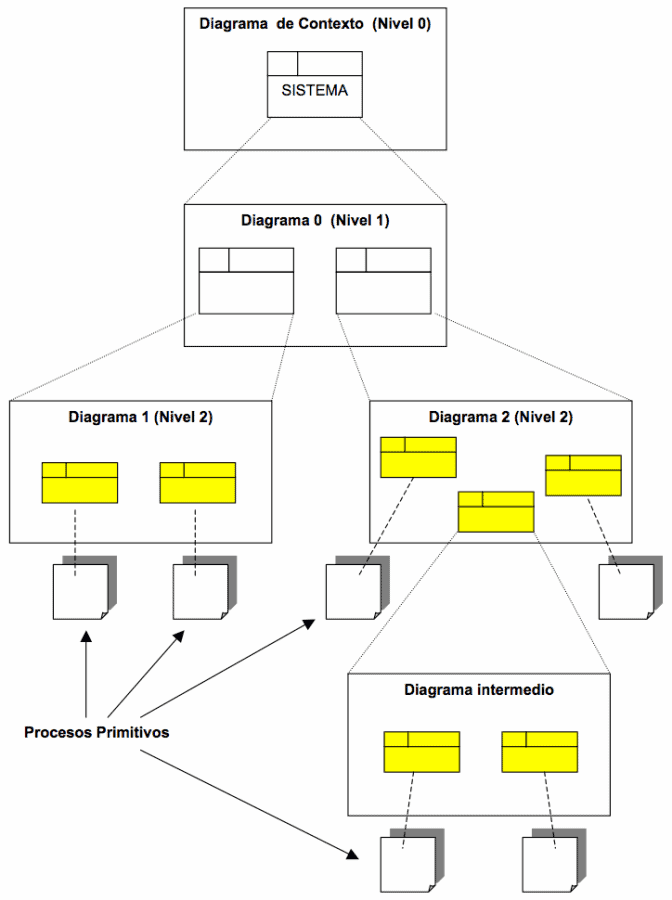

#### Notación {.unnumbered .unlisted}

##### Entidad externa {.unnumbered .unlisted}

Se representa mediante una elipse con un identificador y un nombre significativo en su interior.

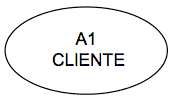

Si la entidad externa aparece varias veces en un mismo diagrama, se representa con una línea inclinada en el ángulo superior izquierdo.

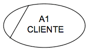

##### Proceso {.unnumbered .unlisted}

Se representa por un rectángulo subdividido en tres casillas donde se indica el nombre del proceso, un número identificativo y la localización.

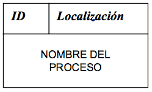

Si el proceso es de último nivel, se representa con un asterisco en el ángulo inferior derecho separado con una línea inclinada.

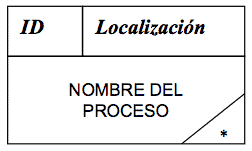

El nombre del proceso debe ser lo más representativo posible. Normalmente estará constituido por un verbo más un sustantivo.

El número identificativo se representa en la parte superior izquierda e indica el nivel del DFD en que se está. Hay que resaltar que el número no indica orden de ejecución alguno entre los procesos ya que en un DFD no se representa una secuencia en el tratamiento de los datos. El número que identifica el proceso es único en el sistema y debe seguir el siguiente estándar de notación:

* El proceso del diagrama de contexto se numera como cero.
* Los procesos del siguiente nivel se enumeran desde 1 y de forma creciente hasta completar el número de procesos del diagrama.
* En los niveles inferiores se forma con el número del proceso en el que está incluido seguido de un número que lo identifica en ese contexto.

La localización expresa el nombre del proceso origen de la descomposición que se esté tratando.

##### Almacén de datos {.unnumbered .unlisted}

Se representa por dos líneas paralelas cerradas en un extremo y una línea vertical que las une. En la parte derecha se indica el nombre del almacén de datos y en la parte izquierda el identificador de dicho almacén en el DFD.

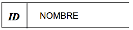

Si un almacén aparece repetido dentro un DFD se puede representar de la siguiente forma:

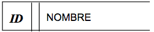

##### Flujo de datos {.unnumbered .unlisted}

Se representa por una flecha que indica la dirección de los datos, y que se etiqueta con un nombre representativo.

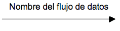

La representación de los flujos de datos entre procesos y almacenes es la siguiente:

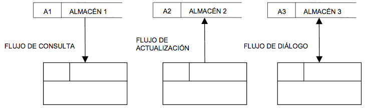

##### Proceso de control {.unnumbered .unlisted}

Se representa por un rectángulo, con trazo discontinuo, subdividido en tres casillas donde se indica el nombre del proceso, un número identificativo y la localización.

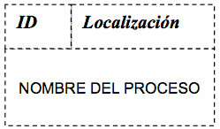

##### Flujo de control {.unnumbered .unlisted}

Se representa por una flecha con trazo discontinuo que indica la dirección de flujo y que se etiqueta con un nombre representativo.

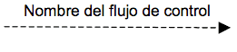

#### Ejemplo {.unnumbered .unlisted}

La figura es un diagrama de flujos de un Sistema Gestor de Pedidos. En él están representados todos los elementos que pueden intervenir en una Diagrama de Flujo de Datos.

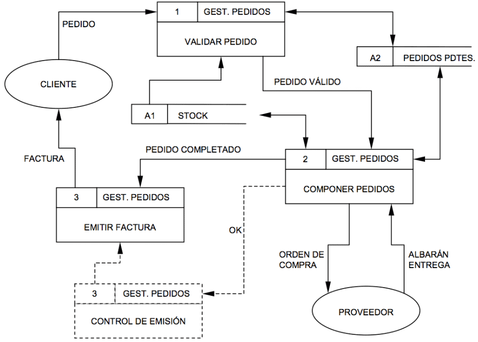

### Diagrama de Interacción

El objetivo de esta técnica es describir el comportamiento dinámico del sistema de información mediante el paso de mensajes entre los objetos del mismo. Además representa un medio para verificar la coherencia del sistema mediante la validación con el modelo de clases.
Descripción

Un diagrama de interacción describe en detalle un determinado escenario de un caso de uso. En él se muestra la interacción entre el conjunto de objetos que cooperan en la realización de dicho escenario. Suele ser conveniente especificar en la parte izquierda del diagrama el caso de uso que se está representando para que resulte más sencilla su validación.

Los elementos que componen los diagramas de interacción son los objetos y los mensajes:

* Un *objeto* es una entidad que tiene un estado, un comportamiento e identidad. La estructura y el comportamiento común de diferentes objetos se recoge en una clase. En un diagrama de interacción, los objetos serán al final instancias de una determinada clase o de un actor.
* Un *mensaje* es una comunicación entre dos objetos. El envío de un mensaje por parte de un objeto (emisor) a otro (receptor), puede provocar que se ejecute una operación, se produzca un evento o se cree o destruya un objeto.

Hay dos tipos de diagramas de interacción: [diagramas de secuencia](#diagrama-de-secuencia) y [diagramas de colaboración](#diagrama-de-colaboracion). Ambos tipos de diagramas tratan la misma información pero cada uno hace énfasis en un aspecto particular en cuanto a la forma de mostrarla.

Los diagramas de secuencia muestran de forma explícita la secuencia de los mensajes intercambiados por los objetos, mientras que los diagramas de colaboración muestran de forma más clara cómo colaboran los objetos, es decir, con qué otros objetos tiene vínculos o intercambia mensajes un determinado objeto.

A continuación se detallan las particularidades de cada uno de ellos.

#### Diagrama de Secuencia

El diagrama de secuencia es un tipo de diagrama de interacción cuyo objetivo es describir el comportamiento dinámico del sistema de información haciendo énfasis en la secuencia de los mensajes intercambiados por los objetos.

##### Descripción {.unnumbered .unlisted}

Un diagrama de secuencia tiene dos dimensiones, el eje vertical representa el tiempo y el eje horizontal los diferentes objetos. El tiempo avanza desde la parte superior del diagrama hacia la inferior. Normalmente, en relación al tiempo sólo es importante la secuencia de los mensajes, sin embargo, en aplicaciones de tiempo real se podría introducir una escala en el eje vertical. Respecto a los objetos, es irrelevante el orden en que se representan, aunque su colocación debería poseer la mayor claridad posible.

Cada objeto tiene asociados una *línea de vida* y *focos de control*. La línea de vida indica el intervalo de tiempo durante el que existe ese objeto. Un foco de control o activación muestra el periodo de tiempo en el cual el objeto se encuentra ejecutando alguna operación, ya sea directamente o mediante un procedimiento concurrente.

##### Notación {.unnumbered .unlisted}

###### Objeto y línea de vida {.unnumbered .unlisted}

Un objeto se representa como una línea vertical discontinua, llamada línea de vida, con un rectángulo de encabezado con el nombre del objeto en su interior. También se puede incluir a continuación el nombre de la clase, separando ambos por dos puntos.

Si el objeto es creado en el intervalo de tiempo representado en el diagrama, la línea comienza en el punto que representa ese instante y encima se coloca el objeto. Si el objeto es destruido durante la interacción que muestra el diagrama, la línea de vida termina en ese punto y se señala con un aspa de ancho equivalente al del foco de control.

En el caso de que un objeto existiese al principio de la interacción representada en el diagrama, dicho objeto se situará en la parte superior del diagrama, por encima del primer mensaje. Si un objeto no es eliminado en el tiempo que dura la interacción, su línea de vida se prolonga hasta la parte inferior del diagrama.

La línea de vida de un objeto puede desplegarse en dos o más líneas para mostrar los diferentes flujos de mensajes que puede intercambiar un objeto, dependiendo de alguna condición.

###### Foco de control o activación {.unnumbered .unlisted}

Se representa como un rectángulo delgado superpuesto a la línea de vida del objeto. Su largo dependerá de la duración de la acción. La parte superior del rectángulo indica el inicio de una acción ejecutada por el objeto y la parte inferior su finalización.

###### Mensaje {.unnumbered .unlisted}

Un mensaje se representa como una flecha horizontal entre las líneas de vida de los objetos que intercambian el mensaje. La flecha va desde el objeto que envía el mensaje al que lo recibe. Además, un objeto puede mandarse un mensaje a sí mismo, en este caso la flecha comienza y termina en su línea de vida.

La flecha tiene asociada una etiqueta con el nombre del mensaje y los argumentos. También pueden ser etiquetados los mensajes con un número de secuencia, sin embargo, este número no es necesario porque la localización física de las flechas que representan a los mensajes ya indica el orden de los mismos.

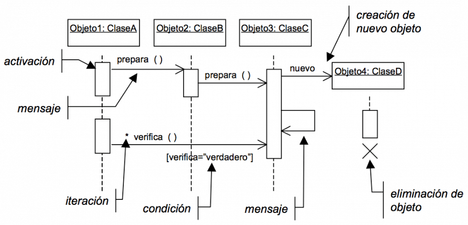

Los mensajes pueden presentar también condiciones e iteraciones. Una condición se representa mediante una expresión booleana encerrada entre corchetes junto a un mensaje, e indica que ese mensaje sólo es enviado en caso de ser cierta la condición. Una iteración se representa con un asterisco y una expresión entre corchetes, que indica el número de veces que se produce.

(Nota.- Esta notación es la más habitual, pero MÉTRICA Versión 3 no exige su utilización).

##### Ejemplo {.unnumbered .unlisted}

Diagrama de secuencia para el caso de uso: Prestar un ejemplar de una aplicación encargada de los préstamos y reservas de una biblioteca:

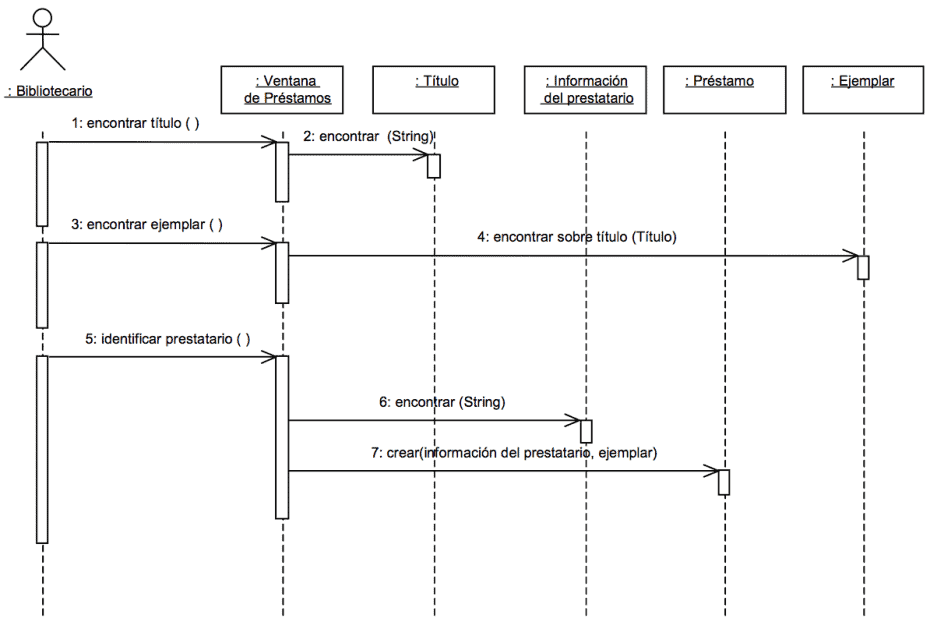

#### Diagrama de Colaboración

El diagrama de colaboración es un tipo de diagrama de interacción cuyo objetivo es describir el comportamiento dinámico del sistema de información mostrando cómo interactúan los objetos entre sí, es decir, con qué otros objetos tiene vínculos o intercambia mensajes un determinado objeto.
Descripción

Un diagrama de colaboración muestra la misma información que un diagrama de secuencia pero de forma diferente. En los diagramas de colaboración no existe una secuencia temporal en el eje vertical; es decir, la colocación de los mensajes en el diagrama no indica cuál es el orden en el que se suceden. Además, la colocación de los objetos es más flexible y permite mostrar de forma más clara cuáles son las colaboraciones entre ellos. En estos diagramas la comunicación entre objetos se denomina vínculo o enlace (link) y estará particularizada mediante los mensajes que intercambian.

##### Notación {.unnumbered .unlisted}

###### Objeto {.unnumbered .unlisted}

Un objeto se representa con un rectángulo dentro del que se incluye el nombre del objeto y, si se desea, el nombre de la clase, separando ambos por dos puntos.

###### Vínculo {.unnumbered .unlisted}

En el diagrama, un vínculo se representa como una línea continua que une ambos objetos y que puede tener uno o varios mensajes asociados en ambas direcciones. Como un vínculo instancia una relación de asociación entre clases, también se puede indicar la navegabilidad del mismo mediante una flecha.

###### Mensaje {.unnumbered .unlisted}

Un mensaje se representa con una pequeña flecha colocada junto a la línea del vínculo al que está asociado. La dirección de la flecha va del objeto emisor del mensaje al receptor del mismo. Junto a ella, se coloca el nombre del mensaje y sus argumentos.

A diferencia de los diagramas de secuencia, en los diagramas de colaboración siempre se muestra el número de secuencia del mensaje delante de su nombre, ya que no hay otra forma de conocer la secuencia de los mismos.

Además, los mensajes pueden tener asociadas condiciones e iteraciones que se representarán como en los diagramas de secuencia.

##### Ejemplo {.unnumbered .unlisted}

Diagrama de colaboración para el caso de uso: Prestar un ejemplar de una aplicación encargada de los préstamos y reservas de una biblioteca.

[Ejemplo de Diagrama de colaboración](../images/colaboracion-ejemplo.png)

(Nota.- Esta notación es la más habitual, pero MÉTRICA Versión 3 no exige su utilización).

### Diagrama de Paquetes
### Diagrama de Transición de Estados
### Modelado de Procesos de la Organización
#### SADT (Structured Analysis and Design Technique)

### Modelo Entidad/Relación Extendido

Se trata de una técnica cuyo objetivo es la representación y definición de todos los datos que se introducen, almacenan, transforman y producen dentro de un sistema de información, sin tener en cuenta las necesidades de la tecnología existente, ni otras restricciones.

Dado que el modelo de datos es un medio para comunicar el significado de los datos, las relaciones entre ellos y las reglas de negocio de un sistema de información, una organización puede obtener numerosos beneficios de la aplicación de esta técnica, pues la definición de los datos y la manera en que éstos operan son compartidos por todos los usuarios.

Las ventajas de realizar un modelo de datos son, entre otras:

* Comprensión de los datos de una organización y del funcionamiento de la organización.
* Obtención de estructuras de datos independientes del entorno físico.
* Control de los posibles errores desde el principio, o al menos, darse cuenta de las deficiencias lo antes posible.
* Mejora del mantenimiento.

Aunque la estructura de datos puede ser cambiante y dinámica, normalmente es mucho más estable que la estructura de procesos. Como resultado, una estructura de datos estable e integrada proporciona datos consistentes que puedan ser fácilmente accesibles según las necesidades de los usuarios, de manera que, aunque se produzcan cambios organizativos, los datos permanecerán estables.

Este diagrama se centra en los datos, independientemente del procesamiento que los transforma y sin entrar en consideraciones de eficiencia. Por ello, es independiente del entorno físico y debe ser una fiel representación del sistema de información objeto del estudio, proporcionando a los usuarios toda la información que necesiten y en la forma en que la necesiten.

#### Descripción {.unnumbered .unlisted}

El modelo entidad/relación extendido describe con un alto nivel de abstracción la distribución de datos almacenados en un sistema. Existen dos elementos principales: las entidades y las relaciones. Las extensiones al modelo básico añaden además los atributos de las entidades y la jerarquía entre éstas. Estas extensiones tienen como finalidad aportar al modelo una mayor capacidad expresiva.

Los elementos fundamentales del modelo son los siguientes:

##### Entidad {.unnumbered .unlisted}

Es aquel objeto, real o abstracto, acerca del cual se desea almacenar información en la base de datos. La estructura genérica de un conjunto de entidades con las mismas características se denomina tipo de entidad.

Existen dos clases de entidades: regulares, que tienen existencia por sí mismas, y débiles cuya existencia depende de otra entidad. Las entidades deben cumplir las siguientes tres reglas:

* Tienen que tener existencia propia.
* Cada ocurrencia de un tipo de entidad debe poder distinguirse de las demás.
* Todas las ocurrencias de un tipo de entidad deben tener los mismos atributos.

##### Relación {.unnumbered .unlisted}

Es una asociación o correspondencia existente entre una o varias entidades. La relación puede ser regular, si asocia tipos de entidad regulares, o débil, si asocia un tipo de entidad débil con un tipo de entidad regular. Dentro de las relaciones débiles se distinguen la **dependencia en existencia** y la **dependencia en identificación**.

Se dice que la dependencia es en existencia cuando las ocurrencias de un tipo de entidad débil no pueden existir sin la ocurrencia de la entidad regular de la que dependen. Se dice que la dependencia es en identificación cuando, además de lo anterior, las ocurrencias del tipo de entidad débil no se pueden identificar sólo mediante sus propios atributos, sino que se les tiene que añadir el identificador de la ocurrencia de la entidad regular de la cual dependen.

Además, se dice que una relación es **exclusiva** cuando la existencia de una relación entre dos tipos de entidades implica la no existencia de las otras relaciones.

Una relación se caracteriza por:

* **Nombre**: que lo distingue unívocamente del resto de relaciones del modelo.
* **Tipo de correspondencia**: es el número máximo de ocurrencias de cada tipo de entidad que pueden intervenir en una ocurrencia de la relación que se está tratando.
* Conceptualmente se pueden identificar tres clases de relaciones:
  * Relaciones 1:1: Cada ocurrencia de una entidad se relaciona con una y sólo una ocurrencia de la otra entidad.
  * Relaciones 1:N: Cada ocurrencia de una entidad puede estar relacionada con cero, una o varias ocurrencias de la otra entidad.
  * Relaciones M:N: Cada ocurrencia de una entidad puede estar relacionada con cero, una o varias ocurrencias de la otra entidad y cada ocurrencia de la otra entidad puede corresponder a cero, una o varias ocurrencias de la primera.
* **Cardinalidad**: representa la participación en la relación de cada una de las entidades afectadas, es decir, el número máximo y mínimo de ocurrencias de un tipo de entidad que pueden estar interrelacionadas con una ocurrencia de otro tipo de entidad. La cardinalidad máxima coincide con el tipo de correspondencia.

Según la cardinalidad, una relación es obligatoria, cuando para toda ocurrencia de un tipo de entidad existe al menos una ocurrencia del tipo de entidad asociado, y es opcional cuando, para toda ocurrencia de un tipo de entidad, puede existir o no una o varias ocurrencias del tipo de entidad asociado.

##### Dominio {.unnumbered .unlisted}

Es un conjunto nominado de valores homogéneos. El dominio tiene existencia propia con independencia de cualquier entidad, relación o atributo.

##### Atributo {.unnumbered .unlisted}

Es una propiedad o característica de un tipo de entidad. Se trata de la unidad básica de información que sirve para identificar o describir la entidad. Un atributo se define sobre un dominio. Cada tipo de entidad ha de tener un conjunto mínimo de atributos que identifiquen unívocamente cada ocurrencia del tipo de entidad. Este atributo o atributos se denomina identificador principal. Se pueden definir restricciones sobre los atributos, según las cuales un atributo puede ser:

* Univaluado, atributo que sólo puede tomar un valor para todas y cada una de las ocurrencias del tipo de entidad al que pertenece.
* Obligatorio, atributo que tiene que tomar al menos un valor para todas y cada una de las ocurrencias del tipo de entidad al que pertenece.

Además de estos elementos, existen extensiones del modelo entidad/relación que incorporan determinados conceptos o mecanismos de abstracción para facilitar la representación de ciertas estructuras del mundo real:

* La **generalización**, permite abstraer un tipo de entidad de nivel superior (supertipo) a partir de varios tipos de entidad (subtipos); en estos casos los atributos comunes y relaciones de los subtipos se asignan al supertipo. Se pueden generalizar por ejemplo los tipos *profesor* y *estudiante* obteniendo el supertipo *persona*.
* La **especialización** es la operación inversa a la generalización, en ella un supertipo se descompone en uno o varios subtipos, los cuales heredan todos los atributos y relaciones del supertipo, además de tener los suyos propios. Un ejemplo es el caso del tipo *empleado*, del que se pueden obtener los subtipos *secretaria*, *técnico* e *ingeniero*.
* **Categorías**. Se denomina categoría al subtipo que aparece como resultado de la unión de varios tipos de entidad. En este caso, hay varios supertipos y un sólo subtipo. Si por ejemplo se tienen los tipos persona y compañía y es necesario establecer una relación con *vehículo*, se puede crear propietario como un subtipo unión de los dos primeros.
* La **agregación**, consiste en construir un nuevo tipo de entidad como composición de otros y su tipo de relación y así poder manejarlo en un nivel de abstracción mayor. Por ejemplo, se tienen los tipos de entidad *empresa* y *solicitante de empleo* relacionados mediante el tipo de relación entrevista; pero es necesario que cada entrevista se corresponda con una determinada *oferta de empleo*. Como no se permite la relación entre tipos de relación, se puede crear un tipo de entidad compuesto por *empresa*, *entrevista* y *solicitante de empleo* y relacionarla con el tipo de entidad *oferta de empleo*. El proceso inverso se denomina desagregación.
* La **asociación**, consiste en relacionar dos tipos de entidades que normalmente son de dominios independientes, pero coyunturalmente se asocian.

La existencia de supertipos y subtipos, en uno o varios niveles, da lugar a una **jerarquía**, que permitirá representar una restricción del mundo real.

Una vez construido el modelo entidad/relación, hay que analizar si se presentan redundancias. Para poder asegurar su existencia se deben estudiar con mucho detenimiento las cardinalidades mínimas de las entidades, así como la semántica de las relaciones.

Los atributos redundantes, los que se derivan de otros elementos mediante algún calculo, deben ser eliminados del modelo entidad/relación o marcarse como redundantes.

Igualmente, las relaciones redundantes deben eliminarse del modelo, comprobando que al eliminarlas sigue siendo posible el paso, tanto en un sentido como en el inverso, entre las dos entidades que unían.

#### Notación {.unnumbered .unlisted}

##### Entidad {.unnumbered .unlisted}
La representación gráfica de un tipo de entidad regular es un rectángulo etiquetado con el nombre del tipo de entidad. Un tipo de entidad débil se representa con dos rectángulos concéntricos con su nombre en el interior.

##### Relación {.unnumbered .unlisted}

Se representa por un rombo unido a las entidades relacionadas por dos líneas rectas a los lados. El tipo de correspondencia se representa gráficamente con una etiqueta 1:1, 1:N o M:N, cerca de alguno de los vértices del rombo, o bien situando cada número o letra cerca de la entidad correspondiente, para mayor claridad.

La representación gráfica de las cardinalidades se realiza mediante una etiqueta del tipo (0,1), (1,1), (0,n) o (1,n), que se coloca en el extremo de la entidad que corresponda. Si se representan las cardinalidades, la representación del tipo de correspondencia es redundante.

##### Atributo {.unnumbered .unlisted}

Un atributo se representa mediante una elipse, con su nombre dentro, conectada por una línea al tipo de entidad o relación.

En lugar de una elipse puede utilizarse un círculo con el nombre dentro, o un círculo más pequeño con el nombre del atributo a un lado. También pueden representarse en una lista asociada a la entidad. El identificador aparece con el nombre marcado o subrayado, o bien con su círculo en negro.

##### Exclusividad {.unnumbered .unlisted}

En la representación de las relaciones exclusivas se incluye un arco sobre las líneas que conectan el tipo de entidad a los dos o más tipos de relación.

##### Jerarquía (tipos y subtipos) {.unnumbered .unlisted}

La representación de las jerarquías se realiza mediante un triángulo invertido, con la base paralela al rectángulo que representa el supertipo y conectando a éste y a los subtipos. Si la división en subtipos viene determinada en función de los valores de un atributo discriminante, éste se representará asociado al triángulo que representa la relación.

En el triángulo se representará: con una letra d el hecho de que los subtipos sean disjuntos, con un círculo o una O si los subtipos pueden solaparse y con una U el caso de uniones por categorías. La presencia de una jerarquía total se representa con una doble línea entre el supertipo y el triángulo.

#### Ejemplo {.unnumbered .unlisted}

Modelo entidad-relación extendido para un sistema de gestión de técnicos y su asignación a proyectos dentro de una empresa u organización.

Como se aprecia en el diagrama, TÉCNICO es un subtipo de EMPLEADO, generado por especialización, pues era necesario para establecer la relación Trabaja en con PROYECTO, ya que no todos los empleados de la empresa, como los administrativos, son susceptibles de trabajar en un proyecto. La entidad TÉCNICO tendrá los atributos de EMPLEADO más el atributo nivel.

[Ejemplo de Modelo Entidad/Relación Extendido](../images/MERE_Ejemplo.png)

Los tipos de correspondencia son `1:N` entre DEPARTAMENTO y EMPLEADO, pues un departamento tiene 1 o varios empleados. Entre TÉCNICO y PROYECTO es `M:N`, pues un técnico puede trabajar en 1 o varios proyectos, y en un proyecto trabajan 1 o varios técnicos.

Por otro lado, se han incluido atributos que caracterizan la relación *Trabaja en*, como son *fecha de asignación* y *fecha de cese*, ya que un técnico no siempre estará trabajando en un proyecto, sino en determinado periodo. (Nota.- Esta notación es la más habitual, pero MÉTRICA Versión 3 no exige su utilización).

### Normalización
### Optimización
### Reglas de Obtención del Modelo Físico a partir del Lógico
### Reglas de Transformación
### Técnicas Matriciales

## Técnicas de gestión de proyectos

### Técnicas de Estimación

#### Método Albrecht para el Análisis de los Puntos Función

Para proceder al cálculo de los puntos función de un sistema han de realizarse tres etapas:

- Identificación de los componentes necesarios para el cálculo.
- Cálculo de los Puntos Función no ajustados.
- Ajuste de los Puntos Función.

##### Identificación de los componentes {.unnumbered .unlisted}

En esta etapa se identifican los elementos a tener en cuenta para el cálculo de los puntos función. Primeramente se enumeran todos los componentes de cada tipo (entradas externas, salidas externas, grupos lógicos de datos internos, grupos lógicos de datos de interfaz y consultas externas); seguidamente, se evalúa individualmente la complejidad de cada uno de ellos, utilizando unas tablas ya establecidas que proporcionan el factor de complejidad de cada componente individual, siendo estos factores: COMPLEJO, MEDIO o SENCILLO.

A continuación se describen los distintos componentes que han de tenerse en cuenta para el cálculo y la forma de determinar su complejidad en cada caso.

###### Entradas externas {.unnumbered .unlisted}

- Son todos aquellos grupos de datos o mandatos de control de usuario que entran en la aplicación y añaden o cambian información en un grupo lógico de datos interno.
- Una entrada es única si difiere en su formato o si arranca procesos diferentes.
- Para el análisis de este componente se utiliza la siguiente matriz de complejidad:

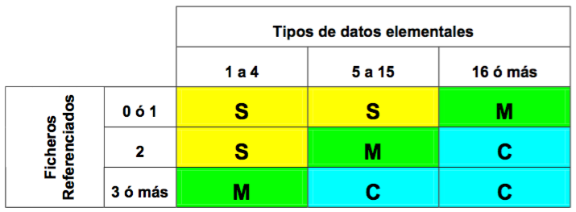

Los tipos de entrada aplicables son los siguientes:

- Documento tecleado.
- Documento de lectura óptica.
- Pantalla.
- Disquete / CD.
- Cinta magnética.
- Interruptor.
- Sensor digital.
- Sensor analógico.
- Tecla de función.
- Puntero electrónico.

##### Salidas externas {.unnumbered .unlisted}

- Son todos aquellos grupos lógicos de datos o mandatos de control de usuario que salen de la aplicación.
- Una salida es única si difiere en su formato o si es generada por procesos lógicos diferentes.

Para el análisis de este componente se utiliza la siguiente matriz de complejidad:

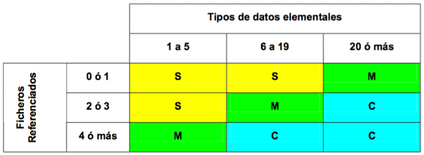

Los tipos de salida aplicables son los siguientes:

- Informe por pantalla.
- Informe por impresora.
- Informe por lotes.
- Transacción automática.
- Escritura en disquete.
- Escritura en soporte magnético / óptico.
- Mensaje por pantalla.
- Accionamiento digital.
- Accionamiento analógico.
- Factura, recibo, albarán, etc.

##### Grupos lógicos de datos internos {.unnumbered .unlisted}

- Son aquellos grupos lógicos de datos o información de control interna que se generan, son usados y mantiene la aplicación.
- No deben incluirse aquellos grupos lógicos de datos que no sean accesibles por el usuario a través de entradas o salidas externas, ficheros de interfaz o consultas.
- Para el análisis de este componente se utiliza la siguiente matriz de complejidad:

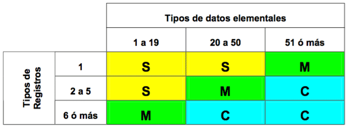

Los tipos de datos internos o ficheros aplicables son los siguientes:

- Fichero lógico interno.
- Base de datos.
- Tabla de usuario.
- Fichero de control o proceso secuencial por lotes.
- Fichero de query de usuario.

##### Grupos lógicos de datos de interfaz {.unnumbered .unlisted}

- Son aquellos grupos lógicos de datos compartidos con otra aplicación, recibidos o enviados a ella.
- Los grupos lógicos internos que son a su vez interfaz, deben contarse en ambos grupos.

Para el análisis de este componente se utiliza la siguiente matriz de complejidad:

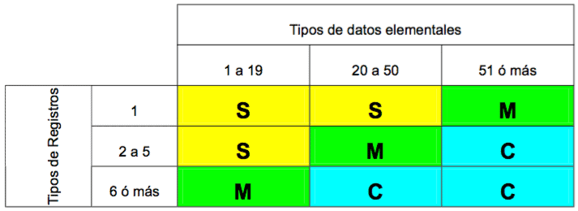

Los tipos de datos o ficheros de interfaz aplicables son los siguientes:

- Fichero lógico interno accesible desde otra aplicación.
- Fichero lógico interno accesible para otra aplicación.
- Bases de datos compartidas.

##### Consultas externas {.unnumbered .unlisted}

- Son entradas de usuario u otra aplicación que generan una salida inmediata.
- Son consecuencia de una búsqueda y no una actualización de un grupo lógico de datos interno.
- Se utilizará la matriz de Entradas Externas para calificar la parte correspondiente a la entrada.
- Se utilizará la matriz de Salidas Externas para calificar la parte correspondiente a la salida.
- Se seleccionará la más compleja.

Los tipos de consultas aplicables son los siguientes:

- Consulta de usuario sin actualización de ficheros.
- Pantalla o mensaje de ayuda.
- Menú de selección.

##### Cálculo de los Puntos Función no ajustados {.unnumbered .unlisted}

Una vez concluida la etapa anterior se pasan los resultados a la tabla de conversión, que aparece a continuación, dando un peso para cada tipo de componente por su complejidad.

+-----------------------------------------------+----------+----------+----------+------------+
| DESCRIPCIÓN                                   | SENCILLA | MEDIA    | COMPLEJA | TOTAL P.F. |
+===============================================+==========+==========+==========+============+
| Nº de Entradas Externas                       | x 3      | x 4      | x 6      |            |
+-----------------------------------------------+----------+----------+----------+------------+
| Nº de Salidas Externas                        | x 4      | x 5      | x 7      |            |
+-----------------------------------------------+----------+----------+----------+------------+
| Nº Grupos Lógicos de Datos Internos           | x 7      | x 10     | x 15     |            |
+-----------------------------------------------+----------+----------+----------+------------+
| Nº de Grupos Lógicos de Datos de Interfaz     | x 5      | x 7      | x 10     |            |
+-----------------------------------------------+----------+----------+----------+------------+
| Nº de Consultas Externas                      | x 3      | x 4      | x 6      |            |
+-----------------------------------------------+----------+----------+----------+------------+
| TOTAL PUNTOS FUNCIÓN NO AJUSTADOS (PFNA)                                       |            |
+--------------------------------------------------------------------------------+------------+

Una vez calculado el número de funciones y determinada su complejidad, no hay más que llevar los valores obtenidos a la tabla. La suma de los resultados parciales da el valor en PUNTOS FUNCIÓN NO AJUSTADOS (PFNA).

Los distintos factores fueron obtenidos de la investigación llevada a cabo por Allan J. Albrecht. Según sus propias palabras, a base de ensayos y negociaciones. No obstante, alguno de los pesos podrían variarse para reflejar mejor las características peculiares de otra organización u otro tipo especial de desarrollo.

El método para el cálculo es el siguiente:

    Identificar las funciones que intervienen. Estas funciones deben ser las que aparecen en el diagrama 0.
    Clasificar cada función.
    Incorporar cada función a la tabla.
    Sumar los valores obtenidos.

La suma representa la complejidad del proyecto en PUNTOS FUNCIÓN NO AJUSTADOS.

##### Ajuste de los Puntos Función {.unnumbered .unlisted}

Esta etapa tiene como objetivo la adaptación de la estimación a las condiciones de trabajo bajo las que el sistema ha de ser desarrollado. De esta adaptación se obtiene el valor definitivo en Puntos Función del Sistema que se está evaluando, aplicándole correcciones dependiendo de las características de la aplicación que afecten a la complejidad de la misma.

Existen 14 atributos de ajuste que impactan en el desarrollo y que deben ser evaluados, si bien se evalúan independientemente.

A cada atributo se le asignará un valor entre 0 y 5, dependiendo del grado de influencia de éstos. Los posibles valores son:

    Sin influencia (0). El sistema no contempla este atributo.
    Influencia mínima (1). La influencia de este atributo es muy poco significativa.
    Influencia moderada (2). El sistema contempla este atributo y su influencia, aunque pequeña, ha de ser considerada.
    Influencia apreciable (3). La importancia de este atributo debe ser tenida en cuenta, aunque no es fundamental.
    Influencia significativa (4). Este atributo tiene una gran importancia para el Sistema.
    Influencia muy fuerte (5). Este atributo es esencial para el Sistema y ha de ser tenido en cuenta a la hora del diseño.

Los 14 atributos que se contemplan en esta técnica y sus significados aparecen a continuación.

    Comunicación de datos: Los datos usados en la aplicación se envían o reciben por teleproceso. Los posibles valores para este atributo son:
        0 – La aplicación es un proceso por lotes puro.
        1 – Proceso por lotes con impresión remota o entrada remota de datos.
        2 – Proceso por lotes con impresión remota y entrada remota de datos .
        3 – El TP es la interfaz para un proceso por lotes.
        4 – La aplicación está basada en un TP interactivo, pero con un solo protocolo de comunicaciones.
        5 – La aplicación está basada en un TP interactivo, pero con más de un protocolo de comunicaciones.
    Funciones distribuidas: Funciones de datos o procesos distribuidas. Los posibles valores para este atributo son:
        0 – La aplicación no tiene el objetivo de transferir datos o funciones procesadas entre dos sistemas.
        1 – Datos preparados de la aplicación para su procesamiento por el usuario final sobre otro componente del sistema.
        2 – La aplicación prepara los datos para procesarlos sobre otra máquina diferente (no usuario final).
        3 – Proceso distribuido, en línea, con transferencia de datos en una única dirección.
        4 – Como el anterior, pero con transferencia de datos en ambas direcciones.
        5 – Las funciones de proceso se realizan dinámicamente sobre el componente del sistema más apropiado.
    Prestaciones: Consideración en el diseño, instalación y mantenimiento de factores de rendimiento como el tiempo de respuesta, la capacidad de proceso, etc. Los posibles valores para este atributo son:
        0 – No hay requerimientos especiales.
        1 – Se establecen requerimientos para las prestaciones, pero sin tratamiento específico.
        2 – Respuesta crítica del proceso en línea durante las horas punta. No hay especificaciones para la utilización de CPU.
        3 – Respuesta crítica del proceso en línea durante los días laborables. No hay especificaciones para la utilización de CPU. Proceso afectado por aplicaciones de interfaz.
        4 – Las tareas de análisis de las prestaciones se incluyen en la fase de diseño para establecer los requerimientos de usuario.
        5 – Además, se emplearán herramientas específicas para el diseño que contemplen estás características.
    Gran uso de la configuración: Cuando además de los objetivos de rendimiento se considera una gran utilización. El usuario ha de utilizar la aplicación en un entorno bastante cargado. Los posibles valores para este atributo son:
        0-3 – Típica aplicación sobre máquina de producción, sin restricciones de operación declaradas.
        4 – Las restricciones de operación declaradas requieren imperativos especiales sobre la aplicación en el procesador central.
        5 – Además, existen imperativos especiales sobre la aplicación en componentes distribuidos del sistema.
    Velocidad de las transacciones: Número alto de transacciones por unidad de tiempo que influyen en el diseño, instalación y posterior mantenimiento. Los posibles valores para este atributo son:
        0 – Las transacciones no están afectadas por picos de tráfico.
        1 – 10% de transacciones afectadas por los picos de tráfico.
        2 – 50% de transacciones afectadas por los picos de tráfico.
        3 – 100% de transacciones afectadas por los picos de tráfico.
        4 – Se incluyen tareas de análisis para las funciones en la fase de diseño para lograr los altos índices de función declarados por el usuario en los requerimientos de la aplicación o acuerdos de nivel de servicio (SLA).
        5 – Además, se utilizan herramientas de análisis para las prestaciones en las fases de diseño, desarrollo y / o instalación para lograr los altos índices de función declarados por el usuario en los requerimientos de la aplicación o acuerdos de nivel de servicio (SLA).
    Entrada de datos en línea: La toma de datos de la aplicación se realiza en línea. Los posibles valores para este atributo son:
        0 – Todas las transacciones son tratadas por lotes.
        1 – Entre el 1 y el 7% de las funciones son entradas interactivas de datos.
        2 – Entre el 8 y el 15% de las funciones son entradas interactivas de datos.
        3 – Entre el 16 y el 23% de las funciones son entradas interactivas de datos.
        4 – Entre el 24 y el 30% de las funciones son entradas interactivas de datos.
        5 – Más del 30% de las funciones son entradas interactivas de datos.
    Diseño para la eficiencia del usuario final: Se incluyen tareas de diseño para consideraciones especiales del usuario en la Fase de Diseño para atender los requerimientos del usuario, por ejemplo:
        Ayuda de navegación.
        Menús.
        Ayuda en línea.
        Movimiento automático del cursor.
        Scrolling.
        Impresión remota.
        Teclas de función preestablecidas.
        Procesos por lotes lanzados desde transacciones en línea.
        Selección de datos con el cursor.
        Gran uso de facilidades en el monitor (colores, textos resaltados, etc.).
        Copia impresa de las transacciones en línea.
        Ratón.
        Windows.
        Pantallas reducidas.
        Bilingüismo.
        Multilingüismo.
        Los posibles valores para este atributo son:
        0 – No se han declarado ninguno de los anteriores requerimientos especiales de usuario.
        1 – De 1 a 3 de los requerimientos de la lista.
        2 – 4 ó 5 requerimientos de la lista.
        3 – Más de 6 requerimientos de la lista.
        4 – Se incluyen en la fase de diseño tareas de diseño para consideraciones de factores humanos para lograr los requerimientos de usuario declarados.
        5 – Además, se usan herramientas especiales o prototipos para suscitar la eficiencia del usuario final.
    Actualización de datos en línea: Los datos internos se actualizan mediante transacciones en línea. Los posibles valores para este atributo son:
        0 – Ninguna.
        1-2 – Actualización en línea de ficheros de control.
        3 – Actualización en línea de ficheros importantes internos.
        4 – También, se considera esencial la protección contra pérdida de información.
        5 – Además, grandes volúmenes implican consideraciones de coste en el proceso de recuperación.
    Complejidad del proceso lógico interno de la aplicación: Se considera complejo cuando hay muchas interacciones, puntos de decisión o gran número de ecuaciones lógicas o matemáticas. ¿Cuál de las siguientes características tienen aplicación para la aplicación?
        Extensiones de proceso lógicas.
        Extensiones de proceso matemáticas.
        Muchos procesos de excepción, muchas funciones incompletas y muchas iteraciones
        de funciones.
        Procesos sensibles de control y / o seguridad.
        Procesos complejos de manejo de múltiples posibilidades de Entrada / Salida (por ejemplo: multimedia, independencia de dispositivos,…).
        Los posibles valores para este atributo son:
        0 – Ninguno de los anteriores es aplicable.
        1 – Es aplicable uno de los anteriores.
        2 – Son aplicables dos de los anteriores.
        3 – Son aplicables 3 de los anteriores.
        4 – Son aplicables 4 de los anteriores.
        5 – Todos ellos son aplicables.
    Reusabilidad del código por otras aplicaciones. Los posibles valores para este atributo son:
        0 – No hay que reutilizar el código.
        1 – Se emplea código reusable dentro de la aplicación.
        2 – Menos del 10% de la aplicación se considera reusable.
        3 – El 10% o más de la aplicación se considera reusable.
        4 – La aplicación está específicamente preparada y documentada para facilitar la reutilización y se adapta sobre código fuente.
        5 – La aplicación está específicamente preparada y documentada para facilitar la reutilización y, además, se adapta sobre parámetros.
    Facilidad de instalación: Durante el desarrollo se consideran factores que facilitan la ulterior conversión e instalación. Los posibles valores para este atributo son:
        0 – El usuario no ha declarado consideraciones especiales para instalación y conversión.
        1 – El usuario no ha declarado consideraciones especiales para instalación y conversión, pero se requiere un set especial para la instalación.
        2 – El usuario ha declarado consideraciones especiales para la conversión e instalación y se requieren guías probadas de conversión e instalación.
        3 – El usuario ha declarado consideraciones especiales para la conversión e instalación y se requieren guías probadas de conversión e instalación y se considera importante el impacto.
        4 – El usuario ha declarado consideraciones especiales para la conversión e instalación y se requieren guías probadas de conversión e instalación y, además, se facilitan herramientas probadas para la conversión e instalación.
        5 – El usuario ha declarado consideraciones especiales para la conversión e instalación y se requieren guías probadas de conversión e instalación, considerándose importante el impacto. Además, se facilitan herramientas probadas para la conversión e instalación.
    Facilidad de operación: Se han tenido en cuenta factores de operatividad. Se han considerado procedimientos de arranque, de copia de respaldo y de recuperación. Los posibles valores para este atributo son:
        0 – No hay consideraciones especiales de operación.
        1-2 – Se requieren procesos específicos de arranque, back-up y recuperación debidamente probados.
        3-4 – Además, la aplicación debe minimizar las necesidades de operaciones manuales, como manejo de papeles o montaje de cintas.
        5 – La aplicación debe diseñarse para una operación totalmente automática.
    Localizaciones múltiples: La aplicación se diseña para ser utilizada en diversas instalaciones y por organizaciones. El valor para este atributo será la suma de los aplicables:
        0 – No hay requerimientos de usuario para más de un lugar.
        1 – Se consideran múltiples instalaciones pero con idéntica configuración (tanto hardware como software).
        2 – Se consideran múltiples instalaciones pero con similar configuración (tanto hardware como software).
        3 – Se consideran múltiples instalaciones pero con diferente configuración (tanto hardware como software).
        Se añadirá 1 punto por cada una de las siguientes consideraciones:
        Se proporcionará documentación y plan de soporte debidamente probados para soportar la aplicación en múltiples sitios.
        Los lugares están en diferentes países.
    Facilidad de cambios: Se han tenido en cuenta criterios que facilitarán el posterior mantenimiento. El valor para este atributo será la suma de los aplicables:
        0 – No hay requerimientos especiales de diseño para minimizar o facilitar los cambios.
        1 – Se preverá una flexible capacidad de peticiones para modificaciones sencillas.
        2 – Se preverá una flexible capacidad de peticiones para modificaciones medias.
        3 – Se preverá una flexible capacidad de peticiones para modificaciones complejas.

Se añadirán 1 ó 2 puntos dependiendo de que los datos de control significativos se guarden en tablas mantenidas por el usuario mediante procesos interactivos en línea:

- 1 para actualización diferida.
- 2 para actualización inmediata.

Los atributos anteriores, con sus valores correspondientes, se contemplan en la siguiente tabla:

|    | ATRIBUTOS                                               | INFLUENCIA |
|----|---------------------------------------------------------|------------|
| 1  | Comunicación de datos                                   |            |
| 2  | Funciones distribuidas                                  |            |
| 3  | Prestaciones                                            |            |
| 4  | Gran uso de la configuración                            |            |
| 5  | Velocidad de las transacciones                          |            |
| 6  | Entrada de datos en línea                               |            |
| 7  | Diseño para la eficiencia del usuario final             |            |
| 8  | Actualización de datos en línea                         |            |
| 9  | Complejidad del proceso lógico interno de la aplicación |            |
| 10 | Reusabilidad del código                                 |            |
| 11 | Facilidad de instalación                                |            |
| 12 | Facilidad de operación                                  |            |
| 13 | Localizaciones múltiples                                |            |
| 14 | Facilidad de cambios                                    |            |
|    | **SUMA**                                                |            |

Una vez obtenido el valor de los atributos y sumados se obtiene una cifra comprendida entre 0 y 70, a partir de la cual se obtendrá el factor de ajuste, según la fórmula:

$$\text{FA} = 0.65 + (0.01 \times \text{SVA})$$

Siendo:

- FA: Factor de ajuste
- SVA: Suma de los valores de los atributos.

El valor calculado estará comprendido entre 0,65 y 1,35, por lo que el ajuste se realiza en ±35%.

Por último, se ajustan los Puntos Función mediante la siguiente fórmula:

$$\text{PFA} = \text{PFNA} \times \text{FA}$$

Siendo:

- PFA: Puntos Función ajustados
- PFNA: Puntos Función no ajustados
- FA: Factor de ajuste (calculado anteriormente).

##### Cálculo del tiempo en días de esfuerzo {.unnumbered .unlisted}

Una vez ajustados los Puntos Función, bastará multiplicar el valor calculado por los días en que se valore cada Punto Función.

En cada organización se asigna un valor en días diferente para el Punto Función. Es aconsejable que cada organización vaya utilizando su propia experiencia para variar el valor de los Puntos Función dependiendo de sus propios resultados.

Hay quien estima que, inicialmente, se asigne 1 día de esfuerzo por cada Punto Función, de manera que a medida que vayan cerrándose proyectos se vaya modificando tal valor. Otros, basándose en valores medios de la industria informática, recomiendan partir del valor siguiente: 1 Mes de esfuerzo (21 días aproximadamente) equivale a 13 Puntos Función.

#### Método MARK II para el Análisis de los Puntos Función

### Staffing Size (Orientación a Objetos)

### Planificación

#### Program Evaluation & Review Technique – PERT

#### Diagrama de Gantt

#### Estructura de Descomposición de Trabajo (WBS – Work Breakdown Structure)

#### Diagrama de Extrapolación

## Prácticas

### Análisis de Impacto

### Catalogación

### Cálculo de Accesos

### Caminos de Acceso

### Diagrama de Representación

### Factores Críticos de Éxito

### Impacto en la Organización

### Presentaciones

### Prototipado

### Pruebas

#### Pruebas Unitarias

#### Pruebas de Integración

#### Pruebas del Sistema

#### Pruebas de Implantación

#### Pruebas de Aceptación

#### Pruebas de Regresión

### Revisión Formal

### Revisión Técnica

### Sesiones de Trabajo

#### Entrevistas

#### Reuniones

#### JAD (Joint Application Design)

#### JRP (Joint Requeriments Planning)

## Soporte por herramientas

A continuación se presentan diversos cuadros para indicar el nivel de soporte por herramientas de las técnicas y prácticas descritas.

| PRÁCTICAS | NIVEL DE SOPORTE POR HERRAMIENTAS |
| - | - |
| Análisis de Impacto | Medio |
| Catalogación | Medio |
| Cálculo de Accesos | Alto |
| Caminos de Acceso | Medio |
| Diagrama de Representación | Alto |
| Factores Críticos de Éxito | |
| Impacto en la Organización | |
| Presentaciones | Alto |
| Prototipado | Alto |
| Pruebas | |
| Revisión Formal | |
| Revisión Técnica | |
| Entrevistas | Alto |
| Reuniones | Alto |
| JAD (Joint Application Design) | Alto |
| JRP (Joint Requirements Planning) | Alto |

Nota.- El Nivel de Soporte en blanco significa que o bien no se conocen herramientas que soporten esa técnica o práctica, o bien no son necesarias

## Bibliografía

- AMBLER, S. (1998), Mapping Objects To Relational Databases. www.AmblySoft.com/mappingObjects.pdf ( 29 November 1998).
- ARNOLD, ROBERT S. (1995). “Application Development Trends”. Software Productivity Group, Inc.
- ARREDONDO, L. (1993) “Cómo Hacer Presentaciones Profesionales” Ed. McGraw-Hill
- ARREDONDO, L. (1995) “Curso McGraw-Hill de Presentaciones de Negocios” Ed.McGraw-Hill
- BOEHM, BARRY W., “Software Engineering Economics”, Prentice-Hall, Inc., Englewood Cliffs, New Jersey, 1981
- BROWNE, D (1994). “STUDIO (Structured User-Interface Design for Interaction Optimisation)”.
- CARTER, E.B, “Introducing RISKMAN methodology”, NCC Blackwell, 1994
- C. SYMONS, “Software sizing and estimating MK-II FPA”, J. Wiley, 1991
- DAVID A. MARCA CLEMENT L. MC GOWAN. DOUGLAS T. ROSS (1987/1993). “IDEF0/SADT. Business Process and Enterprise Modeling”. Electric Solutions Corporations
- DE MIGUEL, A. y PIATTINI, M. (1993), “Concepción y diseño de bases de datos: Del Modelo E/R al Modelo Relacional”, RA-MA.
- DE MIGUEL, A. y PIATTINI, M. (1997), “Fundamentos y modelos de BASES de DATOS”, RA-MA.
- DE MIGUEL, A., PIATTINI, M. y MARCOS, E. (1998), “Diseño de Bases de Datos Relacionales”, RA-MA.
- ERIKSSON, H. AND PENKER, M. (1998), «UML Toolkit» Ed.John Wiley & Sons, Inc., 1998.
- FOWLER, M. (1997), «UML Distilled Applying the Standard Object Modeling Language» Ed. Addison-Wesley, 1997.
- GARTNER GROUP (1995). “Strategic Planning Assumption: Year 2000 Date Crisis”.
- IEEE Std 1028: 1989, IEEE Standard for Software Reviews and Audits.
- ISO 9000-3.2: 1996 Quality Management and Quality Assurance Standards.
- JACOBSON, IVAR (1994), “Object-Oriented Software Engineering: a Use Case Driven Aproach” Ed. Addison-Wesley, 1994.
- LÓPEZ-CORTIJO, ROMÁN; AMESCUA, ANTONIO, “Ingeniería del Software: Aspectos de Gestión (Tomo 1 – Conceptos Básicos)”, IIIS, 1998.
- MARK LORENZ Y JEFF KIDD, “Object-Oriented Software Metrics”. Ed. Prentice-Hall, Englewood Cliffs, New Jersey, 1994.
- MARTIN, J. Y MCCLURE, C. (1985), “Diagramming Techniques For Analysts and Programmers”. Ed. Prentice-Hall.
- MARTIN, J. (1985), “Information Engineering”. Ed. Prentice-Hall.
- MARTIN, J. (1991) “Rapid Application Development” Ed. Macmillan Publising Company.
- MÉTRICA Versión 2.1.: Metodología de Planificación y Desarrollo de Sistemas de Información. Guías de Referencia, de Técnicas y del Usuario. Ministerio para las Administraciones Públicas. Editorial TECNOS, Madrid, 1995.
- MIKE COTTERELL, BOB HUGHES, “Software Project Management”, International Thomson Computer Press, 1995
- PAGE-JONES, M. (1988), “ The Practical Guide to Structured Systems Design”. Second Edition. Ed. Prentice-Hall, Inc. Yourdon Press.
- PERRY, W. (1995) “Effective Methods for Software Testing” Ed. John Wiley & Sons, Inc.
- PIATTINI, M. y DARYANANI, S. N (1995), “Elementos y Herramientas en el Desarrollo de Sistemas de Información”, RA-MA.
- PIATTINI, M., CALVO-MANZANO, J., CERVERA, J. Y FERNÁNDEZ, L. (1996). «Análisis y Diseño Detallado de Aplicaciones Informáticas de Gestión». Ed. Ra-Ma.
- Plan General de Garantía de Calidad (M.A.P.).
- PRESSMAN, ROGER S. (1997) “Ingeniería Del Software, Un Enfoque Práctico”, Cuarta Edición. Ed. Mc. Graw Hill.
- PUTNAM, LAWRENCE H., Y WARE MYERS, “Measures for Excellence: Reliable Software on Time, Within Budget”, Yourdon Press, Englewood Cliffs, New Jersey, 1992
- R.A. RADICE, R.W. PHILLIPS, “Software Engineering: An industrial approach (Vol.I)”, Prentice-Hall, 1988
- ROGER T. BURTLON (1997). “Business Process Modelling: Analisys and Design”. Tecnology Transfer Institute
- RUMBAUGH, J. et al. (1991), “Object-Oriented Modeling and Design” Prentice-Hall, Englewood Cliffs, New Jersey.
- SHNEIDERMAN , B (1992). “Designing the User Interface: Strategies for Effective Human- Computer Interaction”, 2a Ed. Addison-Wesley Publishing Company, Inc.
- SOMMERVILLE, I (1994). “Software Engineering”, 3a Ed. Addison-Wesley Publishing Company, Inc.
- SSADM Version 4 Reference Manual. Management Information Systems. Application of Computer Systems. Structured Systems Analysis & Systems Design. ISBN 1-85554-004-5; 1990.
- TEXEL, P.A6 AND WILLIAMS, C (1997), «Use Cases combined with Booch/OMT/UML Process and Products”. Prentice Hall, 1997
- UML, OMG Unified Modeling Language Specification: UML Notation Guide Version 1.3 alpha R2, January 1999.
- VAN VILET, HANS, “Software Engineerig Principles and Practice”, John Wiley and Sons, 1993
- YOURDON, E. (1993) «Análisis Estructurado Moderno». Prentice Hall Hispanoamericana S.A., 1993.
- YOURDON, E. AND CONSTANTINE, L. (1979) “Structured Design: Fundamentals of a Discipline of Computer Program and System Design” Prentice-Hall, ISBN 0-13-854471-9

